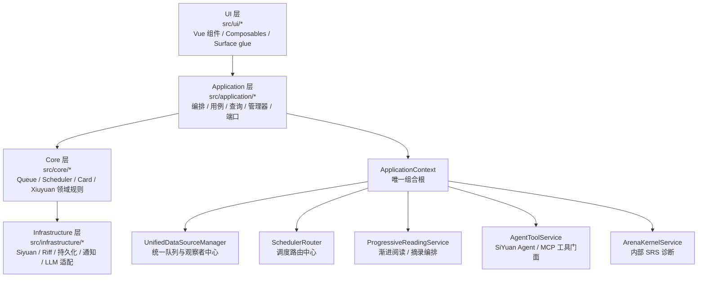
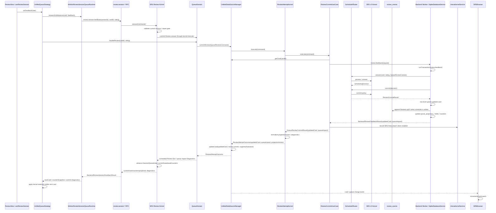

# SiyuanMemo 插件架构说明

最后更新：2026-07-09

本文是当前运行时架构与主数据流的单一事实来源（Single Source of Truth），面向协作者、贡献者与 AI 代理。它描述的是当前仍在生效的主路径，不负责保留历史迁移过程。

---

## 1. 文档目的与边界

本文覆盖：

- 当前分层架构与依赖方向
- 组合根与运行时装配
- Browser / Review / Queue / Scheduler 主链路
- Progressive / Excerpt / Topic-derived item 主链路
- Agent/MCP tools / Capture 主链路
- Kernel companion / backend worker / SiYuan Agent tool fast paths
- Runtime performance diagnostics
- Arena 主链路（AI 策略包竞技 + SRS 算法只读竞技，默认关闭）
- 完整运行时文件职责地图
- 开发边界与改动守则

本文不覆盖：

- 历史迁移复盘
- 旧架构兼容层的设计意图
- 普通用户使用手册

主校准源如下：

1. `src/index.ts`
2. `src/application/ApplicationContext.ts`
3. `src/types/unified-data-source.ts` 与 `src/types/unified-data-source/*`
4. 活跃调用链对应的 `src/` 代码

如果文档与代码冲突，以代码为准。

---

## 2. 当前分层架构总览

插件的固定主依赖方向是：

`ui -> application -> core -> infrastructure`

各层职责：

- `ui/*`：界面、用户交互、表面状态、对外可见 surface 的粘合逻辑。
- `application/*`：用例编排、管理器、查询、服务装配、端口定义、跨领域流程。
- `core/*`：队列规则、调度规则、卡片领域、修远领域、共享事件与核心能力。
- `infrastructure/*`：Siyuan / Riff / 文件 / 通知 / LLM 等外部系统适配。

当前活跃的 bounded contexts：

- Browser
- Review
- Queue / Scheduler
- Card CRUD
- Xiuyuan
- Progressive / Excerpt
- Topic-derived item
- Agent/MCP tools / Capture
- Arena
- Mobile entry
- Siyuan / Riff / Kernel companion / SiYuan Agent integration

### 2.1 参考架构吸收基线（Anki / Incrementum / Incremental Everything）

`absorb-anki-incrementum-architecture-lessons` change 的实现基线如下，作为后续吸收参考源码经验时的守卫：

- Anki 只作为 SRS 账本与队列可重建参考：`cards` 是当前 schedulable state，`review_events` 是 append-only formal review fact，queue projection 是可重建 derived storage，不是持久真相。
- Incrementum Tauri 只作为文档 / 摘录 / 学习项拆分与 scheduler adapter dispatch 参考；SiYuanMemo 不复制 `learning_items.question/answer` 内容主表，内容权威仍是 SiYuan block 与 Xiuyuan aggregate。
- Incremental Everything 只作为 typed action item、reader/extract queue、closest-ancestor priority inheritance、priority review context 的交互/策略参考；不采用 RemNote powerup storage、session-counter queue injection、plugin-local cache authority 或 UI-side hidden mutation。
- 禁止把 Anki `due` 那类多语义字段作为新持久字段；新模型必须把 formal review due、processing due、filtered/deferred queue order、priority order 拆成显式语义。
- Processing scheduler 的 core contract 位于 `src/core/processing/processingScheduler.ts`：它只描述 document / excerpt / progressive item / topic-derived 的 processing due 与 effective priority，不写 `cards.due`，不产生 formal review fact；priority 来源按 manual -> closest ancestor/source -> bounded context override -> default 解析，并输出 priority source identity 供 projection invalidation 使用。
- 禁止用 UI direct SQL、follower-local write、best-effort repair、dual-write 或 silent local fallback 掩盖 backend/writer unavailable；必须返回 typed unavailable/error。

当前 owner 追踪：

- SiYuanMemo-owned SRS / Native Riff Compatibility：普通 quick-card、block-menu、AutoCard、Progressive、Topic-derived、NeuralRoam concept entry 创建的默认 SRS authority 是 SiYuanMemo 本地 Xiuyuan/FSRS persistence；这些路径不再把 native `addRiffCards` 当作创建 side effect。只有显式 `action='explicit-native-riff-compatibility'`、手动导入或显式 native Riff sync 命令才进入 Native Riff Compatibility。Unset/default `riffIntegration` 不启动 passive/startup sync，也不注册 native Riff transaction upsert/remove fan-out；显式 opt-in sync/import 产物标记为 `ownership='riff-managed'` 且 `meta.nativeRiffCompatibility={ owner:'native-riff', source:'riff-sync' }`，同 block 已有 `local-owned` 时不覆盖 plugin-owned scheduling truth。FinalDrill native Riff review items 仍通过 `review.riffFeedback.execute` 桥接 native Riff feedback。Worker shadow audit 对 plugin/shadow overlap 只报告不删除；Browser/Review/Scheduler list reads 通过 `UnifiedStorageManager` projection 让 local-owned cards 胜过同 logical-key 的 `builtin-riff-sync` shadows，raw DTO/store 仍保留 shadow rows 供审计。Storage logical duplicate key 缺显式 `faceIndex/ruleIndex` 时以 card block identity 区分同一 Xiuyuan 下的多卡，duplicate-Xiuyuan load canonicalization 使用稳定 id 选主，避免 payload repair 时间戳反转调度 owner。
- Progressive excerpt completion：`SelectionExcerptService -> ProgressiveReadingService -> ProgressiveExcerptMaterializer` 的前台成功边界是 SiYuan 摘录实体 + `ExcerptRecord` 持久化，`topicCardId` 可以暂缺。`ProgressiveExcerptCompletionService` 独立拥有后台 Topic card 补完：按 `excerptEntityId` 做 in-flight dedupe，发现已有卡则回填 `topicCardId`，创建失败或摘录实体缺失则把 `ExcerptRecord.completionStatus` 标为 `failed` 并写 `completionError`。`ApplicationContext` 只在 ready 后延迟触发 capped startup repair（20 条），scoped repair API 默认 5 条；Siyuan transaction fan-out 不触发摘录 completion repair。
- Formal Review commit：`ReviewView / useReviewSession -> UnifiedQueueStrategy -> BaseReviewQueue -> ReviewCommitUseCase -> SrsBackendClient.reviewFeedback or FollowerCommandClient -> worker/review/WorkerReviewFeedbackRuntime -> WorkerReviewCardMutationPersistenceModule -> SchedulerRouter -> cards + review_events + domain_sync_operations + store_metadata`。正式提交先写 worker-owned 非 SiYuan Review journal（生产为 IndexedDB `entries` object store + bounded `metadata` counters，测试为内存 store；append 按 entry id 写单条记录，不读/重写整份 pending snapshot；不是插件 data JSON 文件）并拿到稳定 idempotency identity。`commitPolicy='write-schedule'` 的 live SQL transaction 必须以 durable persist 运行，写 `review_events(event_type='review-v2', commit_idempotency_key, payload_json skinny index)`、`cards` projection、`domain_sync_operations` skinny ledger、queue projection impact；worker-backed `review.session.feedback` 还必须在同一个 `review.feedback` SQL/delta transaction 内写 `review_transaction_undo_journal` answer evidence 和 `store_metadata` Review mutation stamp；mutation stamp 只递增 revision/modifiedAt/modifiedBy + stamp hash，不调用 full `touchSyncMetadata()` / `loadStore()` / full content hash，不允许 answer commit 后再跑第二个 `review.session.undo-journal.append` durable transaction。该 transaction 在返回 committed success 前完成 SQLite delta v2 或同 durability domain 的 durable checkpoint persistence；SQLite delta append preflight 使用 `snapshot.pendingBytes + entry.byteEstimate` 做 pending-byte accounting，不再 stringify full pending snapshot。`worker/review/ReviewFeedbackStorageEnvelope.ts` owns backend result 的 `storage` envelope assembly：只读 journal / SQLite delta diagnostics 和 `queueImpact`，派生 local intent / truth flush / SQL projection / checkpoint 状态，不追加 journal、不写 SQL projection、不 flush truth。Renderer-side `SrsBackendClient` owns queued Review truth flush scheduling: if `BrowserSrsBackendWorkerTransport` suppresses `truth.writeBinary` / `truth.writeJSON` while `review.feedback` requests are active, that pressure condition is deferred and re-queued for later flush rather than recorded as a terminal truth flush error; non-pressure truth flush errors remain visible。`review_events.payload_json` 只保存 `messagepack-review-event-index` 与 fact summary，不保存 full before/after/reviewEventFact，`domain_sync_operations.payload_json` 只保存 dedupe/audit index，不保存完整 scheduler snapshot。
- Review session hot path：RetrievalPractice / IncrementalLearning 的 active Review session authority 在 backend worker。所有投影支撑的 Review 入口先经过 `ReviewAdmissionModule`，由它消费 `QueueProjectionReadiness`、必要时 materialize recoverable projection，并签发包含 `projectionPolicyHash` / `projectionGeneration` 的 Review Admission Ticket；topbar、Browser toolbar、dialog/new-tab/window restore 都只能把该 ticket 传给 `WorkerReviewSessionQueueRuntime -> review.session.start`，worker start 不再读取 implicit latest generation，缺 ticket 或 projection unreadable 直接 `REVIEW_ADMISSION_UNAVAILABLE` fail closed。`UnifiedQueueStrategy` 只创建 `WorkerReviewSessionQueueRuntime` 作为 thin adapter，`next()` / `onFeedback(rate|skip)` / `goBack()` 通过 `review.session.start/current/feedback/skip/undo` RPC 读取 worker session state；worker session / **SessionQueueIndex** owns current card、next-card selection、bounded one-card `lookaheadCards` preparation candidate、low-rating/skip rotation、avoid-once card/block identity、bounded session undo journal evidence、session-local counters 和 projection status diagnostics。Session start 只能从 admitted ready projection rows materialize 初始卡组；start 之后的评分/跳过/worker-backed go-back 不再由 renderer `ReviewSessionCursor`、projection patch、projection requery、local queue rollback、legacy snapshot restore 或 **BrowserProjectionIndex** readiness 决定当前/下一张。`ReviewSessionController.updateState()` 现在先提交 `state.to-ui-state` + `state.commit-notify` 的 session-owned base state，再异步执行 Review presentation prepare；`state.prepare-presentation-async` 只回填同一 `content.id` 的 prepared render payload，不能覆盖当前卡、header、auxiliary 或 session counters。`lookaheadCards` 只暴露 backend Review Session Cursor 已可选择的下一卡 clone，不推进 current、不重读 projection、不给 renderer 新的 selection authority。worker session unavailable / commit failed / projection stale-deferred-refresh-required / truth flush pending / checkpoint pending 都作为 explicit diagnostics 暴露，不能静默 fallback 到 renderer cursor authority。`ReviewSessionController.grade()` 继续优先应用 `onFeedback()` 返回的 `nextItem` / counter snapshot；非 worker-backed queues（如 FilterGroup/Leech/NeuralRoam/FinalDrill）仍走各自显式队列路径并 fail closed。Backend `review.feedback` / `review.session.feedback` pre-request lifecycle 对普通评分只记录 `sync-divergent-diagnostic` timing bucket（`fullMergeSkipped=true`），不跑 full main DB merge；`review.session.feedback` 必须消费 Review-session repair gate（`clean` / `accepted-repairable` 才允许提交），missing/stale/blocking/unavailable/current-card mismatch 都 fail closed，repairable domain-sync merge/repair 归 `domainSync.repair.apply`、显式诊断/手动修复或 Review preflight 生命周期拥有，不属于 rating click；只有 card-not-found retry 这类 current-card conflict evidence 才强制 merge 并 fail closed。`queue.projection.replace` 只是 derived projection cache 更新，不是 Review session authority。SQLite delta commit hot path 由 `SqliteDatabaseService -> SqliteDeltaCheckpointLayer` 持有 durable evidence invariant；普通连续 Review append 已复用同运行时 verified segment evidence，open segment 与 same-runtime rollover 后的 sealed segment 都按 path/sequence/sealed/checksum/entry-count/byte-size identity 验证，命中时不在 append preflight 重读对应 msgpack，但仍必须在成功返回前完成 open/sealed segment msgpack 与 manifest JSON durable writes。reload/cold runtime、显式 diagnostics、replay、repair、checkpoint recovery、discard、failure、checksum mismatch 或 legacy recovery 没有可信 in-memory evidence 时，普通 `review.session.feedback` commit 仍会在 `persistCommittedTransaction()` append-preflight 里调用 `readSnapshot()` / `readSnapshotFromManifest()`，逐个读取 manifest 中的 sealed msgpack 段以重建可追加 snapshot；这类 `sqlite.readBinary sealed-*.msgpack` 标记为 `purpose=sqlite-delta.append-preflight`，`substep=persist-committed-transaction-read-snapshot` 或 `read-append-hot-path-snapshot`，不是 worker queue/receive delay、pre-request merge、session advance、queue impact、UI CDF preparation 或 SQLite host path 外层调度。`slow review.session.feedback worker-handle summary` 的 `hostBreakdown=` 字段按 kind/path/storage/purpose/substep/count/total/max/bytes 拆分这些 host effects；manifest 写频率、native SQLite/WAL、host bridge cache 或 async durability 不属于当前 Review session authority，必须单独设计 crash recovery 与 fail-closed 语义。当前诊断预算：UI switch p95 目标 <=150ms；backend commit、projection maintenance、sync diagnostic / pre-merge、repair、unattributed UI preparation 必须分别进入 `grade.feedback` / commit promise、`projection-*`、`sync-divergent-diagnostic` / `pre-request-merge`、`repair-required`、`state.prepare-presentation-async` buckets，不能把 projection/sync/repair/presentation 时间并入可见切卡。
- Review feedback latency diagnostics：`review.session.feedback` slow summary 必须保留 `session-feedback-total`，同时把 worker 内部耗时拆到更窄 session step。Answer session preflight、commit（含 inline undo-journal evidence）、advance、state shaping 分别进入 timing buffer；answer 不再有独立 `session-feedback-undo-journal-append` step，skip 仍保留独立 skip undo append ownership。普通 fast path 不新增 info log，也不输出额外 session steps。若 total slow，即使单个 substep 低于慢阈值，也 flush 全部 session substeps，并在 total 明显大于 measured session steps 时输出 `session-feedback-unattributed-gap`，用于区分真实 commit/storage 工作与 worker event-loop / await-resumption gap。Slow worker-handle summary 还必须输出 `transactionBreakdown=` 与 `sqliteBreakdown=`：前者拆出 card read、idempotency check、scheduler compute/commit、Review Ledger/domain sync writes、queue-impact、undo-journal、Review mutation stamp；后者拆出 transaction begin/writer/change-detection、delta capture、SQL commit、append preflight、pending accounting、entry build、segment encode/write、manifest write 和 delta persist total。SQLite delta append 写 `open.msgpack`、`sealed-*.msgpack`、manifest JSON 时携带 `purpose='sqlite-delta.append'` 与 `substep='write-open-segment' | 'write-sealed-segment' | 'write-manifest'`，避免预期 durable append 在 host breakdown 里退化成 `purpose=unknown substep=unknown`。
- Review Transaction Undo Journal：worker-backed `review.session.feedback` 在 `review.feedback` transaction 内写 answer `review_transaction_undo_journal` evidence；`review.session.skip` 在 skip transaction 返回 undo token 前写 skip evidence。Journal 记录 transaction id、original review identity、before/after card state、frontier before/after、queue impact 和 projection generation。该表是 SQLite delta durable-replay 表，普通 append/update 通过 delta segment + manifest 提供 restart durability，不能因触达 `review_transaction_undo_journal` 被归类为 unsupported-table 后强制写整份 `siyuanmemo.db`。`review.session.undo` 只消费该 journal 或 legacy-local runtime stack；生产 worker-backed evidence 缺失/过期时 fail closed，不使用 renderer ReviewHistory、ReviewSessionCursor、BrowserProjectionIndex 或 queue projection repair 伪装成功。Undo 会恢复 Card Schedule Store before-state、恢复 SessionQueueIndex frontier/lookahead/counters，并追加 `review_events(event_type='review-undo-v1')` reversal evidence；物理删除 review history 不是默认 undo 语义。
- Review Ledger / Delta Sync boundary：Review Ledger（`review_events` + worker Review journal identity）与 Card Schedule Store（live `cards` schedule state）是 Review answer 的 durable fact authority；SQLite Delta Sync Adapter 只负责 delta/checkpoint export、diagnostics 和 recovery，不是 rating click 的唯一证明。普通 same-runtime Review append 可以复用同运行时 verified segment evidence，open segment 与经过 append-preflight 验证的 volatile sealed segment 按 path/sequence/sealed/checksum/entry-count/byte-size identity 命中后不再反复读取对应 msgpack。启动时若 `siyuanmemo.db` 可读，必须先信任 loadable SQLite projection 并 replay pending delta/journal；MessagePack truth 只提供 rebuild input，不能因为存在 truth 就覆盖 loadable SQLite/delta 中尚未 `review.truth.flush` 的新 Review schedule/event。只有 SQLite projection 缺失、加载失败并可从 truth fail-closed 重建时，startup truth rebuild 才能写回 projection。显式 `storage.projection.rebuild cards` 写回也必须先比较本地 Review Ledger/Card Schedule evidence：当本地 `review_events` 证明 `last_review` 或 `reps` 比 incoming truth-derived row 更新时，rebuild 只能跳过该 card schedule row，不能把 45 次复习降级回旧 truth 的 42 次；projection row count/readiness 只进入 diagnostics，不成为 schedule authority。显式 diagnostics、reload/cold runtime、replay、repair、checkpoint recovery、discard、failure、checksum mismatch 和 legacy recovery 仍冷读 sealed evidence 并 fail closed。
- Browser projection/count work under Review pressure：Browser warmup 仍由 `SRSBrowser -> browserQueueProjectionWarmupRuntime -> BrowserApplicationService.ensureQueueReadModelReady -> UnifiedDataSourceManager.ensureQueueProjectionReady` 拥有，属于 **BrowserProjectionIndex** derived read-model preparation，不属于 Review answer authority。BrowserProjectionIndex owns matched row identity、counts、filter/sort projections、projection warmup/repair 和 row hydration；projection stale / refreshing / unavailable 只能进入 Browser diagnostics 或 projection-maintenance diagnostics，不能让 active Review session 等它选下一张。Browser sidebar counts 通过 `BrowserQueueCountReadModel` 读取 projection/session count evidence；除 NeuralRoam route-owned `getSize()` 外，普通 count refresh 不再调用 `manager.getQueue(queueType)` 创建 Queue Module。`DialogManager.getActiveReviewQueueType()` 与 `TabManager.getActiveReviewQueueType()` 只暴露只读 Review surface pressure；Browser runtime 消费该 signal 后，在 Review active 时只立即 warm/count 当前可见/Review-relevant queue，sidebar projection-backed queues 延迟 750ms 并按 queue coalesce targeted warmup/retry。非活动队列的 count/readiness/repairable `projection_stale` / `missing_derived_cache` repair 在 Review pressure 下不抢占 Review hot path；Browser visible queue 仍 explicit `ready/refreshing/unavailable`、fail closed，不使用 stale snapshot fallback。`onQueueReady` 仍只按 affected queue type 刷新 counts，NeuralRoam 不进入 projection warmup。
- Review committed read refresh：backend-owned Review commit 返回 `committed=true` 且带 `updatedCard` 后，`UnifiedDataSourceManager.commitReview()` 必须先通过 `IDataRouter.refreshCommittedBackendReviewCard()` 刷新 renderer 本地读模型，再发布卡片/队列事件。`DataAccessFacade` 只维护同运行时内存 overlay 来服务 `getCard()` / `getCards()` 的 close-reopen 读，不调用 `updateCard()` / `batchUpdateCardsWithoutEvents()` 做前端二次持久化；普通卡片 update / batch update / delete / batch delete 会清理该 overlay，避免后续显式 mutation 被旧 overlay 覆盖。
- Review CDF read preparation hot path：`ReviewApplicationService.refreshCdfLiveRelationOnOpen()` 在 Review hot path 调用 `CdfLiveRelationRefreshService.refreshCurrentCardOnOpen(..., { surface: 'review-open', persist: false })`，只返回 presentation/duplicate evidence，不同步写 CDF metadata。普通 Review scoring 后的 `UnifiedQueueStrategy.prepareSelectedReviewCard()` 可以消费该 evidence、复用 pending/complete preparation、或 fail-closed 排除 noncanonical duplicate，但不能触发 `UnifiedDataSourceManager.updateCard()`、广义 dynamic queue invalidation、FilterGroup/NeuralRoam Queue Module 创建。metadata-only CDF refresh write 必须带 `queueImpact.kind='metadata-only'`，只发布 card/block update evidence，不广播 RetrievalPractice/IncrementalLearning/FilterGroup queue-changed。
- CDF descriptor concept binding：`src/core/card/cdf-live-relation/descriptorConceptBindingResolver.ts` owns descriptor-to-concept evidence resolution. Valid evidence kinds are inline source refs, list parent refs, list backlink/card evidence, body heading context, and body document context. Inline/list-parent/backlink/card evidence is explicit evidence; body heading/document is fallback only and cannot suppress existing relation-card backlink evidence for the same descriptor source. `liveRelationScanner.ts` only traverses source grammar and passes evidence into the resolver；conflicts emit `descriptor-concept-conflict` and absent descriptor evidence emits `missing-descriptor-concept-binding` instead of generic missing refs。`CdfLiveRelationRefreshService` and `CdfLiveRelationWriteSyncService` are application adapters: they build known descriptor backlink evidence from existing relation cards, pass it into core derivation, and still require concept document targets when target information is available. Backlink-bound list/body descriptors and heading/document-bound body descriptors therefore share one live derivation path across Review open and editor-save relation sync.
- Review tab restore admission：`ReviewAdmissionTicket` is runtime-only evidence. `TabManager` must discard serialized `reviewAdmissionTicket` during custom tab restore/normalization and re-enter `ReviewAdmissionModule` with the current queue/runtime before mounting a projection-backed Review tab; restored tabs must not reuse a persisted `projectionGeneration` after restart.
- Review native tab menu guard：`reviewNativeSplitRuntime.ts` only prunes the native split command for special renderer Review tabs and does not mutate native `#commonMenu[data-name="tab"]` styling. Close and other native tab actions must stay native-owned; if Review surfaces cover them, fix the Review host surface layering rather than patching the host menu.
- Review tab header drag ownership：Review tabs must not render `resize__move` / `-webkit-app-region: drag` hit surfaces. Custom drag surfaces are dialog-only; tab headers, tab context menus, close buttons, double-click maximize/restore, and native window drag stay host-owned.
- Descriptor Review render concept authority：`DescriptorCardRepository` consumes live CDF relation metadata (`conceptBlockId` on descriptor relations) before legacy `fieldMapping` / `frontBlockIDs` / parent-chain lookup, so render-time parent concept resolution follows the same live CDF authority as repair/refresh.
- CDF current-card open refresh：Review dialog 路径是 `createUnifiedReviewDialog -> UnifiedQueueStrategy -> ReviewApplicationService -> CdfLiveRelationRefreshService`，Review tab restore 路径是 `TabManager -> UnifiedQueueStrategy -> ReviewApplicationService -> CdfLiveRelationRefreshService`，Browser 打开路径是 `SRSBrowser row click/double-click -> BrowserApplicationService -> CdfLiveRelationRefreshService`。`UnifiedQueueStrategy.next()` 在暴露当前 Review card、计算 next dues 前刷新当前 CDF live relation；同一 card identity + CDF-relevant metadata signature 的已准备 Review card 会复用 Review CDF Preparation Evidence，普通评分后的重复 current-card preparation 不再二次阻塞完整 live relation refresh。worker-backed Review session state 带 one-card `lookaheadCards` 时，`UnifiedQueueStrategy` 在当前卡显示后通过 `ReviewCdfPreparationEvidenceStore` 启动下一卡 CDF preparation promise；评分 advance 到同一 signature 下一卡时，visible `consume-advance.prepare-selected-review-card` 复用 pending evidence，并随后按新的 lookahead 预热再下一卡。`ReviewCdfPreparationEvidenceStore` 是该 lifecycle 的深 Module：它 owns completed evidence、pending evidence、pending promise settle、cache invalidation、`card-updated` slot-level invalidation，以及第一条 self-issued pending update 的保留规则；`UnifiedQueueStrategy` 只提供 key builder、identity matcher、prepare callback 和当前卡 id，不再直接持有 pending/completed 状态。普通延迟 `queue-changed` 只失效 cursor cache，不清 CDF preparation evidence；`card-created`、`card-deleted`、full refresh、session restore/reset、CDF editor-save sync 事件、pending failure 或缺失 evidence 仍会清掉相关 evidence 并回到原有 refresh；`card-updated` 使用 slot 级失效，只清命中 prepared identity 的 completed evidence 或命中 pending identity 的 pending evidence，且 CDF prime 自身 refresh 持久化 metadata 发出的第一条 matching pending update 不会误杀下一卡 prime evidence，第二条 matching pending update 仍按外部/stale update fail-closed 失效。duplicate outcome 仍作为 current-card unavailable 处理并写入 session exclusion，worker runtime 本地丢弃的 current card 不会被下一次 `review.session.current` 重新暴露。Browser row click/double-click 只刷新被打开/预览的当前卡。`CdfLiveRelationRefreshService` 从 SiYuan SQL source row/root document rows materialize live source tree，并调用 CDF reconciler 且固定 `allowCreateMissing=false`；该路径只允许更新当前卡 metadata/status 和 derived `fieldMapping` snapshot，不能创建 missing relation cards，不能用 `fieldMapping` 作为 live relation authority。Session Read Model / prepared-card window 仍不是本路径职责；若 post-change live logs 仍显示 `prepare-selected-review-card` 是主瓶颈，再作为 Change 4 单独设计。
- CDF Review policy：Review does not gate study flow on CDF abnormal diagnostics. CDF live relation metadata may still drive creation, rendering, preview, editor-save sync, and queue insertion, but Review keeps the normal card surface and Browser no longer exposes `cdf-abnormal` diagnostic presets, diagnostic actions, or diagnostic result dialogs.
- CDF editor-save relation sync：Review/Browser 写入入口只通过 `ReviewApplicationService.syncCdfLiveRelationsAfterEditorWrite()` / `BrowserApplicationService.syncCdfLiveRelationsAfterEditorWrite()` 进入 `CdfLiveRelationWriteSyncService`。该服务 materialize 同一 live source tree，调用 core reconciler，把 editor-save 导致的 `create-card` actions 转为 Xiuyuan + `FSRSCard` payload，并通过 `createCdfLiveRelationCardCreatorFromUnifiedStorage(getUnifiedStorage())` 持久化；创建卡必须是 `active-live`、新 FSRS state、`schedulerType='fsrs-v6'`，并写入 `liveRelationKey`、relation/source/concept snapshots 与 derived `fieldMapping`。Browser 不再暴露 workspace/document/notebook/full-scope 或 single-source CDF 修复预览/执行入口，也不再保留候选扫描器。`UnifiedStorageManager` 的逻辑去重 key 对 CDF live relation 优先使用 `meta.liveRelationKey`，避免同一 `sourceBlockId` 的多概念 relation 被合并。
- CDF Review session insertion：Review editor save 的 CDF relation sync result 通过 `reviewDataObserverRuntime.appendDueCdfCardsToActiveSessionTail()` 将本次 `createdCards` 和 reactivated `updatedCards` 中 due、active-live、content-complete、非当前、非 progressive excerpt 的卡追加到当前 session tail；外部 relation sync 产生的 `card-updated` 事件走同一 due eligibility 检查并标记为 `external-cdf-sync`。通用 doc-scope `card-created` 只追加非 CDF 卡，避免普通 CDF 关系卡创建误入当前 Review session。`ReviewSessionCursor.appendCardsToTail()` 保护当前卡和已准备 next card，再对未答 tail 里的 live CDF 卡按 `meta.sourceBlockId` 做 soft same-source spreading；插入只更新本轮 `initialTotal/midSessionInserted*` 与一次 toast，不改变 due/schedule/FSRS，也不为未复习插入卡写 skipped/blocked/history。
- Review rich-content runtime：`createReviewRenderServices()` 只创建一个 `ReviewRichContentRenderer(new SiyuanRichContentAdapter())` 并注入 Quick / Concept / Concept Definition / Descriptor / MultiCloze custom renderer services；raw HTML、CDF Direct、Xiuyuan List Template 与各 custom renderer UI 都消费 `RichContentResult`。`RichContentResult` 只属于 Review render-time presentation，包含 sanitized `html`、atoms、diagnostics、source metadata 与 render kind；生产 custom Review ViewModel 不暴露 `frontHtml` / `backHtml` / `contentHtml` / `questionHtml` 这类跨边界 raw HTML 字段，旧 Quick `render()` / `toggleFace()` HTML API 已退休。`ReviewRichHtmlContent.vue` 负责 post-render enhancement、轻量 media failure placeholder 与 event proxy，`reviewRichContentNavigation.ts` 统一处理 block refs、`siyuan://blocks/...`、external links、asset links 和 unsafe targets；rich-content atoms 不进入 Card CRUD、Xiuyuan aggregate 或 persistence DTO。`reviewMarkdownRender.ts` / `SiyuanKramdownGateway` 仍可作为低层 Lute/Siyuan adapter 或旧 domain internal helper，但不能重新成为 renderer-service ViewModel 边界。
- Review View host runtime：`ReviewView.vue` 保留渲染编排与 `useReviewSession` consumption，非渲染 host glue 逐步进入 UI-owned runtime modules。`reviewHostRuntime.ts` 负责 plugin/window context lookup 与 Review truth flush request；`reviewSourceRefreshRuntime.ts` 现在同时拥有 source dependency collection、subscription refresh、transaction-service bind/unbind host wiring；`reviewInlineCardEditorBridgeRuntime.ts` 负责 inline editor open/close/confirm bridge state 与 structured conflict-state cleanup，而 Markdown 读取/写入仍由 `reviewCurrentContentEditorRuntime.ts` 拥有。AI sidecar、AI workbench、Semantic activation、NeuralRoam routes、scheduler rules、queue membership 与 `useReviewSession` transaction modules 不属于该 host-runtime seam。
- Review local durability：`review.feedback` in-flight 的 required `sqlite.writeJSON` / `sqlite.writeBinary` host effect 是本地 durability contract 的一部分；`BrowserSrsBackendWorkerTransport` 与 `ReviewFeedbackTimingScope` 只分类/计量 `sql-projection-db`、`sqlite-delta-log`、`messagepack-truth-segment`、`messagepack-truth-manifest` 等 storage class，不再把 required SQLite delta/checkpoint 写当成 Review hot path 噪音丢弃；这些写失败时返回 `BACKEND_UNAVAILABLE`，Review UI 不报告 committed success。`ReviewCommitUseCase`、`SrsBackendClient` 与 Review Transaction Safety Envelope 会 fail closed：缺 `storage`、journal 非 `projection-applied`、SQL delta/checkpoint failed/unknown、truth-v2 payload 缺失/非法、queueImpact 缺失或 failed，都不能视作 durable committed。重复 key 只在 durable SQL review event 与 journal 状态兼容时返回 duplicate，不追加事件、不推进 card state。`ReviewCommitUseCase` 的 Arena SRS 辅助记录只在 recorder 声明 SQL-backed、不会写 SiYuan 文件时执行；否则跳过这个非关键记录，不回退写 `arena/store.json`。
- SQLite checkpoint storage class：`db.persist` / writer handover / sync/backup 这类 explicit checkpoint barrier 只有在 `checkpointStorageClass='durable-checkpoint'` 且 checkpoint 与 SQLite delta 属于同一 durability domain 时，才负责 replay `prepared` journal、写 durable checkpoint 与清理 covered SQLite delta。生产 `ApplicationContext -> createSqlProjectionFileService -> SqliteDatabaseService -> SqliteDeltaCheckpointLayer` 仍由 SQL worker/browser worker 拥有 DB 写入：`volatile-projection` 的 temp `siyuanmemo.db` persist/checkpoint 只更新本地索引，普通 checkpoint 不清 durable SQLite delta；`BrowserSrsBackendWorkerTransport` 对 `storage.projection.rebuild` / `xiuyuan.sync.execute` 这类 long backend command 内部的 SQLite/truth storage host effects 使用同一长命令 deadline，而不是默认 5s host-effect deadline，避免启动同步/投影重建的大文件 `sqlite.writeBinary` 被短 host-effect timeout 误杀；普通非 long-command 或非 storage host effect 仍保留短 deadline 并 fail closed。旧 volatile manifest 若带 `checkpoint.coveredSegmentPaths`，启动 replay 会重放这些 segment。唯一例外是 `corrupt-open-segment-checkpoint-repair`：当 durable open segment `sqlite-delta/v2/sqlite-delta-log.v2.open.msgpack` checksum mismatch 且当前进程已完成 full checkpoint，delta layer 可按 manifest metadata 清掉 corrupt open segment，并让后续 diagnostics/reload 不再 replay 该坏段。Sealed segment 只允许在 manifest-path 文件缺失、legacy 同名候选存在且 checksum/byteSize 与 manifest 完全一致时迁移回 `sqlite-delta/v2`；现有 manifest-path sealed checksum mismatch 或 mismatched legacy candidate 继续 fail-closed，不清 manifest、不 replay 候选、不报告 Review committed success。checkpoint barrier 不会清掉仍未 `truth-flushed` 的 `projection-applied` Review journal entries。普通 `ApplicationContext.dispose()` 只关闭 renderer SQL runtime，并触发 bounded Review truth flush wait，不上传 renderer 主 DB。
- Storage bootstrap runtime：`worker/db/StorageBootstrapRuntime.ts` owns worker startup storage bootstrap ordering：temp projection byte probe、ignored legacy petal `siyuanmemo.db` diagnostic、MessagePack truth manifest discovery/replay、truth-without-receipt reconciliation、required projection rebuild decision，以及 persisted temp projection load failure 后的 fail-closed runtime reinitialization ordering。`WorkerSqliteDatabaseService` 仍 owns SQL runtime/repository/rebuild/persist authority，只把这些 SQL operations 作为 callbacks 供应给 bootstrap runtime；bootstrap runtime 不成为第二个 SQL writer，不读写 petal `siyuanmemo.db`，不改变 JSON-RPC/storage contract。
- Review recovery and sync merge：启动/reload 先 replay SQL checkpoint + delta v2，再重放 `prepared` Review journal；`projection-applied` entries 保留给 async truth flush compensation。随后 `worker/review/ReviewJournalProjectionReconciler.ts` 在 `SqliteDatabaseService` 注入 journal store / queue projection / repository / transaction runtime 后，用 journal idempotency + durable `review_events` 证据为 RetrievalPractice / IncrementalLearning 重建缺失或仍包含已 Review card 的 derived queue projection；若 journal/projection reconciliation 不可用，projection-backed Review queue read 返回 explicit unavailable，而不是从旧 local queue/cache 算 ready count。diagnostics 暴露 storage/pending count/bytes 与 last write/replay/checkpoint。Review journal 与 SQLite row delta 是两条不同 durability path：Review journal 记录 domain command intent 与 truth-v2 candidate，SQLite delta/checkpoint 记录本地 SQL projection restart durability，不替代 Review journal。backend result 的 `queueImpact` 只表达 bounded outcome：`patch-applied / refresh-required / deferred / unavailable`；FilterGroup / FinalDrill / Leech / NeuralRoam 这类非 SRS projection 维护可在 durable commit 后由 worker 以 queue+policy identity 排队/合并执行，RetrievalPractice / IncrementalLearning 仍在必须即时保持 SRS projection freshness 时同步写 projection delta。`review_events` 是本地 SQL projection/commit evidence，长期 Review truth 以 MessagePack `review-events` segment + local journal flush 为目标 owner；`sync.conflict.merge` / `mergeExternalDatabaseIfChanged()` 导入 `siyuan-sync:siyuanmemo.db` 或 conflict DB 时，不能用通用 `updated_at` 覆盖更完整的本地 `last_review/reps/due/state`。若 review history 证明 incoming card row 陈旧，worker 跳过调度字段，只允许带明确检查时间且同 card/block 的 source-missing 投影更新。renderer 侧 `UnifiedStorageManager` 全量保存合并也必须在远端 `lastReview/reps` 更新时保留远端调度字段，避免旧 DTO 快照重放污染 backend-owned schedule。
- MessagePack truth / delta segment adapters：`worker/truth/MessagePackTruthSegmentStore.ts` 是当前允许 runtime 直接使用 `@msgpack/msgpack` 的 Review truth segment adapter；`src/infrastructure/persistence/sqlite/SqliteDeltaCheckpoint.ts` 是当前允许 runtime 直接使用 `@msgpack/msgpack` 的 SQLite delta v2 bounded segment adapter；`worker/bootstrap/ReviewFeedbackTimingScope.ts` 只允许匹配 `.msgpack` path 以分类 host-effect diagnostics。其它 runtime 仍禁止新增直接 msgpack access。legacy unified-card source detector/import runtime 已退役并删除；`worker/truth/LegacyUnifiedCardsMigrationReceipt.ts` 只保留 `truth/migrations/legacy-unified-cards-to-truth.v1.json` 的 passive completed/reconciled receipt 读写与 shape validation，truth-without-receipt reconciliation 只写 receipt，不读取 `unified-cards.msgpack`、不读取 split legacy files、不导入 records、不做 divergence 判定。`scripts/check-no-runtime-msgpack.cjs` 只对白名单中的 truth segment adapter、SQLite delta adapter、Review timing path classifier 与 passive receipt metadata 放行；legacy source/import runtime 不再是 MessagePack allowlist exception。segment store 先写入 `truth/<family>/<generationId>/device-<deviceId>/seg-<sequence>-<id>.msgpack`，再写同路径 `${segment}.checksum.json` sidecar，最后提交同 family/generation/device 的 `manifest.v1.json`；每个 manifest entry 记录 family、device、schema version、generation、sequence、checksum、record count、byte size、logical time range 与 compaction lineage；跨设备 append 会 fail closed，schema upgrade 会写入新的 generation directory（如 `review-events-v2`）而不是原地改旧 generation manifest。reader 只加载当前 generation manifest-listed segment，会按 manifest/segment 校验 checksum、schema、generation、device、path、record count，并返回显式 `MessagePackTruthValidationError` diagnostics；若目录列举发现未被当前 generation manifest 引用的 `.msgpack`，只返回 `orphan-segment` diagnostics，不应用该 segment，也不把 checksum sidecar 当作 live record。SQLite delta v2 写入 `sqlite-delta-log.v2.open.msgpack` 和 `sqlite-delta-log.v2.manifest.json`，open segment 默认 16 entries / 64 KiB，达到阈值立即 seal 为 immutable `sqlite-delta-log.v2.sealed-<sequence>.msgpack` 并开启新 open segment；main DB checkpoint 只有在 snapshot 和 manifest durable 后才 supersede covered delta。首批 family 的预算契约在 `packages/contracts/src/backend-rpc/storage-policy-catalog.ts`（由 `packages/contracts/src/backend-rpc.ts` re-export）的 `MESSAGEPACK_TRUTH_FAMILY_STORAGE_POLICIES`：`review-events` 与 `diagnostics-records` 默认 1 MiB segment，`card-memory-facts` / `domain-sync-operations` 默认 2 MiB，`ai-session-payload-refs` / `semantic-arena-payload-refs` 默认 4 MiB；closed segment compaction threshold 为 48，目标保留 16 个 closed segments，compaction 输入至少保留 30 天，diagnostics compacted inputs 保留 14 天且按 TTL 清理。所有 family 都要求 keep-until-projection-checkpointed；store caller 不传预算时按该 family policy 执行。5.x storage slimming owner、SQL payload role、legacy compatibility expiry、removal validation 由 catalog-owned `STORAGE_SLIMMING_FAMILY_POLICIES` 统一声明；`payload_json` / `dto_json` 保留为 compatibility/import/read 输入，不再作为长期 canonical truth 命名。`buildMessagePackTruthLocalSegmentIndex()` 只从 per-generation/per-device manifests 重建本地内存索引，不写共享/global manifest；`planCompaction()` 只规划 closed segment eligibility，不在 Review feedback hot path 运行。Review truth flush 只通过显式后台 RPC `review.truth.flush` 运行：它读取 `projection-applied` journal entries，按 idempotency key dedupe 到 `review-events` truth segments，segment + checksum sidecar + manifest update 成功后才把 entries 标为 `truth-flushed`，并在 diagnostics 暴露 queued、records written、segmentWritten、manifestUpdated、projectionRefreshScheduled、duplicate skipped 和 last error。Review SQL backfill 只通过显式后台 RPC `review.truth.backfill` 运行：它读取尚无 `msgpack_ref` 的 `review_events` projection rows，按 commit idempotency key 或稳定 row id dedupe 到同一 `review-events` truth family/generation，写入 generation-scoped device-owned segment、checksum sidecar 与 manifest 后 patch SQL `msgpack_ref/truth_hash/truth_schema_version/projection_generation`，无效行返回 repair-required diagnostics 且不写 segment。`storage.projection.rebuild` 现在支持 `review-event-indexes` 与 `cards` 两个 SQL projection family：`review-event-indexes` 从 `review-events` truth + SiYuan source read 重建 skinny `review_events`；`cards` 从 `card-memory-facts` 的 active card memory/source-binding/card-face records 与 `review.feedback.v2` after-card truth records（包括历史 one-time migration 产生的 legacy snapshot-imported records；tombstone-imported records 显式不生成 active row）加 SiYuan block 内容/attrs 重建 `cards`、`algorithm_card_state` 与 truth/source refs。projection rebuild 的 truth manifest/segment validation failure 返回 `repair-required` 并在 SQL runtime 初始化前早停；缺 truth store/source reader 或缺源块仍返回显式 `unavailable`。`BackendKernel` 覆盖 second-device deleted-SQL fixture：第二设备没有本地 `siyuanmemo.db` 内容时，可从 synced `review-events` / `card-memory-facts` segments 加同一个 SiYuan source read 重建当前支持的 review index 与 card projection，并按唯一 source read 汇总 diagnostics。块属性只读取 allowlisted source-binding hints（`custom-xiuyuan-id`、`custom-fsrs-xiuyuan-id`、受限 card type marker）；Review due/scheduler metadata、queue state、AI/diagnostics 等 attr payload 不参与重建。普通 `review.feedback` 不调用 flush/backfill/rebuild，也不写 `truth.*` host effect。
- Legacy review-log truth import（2026-06-02，2026-07-03 退役）：旧 `LegacyUnifiedCardsTruthMigration` 曾在 no-truth first-start import 中导入 `review-logs/YYYY-MM.json` 到 `review-events` truth；该一次性迁移窗口已关闭，source/import runtime 已删除。现有 `review-events` / `card-memory-facts` truth segment 仍可用于 projection rebuild；旧 completed/reconciled receipt 只作为历史证据读取，不触发 legacy review log 或 unified-card source import。
- Review truth flush/backfill 调度（2026-06-03）：上条里的“普通 `review.feedback` 不调用 flush/backfill”指 `BackendKernel` 的 `review.feedback` handler 不在按钮成功边界内联写 MessagePack。生产 renderer 由 `SrsBackendClient.reviewFeedback()` 在返回 `committed=true` 且 `storage.truthFlush.status='pending'` 后调度一个独立 `review.truth.flush` RPC；普通评分成功不等待 sync-visible truth segment。renderer/worker 的 `truth.writeJSON` / `truth.writeBinary` hot-path 抑制只在当前 host effect 可归属到 `review.feedback` 时触发；独立 `review.truth.flush` 即使发生在评分返回后的 close/queue-complete/startup drain 窗口内，也必须经 truth bridge 写 segment/manifest，不能被 post-review drain window 拦截。默认阈值是 8 条 `projection-applied` journal entries：达到阈值立即 flush，否则由 review view exit、queue complete、plugin unload / `ApplicationContext.dispose()` 的 1 秒 bounded wait、startup compensation、约 5 分钟 long idle 触发。truth flush 失败不撤销已经 durable 的本地 Review success，`projection-applied` entry 保留在 journal 供后续补偿。启动时 `createApplicationBackendRuntimeBundle()` 让 `SrsBackendClient.schedulePendingReviewTruthFlush('startup')` 读取 backend `diagnostics.status`，若 non-SiYuan Review journal 里已有 `projection-applied` / pending entries，或 `review.truthBackfill.pendingSqlRows > 0`，就在 Worker ready 后排后台 truth work：先按 pending row 数和 `batchLimit` bounded drain `review.truth.backfill`（默认 64/批，最多 16 批，repair-required 或 unavailable 立即停）导入旧 SQL Review rows，再跑 `review.truth.flush` drain journal；这解决已提交本地 journal 或旧 `review_events` rows 但还没有 `truth/review-events/...` 文件的重启状态。`createApplicationBackendRuntimeBundle()` 给 Review truth flush 注入本机 temp-local `truth-device-id.v1.json` 持久化的 `device-<uuid>`（localStorage 只作为缓存与旧 key 迁移源）和 `review-events-v1` generation，避免每次复习生成新 device 目录或共享一个多端 active segment identity。backend worker timing 的 slowest host effect 现在带 `storageClass`，区分 `sql-projection-db`、`sqlite-delta-log`、`messagepack-truth-segment` 与 `messagepack-truth-manifest`。
- Card semantic ownership：`CardTypeDefinition`（由 `ICardTemplate` 演进，注册在 `TemplateRegistry`）是 Anki Notetype-like 全局定义，拥有字段结构、card generation rule、render defaults、version/origin；`Xiuyuan` 是 Anki Note-like 语义实例，拥有字段、faces、block bindings/source lineage 与选中的定义；`FSRSCard` 是 Anki Card-like 可调度复习实例，只拥有 `id + xiuyuanID + faceKey + scheduling state`。`faceKey = ruleId + optional faceIndex` 只定位“复习哪一张派生实例卡”，不拥有正反面内容；正反面内容由 `Xiuyuan + CardTypeDefinition + faceKey` 派生。`typeMarker`、`meta.faceIndex`、`templateID` 等旧字段只作为 legacy/display projection 和迁移种子，不是长期稳定身份。Storage slimming 后，card semantic canonical owner 目标是 `card-memory-facts` / source-binding MessagePack truth + SiYuan source content + skinny SQL refs；SQL `dto_json/payload_json` 保留为 legacy import / compatibility read 输入，不能被新代码描述成长期语义 payload truth。`src/core/card/semanticPayload.ts` 定义受保护语义 payload，SRS editor 的 type/render transition 必须经过 `CardEditorApplicationService` guard；custom semantic payload 默认返回 `confirmation-required` 且不写卡，只有显式 overwrite intent 才能覆盖。
- SRS card semantics reconciliation：`src/core/card/semantics/*` owns effective SRS semantic kind resolution for `item | topic | concept | descriptor` behind one Interface. It prefers valid `srsCardCreationReceipt` evidence, then Xiuyuan/template metadata, progressive lineage, card markers, block attrs, and finally raw `FSRSCard.type` as diagnostic evidence; structure evidence is audit-only and cannot be sole commit proof. Conflicting deterministic evidence returns `ambiguous` and produces no automatic patch. `SrsCardSemanticsRepairService` owns dry-run/commit orchestration, while `SqlUnifiedStorageRepository` only reads SQL candidates, applies deterministic patches, invalidates queue projection evidence, and writes `srs_card_semantic_repair_receipts`. `DialogManager.openSrsCardSemanticsRepairDialog()` owns the shared preview/commit dialog lifecycle, and SRS Browser toolbar maintenance is the primary user entry for `诊断并修复卡片类型`; block-scoped menus no longer own this global repair action. `编辑SRS数据` remains scheduling/review-data focused. New list-template, CDF, progressive Topic, and Topic-derived Item creation paths attach append-safe creation receipts so future migrations no longer depend on scattered legacy fields.
- Review session queue runtime：`SrsV2SessionQueueRuntime` owns active Review session queue state for `RetrievalPractice` and `IncrementalLearning` after session start. `ReviewSessionQueueRuntime` exposes the application contract for answer/result/counter/undo/repair states, while `IncrementalLearningProfile` and `RetrievalPracticeProfile` own queue eligibility, initial `queue.getCards()` build, fingerprinting, learning retention and optional lazy entry repair. `UnifiedQueueStrategy.next()` initializes the runtime once, then `onFeedback(rate/skip)` calls runtime `answerAndAdvance()` so persistence succeeds before queue mutation and the next card/counter snapshot are returned from in-memory session state. Ordinary answers do not require projection readiness, projection materialization, or full queue rebuild before advancing. Explicit learn-ahead remains a visible exhausted-session override: once `learnAhead()` starts, `learnAheadSession` consumes the cursor-loaded learning cards and the SRS v2 runtime stands down until that session exits, so stale normal counters or an exhausted runtime cannot hide learn-ahead cards. Multi-window authority is fail-closed: a follower session first tries to reacquire writer mode; if it remains follower, runtime queue mutation returns `REVIEW_SESSION_RUNTIME_UNAVAILABLE` and keeps the visible card stable. Cross-window relayed session-queue success is deferred until a writer-side review session registry/command contract exists; current code does not pretend an unsupported relay method can advance the writer runtime.
- Scheduler snapshot / learning evidence：`src/core/scheduler/schedulerStateSnapshot.ts` owns serializable scheduler-state read model；`src/core/scheduler/learningCurveEvidence.ts` owns advisory-only evidence；application readers 仍负责把当前 review log/fact source 映射为 evidence input。调度字段校验按 effective scheduler 执行：`fsrs-v6` Review/Relearning 必须有正向 FSRS memory（必要时走 repair/diagnostic），未复习 New 可以保留 `stability=0/difficulty=0` 空 memory；`a-factor-v2` Topic/Concept 的调度权威是 `aFactor` / `schedulerMeta.topic`，FSRS compatibility/projection 字段可以为空，启动归一化不得为它们伪造正向 FSRS stability。
- Queue projection：`QueueProjectionRuntime` / `WorkerQueueProjectionRuntime` owns projection snapshot、rowsByIds、replace、materialization echo、generation/policyHash 和 explicit unavailable；`SqlQueueProjectionRepository` owns projection tables；Review feedback 只能通过 worker/writer path 更新 projection delta。`WorkerReviewFeedbackRuntime` 对非 SRS projection-backed queue 返回 explicit deferred impact 时，只把后续 projection row read/build/apply 作为 backend-owned derived maintenance 排队/合并，不让 renderer 或 follower 本地修 projection。Queue projection 是 derived read model：renderer 侧同 queue/policy/generation 物化必须 in-flight 去重，但 passive readiness/readSnapshot/rowsByIds 不再触发物化；只有显式 materialize/repair path 才能从 queue domain 读取 `getCards()` 并写入 `queue.projection.replace`。`queue.projection.replace` 只更新 worker-owned SQL derived cache，SQLite delta v2 把 `queue_projection_generations / rows / counters / invalidations / rebuilds` 归类为 `derived-cache` 并跳过 durable replay，diagnostics 记录 skipped derived tables/changes。delta durable replay 保留 `cards`、`algorithm_card_state`、`review_events`、`review_transaction_undo_journal`、`domain_sync_operations`、store metadata 等 canonical/local evidence rows，以及仅用于 Review SQL-to-MessagePack backfill 证据回填的 `review_events` projection refs。`review_events` delta 接受当前建表列序和旧库后加 `commit_idempotency_key` 的等价 schema fingerprint，避免旧生产库 ref patch 退回整库 checkpoint。delta replay 使用注册 primary key 而不是 rowid，启动时在 worker serving reads 前 replay pending deltas；启动 replay 后若 projection cache 缺失，`WorkerQueueProjectionRuntime` / `QueueProjectionReadinessService` 以 `missing_derived_cache` 报告 refreshing/unavailable diagnostics，等待显式 materialize/repair path 修复；无法提交 rebuild 时返回 explicit unavailable，不回退为 ready-empty 或 stale local queue read；只有兼容 ready generation 且 row count=0 才是 ready-empty。pending delta 只有在同 durability domain 的 `durable-checkpoint` checkpoint 写成功后才清；temp `siyuanmemo.db` 属于 `volatile-projection` 索引，不是 durable delta 清理屏障。未注册表、schema mutation、schema fingerprint mismatch、durable-checkpoint 的 delta threshold overflow、backup/sync/replace/writer handover/显式 `db.persist` 都是 observable checkpoint mode，不报告假 delta success；volatile projection threshold 继续写 bounded delta segment。
- Browser Read Model：Browser 队列视图的 pageable/searchable/sortable rows 由 `BrowserQueueViewLifecycle -> queue datasource -> BrowserApplicationService.getQueueQuerySnapshot()/getQueueRowsByIds() -> QueueBrowserQueryKernel` 读取。`BrowserQueueViewLifecycle` 负责 queue id 归一、queue type 解析、缺失 readiness owner 的 fail-closed 检查、立即挂载 queue datasource、projection identity/read-model snapshot metadata 与 live identity planning；`ensureQueueReadModelReady()` / `UnifiedDataSourceManager.ensureQueueProjectionReady()` 由 `browserQueueProjectionWarmupRuntime` 等后台预热路径调用，记录 `ready / refreshing / unavailable` diagnostics，但不再作为 Browser 首屏同步开闸条件。projection-backed 队列的 datasource first page 读取 `queue.getSnapshotRows()` 的 projection identity/count/order，再用 `queue.getCardsBySnapshotIds()` 按请求 id hydrate visible rows；projection 尚未 ready 或缺 projection row/card 时显式 `QUEUE_PROJECTION_NOT_READY` / `QUEUE_PROJECTION_UNAVAILABLE`，由 grid first-page state 显示 refreshing/unavailable，不回退到 stale `queue.getCards()`，也不清掉已挂载 datasource。Browser open warmup 按 active queue first 预热所有 sidebar projection-backed queues；live identity recheck 只预热受影响队列且不取消正在进行的 browser-open sidebar warmup；对 `projection_stale` / `missing_derived_cache`，warmup 只通过 `BrowserApplicationService.repairQueueReadModel()` 发 application command，后者再进入 `UnifiedDataSourceManager.materializeQueueProjection(...)`；非 ready 状态带 `retryAfterMs` 时安排 targeted recheck，不停在一次日志；任一 queue readiness 变成 ready 后会 targeted force-refresh 对应 sidebar count，让 passive count 在 projection 可读后自动补齐，不等手动刷新。`BrowserQueueCountReadModel` owns sidebar count reads: projection-backed counts use `readQueueProjectionSnapshot()` counters/visible rows and fail closed when unavailable; only NeuralRoam keeps route-owned `queue.getSize()` because it is an explicit route queue. `useQueueBridge` 对 queue counts 按 browser queue id 合并补丁，并用每队列请求序号拒绝旧响应覆盖较新的定向刷新结果；active Review pressure 下 broad count refresh 只 patch active Review queue，non-active count work 在 pressure clear 后补跑。`BrowserApplicationService.getQueueCounts()` 仍返回全量 count object，但 UI 不把定向刷新当成全量替换。只有队列类通过 `getProjectionReadMode() === 'local-queue'` 声明 explicit local policy 时，Browser 才走 local queue cards，并在 read owner metadata 中标记 `explicit-local-queue`。Deck/query datasource 的普通 open/search/sort/filter/force-refresh rows 走 `BrowserApplicationService.getDeckPage()` -> backend `browser.deck.page` bounded page read；`BrowserQuerySession`、aggregate snapshot/page、matched-id universe 与 rows-by-id hydration 只服务 all-select、bulk/action-target、focus/export、diagnostics 等显式 full-universe action，并携带 action reason。source-existence cache 只 patch 可见行并调度后台 refresh，不作为替代读源。
- Browser Read Model contract：`docs/ADR-005-browser-read-model-contract.md` 固化 Browser UI 只读 application-owned `BrowserReadModel`；`BrowserApplicationService.getBrowserReadModel()` 提供 `page / matchedIds / rowsByIds / actionTargetsByIds / documentCounts`，deck / queue / advanced SQL 只作为 query source，page 热路只读 SQL skinny browser rows 或 queue projection snapshot，不 inline 读 MessagePack truth 修 row。advanced SQL 通过 `BrowserAdvancedSqlQuerySourcePort -> BrowserAdvancedSqlQuerySourceSiyuanAdapter -> QuerySiyuanAdapter` 返回 block/card ids，再走同一 rows path；FilterGroup 只在提交筛选策略后进入 projection identity，编辑/preview 是 ephemeral query。所有 Browser read response 带 `queryFingerprint / generation / readOwner`；`BrowserGridDatasourceLifecycle` 与 `browserAsyncReadGuard` 丢弃 stale response；`DeckDataSource` / `QueryDataSource` 把 `preparing / repair-required / unavailable` 转成 `BrowserReadModelStateError`，由 first-row/grid state 显示 projection-refreshing / repair-required / unavailable，不走 empty-state fallback。`scripts/check-no-ui-sql.cjs` 覆盖 Browser UI SQL wrapper、inline MessagePack hydrate、page full payload parse 和 local `queue.getCards()` fallback。
- Review queue projection last-good：Projection is a rebuildable read model for Browser/statistics/cold start/background diagnostics and for non-runtime-backed queues. `RetrievalPractice` / `IncrementalLearning` active Review answer-to-next no longer depends on projection readiness; projection refresh may still run in the background and report diagnostics. `SqlQueueProjectionRepository` 在 invalidated/rebuilding/repairing 状态保存 last-ready generation metadata；`WorkerQueueProjectionRuntime.snapshot({ allowStale: true })` 可为 soft-stale tolerant caller 读取 last-good，默认 hard-stale 读仍返回 invalidated/rebuilding/unavailable，不服务不兼容 projection rows。
- Kernel transaction queue：`kernel.transaction.ingest/dequeue/requeue` 的 queue state、dedupe key、snapshot restore/persist、backpressure counters 与 diagnostics 由 `worker/kernel-transaction/WorkerKernelTransactionRuntime.ts` owns。AutoCard / native Riff / doc-tree 的 transaction fan-out policy 由共享的纯计划器 `src/core/infrastructure/websocket/transaction-fanout-coordinator.ts` owns；renderer `TransactionWebSocketService` 与 backend worker 都从 raw transactions 加短期 provenance snapshot 计算同一 plan，worker 不信任 renderer 序列化 plan。`WorkerKernelTransactionRuntime` 只把 plan 转为 action queue items 并做 dequeue coalescing，不执行 AutoCard、Xiuyuan sync、doc-tree refresh 或 Review truth side effects。`WorkerSqliteDatabaseService` 只创建 runtime、传入 `SqliteFileServiceAdapter` 与 queue limit options，并保留原 RPC facade method / diagnostics shape；snapshot 文件名与 public backend RPC method string 不变。这个 runtime 不接管 scheduler、Review truth、queue projection、AI/Job/Hotspot 或 agent 行为。
- SiYuan Agent tools：上游 `H:/project-F/flashcard/siyuan` 的 `origin/dev` 暴露 `Plugin.addAgentAction({ name, description, handler })` 与 kernel `siyuan.mcp.registerTool(name, config, handler)` / `unregisterTool(name)`；Go 侧会把插件 MCP handler 的返回值 `JSON.stringify` 后包成 text content，因此 `src/kernel.ts` 的 handler 直接返回 SiYuanMemo typed envelope，不自行返回 `{ content, isError }`。Kernel 只注册 `memo_query` / `memo_card` / `memo_review` / `memo_ui`、要求非空 `action`、拒绝 unknown/blocked action，并通过 `writer.submitCommand(method='agent.tool.execute')` 转发到 active writer；它不读写 `siyuanmemo.db`，不拥有卡片、队列、Review、CDF、scheduler、AI chat、模型选择或 prompt/tool-loop 编排。`ApplicationContext` 装配 `AgentToolService` 作为唯一 plugin Agent/MCP application facade：`memo_query` 只读 learning overview；`memo_card create/save/suspend/resume` 只接受 caller 显式 payload 或既有 card id，并走 Card CRUD writer path；`memo_card draft` 不再调用插件 LLM/prompt/settings 或本地 heuristic，缺少 host-provided explicit candidate content 时返回 typed unsupported/unavailable；`memo_review` 只提供 explanation/hint/source/score suggestion，拒绝 feedback/grade/commit；`memo_ui` 通过 frontend `addAgentAction` 在 `ApplicationContext` ready 后注册，只打开/聚焦支持的非 AI learning surfaces。`memo_ui` 的 `ai` / `ai-companion` retired target 显式返回 unsupported，不打开插件 AI dialog、sidecar 或 companion tab。缺 MCP/API/frontend/writer/read owner 时返回 typed unavailable，不安装 shim，不做 hidden fallback。
- Processing scheduler / priority：`src/core/processing/processingScheduler.ts` owns processing work contracts、processing queue read ordering、effective priority source identity、priority-source invalidation plan；`QueueProjectionBuilder.planPrioritySourceQueueProjectionInvalidation()` bridges priority-source changes into review projection invalidation metadata while processing projection refresh remains a separate processing-family contract. Follower windows still relay projection materialization through `queue.projection.replace` writer relay and do not repair priority/projection rows locally。
- Progressive / Excerpt / Topic-derived：`ProgressiveReadingService`、`SelectionExcerptService`、`TopicDerivedItemService` 是 application owner；`SelectionExcerptService.executeSelectionExcerptAction()` owns selection excerpt action runtime（selection materialization orchestration、source mark prepare/apply、created/duplicate outcome mapping、preservation/source-mark diagnostics），editor / block-menu / Review surfaces 只保留 duplicate-open、Review routing / hyperspace injection 和消息映射；backend command facade owns idempotency / unavailable shape，writer window owns bounded SiYuan/Riff side effects。
- Review render surface：`UnifiedReviewAdapter`、`ReviewView.vue` helper modules、`ReviewContent.vue`、review special render services 共同构成当前 render path。特殊 renderer 路由权威是 `UnifiedReviewAdapter -> ReviewRenderableContext.renderPolicy`；`ReviewContent.vue` 与 `reviewPresentationPreparer.ts` 不再从 raw legacy `card.meta.templateID/typeMarker/faceIndex/renderProfile` 重新推断特殊 renderer。无 `renderPolicy` 的 compatibility/test/restored state 只能走 main Protyle 或显式 unsupported，不允许隐藏 UI-local semantic routing fallback。answer/edit/advance/defer/convert 仍走 typed application commands。

---

## 3. 启动与装配流程（Composition Root）

运行时启动主链路：

1. `src/index.ts` 的 `onload()` 先同步注册 Browser / Review / Review AI custom tab 类型
2. 每个 custom tab 的 `init` 先渲染 loading shell，并等待 `contextReady`
3. 调用 `ApplicationContext.create({ plugin, i18n })`
4. `ApplicationContext.create()` 完成后 resolve `contextReady`，由 `TabManager` runtime helper 真正 mount Vue tab surface
5. `src/index.ts` 再注册顶栏、Dock、事件处理器、Slash 命令、移动端入口等外层 UI 胶水

启动期只同步建立插件 shell、命令、topbar / menu / custom tab 注册与应用组合根。Browser、Review、Settings、Arena、Mobile launcher、Progressive split、Template select 这些可见 surface，以及统一 Review dialog 工厂，都通过 `src/application/managers/lazySurfaceComponents.ts` 的 cached dynamic import 在首次打开时加载。`TabManager` 的 custom tab init 允许异步 mount，并用 runtime mount token 防止异步组件返回后挂载到已销毁的 tab runtime。发布构建遵守思源官方插件样例的扁平包形态：`vite.config.ts` 保持 `inlineDynamicImports: true`，输出单个 `index.js`、`index.css`、`kernel.js` 与静态资源，不生成 `chunks/*` 或额外入口 loader；其中 packaged `kernel.js` 由 `src/kernel.ts` 经 `webpack.kernel.config.cjs` 独立构建到 `build/kernel/kernel.js` 后复制进包根。这里的 dynamic import 只是源码级生命周期边界，用来避免 manager 静态导入可见 surface；release 包仍是单 JS 文件。startup lazy boundary test 保护 `DialogManager` / `TabManager` 不再静态导入 Browser / Review surface 组件，并保护 Vite 不重新打开 chunk 输出。

`ApplicationContext` 是当前唯一组合根。它负责：

`ApplicationContext` 仍拥有生命周期顺序、lazy getter 缓存、public accessor 与 dispose 顺序；本轮只把装配细节下沉到 typed factory bundle，不把这些 factory 变成全局 service locator。`createApplicationBackendRuntimeBundle.ts` 负责 backend Worker / kernel sidecar / writer lease runtime 组合，`createReviewBrowserServiceBundle.ts` 负责 Review/Browser service 组合，`createAutoCardKernelXiuyuanServiceBundle.ts` 负责 AutoCard/kernel/Xiuyuan service 组合；这些 factory 都返回显式 bundle 或 factory 方法，由 `ApplicationContext` 消费并持有结果。插件自有 AI Workbench factory 已退役；Agent/MCP 只通过 `AgentToolService` 进入现有 Browser/Card/Review/Dialog/Tab owners。writer relay method 分发从组合根内联 switch 移到 `src/application/commands/writerRelayCommandDispatcher.ts`，仍保持原 command name、payload shape 与 explicit unavailable/error contract。

ApplicationContext composition Interface audit（2026-06-14）：public `ApplicationContext` getter facade 仍保持兼容，但内部 high-traffic factory seam 不应要求完整 root shape。`createReviewBrowserServiceBundle.ts` 现在按 bounded slice 接收 `ReviewBrowserCompositionDeps`：`neuralRoam` 只拿 storage/card service/data-source/i18n/manager Siyuan port/open dialog；`browser` 只拿 unified storage、data-source、backend/writer relay clients、deck read port、Browser Siyuan/query ports 与 advanced SQL query source；`review` 只拿 unified storage、data-source、scheduler、backend/writer relay clients 与 Review Siyuan port；`cardEditor` 只拿 data-source 和 Review service；`srsTransparency` 只拿 scheduler、Arena kernel、Review log service。`createApplicationBackendRuntimeBundle.ts` 已保持显式 runtime options（config、file service、unified data-source manager、host effects、writer relay dispatcher、kernel sidecar/env readers），不 import `ApplicationContext`，backend worker ownership / writer relay routing / SQL ownership 不变。仍保留 broad public getters 给 Dialog/Menu/Tab/Dock manager、legacy service registry、Progressive/Topic/Xiuyuan factories、private API、AgentToolService 和 domain-sync helper 使用；这些不是本轮迁移对象。下一安全 slice：继续拆 UI manager `ApplicationContext` constructor dependency，或把 Progressive/Topic-derived factory deps 按 command/read materialization 分组。

- 初始化 `StorageManager` / `UnifiedStorageManager`
- 初始化 `SchedulerRouter` / `RescheduleService`
- 初始化 `UnifiedDataSourceManager`，并在组合根注入队列持久化与 `LeechActionEffectsPort`；Leech queue 不在 manager 内部默认构造 Siyuan effects adapter
- 装配 `CardApplicationService` / `BrowserApplicationService` / `ReviewApplicationService`；其中 Card CRUD usecases 的 `CardCreationSiyuanPort` / `CardDeletionSiyuanPort`、Xiuyuan write usecases 的 `XiuyuanSiyuanPort`、`ReviewApplicationService` 的 `ReviewSiyuanPort`、`CardContentQueryService` / `DataAccessFacade` 的 `QuerySiyuanPort` 由组合根注入，不在 usecase/service/facade 内默认构造基础设施 adapter
- SQL active 时给 `CardApplicationService` 注入 `SqlCardReadModel`，并把 `SqlUnifiedStorageRepository` 作为 `BrowserDeckReadPort` 注入 `DocTreeReviewScopeService`；Browser deck 主表的普通可见 rows 通过 `BrowserCardUniverseReadModule -> SrsBackendClient -> worker browser.deck.page` 做 bounded page read，matched ids / rows-by-ids / aggregate snapshot / count / stats / document counts 只由显式 full-universe action、diagnostics 或 count/hierarchy read 调用，source-existence cache 与 refresh 只作为显式后台/可见行 patch，不在 active deck read 失败时回到 `UnifiedStorageManager` / snapshot 读模型
- 装配 `DialogManager` / `MenuManager` / `TabManager` / `DockManager`；`DialogManager`、`MenuManager`、`TabManager`、`BlockMenuHandler`、`PracticeQueueManager`、`ReviewScopeCardCreationSyncService` 的 Siyuan / Progressive / Leech effects 依赖由 `ApplicationContext` 通过应用端口注入，不在 manager/service 内部默认构造基础设施 adapter
- 装配 Browser 所需的 Siyuan port、advanced SQL query source port 与 datasource factory；`ApplicationContext -> createReviewBrowserServiceBundle` 给 `BrowserApplicationService` 注入 `BrowserAdvancedSqlQuerySourceSiyuanAdapter(new QuerySiyuanAdapter())`，`BrowserApplicationService` 不直接依赖 `src/ui/browser/*`
- 装配 Review special renderer service；`ReviewContent.vue` 不直接创建 core infrastructure repository
- 装配 `XiuyuanApplicationService` / `XiuyuanSyncService`；SQL active 时 `ApplicationContext` 给 `XiuyuanRepository` 注入 `SqlXiuyuanReadRepository`，`findById()` 读 `xiuyuans` 主键，`findByBlockId()` 通过 `cards.block_id + cards.xiuyuan_id` 索引 join 到 `xiuyuans`，再用 `cards.dto_json` 恢复 ADR-004 aggregate card links；这两个读路径不扫描 `UnifiedStorageManager.getAllXiuYuans()`。`findAll()` 仍是同步/管理面的全量枚举，暂不纳入本阶段 SQL-first active path。所有 `XiuyuanRepository` read methods 只能 hydrate domain aggregate，不能顺手持久化 cardIds/faces 修复；修复必须通过显式 write usecase/backend sync command 进入写路径。`XiuyuanApplicationService` 的修缘写入 usecases 共享组合根注入的 `XiuyuanSiyuanAdapter`，`XiuyuanSyncService` 的 Riff sync API 依赖由组合根注入 `XiuyuanSyncSiyuanAdapter`。transaction-triggered native Riff upsert 必须携带 explicit block ids；scoped sync 通过 `XiuyuanSyncSiyuanAdapter.getRiffCardsByBlockIDs()` 直接读取目标 blocks，缺 scope 时跳过这类 upsert，不退回 broad incremental sync。
- 装配 `ProgressiveReadingService` / `SelectionExcerptService` / `SelectionTopicContinuationService` / `TopicDerivedItemService`
- 装配 `ConfiguredCaptureStorageService`；插件自有 AI Workbench / Review AI registry / LLM provider runtime 已退役，不再作为 active composition dependency
- 装配 `KernelCompanionPort` 与 `KernelSidecarClient`，把可选内核伴生 JSON-RPC、RPC WebSocket push、kernel network proxy、private SSE 细节限制在 Siyuan integration 边界内；Settings / UI 只通过应用端口读状态，不直接调用 `/api/plugin/rpc/*`、`/ws/plugin/rpc/*` 或 private SSE endpoint
- 装配 `AgentToolService` 与 `agent.tool.execute` writer relay hook；kernel MCP tool 和 frontend Agent action 都只进入这个 application facade，再由 Browser/Card/Review/Dialog/Tab 等现有 owner 执行或返回 typed unavailable
- 装配 `SrsBackendClient` 的真实 browser Worker transport；`BackendKernel` 与 sql.js backend compute 在 `worker/bootstrap/backend-worker.entry.ts` 内运行，renderer 只通过 typed host-effect bridge 执行文件持久化、SiYuan sync conflict source cleanup、SiYuan block existence、NeuralRoam graph query、AutoCard host side effect 与 AI kernel network proxy；`BrowserSrsBackendWorkerTransport` 现在是 Worker supervisor：每个 Worker generation 有 startup/request/probe deadline、liveness diagnostics、bounded restart budget、no-replay pending request cleanup，`ApplicationContext` 把该 health provider 注入 `FrontendInstanceRuntime`，让 writer lease 在 backend Worker unhealthy 时释放或停止续租；`FrontendInstanceRuntime` 的 ownership 策略保持主窗口优先但非强绑定：canonical desktop primary-app 在 heartbeat/relay 遇到空 lease gap 时保持 writer mode 并立即 reacquire，观察到另一个 primary writer 或 backend unhealthy 时仍按 fail-closed 降级；NeuralRoam graph query host effect 复用 `UnifiedDataSourceManager` 提供的 SQL card facts（node type + priority），让 worker advance 与应用内 NeuralRoam 使用同一套 active-source card / syntax detection 节点类型语义，而不是在 renderer graph adapter 内另起一条 `fsrs_cards` 判定路径；发布构建把 worker bootstrap 作为 inline Worker 打进 `index.js`，保持官方插件样例的扁平 package 形态，不生成 `assets/`
- Frontend runtime unload quiesce（2026-07-04）：`ApplicationContext.dispose()` 开始时先调用 `FrontendInstanceRuntime.prepareForUnload()`，同步停掉 heartbeat、writer relay polling、relay continuation timer、visibility refresh、push relay subscription callbacks 与 runtime registry entry，再继续 Review truth flush、backend Worker dispose 和最终 lease release。该边界只作用于 unload/dispose 状态；正常 startup、visibility/heartbeat ownership refresh、primary-app writer reclaim 与 writer relay push/watchdog 语义不变。目的只是让 SiYuan 退出/安装新版时 kernel companion 已卸载后的 `Plugin not loaded` / WebSocket reconnect / `push relay degraded` 噪音不再由插件后台循环继续制造，不引入 kernel-side DB writer、native DB owner 或 fallback 成功路径。
- Backend storage startup gate：`createApplicationBackendRuntimeBundle()` 在构造 `SrsBackendClient` 后立即执行 `db.load`，把 truth bootstrap metadata（truth-wide device id、`card-memory-facts-v*`、`review-events-v*`、schema version、segment budget）传给 Worker。若 legacy migration、truth validation、legacy divergence、source read 或 required projection rebuild 抛出 storage error，factory 会 dispose transport/client、把 `srsBackendClient` 置空，并把错误文本保存到 `ApplicationContext.backendStartupError`。`DialogManager.checkInitialized('browser'|'review')` 在 Browser/Review active surface 打开前读取该状态并显示 storage unavailable message；因此这些 surface 不会在半初始化 projection 上继续打开。Review truth flush 也只在非 writer-relay runtime 或当前 instance 是 writer 时调度/卸载 flush，follower 不本地写 truth。
- Backend runtime hotspot foundation（2026-05-24，Browser/Graph/Review read-write slice 2026-05-25 更新）：`packages/contracts/src/backend-rpc.ts` 定义 Browser deck page、aggregate snapshot/page/focus、`graph.query`、`review.riffFeedback.execute` / `review.sourceRefresh.execute` 等 active contracts；`SrsBackendClient` 是 application 唯一 typed caller。Browser aggregate read 现在由 `WorkerBrowserAggregateReadService` 在 Backend Worker 内基于 `siyuanmemo.db` 生成 snapshot id / generation / queryFingerprint，并提供 page/focus/source-existence/hierarchy facts；deck datasource lifecycle 的普通首屏/翻页 rows 首选 `BrowserApplicationService.getDeckPage()` / backend `browser.deck.page`，aggregate page/snapshot 只给显式 full-universe action 或 diagnostics 使用并携带 action reason，不再把普通 deck page 绑定到 full matched-id snapshot。`graph.query` 现在由 `WorkerGraphQueryService` 返回 presentation-ready nodes/edges、limit/continuation 和 content-safe diagnostics；缺 graph adapter、missing/unreadable node、deadline/invalid request 均返回 typed unavailable/partial/failed，不执行 renderer fallback。`writerRelayCommandDispatcher` 已允许 follower 提交 domain sync、Progressive/Topic command、Review Riff feedback 与 Review source-refresh command；plugin AI job/write-tool contracts 已随 Workbench retirement 删除。Kernel companion capability diagnostics 现在区分 `kernelNetworkProxy`、`kernelNetworkSse`、`privateHttp`、`privateSse` 与 `riffReadAuditProxy`；`riffReadAuditProxy` 已 live smoke 到 `available`，`kernel.js` 绑定 `riff.read` / `riff.audit` 两个窄读 RPC，只回传去正文的 native Riff 卡事实，不接管 scheduler、queue projection、AI job state 或 `siyuanmemo.db` 写入。Graph 的 `resolveNeuralGraphQuery` host effect 仍按 ownership map 归档为 migration-only adapter，直到 approved kernel/private graph read adapter 接管。
- Xiuyuan sync backend apply slice（2026-05-24，worker runtime extraction 2026-06-14）：`xiuyuan.sync.execute` 是 Backend Worker typed RPC，由 `SrsBackendClient.executeXiuyuanSync()` 调用；`BackendKernel` 委托 `BackendXiuyuanSyncRuntime -> WorkerXiuyuanSyncPlanner` 处理请求校验、native Riff read/audit dependency、plan construction 与 RPC idempotency replay。planner 通过 `WorkerSqliteDatabaseService.readXiuyuanSyncLocalFacts()` 兼容 facade 读取本地 Xiuyuan/card facts；该 facade 委托 `worker/xiuyuan/WorkerXiuyuanSyncRuntime.ts` 执行 SQL local-facts normalization。`BrowserSrsBackendWorkerTransport` 的 `siyuan.riff.readAudit` host effect 仍调用组合根批准的 `XiuyuanSyncSiyuanAdapter` 读取 native Riff card facts。dry-run/audit 只返回 audit-safe plan，diagnostics 不包含卡片正文；非 dry-run 通过 `WorkerSqliteDatabaseService.applyXiuyuanSyncPlan()` 兼容 facade 进入同一 `WorkerXiuyuanSyncRuntime`，在 Backend Worker DB authority 内按 update/delete/create 顺序写入 `xiuyuans`、`cards`、tombstones 与 sync checkpoint，并返回 `applyImpact.reason='applied'` 和 changed ids。`WorkerXiuyuanSyncRuntime` owns Xiuyuan sync payload comparison、schedule merge、local-owned skip protection、no-op checkpoint decision 与 tombstone/checkpoint persistence；`WorkerSqliteDatabaseService` 只供应 SQL runtime/repository/clock dependency，不新建第二条 SQLite ownership path。`WorkerXiuyuanSyncPlanner` 会对同 block plugin-owned Xiuyuan cards 与 `builtin-riff-sync` shadow cards 生成 `shadowAudit`（block ids、plugin/shadow card ids、Xiuyuan ids、ownership evidence、`audit-only-defer-hide-or-delete-policy`），但不删除、不隐藏、不 tombstone；hide/delete policy 必须经显式 repair/admin action 与测试后才能执行。`XiuyuanSyncService` full/incremental 生产入口通过 backend command facade 执行，backend unavailable 以显式错误返回，不吞掉后再静默本地 apply。
- Progressive / Topic-derived backend command cutover（2026-05-25）：`progressive.command.execute` 与 `topic-derived.command.execute` 是 Backend Worker typed RPC，由 `SrsBackendClient.executeProgressiveCommand()` / `executeTopicDerivedCommand()` 调用。`BackendKernel` 负责 command idempotency replay、typed unavailable、terminal rollback/audit result shape，并通过 `BrowserSrsBackendWorkerTransport` host-effect bridge 回到组合根批准的 application executor；`ProgressiveReadingService` / `TopicDerivedItemService` 的公开写入口在 backend client 可用时只提交 backend command，不再先提交 generic hotspot accepted 再本地继续写。当前 renderer-only materialization facts 仍由 review/block-menu/selection runtime 在调用前收集为 bounded input；Worker owns command state/result/idempotency，writer 窗口 owns SiYuan doc/card/attr/native Riff side-effect execution。follower window 会通过 `FollowerCommandClient -> writerRelayCommandDispatcher -> SrsBackendClient` relay `progressive.command.execute` / `topic-derived.command.execute`，缺 writer relay 时显式 `WRITER_UNAVAILABLE`，不使用 follower-local mutation fallback。
- Review low-priority hotspot slice（2026-05-25）：FinalDrill native Riff rating/skip no longer calls `ReviewSiyuanPort.reviewRiffCard()` / `skipReviewRiffCard()` from `FinalDrillV2Session`; it calls `ReviewApplicationService.executeFinalDrillRiffFeedback()` -> backend/writer `review.riffFeedback.execute`, and unavailable/failure shows the existing explicit drill error without direct Riff fallback. Review source refresh now asks `ReviewApplicationService.executeReviewSourceRefresh()` for backend-authored `refresh-required | no-op | missing-source | unavailable | failed` impact before refreshing visible content; backend missing-source impact can update source-existence projection and return `cleanupMissingSource` without UI-local inference.
- 安装 opt-in Runtime performance diagnostics session helper：`src/utils/runtimePerformanceDiagnostics.ts` 只在当前 renderer session 内记录 bounded in-memory span/counter/longtask 摘要，默认关闭，不持久化、不上报、不记录正文内容；控制台入口为 `window.siyuanMemoRuntimePerformance.enable()/report()/copyReport()/disable()`
- 初始化 MessagePack truth 与 temp SQL projection：旧 `unified-cards.msgpack` 的 no-truth first-start import 已在 one-time migration 后退役；当前启动只使用现有 MessagePack truth 与 temp SQL projection，缺 truth 或 required projection rebuild/validation/source read 失败时以 typed storage unavailable fail closed，不再读取、hash、decode 或迁入 legacy unified/split MessagePack。`truth/migrations/legacy-unified-cards-to-truth.v1.json` 仅作为 passive migration receipt 证据保留。`siyuanmemo.db` 是 workspace temp / in-memory `volatile-projection` SQL 索引，不是 durable truth；发现 petal `storage/petal/siyuan-plugin-siyuanmemo/siyuanmemo.db` 时只报告 ignored diagnostic，不读取、不迁移、不删除、不写入。temp DB 缺失、损坏或 schema-incompatible 时 drop/ignore 后从 MessagePack truth 重建 card 与 review-event required indexes；required rebuild/validation/source read 失败以 typed storage unavailable fail closed，不继续打开 Review/Browser。
- renderer/worker 的 temp `siyuanmemo.db` 以 `volatile-projection` storage class 装配；`ApplicationContext` 侧 SQL projection runtime 使用 `persistOnInit:false` + SQLite delta layer，普通启动和普通 dispose 不再 implicit checkpoint/upload 整个 DB。正式 Review success gate 采用 journal + SQLite delta v2 / 同域 durable checkpoint durability，评分热路允许 required `sqlite.writeJSON/writeBinary` host effect，失败即 fail closed。Queue projection 表族和 Review backfill 的 `review_events` truth-ref patch 采用 SQLite delta checkpoint layer，不在 projection replace/backfill-ref 热路写主 DB；pending delta 会在启动 replay、只在同域 durable checkpoint 成功后清理，temp projection persist 不清 durable delta。其它非 Review mutation 仍必须走 explicit checkpoint 或各自现有 durability path，不能隐藏 fallback 成功；`UnifiedStoragePersistence` 只保留旧 unified store loader 供初始迁移使用，不再暴露旧 msgpack save callback，`check-no-runtime-msgpack.cjs` 防止 production runtime 新增 msgpack 读写入口
- `ArenaKernelService` 已从产品 surface 退役：AI strategy-pack / prompt override / tool policy / scenario event paths 均为 no-op 或 unsupported；保留的 SRS comparison 只服务 `SrsTransparencyApplicationService` 等内部诊断，不提供 Review/Settings/Manager 可见入口，也不拥有正式 scheduler 写入。
- 外部 SRS 算法第一版边界在 `src/application/services/external-srs/ExternalSrsAlgorithmRuntime.ts`：只从用户控制的本地算法目录发现 manifest，经校验后以 `external:*` 通用 id 写入 `algorithm_registry`，默认 `disabled`；`ExternalSrsAlgorithmRuntimeAdapter` 只传结构化快照和参数，不传数据库、思源 API、writer port 或 plugin service 对象，输出保持 advisory-only，不接管正式 FSRS v6 due 写入
- 运行路径收口由 `scripts/check-backend-runtime-paths.cjs` 兜底：它在 `pnpm run check:boundaries` 里核对 queue projection、neural-roam.advance、review.feedback、autocard.decision.resolve/autocard.execute、private.command.execute、ai.session/job 的 contract -> worker -> client -> `ApplicationContext` -> caller 链路；External SRS 继续停留在 advisory-only foundation，只有当 `ApplicationContext` 显式接入并补齐 UI 入口后才算 active runtime
- SRS v2 队列策略集中在 `src/core/queue/domain/SrsV2QueuePolicy.ts`：`IncrementalLearning` 是 Mixed SRS Queue，Learning/Relearning 按精确 `now` 到期，Review 按 `fsrs.dayStartHour` 派生的 review day 到期，New 只在该队列按每日上限引入；`RetrievalPractice` 是 review-oriented 队列，默认不引入 New。普通队列清空后，Review UI 可触发显式 `Learn Ahead`，只取未来 Learning/Relearning，受 `scheduler.srsV2.learnAhead.windowMinutes` 与 `maxCards` 双重限制。

这意味着：

- 任何运行时服务暴露、服务替换、启动顺序问题，先看 `ApplicationContext`
- 任何 custom tab 恢复失败或重载后消失的问题，先看 `src/index.ts` 的提前注册 + `contextReady` lazy mount 桥接
- 任何 surface 是如何被打开的，先看 `src/index.ts` + `DialogManager` / `TabManager`
- 任何“这个能力到底算哪个 bounded context”的争议，先看组合根里它如何被装配和谁在消费它

---

## 4. 关键运行入口与主链路

### 4.1 Browser

主要入口：

- `src/index.ts` 顶栏点击
- `src/application/managers/MenuManager.ts`
- `src/application/managers/DialogManager.ts::openBrowserDialog()`

主链路：

1. 入口动作落到 `DialogManager.openBrowserDialog()`；在加载 Browser 组件或打开 Browser tab 前，先执行 `checkInitialized('browser')`。当 backend Worker startup 已因 `LEGACY_MIGRATION_FAILED`、`TRUTH_VALIDATION_FAILED`、`PROJECTION_REBUILD_FAILED` 或 `SOURCE_READ_UNAVAILABLE` 失败并导致 `SrsBackendClient` 不可用时，Browser 只显示 storage unavailable toast，不创建半可用 surface。
2. 首次使用时通过 `lazySurfaceComponents` 加载并挂载 `src/ui/browser/SRSBrowser.vue`
3. `SRSBrowser.vue` 消费：
   - `BrowserApplicationService`
   - `TabApplicationService`
   - `UnifiedDataSourceManager` facade
4. Browser 在全量 / 队列 / deck 等模式下，通过 Browser Read Model 加载 matched identity/count，再只 hydrate 请求页或指定 row ids。SQL active 的 deck 主表由 `BrowserCardUniverseReadModule` owns expressibility/fail-closed boundary、aggregate snapshot/page reads、matched ids、row hydration、stats、document counts 与 source-existence marking，优先走 `browser.aggregate.snapshot/page` 的 snapshot identity + generation + backend page contract，`getDeckMatchedIds()` 用 backend SQL 返回完整匹配 id 列表作为 explicit card-id selection，`getBrowserDocumentCounts()` 用 count-only root rows 构建文档层级，不为层级计数 hydrate 全量 Browser rows；active deck aggregate/page / matched ids / rows-by-ids / count / stats / document counts 失败时返回 explicit `BACKEND_UNAVAILABLE`，不再读取旧 snapshot。projection-backed Browser 队列打开时先由 `BrowserQueueViewLifecycle` 挂载 queue datasource，让 first page 读取 `queue.getSnapshotRows()` 的 ordered lite identity/count，再由 `getCardsBySnapshotIds()` hydrate visible rows；Queue Projection Readiness 只作为后台 warmup / diagnostics / live identity recheck 输入，不作为首屏 datasource attach gate。queue document counts 复用同一 projection identity 从 projection rows + SQL card universe root ids 计数，invalidated/rebuilding/unavailable generation fail closed，不读取 stale local queue cards。Browser open 会通过 `browserQueueProjectionWarmupRuntime` bounded 预热全部 sidebar projection-backed queues，active queue 优先；live identity event 只 rewarm 受影响队列且使用独立 targeted timer，不中断 browser-open full warmup；ready 后触发 targeted `refreshQueueCounts({ forceRefresh: true, affectedQueueTypes: [...] })`，让 sidebar count 在 projection 可读时自动补齐；`useQueueBridge` 只把这次影响到的 queue id 合并进现有 count state，并拒绝旧请求覆盖较新的同队列结果。warmup 记录 readiness diagnostics；可修的 `projection_stale` / `missing_derived_cache` 只通过 `BrowserApplicationService.repairQueueReadModel()` 进入 application-owned materialize command，非 ready + `retryAfterMs` 会 targeted retry；不挂第二份 datasource、不触发 local queue substitute。projection 尚未 ready 时由 datasource/grid first-page path 返回 explicit not-ready/refreshing overlay；row hydration 缺失时 fail closed，不读取 stale local queue cards。NeuralRoam 的 Browser sidebar count 读取 route-owned `NeuralRoamQueue.getSize()`，不再用 concept pool 或 projection counters 代表 active route 大小。`FilterGroupQueue`、`SubsetReviewQueue`、`TemporaryDrillQueue` 等显式 `local-queue` policy 仍可用 `queue.getCards()`，但 read owner metadata 必须标记 `explicit-local-queue`。Browser Queue View Lifecycle 由 `src/application/queries/browser/BrowserQueueViewLifecycle.ts` 承接；datasource/session 侧只缓存 query fingerprint、lite rows、hydrated visible rows 和 action targets，不决定 backend/projection/local owner。source-existence cache 只 patch visible rows 并调度后台 refresh，不是 fallback read source。`getQueueProjectionRolloutState()` 只保留为显式 rollback/parity override。
5. Browser DTO、query parser、stable row id 与排序显示契约以 `src/types/browser.ts` 为共享契约；application query kernel 只依赖 `src/application/queries/browser/shared/*` 与 `src/types/browser.ts`，不再 import UI browser module
6. 右键批量动作通过当前数据源持有的 `UnifiedDataSourceManager` 批量入口执行：删卡走 `batchDeleteCards(cardIds, { blockIds })`，优先级/重置/暂停/恢复走 `batchUpdateCards(cards)`，加入队列只走 `batchAddToQueue()`，从当前队列移除只走 `batchRemoveFromQueue()`；manager 缺少队列 membership 批量命令时返回显式 unavailable，不再回到 UI 侧 queue `addCards()` / `removeCards()`。SRS Browser 的“选中复习”不再只传 block scope，而是通过 `plugin.openSubsetReviewDialog(blockIds, { cardIds, preferredCardId })` 把 exact card scope 交给 `DialogManager`；`postpone/advance/spread` 走 `RescheduleService -> UnifiedStorageCardUpdateAdapter -> UnifiedStorageManager.batchUpdateCards()`，SQL active 时再一次 `cards` upsert + persist；这些入口在应用层分块 upsert / 批量删除 / 一次队列持久化后统一发布 `CardDeleted / CardsDeleted`、`card-updated` 与 `queue-changed`，单卡 API 只作为旧调用 fallback
7. UI 增量刷新由 `useBrowserAdapterSync`、`useIncrementalGridUpdates`、`useQueueBridge` 驱动；Browser SQL、文档树读取、queue block projection、preview breadcrumb 等 Siyuan 调用必须显式拿到 Browser 侧 Siyuan port，不再依赖 browser service 模块全局状态，也不从 UI 直接 import infrastructure Siyuan API
8. Browser surface profile 默认值由 `layoutProfile.ts` 维护；profile-scoped chrome preference 读写、legacy dialog key 迁移与 storage failure contract 由 `browserChromePreferences.ts` 维护；open-state capture、初始 open-state normalization、legacy `__lost__` 归一与 neural subview / queue-id 投影由 `browserSurfaceState.ts` 维护，`SRSBrowser.vue` 只负责把这些 projection 应用到当前 UI state 并调度加载 / 刷新副作用
9. Browser neural 子视图的 route bar、trace/list projection、preview / convergence controller state 由 `src/ui/browser/neural/*` helpers 维护；`browserNeuralWorkspaceRuntime.ts` 是 Browser 侧 `neural-roam.viewState` / `neural-roam.command` 适配器，负责从 `UnifiedDataSourceManager` 读取 backend view state、提交 backend command，并在 command capability 缺失时返回显式 unavailable。`useNeuralBrowserController.ts` 不再把 jump/focus/source/anchor/history clear/engine mode/navigation/bookmark 命令落回本地 `NeuralRoamQueue` mutation；命令成功后只消费 backend 回传 view state 刷新 UI 和 review-surface handoff。route selector/create/rename/delete/save temporary/switch 以 backend `neural-roam.viewState.routes` 作为读侧真相，并通过 `neural-roam.command` 进入 queue/application path，Browser 只显示当前全局 active route 的 concept pool、station pool 与 paged route log，不直接访问 SQL。Browser 发起 route switch/create/delete 且已有 NeuralRoam Review surface 时，会通过 `TabManager.hasOpenNeuralReviewTab()` / `DialogManager.hasOpenNeuralReviewDialog()` 探针先确认 reset，再切换全局 `activeRouteId` 并复用现有 review-surface handoff 同步打开的 NeuralRoam Review。NeuralRoam backend read/command 边界是当前权威：`neural-roam.viewState` 负责把 route identity、engine mode、current node、sources/anchors、route/engine history、counters 与 batch progress 读回前端，`neural-roam.command` 负责接收 Browser/Review/Dialog/Tab/entry action 的 switch-route、switch-engine-mode、temporary route、source/focus/anchor、navigation、bookmark、history clear 等命令并回传更新后的 view state 与 queue state；entry action 的 current-route add 统一走 `NeuralRoamEntryActionService.addConceptBlocksToCurrentRoute()` + backend `set-sources`，renderer 本地 `NeuralRoamQueue` 只作为 backend state 的同步缓存、adapter bridge 和测试辅助，不能继续扩大成新的 runtime authority。
   - Browser 同时暴露两个 NeuralRoam history surface：`双链轨道` 读当前 propulsion engine 的 `getHistoryPage()` / engine-local trace；`航线日志` 读 `getRouteHistoryPage()` / SQL route history，记录整条 active route 跨引擎真实访问过的 node trajectory。两者复用 history list 展示，但 data source 与清空语义分开；route log 不用于重建或替换 engine-local history，engine history 也不用于复活已清空的 route log。
10. Browser Semantic workspace 由 `src/ui/browser/semantic/BrowserSemanticWorkspaceRuntime.ts` owns start/root exploration/action/handoff orchestration；`SRSBrowser.vue` 只切换 workspace mode、渲染 `browserSemanticState`、把 Navigator 事件转发给 runtime。helper 边界仍是只读/显式命令边界：`browserSemanticFocus.ts` 只解析 Browser 选中卡是否为 Concept focus；`BrowserSemanticEntryController` 只负责从 Browser Concept 启动或恢复同 root active Semantic session；`BrowserSemanticBackendReadAdapter` 通过 application/backend read client 调 `semantic.browser.read`，不让 UI 读 SQL；`browserSemanticReadModel.ts` 产出 Browser-owned review model（root/current/timeline、edge explanations、selected node、later、suggestions、archived branches、empty-vs-unavailable）；`BrowserSemanticStateController` 串接 session start/restore、local selected-node review state、end session 与 Review handoff，并把 handoff unavailable 转成显式 unavailable state。`BrowserSemanticWorkspaceRuntime.ts` 同时负责从 Neural concept pool root 解析 Browser card、缺 root card 时返回 `focus-unavailable`、以及通过 `BrowserSemanticReviewHandoff.ts` 调用 Tab/Dialog 的 Review Semantic handoff。`semantic.browser.read` 是只读 RPC，返回 active same-root session、current session review model、projection/tree/timeline、selected node、edge explanations、later、suggestions 与 archived branches，并显式区分 missing session 与可用空 candidates。
11. Browser grid snapshot hydration、selection scope/fingerprint/filter-summary projection、batch action label/result/reload policy、reschedule parameter dialogs、action/context/practice menu runtime、loadData datasource controller、source-existence visible-row patch runtime 与 toolbar Spread dialog 由 `browserDataSnapshots.ts`、`browserSelectionScope.ts`、`browserActionFeedback.ts`、`browserActionParamDialogs.ts`、`browserActionMenuRuntime.ts`、`browserSourceExistenceRuntime.ts`、`browserSpreadDialog.ts` 维护；`SRSBrowser.vue` 只串联 refs、datasource、dialog deps 与真实 side effects。AG Grid 首块/page/cache/rowBuffer 预算由 `browserGridSizing.ts` 统一维护：桌面首块 32 行、rowBuffer 6，移动端保留 120 行滚动块但同样限制 rowBuffer；首屏 shell/loading/empty/grid/overlay 判定由 `browserGridFirstPageState.ts` 统一解析，projection-not-ready 只显示 grid-frame refreshing overlay，不触发 UI SQL、projection materialization 或旧 queue fallback；AG Grid row identity 由共享 Browser stable id 契约提供。文档层级默认走 `getBrowserDocumentCounts()` count-only 路径并通过 bounded title lookup 显示标题，层级 loading / unsupported / unavailable 不清空 grid datasource 或首屏 rows。allRows/focus snapshot 不再作为默认层级计数后台任务；它只保留给显式需要完整 `BrowserCard[]` 的 workflow，例如 shuffle / explicit all-row action，并由触发 workflow 负责调用 `ensureAllRowsSnapshot()` 或 `loadAllRowsForCurrentView()`。deck page / rows-by-ids 首屏读只套用已知 source-existence status cache，不再同步等待 backend `browserSourceExistenceByBlockIds()`；后台 page refresh 会按 active page 合并、取消 stale 结果，并且 `getDeckRowsByIds()` 的 snapshot hydration 不触发 page refresh。refresh 得到 changed block ids 后由 `BrowserApplicationService.subscribeSourceExistenceUpdates()` 通知 Browser UI，`SRSBrowser.vue` 会先合并同一 view 的 visible-row patch，首行未完成时让路到首行后或 1s 上限；`browserSourceExistenceRuntime.ts` 只 patch 当前 rows、focus rows、bounded allRows cache、loaded-row cache 与可见 AG Grid nodes，并返回 active queue reload decision；queue datasource attach 仍只由 `BrowserQueueViewLifecycle.ts` 决定，不在 source-existence runtime 里重复解释 readiness。
12. Runtime performance diagnostics 开启后会记录 Browser `open.shell-attached`、`open.first-rows-visible`、`loadData`、search reload、force refresh、grid `getRows/successCallback/ui update/first-data-rendered/model-updated/filter-changed/sort-reload`、hierarchy document count/title lookup、queue projection warmup、allRows/focus snapshot hydrate chunk/yield、source-existence refresh/sweep 与 backend deck page/rows/stats 的耗时，用来判断打开 SRS Browser 时是否是 hierarchy count、queue readiness、UI hydrate、AG Grid、显式后台 snapshot 或 source sweep 抢占 renderer；首行事件与各 span 的 started/ended time 一起构成 first-row overlap 证据，不把搜索正文写入 metadata（只记录 query length / sort count / row counts 等低敏信息）。`browser-sql-profile` / `runtime-sql-profile` 还输出 `browserReadModel` 与 `queueProjection` sections，覆盖 snapshot、matched IDs、page hydration、rows-by-ids hydration、action-target lookup、hierarchy count-only reads、projection-backed hierarchy counts 与 queue projection warmup readiness timing/query plans；新增 Browser Read Model 索引或 query-plan 替换必须先引用这类 profile evidence。

### 4.2 Review

主要入口：

- `DialogManager.openReviewDialog()`
- `DialogManager.openSubsetReviewDialog()`
- `DialogManager.openNeuralRoamDialog()`
- `DialogManager` 中的 leech / filter-group / browser handoff 等 review 打开流

主链路：

Storage startup gate：所有 Review 打开入口（标准 review、queue switch、NeuralRoam、Leech、subset/static scope、filtered retrieval/incremental、temporary drill）在队列创建、tab delegation、domain-sync diagnostics 和 `createUnifiedReviewDialog()` 前先执行 `checkInitialized('review')`。backend storage startup 失败时只显示包含 storage error code 的 unavailable toast，不继续创建 Review session、queue projection 或 tab handoff。

1. `DialogManager` 选择队列与 header variant，并根据 `settings.ui` 决定桌面端标准 review 入口是走 dialog 还是 `TabManager.openReviewTabInNewTab(...)`。所有 Review entry 在队列创建、tab delegation、queue switch、subset/static queue materialization 和 `createUnifiedReviewDialog()` 前先走 `ReviewDomainSyncSafetyService -> ApplicationContext.readDomainSyncDiagnostics()`；`repairable`、`needs-direction`、`divergent`、`source-error` 或 diagnostics unavailable 都 fail-closed，并打开 plugin-owned manual sync conflict recovery dialog，不用 toast 或隐藏 local fallback 放行。
   - 块菜单 / 文档菜单的提取练习、渐进学习、临时练习由 `CoreReviewEntryService` 先把当前 scope 解析成 exact `cardIds` + `preferredCardId`，再交给 `DialogManager`；`DialogManager.openRetrievalPracticeWithFilter()` / `openIncrementalLearningWithFilter()` 现在创建一次性 `SubsetReviewQueue`，不再修改共享 `FilterGroupQueue.setFilter()`、不再携带 filter session transfer state。打开到 tab 时使用 `ReviewTabTransferState(kind='static-subset-session')` 序列化 `blockIds/cardIds/preferredCardId`，由 `TabManager` 恢复 detached `SubsetReviewQueue`，不会在 tab init 时退回普通 FilterGroup。dialog 内再点“打开为标签页 / 拆分”时，`ReviewView` 也优先复用传入的 `static-subset-session`，而不是重新尝试 `FilterGroupQueue.serializeSessionSnapshot()`。`openTemporaryDrill()` 同样把 exact card scope 注入 `TemporaryDrillQueue`，避免同块多卡时只靠 block id 重新扩展出错误集合；Image Occlusion 编辑器里的“提取练习 - 全部 / 临时练习”按钮会从 `custom-fsrs-image-occlusion-card-ids` 读取 ordered card ids 并传同一 exact scope。
2. dialog 路径首次使用时加载 `createUnifiedReviewDialog(...)`；tab 路径走 `TabManager` 的 review tab handoff
3. dialog 工厂装配：
   - `UnifiedQueueStrategy`
   - `UnifiedReviewAdapter`
   - `SchedulerRouter`
   - `UnifiedDataSourceManager`
4. 挂载 `src/ui/review/v2/ReviewView.vue`
5. `useReviewSession.ts` 绑定 `reviewSessionController.ts`；controller 统一驱动 `next / reveal / grade / skip / custom`，并且所有“直接把某张卡写成当前卡”的恢复/刷新入口都会先走 queue strategy 的 `hydrateCurrentItem()` 显示态补水，再更新 UI，避免外部刷新、会话恢复、AI 新卡同步等路径把原始 `FSRSCard` 直接塞回当前位后丢掉 runtime `nextDues`；当当前队列项在评分前已被删除或失效时，queue strategy 会抛出 `QueueItemUnavailableError`，controller 只重新 `queue.next()` 跳到下一张，不记录复习历史，也不把 session 误置为空完成态。grade/skip/custom 在 `queue.onFeedback()` 前还会调用注入的 domain-sync action guard；unsafe 或 diagnostics unavailable 会保留当前卡和 `showAnswer`，打开同一个 conflict recovery dialog，并阻止 backend `review.feedback`、writer relay feedback、local queue advancement、session counter increment 和 projection patch。dialog 中 retry/apply 让 diagnostics 重新变 safe 后会触发现有 `hook.reload()`，从 backend-owned queue/card state 重新装载。普通 action 失败时，controller 恢复当前卡片与 `showAnswer`，通过 `ReviewSessionActionError.action` 带上原 grade/skip/custom 意图；`ReviewView.vue` 把该 payload 交给 `reviewWriterRecoveryRuntime.ts`，再由纯 `reviewWriterUnavailableRecovery.ts` 分类 writer relay unavailable / no active writer / backend unavailable / generic error，并在 writer/backend unavailable 时显示可 dismiss 的紧凑 notice。retry 只调用既有 `hook.grade/skip/executeCommand`，刷新只调用既有 `hook.reload()`，不会引入本地 schedule write、queue bypass 或自动后台重试。
   - 评分切卡仍等待正式 `queue.onFeedback()` / backend writer 提交成功后才前进；RetrievalPractice / IncrementalLearning 在 active Review session 中由 `SrsV2SessionQueueRuntime` 持有完整 session queue，`UnifiedQueueStrategy` 只把 SRS v2 rate / skip 委托给 `ReviewAnswerPipeline`：pipeline 统一执行 transaction capture（仅 renderer-local authority）、runtime `answerAndAdvance()`、runtime conflict/unavailable fail-closed 映射、cursor/counter sync、`consume-advance.prepare-selected-review-card`、history recording、queueImpact/commit result shaping 和 timing evidence。普通 rate / skip 不再等待 projection readiness、projection rows hydration 或 full queue reload；runtime 初始化仍使用现有 queue builder 的 `queue.getCards()`，评分持久化仍通过 `BaseReviewQueue -> ReviewCommitUseCase -> backend/writer`，因此 queue membership 和 scheduler commit 不被前端 UI 接管；Good/Easy 递减 remaining，Again/Hard 留在 learning/relearning workload 时不递减，skip 保留 remaining 并先调用 queue skip side effect。FilterGroup / FinalDrill / Leech 可消费 backend `patch-applied / refresh-required / deferred / unavailable` impact：patch 走 projection cache hot patch，refresh/generation mismatch/unavailable 失效 cache，deferred 只在该 queue 明确允许时继续当前 session，本次 projection row read/build/apply 由 backend worker 后台合并维护；`ReviewFeedbackAdvancementCoordinator` 继续承接这些非 runtime 队列的普通 rate / skip / hide-current-in-scope、unavailable current item cleanup 和 failed-feedback local compensation。Review Transaction Safety Envelope 由 `ReviewTransactionSafetyEnvelope` 承接：反馈前捕获 pre-review card snapshot、queue rollback snapshots 与 session-local exclusions，go-back 时执行 persistent rollback，feedback 失败时执行 no-persist card restore 并把恢复后的可见 item 交回 local advancement。projection patch/refresh/deferred 由 `ReviewSessionProjectionAdvancePolicy` 调用 `ReviewSessionProjectionApplier`，失败反馈补偿顺序由 `ReviewFeedbackCompensationPolicy` 计划，Learn Ahead 进入/退出由 `ReviewLearnAheadAdvancePolicy` 负责。NeuralRoam 不再用静态 projection cursor 作为切卡权威：初始 next、rate、skip 与后续 next 都调用 `neural-roam.advance`，`NeuralRoamAdvanceCoordinator` 消费 backend advance contract、归一 outcome、同步 renderer 本地 NeuralRoam queue state、维护 pending next 与 counter snapshot，并通过 `ReviewCurrentItemCommand` 应用可见 item；`UnifiedQueueStrategy` 会在 next/feedback 前从 `NeuralRoamQueue.getActiveRouteId()` 读取当前航线并写入 advance request，route switch 后立即清空 pending advance state 并把新 route id 交给 coordinator。worker 内运行现有 NeuralRoam 引擎并通过 typed SiYuan graph host effect 查询图事实；worker advance 通过 `SqlNeuralRoamRouteRepository + NeuralRoamRouteCatalog` 读取 SQL active route，先把旧 `queue_state.neuralRoamQueue` 迁入 `默认航线`，之后以 SQL `activeRouteId` 为 route authority；advance result 必须携带 `routeId`、session `routeId` 和 worker 导出的 v8 `queueState`，展示 `nextItem` 前会同步到 renderer 本地 `NeuralRoamQueue`，供 Review/Browser 的 engine-local `双链轨道` 读取同步后的 engine state，并供 `航线日志` append/read route-owned state；若请求 routeId 与 SQL active route 不一致，backend 返回 `status: mismatch` / `unavailableReason: route-mismatch`，不推进、不提交反馈、不写另一个 route；该 host effect 注入应用侧 node-type resolver，ConceptQueryEngine 的 formal-review neighbor 过滤走同一 resolver 后才会触碰 local SQL schema。Semantic Activation 的 Review concept session/navigation 先由 `SemanticActivationSessionController` 组装 `semantic.command.execute`，再交给 `SemanticActivationCommandClient` 走 writer-owned backend/follower relay；start/follow/switch/end/restore 都返回显式 session/result，不写 Orbit/Hyperspace pools，也不允许 UI 直接 SQL。FinalDrill 的 drill-only feedback 不写正式 schedule；FilterGroup preview-only feedback 只更新队列投影/计数。`onReviewDetailed` / Arena 反馈后处理在下一张卡 UI commit 后异步启动，不再阻塞可见切卡。Runtime performance diagnostics 开启后会记录 `grade.total / feedback / next / state.to-ui-state / state.prepare-before-commit / state.commit-notify / state.fetch-auxiliary-data`，以及 `ReviewAttemptKernel` / `ReviewCommitUseCase` / `neural-roam.advance` 内的 backend worker / writer relay / Arena 记录耗时；worker slow diagnostics 还区分 `projection-deferred-enqueue`、synchronous projection read/build/apply、deferred maintenance run 与 queue-impact。
   - 当前 Review advance 边界要求 `UnifiedQueueStrategy` 在 next/feedback 前先调用 renderer `NeuralRoamQueue.syncActiveRouteState()`，再读取 active route id 写入 `neural-roam.advance` request；Review/Browser 可分别打开 engine-local `双链轨道` 与 route-level `航线日志`，不把切换引擎后的推进历史冒充整条航线日志。
6. review header 的二级动作仍由 `ReviewView.vue` 编排；Review presentation chrome 的 queue/header/title/snapshot-key 语义统一由 `src/types/review-presentation-semantics.ts` 提供纯 resolver，`UnifiedReviewAdapter`、`DialogManager`、`TabManager` 与 `reviewShellCommands.ts` 共享该 resolver，不再各自维护 standard queue/header/title map。该 resolver 只处理 presentation identity，不读取队列、不 materialize projection、不提交 review、不写 scheduler/DB；card body/source/special renderer identity 仍由 `reviewPresentationPreparer.ts`、payload seam 与 Review content 主链负责。more-menu 的纯分组 / label / disabled projection 由 `reviewMoreMenuItems.ts` 承接，neural toolbar/menu command projection 由 `reviewNeuralCommands.ts` 承接，NeuralRoam route selector/create/rename/delete/save temporary/switch 的 backend command、result sync、route mismatch/unavailable 处理与菜单项 projection 由 `reviewNeuralRouteCommands.ts` 承接，Semantic temporary node view / preview render / temporary-card scoring / current-session suppression 由 `reviewSemanticTemporaryRuntime.ts` 承接，writer/backend unavailable notice、retry、dismiss、reload 由 `reviewWriterRecoveryRuntime.ts` 承接，review tab runtime snapshot / transfer state / shared-session promotion / managed split open 由 `reviewTabTransferRuntime.ts` 承接，progressive excerpt / source / complete-piece command runtime 由 `reviewProgressiveExcerptCommands.ts` 承接，open-as 菜单命令由 `reviewOpenAsCommands.ts` 承接，standard queue switch / native titlebar / fullscreen shell runtime 由 `reviewShellCommands.ts` 承接，SRS editor dialog glue 由 `reviewSrsEditorCommands.ts` 承接，current-content editor、review card action、filter/scope、data observer/doc-scope queue 与 native split runtime 分别由 `reviewCurrentContentEditorRuntime.ts`、`reviewCardActionCommands.ts`、`reviewFilterCommands.ts`、`reviewDataObserverRuntime.ts`、`reviewNativeSplitRuntime.ts` 承接；Review Arena conflict/advisory UI 已退役。source transaction refresh 队列由 `reviewSourceRefreshRuntime.ts` 承接，键盘去重与全局事件绑定由 `reviewKeyboardRuntime.ts` 承接；SFC 只注入当前状态、依赖与真实命令回调：
   - 插件自有 Review AI sidecar / companion tab 与 Arena advisory/conflict surface 已退役；Review 内的 AI-facing 入口只剩 host Agent 通过 `memo_review` 读取 bounded context。
   - `更多` 菜单中的优先级编辑走 `CardEditorApplicationService.updatePriority(...)`
   - `更多` 菜单中的“编辑当前内容”走 `ReviewApplicationService.getBlockKramdown/updateBlockMarkdown(...)`，通过共享 `LargeTextEditorDialog` 编辑当前块原始 Markdown；保存后只调用 `ReviewContent.refreshVisibleContent()` 原地刷新当前内容，不重建 review session
   - CDF definition / descriptor 的“更换概念卡”不再由 `ReviewView.vue` 直接做源码块引用替换；Review 只收集 pending write、展示确认/诊断，并调用 core `src/core/card/cdf-live-relation/conceptBindingEditor.ts` 规划绑定改写。该 Module 接受文档块作为概念目标，不要求目标已有 concept simple card；正常替换、stale 源码修复、空 definition 绑定会产出可写源码，写入后继续交给既有 CDF live relation write repair flow 创建缺失关系卡和 concept simple asset。空 descriptor 只有能产出 live-derivable 结构时才可修复；当前不安全结构返回 `descriptor-structure-repair-unavailable`，禁止只靠 `fieldMapping` 激活关系。
   - tab transfer 统一走 `reviewTabTransferRuntime.ts` 构造 serializable transfer state / runtime state；只有该 transfer runtime 读取队列 session snapshot，`ReviewView.vue` 不直接调用 `serializeSessionSnapshot()` / `restoreSessionSnapshot()`；tab 模式下插件托管的“在新页签中打开”走 `TabManager.openReviewTabInNewTab(...)`，而“右侧/下方分屏当前复习”先通过 `SharedReviewSessionRegistry` 提升或复用共享 review session，再交给 `TabManager.openReviewTab(...)`
   - filter/scope、doc-scope enqueue 与 progressive excerpt 注入 FilterGroup 时只调用 `BrowserApplicationService` 暴露给 Review 的 `setFilterGroupFilter()` / `rebuildFilterGroupQueue()` 命令 client；`ReviewView.vue` 与 Review runtime helper 不直接执行 `FilterGroupQueue.setFilter()`
   - `更多` 菜单中的暂停动作走 `CardEditorApplicationService`
   - `更多` 菜单中的删除动作走 `CardApplicationService`
   - progressive excerpt 仍复用 `SelectionExcerptService.executeSelectionExcerptAction()` / `ProgressiveReadingService` 主链，Review helper 只负责 selection/current-card 输入、duplicate-open、review-route / hyperspace-inject 和消息映射，不再本地编排 materialize/highlight/create 分支
   - fullscreen / queue switch / native titlebar 仍只在 Review shell helper 内做 DOM/runtime 编排，真实 dialog / tab manager 由 `ReviewView.vue` 注入
   - SRS editor 继续复用既有 application / dialog 主链，Review helper 只集中 card lookup、deck/scheduling context 和 scheduled/dismissed event glue
7. `ReviewContent.vue` 继续在 `主 Protyle / special renderer` 之间路由；special renderer 所需的 quick / descriptor render services 由 `ApplicationContext.createReviewRenderServices()` 在 composition root 创建 Siyuan block adapters 后，经 `ReviewView.vue` 注入 `ReviewContent.vue`；`createReviewRenderServices()` 只接收已注入 adapter，不再默认 new block adapter，`ReviewContent.vue` 也不再自建 fallback render services；Image Occlusion 与 Xiuyuan list-template 读取块属性 / Markdown / breadcrumb 时只接收 `ReviewSiyuanPort` 投影，不直连 `@/infrastructure/siyuan/api`；其中普通 `builtin-multi-cloze` Item 已回到主 Protyle / 原生编辑路径，历史 `quick-default` 标记也会被普通 multi-cloze 契约压回 native path，只有 `inline-formula-cloze` 继续走专用 `MultiClozeCardRenderer`；quick-symbol Item 由 `SrsCardRenderContractResolver` 输出 `renderFamily='quick-symbol'`、quick renderer kind、deterministic evidence、repair patch 和 diagnostics，`buildReviewRenderableRenderPolicy()` 只消费该 SRS Card Render Contract，不再让 stale `forceProtyleRender` 抢走确定 quick-symbol 卡；`UnifiedReviewAdapter` 会把普通 multi-cloze 与 topic-derived Item 标记为 native inline hidden 候选，最终由 `ReviewContent` 的 DOM 检测按思源 flashcard 配置给 `mark/list/heading/superBlock` 加隐藏 class；special renderer 仍通过 `getEditableSource()` 向 `ReviewView.vue` 暴露当前可编辑块，同块编辑保存或经 `TransactionWebSocketService` 共享 transaction stream 命中的源块刷新由 `reviewSourceRefreshRuntime.ts` 做 debounce、suppression 和依赖块匹配，命中后走 `refreshVisibleContent()`：主 Protyle 调 `reload(false)`，special renderer 只重挂自身子组件，外层 review content key 只表达卡片身份
8. review tab 现在区分 `surface id` 与 `shared review session id`：前者仍用于 tab 生命周期/AI companion 绑定，后者只用于插件托管分屏共享同一套 review controller
9. SQL active 的队列候选真相是 `cards` 当前状态；`queue_state` 只保存筛选配置、临时黑名单、手动加入、session 排除和手动顺序等 overlay。手动加入卡解析按 card id / block id 定点查询，查不到才清理无效 manual entry，不再常规回退到无过滤全量 `getCards()`。`queue_projection_*` 表作为 backend/writer owned derived storage 存在，用来记录可重建的队列 rows、counters、invalidations、generation、policy hash 与显式 rebuild/repair 命令状态。

   Projection build/read/hydrate 三个边界统一使用 active-source 语义：`source_exists = 0` 的卡不会进入 build source、snapshot rows、rowsByIds/card-id hydration 或 Review/Browser 可见集，`source_exists IS NULL` 仍按既有 fail-open 策略保留并等待 source-existence repair；`DataAccessFacade.getCards()` 在 SiYuan sync 后 host block index 暂未追上时，对 root/content source metadata 尚不完整且仍有合法 SiYuan block id 的 source-unchecked 卡同样 fail-open，不把这种短窗口误判写成 ready projection 缺卡；空/`undefined`/非 SiYuan block id 的旧卡不会进入队列物化。worker `queue.projection.snapshot` / `queue.projection.rowsByIds` / `queue.projection.replace` 由 `worker/queue-projection/WorkerQueueProjectionRuntime.ts` owns projection read、row hydration、replace validation、counter rebuild 与 replace transaction；source-existence 状态变化后的 projection generation invalidation 由 `worker/queue-projection/SourceExistenceProjectionInvalidator.ts` owns queue coverage、dedupe、reason/metadata/generation shaping；`sync.conflict.merge` 若合并进来的 cards 改变，会用 `sync-conflict-merge` 使六类 queue projection invalidated，避免 SiYuan conflict DB 合并后 `cards` 已有 due 卡但旧 `queue_projection_*` 仍显示 ready+0 rows；`SqliteDatabaseService` 只注入 repository / projection / transaction runtime。

   `QueueProjectionBuilder` 覆盖 RetrievalPractice、IncrementalLearning、FilterGroup、FinalDrill、Leech、NeuralRoam 六个队列：前两者复用 `SrsV2QueuePolicy` 生成正式 review projection row / counter / frontier / affected-set，deferred 四队列把 filter/drill/leech/neural 专属事实写入 typed payload metadata，并提供同块、manual、drill、leech、neural session/history 的 affected-set 计划；其中 NeuralRoam rows 是 Browser/count/diagnostic/repair 快照，不是 next-item authority。worker `review.feedback` 由 `worker/review/WorkerReviewFeedbackRuntime.ts` owns queue mode / commit policy validation、SchedulerRouter commit、`review_events` append、review commit idempotency enforcement 和 queue projection impact/delta；RetrievalPractice / IncrementalLearning 正式提交事务内重算 projection delta；deferred queue 基于现有 projection rows 做 hot-patch delta，FinalDrill low rating 移尾且不写正式 schedule，其余 ordinary feedback 移除/更新行并推进 counters/generation。

   `SrsBackendClient` 与 `UnifiedDataSourceManager` 将 `queue.projection.snapshot` / `queue.projection.rowsByIds` / `queue.projection.replace` 收口成 application manager port。`BaseReviewQueue`、Browser query kernel 和 `UnifiedQueueStrategy` 通过这些 port 读取 projection rows/counters、按 projection row id hydrate 卡片，并在 ordinary feedback 后 hot patch 或按 refresh-required 重新加载；Review full reload 会以 `forceRefresh=true` 重新读取 snapshot 与 rowsByIds，确保 snapshot rows 和 active-source hydration 来自同一刷新边界。`QueueProjectionRuntime.ensureReady()`、`readSnapshot({ forceRefresh: true })`、`getCardsBySnapshotIds()`、Browser open/warmup/count refresh 都是 passive read path：它们只返回 ready/refreshing/unavailable/null/[] 与 diagnostics，不调用 `queue.getCards()` 或 `queue.projection.replace`。只有显式 `QueueProjectionRuntime.materialize()` / `UnifiedDataSourceManager.materializeQueueProjection()` repair path 能从真实 queue `getCards()` 物化 ordered rows，再经 backend/writer `queue.projection.replace` 写入 projection storage；follower 模式必须经 writer relay 提交，不允许 follower-local writer bypass。writer relay materialization 成功后，runtime 会把这次 writer 返回的 rows/counters 作为同 generation 的短期 materialization echo 用于当前 snapshot 与 row hydration；echo 在队列失效、全量失效或正式 review commit 后通过 manager 委托清除，避免 follower 本地 worker 旧 DB 把刚写成功的 projection 读回 unavailable。

   `QueueProjectionRuntime` 也是 projection live identity event owner：materialized / refreshed ready identity 只在可读 policy/generation 成立后发布，invalidated / echo-cleared 只发布 recheck signal，payload 不含 rows/cards/source markdown/review feedback/scheduler decision；`UnifiedDataSourceManager.subscribeQueueProjectionLiveIdentityEvents()` 只暴露 typed subscription，不新增 backend/kernel broadcast。projection-backed 队列若 snapshot / row hydration / counter / explicit materialization 依赖不可用，会显式 `QUEUE_PROJECTION_UNAVAILABLE` 或 `BACKEND_UNAVAILABLE`，不再悄悄回退 strategy rows、size methods 或本地计数。`QueueProjectionRuntime` 显式报告 `existing-queue-strategy` / `parity-checking` / `backend-projection` / `backend-advance` / `advance-contract-unavailable` / `projection-unavailable`，`UnifiedDataSourceManager.getQueueProjectionRolloutDiagnostics()` 只保留公开 façade；NeuralRoam 只有在 backend advance 可用时才是 review-ready；`getQueueProjectionRolloutState()` 只作为显式 rollback/parity override，不引入 UI direct SQL/RPC 或 follower-local writer bypass。

10. `sync.conflict.merge` 合并 review/card 事实时保持 `review_events` append-only/idempotent：缺失的正式 `review-v2` 事件只追加，重复事件忽略，不用 review history 直接重放或重算 scheduler。card row 冲突不再用单个 coarse stamp，而按显式 review-sync 新鲜度比较：positive `last_review` 较新者胜，其次 `updated_at`，再其次 `reps`，完全相同则保留本机 row；incoming card row 胜出时仍携带 `source_exists=0` 的 missing-source projection，避免另一端已确认删除的有效 block-id 卡在本机保持 `source_exists NULL` 并经 source-unchecked fail-open 回到 Review/Browser 队列。只有 card row 实际改变时才用 `sync-conflict-merge` invalidating 六类 queue projection；event-only merge 不触发 projection invalidation。worker/SQLite owner 同时返回只读 `reviewCardDivergences` diagnostics，报告 `review-history-newer-than-card-state` 与 `review-event-count-exceeds-card-reps`，供后续人工/显式修复判断；该诊断路径不写 cards、due、scheduler state、review_events 或 queue projection。`BackendKernel.handle()` 在非 exempt RPC 前执行 `mergeExternalDatabaseIfChanged()` 后，会把非空 merge summary 记录到 bounded `preRequestMerge` diagnostics ring；`diagnostics.status` 暴露 latest/history、source ids、merged/ignored review/card counts、skipped sources、divergence count 与 reason counts，让调用方确认某个普通请求前是否先合并了 synced/conflict DB 内容。该 diagnostics 只读、非阻塞，不改变原 RPC result shape，也不把 merge failure 降级成 warning。`sync.reviewDivergence.audit` 复用同一 evidence builder 对当前数据库做 on-demand 只读审计，返回 bounded records、per-reason counts、truncated flag 与 source metadata；`SrsBackendClient -> ReviewSyncDivergenceAuditApplicationService -> ApplicationContext.auditReviewSyncDivergence()` 只暴露 typed diagnostic surface 和日志摘要，不改变 Review/Queue/Sync 成功语义，也不允许 UI/kernel/follower 直读或修写 SQLite。

11. Domain sync ledger 是 backend/SQLite owned 的 domain-level convergence record；`domain_sync_operations` 记录 review commit、card tombstone、source-existence update、repair-applied 等不可变操作，`domain_sync_processed_sources` 记录有真实导入的 SiYuan 主库 source fingerprint，以及冲突库/失败来源的 import/ignore/skipped 计数与原因；`siyuan-sync:siyuanmemo.db` 若只是 ignored-only no-op 扫描，不写 processed-source 行，只在 worker 内存记住 persisted hash，避免“记录自己已扫描”改变主 DB fingerprint 并触发下一轮整库上传。`domain_sync_sanity_snapshots` 和 `domain_sync_repair_plans` 只保存诊断/计划元数据。SiYuan sync 在这里仅作为数据库字节传输与 conflict-copy transport，不是独立 sync server，也不承担调度器 replay、card state 推导或投影修复。`domainSync.status` / `diagnostics.status.domainSync` 给出只读 sanity、ledger/source/skipped/import evidence，并在 processed conflict DB source 上给出 cleanup eligibility；只有已处理、非 skipped、有 path、当前不处于 `needs-direction` / `source-error` 的 SiYuan conflict DB source 才能清理。`domainSync.repair.preview` 从 ledger、review_events、cards、scheduler evidence 建 bounded read-only plan，最多持久化 non-authoritative plan fingerprint/status，不写 cards、review_events、due、scheduler state、tombstones 或 queue projection。`domainSync.repair.apply` 必须带 plan id、确认元数据和 apply idempotency key；writer/local 由 backend 执行，follower runtime 必须经 writer relay，不允许 follower-local SQLite writer bypass。`domainSync.conflictSources.cleanup` 必须带 source ids、确认时间和 idempotency key，writer/local 由 backend 经 typed host effect 删除/归档 eligible conflict-copy evidence，follower runtime 必须经 writer relay；结果只返回 cleaned/skipped/failed bounded counts，不写 cards、review_events、scheduler state 或 queue projection，也不会删除 unprocessed/skipped/source-error/needs-direction evidence。apply 在同一 backend transaction 内校验 ledger generation、card state fingerprint、review history fingerprint 与 scheduler config hash，拒绝 stale plan；只执行 plan 内 card-state repair，追加 `repair-applied` audit operation，touch sync metadata，并用 `explicit-repair` invalidating 六类 queue projection。重复 apply key 返回 duplicate success，不重复 mutation。非目标：不做隐藏自动修复、不按 review history 私自重放 scheduler、不让 UI/kernel/follower 直读或修写 ledger SQLite 表、不承诺独立多端同步协议。

当前 review surface 路由补充：

- `reviewOpenInNewTabByDefault` 只影响桌面端标准全局 review 入口：提取练习、渐进学习、刻意练习、筛选复习、神经漫游，以及块/文档菜单触发的 scoped retrieval / incremental handoff。
- `reviewOpenFullscreenByDefault` 只影响 dialog 模式的初始打开状态；一旦走 tab 路径，该设置被忽略。
- `TabManager.openReviewTabInNewTab(...)` 不再隐式退化成右侧分屏；只有显式 `position: 'right' | 'bottom'` 才会走分屏。
- scoped retrieval / incremental / subset / temporary drill 在切到 tab 或从 dialog 再打开为 tab 时携带 `static-subset-session` transfer state，并由 `TabManager` 重建 detached `SubsetReviewQueue` / `TemporaryDrillQueue`；不复用 live `FilterGroupQueue`，也不通过 `FilterGroupQueue.serializeSessionSnapshot()` 做 filter-session 恢复。
- Browser / Review / Review AI companion 的 restore 现在统一走“提前注册 custom tab -> loading shell -> `contextReady` 后 mount runtime”主链，不再依赖 `ApplicationContext.create()` 之后才晚注册 tab。
- `subset-review`、`temporary-drill`、`leech` 等依赖上下文/live queue 实例的会话型 review 仍保持 dialog-only，直到 tab restore parity 明确建模；块/文档菜单的 scoped retrieval / incremental 是标准 review entry，允许按桌面设置打开到 tab，但其 authority 是 exact-card `SubsetReviewQueue`。
- Semantic Activation 运行时 foundation 保留，但不再作为用户可见 Neural Roam 第三模式：`semantic-activation` 旧偏好会归一回 `orbit`，Review header 的 Neural engine picker 只暴露 Orbit/Hyperspace，Review content 的 Concept roam 入口不再因旧偏好启动 Semantic session，而是继续打开普通 Neural Roam。Review side-area 只显示 AI tab；Semantic sidebar / temporary Semantic review / Browser Semantic workspace 暂时隐藏，底层 `SemanticActivationSessionController -> SemanticActivationCommandClient -> semantic.command.execute`、`semantic.sidebar.read`、`semantic.browser.read` 与 SQLite Semantic owner 仍作为后台契约留存，后续若恢复入口必须重新补验入口、侧栏、Browser handoff 与两窗口 writer/follower smoke。2026-05-17 的 Semantic Exploration redesign foundation 将展示/回顾所需契约前移到 core/backend：`SemanticRealNodePresentation` 负责 display title/summary/node kind/breadcrumb/availability/source block/card/debug id，`SemanticEdgeExplanation` 负责 lens/explanation/reason/evidence/created-by/time；virtual/inferred knowledge 在 bind/materialize 到真实块或卡前不能作为 path node 或主候选。SQLite Semantic owner 现在持久化 branch edge、active cursor branch state、archived/restored branch、later、irrelevant feedback、suggestion 与 fork metadata，`SemanticSessionProjectionBuilder` 从这些 owner 数据推导 tree、active path、branch 列表、archived branches、inherited context、later、suggestions 与 ended/fork 状态。Worker/backend 读面分三层：`semantic.session.read` 返回核心 session/tree/presentation truth，`semantic.sidebar.read` 返回 Review 侧栏 binding/current/path/branch/candidate/edge-explanation/later/suggestion model，`semantic.browser.read` 保留旧兼容字段但新增 Browser 回顾所需 projection、selected node、edge explanations、later、suggestions、archived branches；UI/read RPC 只能消费这些投影或显式 unavailable，不直接用 bare block id 当主标签。Semantic session root 可携带 `rootFocusNodeType`，不再被强制解释为 Concept；候选读会过滤 unreadable/bare-id 节点与 session/root irrelevant feedback，`add-later/remove-later`、scoped `mark-irrelevant`、suggestion create/ignore/bind/materialize 都是 writer-owned command，且 bind/materialize 不自动 follow 到路径。
- Semantic Session Read Model 现在由 `worker/semantic/SemanticSessionReadModelBuilder.ts` 通过窄 reader Interface 组装 presentation-ready read model；`worker/db/SqliteDatabaseService.ts` 只作为 SQLite owner/Adapter 委托 `semantic.session.read`、`semantic.sidebar.read`、`semantic.browser.read` 三类 read surface，writer-owned `semantic.command.execute` 仍留在 DB owner 内。

评分主链：

失败补偿语义：

- `QueueItemUnavailableError` 只表示当前卡评分前已消失，继续沿用“清理 stale item -> 下一张”的专用路径，不写 review history，也不套普通补偿
- 其他 feedback 失败，尤其是 SQL persist 失败，`UnifiedQueueStrategy` 会丢弃刚压入的失败 history，恢复 queue rollback snapshot、session 排除、当前项、计数/cache，并通过 `UnifiedDataSourceManager.restoreCardSnapshotForFailedFeedback()` 用 `suppressAutosave` 恢复评分前 card 内存态；补偿本身不再触发第二次落盘

Review Attempt Kernel 边界：

- `ReviewAttemptKernel` 位于 `src/application/usecases/review`，是一次评分/预览/drill attempt 的应用层深 module；它保持 `ReviewCommitUseCase` 作为 backend-worker / writer-relay authority adapter，不接管 DB 写入，也不把 fallback local schedule write 带回复习路径。
- kernel 输出统一 `projectionAction`：`patch-applied`、`refresh-required`、`generation-mismatch`、`not-applicable`、`unavailable`。`BaseReviewQueue` 只透传 outcome，`UnifiedQueueStrategy` 只消费 action 做本地 session cache hot patch 或强制刷新，不再独立解析 backend `queueImpact.affectedQueues` 来决定投影后续动作。
- `ReviewCommitUseCase` 是 kernel 下层的 backend feedback adapter，只保留 card read、runtime policy、backend `review.feedback`、writer relay、scheduler config 与 Arena 批次记录依赖；旧本地 scheduler / review log / transaction runner 构造依赖已移除。`deepen-sql-first-card-runtime` 的首个 Review mutation slice 选定普通 `review.feedback`：worker 内通过 `WorkerReviewCardMutationPersistenceModule` 在现有 `runTransaction('review.feedback')` transaction owner 下提交 SQL card state、review event/domain sync ledger、sync metadata，并回调同一 transaction 内的 queue projection impact builder；projection persistence failure 会让 card/review event/domain sync/projection counters 一起回滚，不留下 hidden partial success。ReviewCommit/ReviewAttempt/BackendKernel 测试覆盖 projection generation mismatch、hot-patch impact、projection unavailable、writer-required fail-closed 与 projection 写失败回滚。
- `worker/review/SrsReviewKernel.ts` 是 worker-owned Review answer seam：`BackendReviewRpcRuntime` 的 `review.session.start/current/feedback/skip/undo` 只依赖 `SrsReviewKernel`，当前 adapter 包住 `WorkerReviewSessionRuntime`；`undo` 消费 Review Transaction Undo Journal evidence，恢复 Card Schedule Store before-state、SessionQueueIndex frontier、lookahead/counters，并追加 `review_events(event_type='review-undo-v1')` reversal evidence，journal 缺失或 stale undo token 显式 fail closed，不落回 renderer history。它是 Anki-style kernel 的收口点：小 Interface 暴露 start/current/answer/skip/undo/lookahead/counters/diagnostics，大 Implementation 继续隐藏 scheduler、Review Ledger、Card Schedule Store、SessionQueueIndex、NextCardPreparation 与 diagnostics。
- `src/application/adapters/review-session/*` 是 Review session advancement 的应用层模块区：`ReviewAnswerPipeline` 是 SRS v2 answer-click deep module，背后消费 `ReviewSessionQueueRuntime` 结果并集中 transaction capture、runtime answer、fail-closed mapping、cursor/counter sync、next-card presentation preparation、history recording、queueImpact/commit result shaping 与 timing evidence；`UnifiedQueueStrategy` 不再手写这一段 answer orchestration。`WorkerReviewSessionQueueRuntime` 是 RetrievalPractice / IncrementalLearning 的 active renderer adapter，背后 RPC 到 worker-owned **SRS Review Kernel**，返回 current/next/counter/projection status/commit diagnostics；它不实现 renderer-side rollback authority，`goBack()` 在 worker-owned session 下 fail closed。`SrsV2SessionQueueRuntime` 与 `ReviewSessionCursor` 仅保留为非 active/legacy-local session mechanics：cursor 可维护 cache/snapshot/display helper state，但不能在 worker session selected 后决定 post-feedback next-card advancement。`ReviewCurrentItemCommand` owns 当前可见 item 的 select/restore/clear mutation；`ReviewTransactionRuntime` owns legacy/local transaction interface（capture、record history、go-back rollback、failed-feedback compensation、clear），但 worker-owned feedback path 不再先捕获 renderer transaction，也不在 worker commit failure 后运行 local queue compensation。`ReviewSessionProjectionAdvancePolicy` / `ReviewSessionProjectionApplier` 只服务 projection-derived cache patch/refresh 判断，不成为 Review next-card authority。`ReviewLearnAheadAdvancePolicy` 管理 Learn Ahead enter/exit；`NeuralRoamAdvanceOutcomePolicy` 只消费 backend advance outcome，不读取静态 projection cursor。`UnifiedQueueStrategy` 只负责调用这些 module、应用返回 state、执行显式 side effect、或触发 fail-closed reload/unavailable。

### 4.3 Progressive / Excerpt / Topic-derived item

当前这些能力已经在主路径上，不是临时实验分支。

主要入口：

- `DialogManager.openProgressiveSplitDialog()`
- `ProgressiveExcerptHotkeyHandler`
- `BlockMenuHandler` 中的 progressive excerpt 入口
- `ReviewView.vue` 对 `PROGRESSIVE_EXCERPT_REQUEST_EVENT` 的响应
- `AutoCardHandler` 中的 topic continuation / topic-derived item 入口
- 编辑器选区右键中的 `摘录` / `在 Topic 下创建 Item`
- 插件命令与热键中的 `⌥⇧X`（摘录为 Topic）/ `⌥⇧Z`（当前选区创建 Item）

`⌥⇧X` 的 editor fallback 会先解析原生文本 Range，保留单块/跨块局部选区切片；如果当前没有文本 Range，则继续识别 SiYuan 的 `.protyle-wysiwyg--select` 块选区，并复用块菜单同一套 full-block snapshot 与 `SelectionExcerptService` 下游链路。

主链路分工：

- `ProgressiveReadingService`：渐进阅读、拆分、摘录入口与 backend command facade 的核心应用服务；本地摘录创建委托给 `ProgressiveExcerptMaterializer`，split / child-doc / workbench 编排仍由 service 负责
- `ProgressiveExcerptMaterializer`：摘录 materialization 接口 owner，集中处理选区归一、source lineage、source-child / daily-note / library 落点、attrs、topic-card linkage、duplicate result 与失败回滚；实际 Siyuan / Riff 写入仍经 application ports 与现有 service helper
- `SelectionExcerptService`：selection excerpt action runtime；统一 `executeSelectionExcerptAction()`，负责 selection materialization orchestration、source mark prepare/apply、create/duplicate 结果映射、preservation diagnostics 与 source-mark diagnostics；duplicate-open、Review queue/hyperspace routing 和 toast/message 仍由 caller surface 持有
- `TopicDerivedSourceEligibility`：Topic-derived Item 的 source eligibility owner；先读取当前块本地卡角色，允许 Topic 卡或 Topic 语境下普通块，默认拒绝已有 Item / Descriptor / Concept / cloze / 未知非 Topic 闪卡，即使该块位于 Topic 文档或 Topic Container 内
- `SelectionTopicContinuationService`：把选区继续制卡的 topic/excerpt 语境判定、role-aware source eligibility、planner 结果适配，以及“普通选区改 source mark + 立刻创建 1 个 Item”的 manual-cloze 分流收敛到 topic-derived 主链，同时负责把“从当前块高亮补齐 Item”的多个 mark candidate 合并成一次 batched Topic-derived request
- `TopicDerivedItemService`：在 topic / excerpt 语境下创建 topic-derived item；backend client 可用时先提交 `topic-derived.command` facade；backend-owned execution 用本地 child-doc 操作，不再嵌套 Progressive command facade；creation rule / answer fingerprint 只写 card `progressiveLineage` / metadata，不写 high-churn block attrs

当前 manual-cloze 的 DOM / 错误契约补充：

- Topic / 摘录语境里的 `⌥⇧Z` 与右键 `在 Topic 下创建 Item` 会先把 source 选区写成 tokenized `mark`：默认是 `data-type="text mark"`，如果选区本身就是单个内联 `span[data-type]`，则保留原 token（例如 `block-ref`）并追加 `mark`
- `SelectionTopicContinuationService` 生成的 manual-cloze `artifactContentDom` 与 source 写回共用同一套 tokenized mark helper，因此 block-ref 这类选区不会因为高亮而丢掉原有内联语义
- `applyPreparedSelectionClozeMark()` 成功时返回显式 `applied / already-applied`；失败时 `ProgressiveExcerptHotkeyHandler` 记录 source-mark diagnostic，但仍继续调用 Topic-derived Item 创建链。Item 创建成功但 source mark 未写入时显示 success-with-warning；只有新 mark 已成功写入且后续 Item 创建失败时才回滚 source DOM，预先存在的 mark 不回滚
- mark 识别主链按 `data-type` token 列表是否包含 `mark` 判定，不再要求精确字符串 `data-type="mark"`
- Siyuan 3.6.5 的 `/block/updateBlock` 返回会先在 `infrastructure/siyuan/api.ts` 归一化成统一 mutation result；如果 update 成功但响应里没有新的 op id，则回退返回请求 block id，避免 active path 再碰到 `result.doOperations is not iterable`
- `⌥⇧Z` 固定只处理当前这 1 个空；如果选区里已经覆盖多个高亮，则直接提示改走块菜单的 `从当前块高亮补齐 Item`

集成边界：

- `ProgressiveSiyuanPort` / `ProgressiveSiyuanAdapter`
- `ProgressiveNativeRiffPort` / `ProgressiveNativeRiffAdapter`
- `ConfiguredCaptureStoragePort` / `ConfiguredCaptureStorageSiyuanAdapter`

### 4.4 Agent/MCP tools / Capture

插件不再拥有 AI chat、LLM/provider selection、prompt orchestration、tool-loop execution、AI session persistence 或 AI Workbench conversation UI。SiYuan core Agent owns reasoning；SiYuanMemo 只暴露 bounded Agent/MCP tools 给 host Agent 调用。

主要入口：

- `src/kernel.ts` 注册 `memo_query` / `memo_card` / `memo_review` / `memo_ui`
- `src/index.ts` 通过 `Plugin.addAgentAction` 注册 frontend `memo_ui`
- `ApplicationContext` 装配 `AgentToolService`，并通过 `agent.tool.execute` writer relay 执行 MCP tool
- `ConfiguredCaptureStorageService` 仍服务 Progressive / Excerpt 的 capture target 解析，不再是 AI Workbench dependency

主链路分工：

- `AgentToolContracts`：Agent/MCP tool name/action/schema/result contract；统一 safe vs mutating classification、blocked review mutation actions、typed `success` / `unavailable` / `validation-error` / `unsupported-operation` envelopes。
- `AgentToolService`：唯一 Agent tool application facade；`memo_query` 读取 bounded learning overview，`memo_card` 只保留 explicit create/save/suspend/resume card writes，`memo_review` 只读当前 Review context，`memo_ui` 只打开/聚焦支持的非 AI learning surfaces。
- `memo_card draft`：没有 host-provided explicit candidate content 时返回 typed unsupported/unavailable；不得调用插件 LLM、AI settings、prompt runtime、session runtime 或 local heuristic generator。
- `memo_ui`：`status/get` 返回 supported non-AI targets；`ai` / `ai-companion` 等 retired targets 显式返回 unsupported，不打开 dialog、sidecar 或 companion tab。
- `ArenaKernelService`：Arena 产品 surface 已退役；AI Arena 行为 no-op/unsupported，SRS comparison 只作为内部诊断证据，不恢复插件 AI Workbench，也不拥有 host Agent reasoning。

Retired active surfaces：

- Browser AI Workbench button/event/handler
- Review AI sidecar、standalone Workbench command、companion tab 和 registry use
- `DialogManager.openAiWorkbenchDialog()` 与 `TabManager.openReviewAICompanionTab(...)`
- Settings 中仅服务插件 AI provider/prompt/tool/user-skill/chat defaults 的 UI
- `AIWorkbench*` / `AIChat*` / `AIPrompt*` / `AIFlashcard*` / `AISelfTest*` runtime、plugin `LLMPort` adapter、AI session store 和 Agent draft LLM generation

### 4.5 Mobile entry

当前移动端主路径：

1. `src/index.ts` 判断 `isMobile`
2. 顶栏动作改为 `DialogManager.openMobileQueueLauncherDialog()`
3. 挂载 `src/ui/mobile/MobileReviewLauncher.vue`
4. 用户从 launcher 继续进入 queue-specific review 或 browser

桌面端顶栏主路径仍是 `openBrowserDialog()`。

---

## 5. 文件职责地图（完整运行时地图）

说明：

- 本节覆盖当前运行时主链路与高频文件职责
- 目标不是枚举所有历史文件，而是让协作者能快速定位“这类行为该去哪一层、哪一组文件找”
- `__tests__`、备份文件、历史迁移文档不作为主架构基线

### 5.1 根入口与插件伴生脚本

- `src/index.ts`：插件生命周期入口；创建 `ApplicationContext`，注册顶栏、Dock、命令、Slash、移动端入口与事件处理器。
- `src/main.ts`：独立前端挂载入口，主要用于调试 / standalone surface。
- `src/App.vue`：前端壳层组件。
- `src/commands.ts`：命令入口的轻量封装。
- `src/index.scss`：全局样式入口。
- `src/global.d.ts` / `src/shims-vue.d.ts`：全局与 Vue 类型声明。
- `kernel.js`：SiYuan 内核插件伴生脚本，当前负责同 kernel port 单例协调、writer lease、writer command queue、RPC WebSocket broadcast wake-up、queue projection identity-only broadcast relay、`network.fetchExternal` / `network.streamExternal`、private `GET /status` / `POST /command` 窄 facade 与 private `/ai/stream/:streamId` SSE relay；projection relay 只转发 queue/policy/generation/source instance 等身份字段，不携带 rows/cards、不写 `siyuanmemo.db`，不运行 sql.js，不接管 scheduler、Riff 写入、review commit、Browser query、projection materialization 或 AI 会话业务状态；backend Worker liveness 只通过 renderer transport diagnostics 影响 writer lease 续租/释放，不把 DB owner 迁入 kernel。
- `worker/bootstrap/WorkerNeuralRoamAdvanceService.ts`：worker NeuralRoam RPC façade，仍接收 `neural-roam.advance`、`neural-roam.viewState` 与 `neural-roam.command`，但 route mismatch、projection mismatch、view-state/progress build、command apply 与 advance result shaping 已委托给 focused worker policy modules。
- `worker/bootstrap/neuralRoam{RoutePolicy,ViewStateBuilder,CommandPolicy,AdvancePolicy}.ts`：backend NeuralRoam focused policy modules；分别负责 route identity/mismatch、view-state/counter/progress build、command-to-queue mutation apply、advance idempotency/projection mismatch/unavailable result shaping。它们不改 backend RPC method/payload shape，也不让 UI/Review 重建 route state。

### 5.2 Application 层（`src/application/*`）

组合根与管理器：

- `src/application/ApplicationContext.ts`：唯一组合根、服务注册表、生命周期与依赖注入容器。
- `src/application/managers/DialogManager.ts`：Browser / Review / Progressive / Arena dialog 总入口；插件 AI Workbench dialog 已退役。
- `src/application/managers/MenuManager.ts`：顶栏与菜单动作编排。
- `src/application/managers/TabManager.ts`：Browser / Review tab 生命周期与 handoff；AI companion tab 已退役。
- `src/application/managers/DockManager.ts`：Dock panel 初始化与交互。
- `src/application/managers/BlockMenuHandler.ts`：块菜单、文档菜单、编辑器菜单入口动作。
- `src/application/managers/PracticeQueueManager.ts` / `ReviewSyncManager.ts`：复习与同步相关的应用层管理。

核心应用服务：

- `src/application/services/UnifiedDataSourceManager.ts`：统一队列创建、缓存、失效、观察者通知中心；Browser / Review 仍通过公开 manager 方法读取 projection snapshot、rowsByIds、readiness 与 rollout diagnostics，但这些 projection runtime 细节已经委托给 `QueueProjectionRuntime`。manager 只负责注入 backend client、follower command client、frontend runtime、queue factory 与 rollout override，并在 review commit / queue invalidation / full invalidation 时显式清 runtime echo。
- `src/application/services/CardApplicationService.ts`：卡片创建 / 更新 / 删除的应用编排入口；SQL active 时通过 read model `countCards()` 提供 due / total 计数。
- `src/application/services/BrowserApplicationService.ts`：Browser 读模型、统计与交互动作的主服务；deck page/matched ids/rows-by-ids/count/stats 与 source-existence sweep 统一走 Worker RPC（含 worker-side sweep apply 聚合）。当 backend worker 不可用时显式返回 `BACKEND_UNAVAILABLE`，不再回退 SQL/legacy snapshot 主路径。
- `src/application/services/ReviewApplicationService.ts`：复习流程相关编排；依赖 `ReviewSiyuanPort`，由 `ApplicationContext` 注入 `ReviewSiyuanAdapter`。
- `src/application/services/SettingsService.ts` / `ReviewLogService.ts` / `RiffBlacklistService.ts`：配置、日志、黑名单等横切服务；其中 `ReviewLogService` 只保留 legacy monthly JSON 与 SQL review log 的兼容读投影，`addReviewLog*` / `addDrillLogV2` / `addRescheduleLog` renderer 写口一律返回 `BACKEND_UNAVAILABLE`，正式 Review 写入只能走 backend `review.feedback` / Review truth 命令或未来 writer-owned command；`SettingsService` 在 init/update 时负责把持久化的 `ui.enableDebugLogs` 同步到 SiYuanMemo 运行时 logger 级别，不再 patch 宿主全局 `console`。
- `src/application/services/XiuyuanSyncService.ts`：Riff 对账服务；Siyuan/Riff API 通过 `XiuyuanSyncSiyuanPort` 从 `ApplicationContext` 注入，不在 service 内默认构造 infrastructure adapter；增量/全量先规划 `SyncChangeSet`，再通过 Xiuyuan repository 单次提交；增量只做幂等 upsert / 元数据同步，全量才允许删除 riff-owned Xiuyuan。Malformed/legacy Riff input normalization 由 `XiuyuanRiffInputRuntime` 承接，黑名单过滤与 cleanup planning 由 `XiuyuanRiffBlacklistRuntime` 承接，native `removeFlashcards` 的本地删除计划由 `XiuyuanNativeRiffRemoveRuntime` 承接，Riff upsert/delete change-set 组装由 `XiuyuanSyncChangeSetPlanner` 承接，最终 `SyncChangeSet` apply 由 `XiuyuanSyncApplyRuntime` 承接；service 仍是唯一 public sync façade 与 event owner。native-riff 增量若只跳过 local-owned/已处理卡，也会推进 checkpoint，避免同一批旧 Riff 卡在多窗口事务后反复扫描；旧 `custom-xiuyuan-id` / `custom-fsrs-xiuyuan-id` 只作为显式兼容读取源，读取 attrs 或 existing lookup 失败时 fail closed，不再把依赖失败当作无绑定、跳过卡片或默认 priority。
- `src/application/services/ReviewQueuePreparationService.ts` / `DocTreeReviewScopeService.ts`：review scope 与 queue preparation 编排；SQL active 时 doc-tree scope 先用 `root_id IN (...)` 查询候选 card id，再按 id hydrate，SQL 不可用时回 storage scan。
- `src/application/services/ReviewScopeCardCreationSyncService.ts`：review scope 内的卡片增删事件桥接；监听 `CardCreated / CardDeleted / CardsDeleted`，把新增或删除同步到 `UnifiedDataSourceManager`，让打开中的 Browser / Review 队列通过统一 observer 链路刷新。
- `src/application/services/ConfiguredCaptureStorageService.ts`：capture 目标存储解析与写入策略。
- `src/application/services/ExcerptRecordService.ts`：摘录记录与去重相关服务。
- `src/application/services/ProgressiveExcerptMaterializer.ts`：Progressive 摘录 materialization 接口，集中 storage target、lineage/attrs、topic-card linkage、duplicate result 与回滚策略。
- `src/application/services/ProgressiveReadingService.ts`：progressive split / excerpt 的主编排服务。
- `src/application/services/SelectionExcerptService.ts`：选择态摘录 action runtime；统一 editor / block-menu / Review 的 `executeSelectionExcerptAction()`，不暴露 materialize/create/updateSourceBlockDom public pass-through。
- `src/application/services/SelectionTopicContinuationService.ts`：选区继续制卡门面，负责同步 menu 预判和异步 progressive source context 解析。
- `src/application/services/TopicDerivedItemService.ts`：topic continuation / derived item 创建编排。
- 插件 AI Workbench session/chat/prompt/tool-loop runtime 已退役；active application services 不再包含 AI session store、plugin LLM prompt runtime、AI chat runtime 或 AI flashcard write tool owner。
- `src/application/services/ArenaStoreService.ts`：Arena store facade；SQL active 时写 `algorithm_registry / arena_predictions / arena_outcomes / arena_metric_bins / arena_score_snapshots / ai_arena_events / ai_card_attributions`，旧 `arena/store.json` 只作为迁移来源或 fallback；非复习 AI 动作通过 `commitBatch()` 把 match、score snapshot、card attribution 合成一次 store 提交，SQL path 只触发一次 persist，legacy JSON path 只读改写一次。
- `src/application/services/ArenaKernelService.ts`：Arena 统一内核；负责 AI 场景池、策略包加权抽样、pin/retire/clone/challenge 管理、AI 行为评分、SRS 内置 FSRS v6 只读 baseline/advisory、Universal/Calibration metric、learning-curve evidence 诊断消费与 delayed attribution；`buildSrsRecommendation()` 通过 composition-provided `ReviewLogLearningCurveEvidenceReader` 读取 bounded recent review history，把 ready / insufficient-history / low-quality-history / unavailable evidence 状态作为 advisory diagnostics 附到推荐 read model；`recordAIEvent / applyAttributedReviewFeedback / selectAIPack` 以“一逻辑 AI 动作最多一次 persist”为边界提交。
- `src/application/agent/AgentToolContracts.ts`：SiYuanMemo Agent tool name/action/result/schema contracts；集中 action allowlist、blocked review feedback actions、safe-vs-mutating classification、typed success/unavailable/validation/unsupported envelopes，以及 `siyuan.mcp` / `Plugin.addAgentAction` feature guards。
- `src/application/services/AgentToolService.ts`：SiYuan Agent tool application facade；把 `memo_query`、`memo_card`、`memo_review`、`memo_ui` 路由到现有 Browser/Card/Review/Dialog/Tab owners，`memo_card draft` 不再生成插件候选，缺少 host-provided explicit candidate content 时返回 typed unsupported/unavailable；create/save/suspend/resume 继续走 controlled Card CRUD writer path，review feedback/grade/commit 继续被拒绝，`memo_ui` retired AI targets 显式 unsupported。
- `src/application/services/external-srs/ExternalSrsAlgorithmRuntime.ts`：外部 SRS 算法 manifest / discovery / registry / runtime adapter 契约；支持 `worker-module` / `wasm-worker` manifest 声明、`advisory-preview` / `arena-prediction` 能力声明、disabled-by-default 注册、显式 `enabled/disabled/unavailable/validation-error` 状态，以及 timeout / missing-file / runtime-error fail-closed 结果。该模块不执行动态 import，不给用户算法任何写端口。
- `src/application/services/queue-projection/QueueProjectionRuntime.ts` / `QueueProjectionBuilder.ts` / `QueueProjectionParityDiagnostics.ts` / `QueueProjectionReadinessService.ts`：`QueueProjectionRuntime` 是 application-level projection runtime module，owns projection-readable queue checks、rollout state normalization、readiness service composition、passive snapshot reads、passive row hydration、explicit materialization/repair、writer-relay replace、short-lived materialized echo cache、unavailable diagnostic recording/clearing 和 rollout diagnostic construction；`UnifiedDataSourceManager` 只委托它。Builder / parity / readiness 继续分别负责六队列 row materialization、parity harness 与 canonical `ready | refreshing | unavailable` orchestration；RetrievalPractice / IncrementalLearning 复用 core `SrsV2QueuePolicy` 保持现有队列顺序，把当前可见卡、manual outstanding、rotation cards、due bucket、sort key、counter、frontier candidate、普通 feedback affected-set 与 broad invalidation plan 物化为 backend/writer 可持久化事实；FilterGroup / FinalDrill / Leech / NeuralRoam builder 保留共享 projection row contract，把 filter hash/session transfer/preview policy、drill entry/log/FlipElement order、lapse/manual/action retention、neural synthetic/associated-review/history cursor 等事实放入 typed payload metadata；所有 builder source query 必须请求 active-source cards，projection snapshot/rowsByIds hydrate 也会过滤 known missing source cards。NeuralRoam projection 只表达 Browser/count/diagnostic/repair 视图，不表达 advance cursor；Browser 只消费 readiness/runtime 结果，不生成 policy、不 repair、不读 SQL。parity harness 用于比较现有 strategy snapshot rows/counters 与 projection rows/counters，输出缺行、多行、顺序差异与 counter delta；worker `review.feedback` 对 RetrievalPractice / IncrementalLearning 可同步生成 projection delta，对非 SRS projection queue 返回 `deferred` 时只排队 backend-owned maintenance，`queue.projection.snapshot` / `queue.projection.rowsByIds` RPC 暴露 rows/counters/hydration。`ensureReady()`、`readSnapshot({ forceRefresh: true })`、`getCardsBySnapshotIds()`、Browser open/warmup/count refresh 都是 passive read path，不调用 `queue.getCards()` 或 `queue.projection.replace`；只有 `QueueProjectionRuntime.materialize()` / `UnifiedDataSourceManager.materializeQueueProjection()` 这类显式 repair/materialization 入口能用 application runtime 从 queue domain 生成 rows 并经 writer/backend replace 写入。follower 成功 relay 后只复用本次 writer materialization echo，不落本地 worker DB，不给 UI 写 projection。materialized/refreshed ready identity 会通过 `FrontendInstanceRuntime -> KernelSidecarClient -> queueProjection.publishIdentityChanged` 发出 cross-window identity-only broadcast；其他窗口的 runtime 过滤本地 echo、重复和不完整身份后，交回 `QueueProjectionRuntime.acceptRemoteLiveIdentityEvent()`，再以原 `QueueProjectionLiveIdentityEvent` 形状通知 Browser。Browser 因此仍只走已有 readiness/load/datasource attach 路径重载可见队列，不直接消费 kernel API，也不 patch 旧 rows。
- `src/infrastructure/services/ExternalSrsAlgorithmFileHost.ts`：思源插件数据目录下的外部算法本地文件 host；只调用 `/api/file/readDir` 和 `/api/file/getFile` 读取用户本地目录，不提供内置下载 URL 或自动下载行为。
- `src/infrastructure/persistence/sqlite/SqlExternalSrsAlgorithmRegistryRepository.ts`：`algorithm_registry` 的外部算法 metadata adapter；只管理 `external:*` id，内置 `fsrs-v6` / `a-factor-v2` 行由 SQL seed 路径继续拥有。
- `src/application/services/SharedReviewSessionRegistry.ts`：插件托管 review 分屏的共享 session 注册中心。

Browser UI runtime helpers：

- `src/ui/browser/BrowserGridFirstRowsLifecycle.ts`：Browser grid first-row lifecycle helper；负责 empty datasource、loaded rows、projection-not-ready、hard getRows error 四类首行状态的 UI 应用，更新 `loading / hasFirstDataBlockLoaded / rows / rowsForFocus / totalRowCount`，记录 first-row milestone，并保留 `grid.datasource-ui-update` runtime performance span。
- `src/ui/browser/BrowserGridDatasourceLifecycle.ts`：Browser grid datasource lifecycle helper；负责 AG Grid `IDatasource` 构造、`getRows` fetch orchestration、random-sort rows 分页、datasource version / sort revision stale 检查、pending datasource 延迟 attach，并把 projection-not-ready / hard error 继续委托给 `BrowserGridFirstRowsLifecycle`。它保留 `grid.get-rows`、`grid.fetch-rows`、`grid.success-callback`、`grid.apply-datasource` performance spans；`SRSBrowser.vue` 只保留 shell state、grid api、load-data 入口和真实 side effects wiring。
- `src/ui/browser/browserLoadDataRuntime.ts`：Browser load runtime；负责全量 / deck / SQL / queue 模式调度、加载取消、selection/preview 清理、调用 application-owned Browser Queue View Lifecycle，并在有效 queue identity 下立即接入 queue datasource；只有 invalid queue、缺失 readiness owner、datasource factory 失败等 prepare failure 才清空 current datasource/rows。Queue Projection Readiness 的 `refreshing / repair-required / unavailable` 由 datasource/grid first-page 与 warmup diagnostics 表达，不作为 load-data attach gate，也不做 UI-local queue fallback。
- `src/types/memory-content-payload-seam.ts`：Browser / Queue 共用的 memory/content payload seam；`MemoryItemSnapshot` 只承载调度与学习状态，`SourceContentProjection` 只承载 source block 内容、deck/root、tags、note、blockType 与 existence，`BrowserRowProjection` / `BrowserCard` / `QueueSnapshotRow` 由该 seam 统一组合。`browserService` 的 no-card block virtual rows 与 `QueryDataSource` 的 template-backed SQL rows 都通过这里构造，不在 Browser datasource 内手工混合 schedule/source/display 字段。

适配器、工厂、查询、用例：

- `src/application/factories/createUnifiedReviewDialog.ts`：统一 review dialog 工厂。
- `src/application/factories/createReviewRenderServices.ts`：review special renderer service 装配边界，接收 composition root 注入的 quick / descriptor block adapters 后创建 render services。
- `src/core/card/render-contract/SrsCardRenderContractResolver.ts`：SRS Card Render Contract Module；在语义类型确定后解析 quick-symbol render family、special renderer kind、deterministic quick evidence、render repair patch 和 diagnostics。当前先覆盖 quick-symbol 与 native multi-cloze/image-occlusion precedence，后续其他 renderer family 迁移到同一 Interface。
- `src/application/factories/createApplicationBackendRuntimeBundle.ts`：组合 backend Worker transport、SRS backend client、kernel sidecar client、writer lease runtime 与 follower command client；返回显式 bundle，`ApplicationContext` 仍负责生命周期持有和 dispose。
- `src/application/factories/createReviewBrowserServiceBundle.ts`：Review/Browser bounded-context service factory，集中 `NeuralRoamEntryActionService`、`BrowserApplicationService`、`ReviewApplicationService`、`CardEditorApplicationService` 与 SRS transparency service 装配。
- `src/application/services/ArenaKernelService.ts`：退役 Arena 内核；AI strategy/sample/challenge 写路径 no-op/unsupported，保留内部 SRS diagnostic comparison，不恢复插件 AI Workbench、LLM provider、prompt/session 或 host Agent reasoning owner。
- `src/application/factories/createAutoCardKernelXiuyuanServiceBundle.ts`：AutoCard/kernel/Xiuyuan bounded-context service factory，集中 Xiuyuan repository/application service、Xiuyuan sync service 与 AutoCard handler 装配，保持 Siyuan/Riff adapters 从组合根注入。
- `src/application/commands/writerRelayCommandDispatcher.ts`：writer relay command dispatcher，集中 `review.feedback`、queue projection、NeuralRoam、AutoCard、private API、Semantic 与 `agent.tool.execute` relay method 的 typed backend/application hook 调用；unsupported method 显式 `BACKEND_UNAVAILABLE`。
- `src/application/adapters/UnifiedQueueStrategy.ts`：review session 到 queue domain 的策略适配；`RetrievalPractice` / `IncrementalLearning` active Review 先走 `SrsV2SessionQueueRuntime`，用 session queue 返回 next/pending next/counter snapshot，普通 answer-to-next 不读 projection snapshot、rowsByIds 或 full queue reload。runtime 仍通过 `queue.handleReview()` / `queue.skip()` 完成持久化，再本地 patch main/learning queue、avoid-once visible identity 和 remaining counter；runtime unavailable/conflict 显式抛出，不落回 projection hot path。FilterGroup / FinalDrill / Leech 仍消费 backend `queueImpact`：`patch-applied` 按 removed/updated/inserted projection rows 更新本地 cache 与 counter snapshot，不做完整 reload；`refresh-required` / generation mismatch / `unavailable` 会失效 cache，下一次 `next()` 从 projection-backed queue snapshot 重新加载；`deferred` 只在 queue 明确允许时继续当前 session，否则按 refresh-required 处理，避免把后台 projection freshness 冒充为已同步。完整 reload 时强制刷新 snapshot + rowsByIds，避免 stale snapshot rows 与 active-source hydrate 结果行数错位。NeuralRoam 的 `next()` / `onFeedback()` 不读静态 projection cursor，而是调用 `UnifiedDataSourceManager.neuralRoamAdvance()` 并消费 backend 返回的 next/exhausted/unavailable/mismatch；缺 advance capability 会显式 `NEURAL_ROAM_ADVANCE_UNAVAILABLE`。`next()/goBack()` 之外的 restore/refresh/load-by-block 会复用同一套 `maybeAddNextDues()` 显示态补水逻辑，而不是在 controller 再复制一份预览计算；strategy 直接注册为 `UnifiedDataSourceManager` observer，收到当前队列 `queue-changed` 会失效非 runtime projection cache，收到 `card-deleted` 会从缓存与前进 buffer/runtime state 移除匹配卡；如果评分时确认当前 active item 已不存在，或 pre-review snapshot 捕获到 missing card/block/source，则清理 stale item 并抛 `QueueItemUnavailableError`，让 `ReviewSessionController` 清本地状态并前进；其他 feedback 失败会做不落盘补偿，恢复 queue snapshot、session exclusions、当前卡与评分前 card 内存态
- `src/application/adapters/UnifiedReviewAdapter.ts`：review UI 状态与动作适配。
- `src/application/queries/browser/*`：Browser 查询对象与处理器；shared 目录承载 application 可用的 browser row projection / sort / filter helper，并为 SQL page hydrate 复用同一套 Browser row 投影。`BrowserQueueViewLifecycle.ts` 是 Browser queue view 的 application-owned lifecycle owner：负责 browser queue id 解析、readiness owner availability fail-closed 检查、立即 attach queue datasource、projection identity、read-model snapshot metadata、request generation、async token stale checks 与 live identity planning；它通过注入的 datasource factory 创建 queue datasource，但不调用 readiness repair、不 materialize/repair projection、不读 SQL、不回退 local queue rows。`SRSBrowser.vue` 只消费 lifecycle state 映射首行状态，`BrowserGridDatasourceLifecycle` 只负责 AG Grid datasource mechanics 和 metadata stale rejection。
- `src/application/queries/card/*`：卡片查询对象与处理器。
- `src/application/queries/DataAccessFacade.ts`：查询门面与统一数据访问入口；依赖 `QuerySiyuanPort`，由 `ApplicationContext` 注入 `QuerySiyuanAdapter`。
- `src/application/queries/CardContentQueryService.ts`：批量块内容查询服务，依赖 `QuerySiyuanPort`，由 `ApplicationContext` 注入 `QuerySiyuanAdapter`。
- `src/application/usecases/card/*`：卡片 CRUD 用例；Siyuan block text / attrs / Riff 删除能力通过 `CardCreationSiyuanPort` / `CardDeletionSiyuanPort` 从 `ApplicationContext` 注入，不在 usecase 内默认构造 infrastructure adapters。
- `src/application/usecases/xiuyuan/*`：修远创建 / 删除 / 重绑定 / 查询用例；创建 / 列表模板 / 概念描述符 / 自动探路 / 重绑定等写入 usecase 通过 `XiuyuanApplicationService` 接收组合根注入的 `XiuyuanSiyuanPort`，不在 usecase 内默认构造 infrastructure adapter。
- `src/application/commands/card/*` / `src/application/commands/xiuyuan/*`：命令对象层。

Handlers / entries / helpers：

- `src/application/handlers/AutoCardHandler.ts`：自动制卡、topic continuation、与 Riff / Progressive 的事件联动；当前监听制卡走“transaction 只标记候选块，300ms settled 后重读真实块状态再做 planner / Xiuyuan ensure”的语义触发模型；handler 侧会对 insert/update 事务里可检查且明显不含 quick-card marker 的内容做 cheap prefilter，直接计入 `autocard.candidate.prefilter-no-op`，避免普通编辑先读 kramdown/attrs；handler 只接收 `AutoCardSiyuanPort` / `AutoCardRiffPort`，真实 adapters 由 `ApplicationContext.createAutoCardHandler()` 在组合根创建并注入；listener candidate lifecycle 委托给 `AutoCardListenerCandidateRuntime`，AutoCard decision resolve routing 委托给 `AutoCardDecisionRelayRuntime`，AutoCard execute backend/write routing 委托给 `AutoCardExecuteRelayRuntime`，local planner execution sequencing / side-effect callback orchestration 委托给 `AutoCardPlannerExecutionRuntime`，handler 只保留 transaction façade、document scan orchestration、backend callback 与 focused runtime coordination；Runtime performance diagnostics 开启后会记录 handler no-op/候选入队、prefilter、settle/retry latency、`getBlockKramdown/getBlockAttrs`、card type/source context、worker/writer decision、execute envelope 与 Xiuyuan 创建耗时。
- `src/application/handlers/AutoCardListenerCandidateRuntime.ts`：AutoCard listener candidate lifecycle module，统一保存 candidate context、settle timer、transient retry delay、already-processing follow-up、bounded lifecycle diagnostics 与 dispose cleanup；按 block id 记录 accepted / retry-scheduled / created / skipped / retry-exhausted / failed 终态，`missing-block` 与空 kramdown 这类 SiYuan index/editor lag 会做短重试，同块 in-flight 更新会保留最新 context 并在当前评估完成后 follow-up；它只通过注入的 handler-facing evaluator 触发评估，不直接调用 backend client、writer relay、Xiuyuan 或 TopicDerived side effects。
- `src/application/handlers/AutoCardDecisionRelayRuntime.ts`：AutoCard decision relay module，统一构造 `autocard.decision.resolve` request、backend worker 调用、follower `FollowerCommandClient.submitAndWait()` relay、writer-relay unavailable/timeout diagnostics、backend payload normalization 与 policy-disabled local compatibility-read delegation；不执行 Xiuyuan / TopicDerived writes，也不处理 `autocard.execute` envelope。
- `src/application/handlers/AutoCardPlannerExecutionRuntime.ts`：AutoCard local planner execution runtime，负责 quick-basic / quick-cloze / concept / descriptor / list-template / CDF multiline planner decision 的 attrs guard、已有卡检查、结构化创建回调与结果归一；callback failure 显式向上抛出，不通过 backend/local hidden fallback 重试。
- `src/application/handlers/AutoCardExecutionRuntime.ts`：AutoCard app-side execute envelope 运行时，统一执行 `planner-decision` 与 `topic-derived` side effects（Xiuyuan / TopicDerived / toast），其中 planner-decision 路径委托 `AutoCardPlannerExecutionRuntime` 执行，把 worker-first 决策后的执行入口从 `AutoCardHandler` 内联逻辑中收口到单一边界。
- `src/application/handlers/ProgressiveExcerptHotkeyHandler.ts`：编辑器 / review 摘录热键入口。
- `src/application/entries/*`：surface 级入口解析，如 block context、selection resolver、review entry registry。
- `src/application/helpers/CardCreationHelper.ts`：建卡共享辅助逻辑。

端口与接口：

- `src/application/ports/*`：应用层端口定义，约束基础设施依赖方向；`BrowserDeckReadPort` 是 Browser deck 读优化端口，`QueueProjectionPort` 定义 backend/writer owned 队列投影 rows/counters/invalidation/rebuild/diagnostics 读写契约，`KernelCompanionPort` 是可选内核伴生 RPC / broadcast / private SSE 状态与调用端口，`AINetworkProxyPort` 是 AI backend runtime 的 kernel network 边界，UI 不直接依赖 SQLite、Worker transport、Siyuan RPC endpoint、RPC WebSocket 或 private SSE。
- `src/application/interfaces/*`：应用层接口契约。

### 5.3 Core 层（`src/core/*`）

队列与调度：

- `src/core/queue/domain/BaseReviewQueue.ts`：队列聚合根基类。
- `src/core/queue/domain/RetrievalPracticeQueue.ts`：检索练习队列。
- `src/core/queue/domain/FinalDrillQueue.ts`：最终训练队列。
- `src/core/queue/domain/IncrementalLearningQueue.ts`：渐进学习队列。
- `src/core/queue/domain/FilterGroupQueue.ts`：筛选复习队列。
- `src/core/queue/domain/NeuralRoamQueue.ts`：神经漫游队列。
- `src/core/queue/domain/LeechReviewQueue.ts`：难点攻坚队列。
- `src/core/queue/domain/SubsetReviewQueue.ts` / `TemporaryDrillQueue.ts`：会话性与辅助队列。
- Active Review 抽卡、排序与 session queue patch 由 `src/application/adapters/UnifiedQueueStrategy.ts`、`src/application/adapters/review-session/*`、`SrsV2SessionQueueRuntime` 与 `src/core/queue/domain/*` 共同承担；调度写入仍经 `src/core/scheduler/SchedulerRouter.ts`。
- `src/core/queue/neural/*`：神经漫游引擎、历史、trace、传播相关能力。
- `src/core/scheduler/SchedulerRouter.ts`：全局调度路由器。
- `src/core/scheduler/AdvanceEngine.ts` / `PostponeEngine.ts` / `SpreadEngine.ts` / `rescheduleService.ts`：重排与计划引擎；浏览器 Spread 全局默认只收 due/outstanding，勾选“考虑未来复习”才纳入收集期内未来卡，队列模式用 `collectAllCards` 分摊当前队列全集。
- `src/core/scheduler/strategies/*`：具体调度器实现；运行时只内置 FSRS v6 formal memory scheduler 与 Topic/Concept 内部 A-Factor v2 rotation scheduler，旧 SM-family 只读选手不再随插件发布。

存储、卡片、修远：

- `src/core/storage/*`：统一存储、持久化回调、底层存储管理；`UnifiedStorageManager.batchUpdateCards()` 用于调度/浏览器批量写，批内只重排一次 due 索引、只安排一次 autosave。
- `src/core/card/*`：卡片领域对象、渲染、卡型实现与卡片规则。
- `src/core/card/semanticPayload.ts`：受保护卡片语义 payload helper；收集/diff `id/xiuyuanID/blockId/faceKey/type/cardTypeMarker`、template/render markers、Xiuyuan mapping、faces/source lineage 与 unknown custom meta，用于 mapper round-trip regression 与 SRS editor overwrite guard；不读取 SQL projection columns。
- `src/core/card-builder/*`：卡型识别、元数据提取与构建辅助。
- `src/core/card-type/*`：卡型标记与规则映射。
- `src/core/xiuyuan/domain/*`：修远聚合、值对象、领域服务、领域事件。
- `src/core/xiuyuan/infrastructure/XiuyuanRepository.ts`：修缘仓储核心实现；SQL read port 存在时，按 ID 与 block ID 读路径优先走 `XiuyuanSqlReadPort`，并用同一 `toDomain()` aggregate hydration 逻辑恢复 faces、metadata 与 card scheduling links。
- `src/core/xiuyuan/templates/*`：内置模板与模板注册。

共享能力：

- `src/core/shared/domain/events/EventBus.ts`：共享事件总线。
- `src/core/infrastructure/websocket/TransactionWebSocketService.ts`：事务级 `ws-main` 事件总线订阅与 handler 分发；当前是 AutoCard、doc tree review scope、native riff add/remove/upsert 信号路由、review source refresh 的唯一活跃 transaction 入口。它通过 `transaction-fanout-coordinator.ts` 为每个 batch 生成共享 fan-out plan，再把 plan 传给 handler，由各 handler 自己执行 side effects；progressive excerpt 等插件自写事务只通过短期 block-scoped provenance 抑制 AutoCard candidate scheduling，不抑制 doc-tree refresh。Runtime performance diagnostics 开启后会记录插件启用后日常编辑中的 `ws-main` 消息、transaction 数量、handler 分发耗时与 no-op 成本。普通编辑是否进入 AutoCard expensive read 由 worker/app cheap marker prefilter 与 provenance suppression 再收敛，Riff upsert 长同步不在 ws-main dispatch 或 action pump poll span 内等待完成。
- `src/core/infrastructure/websocket/QuickCardWebSocketService.ts`：旧快速卡 websocket；当前不在 active runtime 链路中，仅保留作历史实现参考，不应重新接回第二条监听源。
- `src/core/siyuan/*`：核心 Siyuan API 封装；不应成为 UI / application 直连入口。

### 5.4 Infrastructure 层（`src/infrastructure/*`）

Siyuan / Riff / LLM 适配器：

- `src/infrastructure/siyuan/BrowserSiyuanAdapter.ts`
- `src/infrastructure/siyuan/ReviewSiyuanAdapter.ts`
- `src/infrastructure/siyuan/QuerySiyuanAdapter.ts`
- `src/infrastructure/siyuan/ManagerSiyuanAdapter.ts`
- `src/infrastructure/siyuan/CardCreationSiyuanAdapter.ts`
- `src/infrastructure/siyuan/CardDeletionSiyuanAdapter.ts`
- `src/infrastructure/siyuan/AutoCardSiyuanAdapter.ts`
- `src/infrastructure/siyuan/AutoCardRiffAdapter.ts`
- `src/infrastructure/siyuan/XiuyuanSiyuanAdapter.ts`
- `src/infrastructure/siyuan/XiuyuanSyncSiyuanAdapter.ts`
- `src/infrastructure/siyuan/ProgressiveSiyuanAdapter.ts`
- `src/infrastructure/siyuan/ProgressiveNativeRiffAdapter.ts`
- `src/infrastructure/siyuan/ConfiguredCaptureStorageSiyuanAdapter.ts`
- `src/infrastructure/siyuan/SiyuanKernelCompanionAdapter.ts`：调用 `/api/plugin/getLoadedPlugin`、`/api/plugin/rpc/siyuan-plugin-siyuanmemo` 与 `/ws/plugin/rpc/siyuan-plugin-siyuanmemo`，把内核伴生加载、运行、capability、RPC error 与 broadcast 映射为应用端口 DTO；它是唯一允许访问 kernel companion RPC/WebSocket endpoint 的插件前端适配器。
- `src/infrastructure/siyuan/SiyuanNeuralRoamGraphQueryAdapter.ts`：Worker `neural-roam.advance` 的 typed graph host-effect adapter；组合根必须注入应用侧 `NeuralRoamCardFacts`（node type + priority，当前由 `UnifiedDataSourceManager` 的 SQL-active card universe 解析）让 `fetchNeighbors` / `isConceptCard` / `fetchNodePriority` / hyperspace edges 与应用内 NeuralRoamQueue 使用同一 card facts 语义，并避免 renderer graph query 在缺 `fsrs_cards` schema 时绕过现有 card/source/detection 端口。
- 插件自有 AI Siyuan adapter 与 OpenAI-compatible LLM adapter 已退役；host Agent owns provider/network calls。

持久化与支撑：

- `src/infrastructure/persistence/*`：卡片持久化 DTO、mapper、SQL/legacy 导入适配与存储支撑；`CardMapper` 负责 FSRSCard 运行时 DTO ↔ `CardPersistenceDTO` 映射、`faceKey` 与 protected semantic payload round-trip，legacy `meta.faceIndex/typeMarker/templateID` 只作为兼容投影/迁移种子。
- `src/infrastructure/persistence/sqlite/*`：sql.js 单文件持久化层；`SqliteDatabaseService` 负责 `siyuanmemo.db`、schema、算法注册、FTS5 能力检测、二进制 DB 落盘、事务级 persist 合并与 persist 失败后的 SQL 内存状态恢复，schema v4 在 `cards` 增加 Browser 常用投影、`search_text/card_type_marker`、`source_exists/source_checked_at/source_missing_at` 与索引，并新增 `queue_projection_generations / rows / counters / invalidations / rebuilds` 作为可重建队列投影底座；repository 负责 unified store、Browser deck SQL read port、source-existence cache、Xiuyuan SQL read port、queue state、queue projection、review logs 与 Arena append-only 数据。SQL active 时 `algorithm_card_state` 是当前本地调度 projection owner，`cards`/DTO 的调度字段只作为兼容快照与查询投影；storage slimming 后 `cards.payload_json` / `cards.dto_json` / `review_events.payload_json` / `domain_sync_operations.payload_json` 属于 retained compatibility/import inputs 或 skinny projection payloads，长期 owner 目标是 MessagePack truth + skinny SQL refs + SiYuan source reads。initial msgpack/JSON import 仍可从 legacy `cardDTOs` 生成 active rows，DTO malformed 时 fail closed 并保留备份、不标记迁移完成。`SqliteMigrationService` 负责旧 msgpack/JSON 到 SQL 的一次性迁移，并执行 `algorithm-card-state-production-v1` 回填、备份与 dirty diagnostic。
- `src/infrastructure/queries/CardReadModel.ts` / `SqlCardReadModel.ts`：卡片读模型实现；legacy 读内存 `UnifiedStorageManager`，SQL active 读 `SqlUnifiedStorageRepository.queryCards()/countCards()`，先走 `cards` 表索引字段，再执行 suspended/tags/customFilter 等残余过滤。
- `src/infrastructure/services/FileService.ts` / `QueuePersistenceService.ts`：文件与队列持久化支撑；SQL active 时 `QueuePersistenceService` 只接收 `SqlQueueStateRepository`、只读写 `queue_state`，缺 SQL repository 直接 unavailable，不再读写旧 `queues.msgpack`；旧 `queues.msgpack` 只由 `SqliteMigrationService` 作为初始迁移来源读取。`SqlQueueProjectionRepository` 单独实现 `QueueProjectionPort`，不替代 `queue_state` overlay。
- `worker/truth/MessagePackTruthSegmentStore.ts` / `worker/truth/LegacyUnifiedCardsMigrationReceipt.ts` / `worker/truth/ReviewFeedbackTruthFlushRuntime.ts` / `worker/truth/ReviewSqlTruthBackfillRuntime.ts`：backend worker MessagePack truth segment adapter、passive legacy migration receipt helper、Review journal flush runtime、Review SQL backfill runtime；adapter 负责 bounded segment encode/decode、per-device manifest sidecar、checksum/schema/generation/device/path/record-count validation、local global index rebuild projection 与 compaction eligibility planning。legacy unified-card source detector/import runtime 已退役删除；receipt helper 只读写 truth-side receipt JSON，验证 completed/reconciled metadata，truth-without-receipt reconciliation 只写 receipt、不触碰 legacy source/import。flush runtime 只由 `review.truth.flush` 显式后台命令调用，不属于 Review button-return path；它从 `projection-applied` journal entries 写 `review-events` truth segments，按 idempotency key 跳过已在 truth 中的重复 entry，成功后标记 `truth-flushed` 并记录 flush diagnostics。backfill runtime 只由 `review.truth.backfill` 显式后台命令调用；它把尚无 `msgpack_ref` 的 `review_events` projection rows 导入 `review-events` truth，成功后给 SQL index row 写回 truth refs，失败时返回 repair-required/error diagnostics。
- `worker/review/WorkerReviewFeedbackRuntime.ts` / `worker/review/ReviewJournalProjectionReconciler.ts` / `worker/kernel-transaction/WorkerKernelTransactionRuntime.ts` / `worker/xiuyuan/WorkerXiuyuanSyncRuntime.ts`：`WorkerReviewFeedbackRuntime` owns queue mode / commit policy validation、SchedulerRouter commit、`review_events` append、review commit idempotency enforcement 和 queue projection impact/delta；`ReviewJournalProjectionReconciler` owns restart-time Review journal projection entry normalization、durable `review_events` evidence matching、SRS queue-type filtering、staleness detection 和 derived queue projection replacement；`WorkerKernelTransactionRuntime` owns kernel transaction ingest/action queues、snapshot restore/persist、dedupe/backpressure counters、action extraction/coalescing/requeue 和 diagnostics status；`WorkerXiuyuanSyncRuntime` owns Xiuyuan sync local-facts SQL read、apply transaction、payload/card comparison、schedule merge、local-owned skip handling、tombstone writes 和 sync checkpoint decisions。`SqliteDatabaseService` 仍是 SQL worker startup / transaction authority，只注入 journal store、queue projection、repository、durable event lookup、transaction Adapter、file-service 或 Xiuyuan sync SQL/runtime dependency，并保留 public facade method shape。
- `src/application/clients/backend/BackendRpcCaller.ts` / `src/application/clients/backend/*RpcClient.ts` / `src/application/clients/SrsBackendClient.ts`：`BackendRpcCaller` 统一 backend JSON-RPC request id、params wrapping、error propagation 和 result unwrap；core、Browser、Queue Projection、Review、NeuralRoam、AI/Job、Semantic、Private API 与 integration client facets 复用同一个 caller 并 owning family method calls；`SrsBackendClient` 仍是应用层兼容 facade，委托到 facets 但保留 Review durability assertion、truth flush/backfill timer、NeuralRoam/AI/AutoCard client-side result validation。单一 bounded-context caller 已优先依赖 family facet Interface（Browser、AI/Job、Semantic、Private API、Xiuyuan、Progressive、Topic-derived、Kernel Transaction、AutoCard decision/execute）；完整 `SrsBackendClient` 只应留在 `ApplicationContext` / `createApplicationBackendRuntimeBundle` 这类组合根、`writerRelayCommandDispatcher` 这种跨 family writer relay dispatcher，以及仍同时装配 Browser + Review service 的 bundle factory。`ReviewApplicationService` 暂保留 facade Pick，直到 Review/truth/domain-sync runtime adapter 与 durability/storage change 隔离后再切到 Review facet，避免把 Review durability 迁移混进 client type seam。`reviewFeedback()` 只等待 worker 返回按钮成功结果；若结果显示本地 journal 已投影但 MessagePack truth 仍 pending，它会排队一个延迟后台 `review.truth.flush` RPC。启动 diagnostics 若看到 `review.truthBackfill.pendingSqlRows > 0`，同一后台队列会先跑 `review.truth.backfill` 再跑 flush；失败只进入 warn/diagnostics，不把已经成功的评分改成失败。
- `src/infrastructure/queue/*`：队列相关副作用适配器。
- `src/infrastructure/events/*`：基础设施层事件处理。
- `src/infrastructure/notifications/SiyuanErrorNotificationAdapter.ts`：错误通知适配器。

### 5.5 UI 层（`src/ui/*`）

Browser：

- `src/ui/browser/SRSBrowser.vue`：Browser 主视图，负责应用当前 chrome/open-state projection、加载数据与调度 UI 交互。
- `src/ui/browser/layoutProfile.ts` / `browserChromePreferences.ts` / `browserSurfaceState.ts`：Browser surface profile、默认 chrome 状态、profile-scoped preference 持久化、open-state capture 与初始 hydration projection。
- `src/ui/browser/{browserDataSnapshots.ts,browserSelectionScope.ts,browserGridSizing.ts,browserActionFeedback.ts,browserActionParamDialogs.ts,browserActionMenuRuntime.ts,browserLoadDataRuntime.ts,browserSourceExistenceRuntime.ts,browserSpreadDialog.ts}`：Browser grid snapshot/queryable hydration、desktop/mobile grid sizing budget、selection projection、batch action feedback/reload policy、action 参数 dialogs、action/context/practice menu runtime、loadData datasource controller、source-existence visible-row patch / active-queue reload decision 与 toolbar Spread dialog orchestration。
- `src/ui/browser/neural/{NeuralRouteBar.vue,neuralTraceViewModel.ts,neuralListViewModels.ts,neuralBrowserCommands.ts,neuralNavigationCommands.ts,reviewSurfaceHandoff.ts,useNeuralBrowserController.ts}`：Browser neural route controls、trace/list projection、command orchestration 与 controller state；route management 走 queue/application contract，Review reset 只通过 Tab/Dialog manager 探针与 handoff，不访问 infrastructure 或 SQL。
- `src/ui/browser/SRSBrowserAdapter.ts` / `SRSBrowserQueueView.ts`：Browser 桥接与队列视图逻辑。
- `src/ui/browser/composables/*`：Browser 状态、刷新、排序、筛选、动作封装。
- `src/ui/browser/datasource/*`：Browser UI-side datasource 实现；共享 DTO、query parser、row id、sort contract 已迁到 `src/types/browser.ts`，application query 不从这里取契约；deck datasource 在 service 提供 `getDeckPage/getDeckMatchedIds` 时直接使用应用层分页端口，不再先构造全量 snapshot。
- `src/ui/browser/components/*` / `dialogs/*` / `utils/*`：Browser 交互组件与工具。

Review：

- `src/ui/review/v2/ReviewView.vue`：复习主界面。
- `src/ui/review/v2/reviewMoreMenuItems.ts`：Review `更多` 菜单纯 projection helper，集中分组顺序、separator、文案和禁用态。
- `src/ui/review/v2/reviewNeuralCommands.ts`：Review neural toolbar/menu command helper，集中 lock-focus、engine/nav-mode/bookmark actions、focus/source 菜单与 history 菜单项；真实 queue mutation、loadCard 与 toast 仍由 `ReviewView.vue` 注入。
- `src/ui/review/v2/reviewProgressiveExcerptCommands.ts`：Review progressive excerpt command runtime，集中 setting gate、Topic/selection guard、materialize/create、source highlight、duplicate open、progressive queue insertion、hyperspace injection、source open 与 complete-piece command glue；真实 service、current card/root/filter/neural queue、toast 与 grade side effect 仍由 `ReviewView.vue` 注入。
- `src/ui/review/v2/reviewOpenAsCommands.ts`：Review open-as / locate-source / tab-dialog handoff menu command helper。
- `src/ui/review/v2/reviewTabTransferRuntime.ts`：Review tab runtime state、transfer state、shared-session promotion 与插件托管分屏 open command runtime。
- `src/ui/review/v2/reviewWriterRecoveryRuntime.ts`：Review writer/backend unavailable notice、retry、dismiss 与 reload command runtime；只回调既有 `grade/skip/executeCommand/reload`。
- `src/ui/review/v2/reviewShellCommands.ts`：Review shell command/runtime helper，集中 standard queue switch presets/menu dispatch、native dialog titlebar queue trigger sync/restore、pointer containment 与 fullscreen class / Protyle resize glue；真实 dialog/tab manager、DOM roots 与 toast 仍由 `ReviewView.vue` 注入。
- `src/ui/review/v2/reviewSrsEditorCommands.ts`：Review SRS editor dialog command helper，集中 app/service/card guard、deck/scheduling context projection、`SrsEditorDialog` props 与 scheduled/dismissed events；真实 scheduling context resolver 与 local advance side effect 仍由 `ReviewView.vue` 注入。
- `src/ui/review/v2/{reviewCurrentContentEditorRuntime.ts,reviewCardActionCommands.ts,reviewFilterCommands.ts,reviewDataObserverRuntime.ts,reviewNativeSplitRuntime.ts}`：Review current-content editor、card action、filter/scope、data observer/doc-scope queue 与 native split runtime helpers；Review Arena command/conflict/advisory UI 已删除。
- `src/ui/review/v2/reviewSourceRefreshRuntime.ts`：Review source transaction refresh debounce / suppression / dependency matching runtime。
- `src/ui/review/v2/reviewKeyboardRuntime.ts`：Review duplicate key guard 与全局键盘 / command event binding helper。
- `src/ui/review/v2/useReviewSession.ts`：复习会话状态机。
- `src/ui/review/v2/*`：header / actions / overlays / providers / dialogs / neural tab bridge 等 review 子组件。
- `src/ui/review/components/*`：各卡型渲染组件。
- `src/ui/review/index.ts`：只导出 active v2 review surface；历史 `ReviewViewAdapter` / provider-backed review path 不再是运行时入口。

移动端、渐进阅读、Agent/MCP：

- `src/ui/mobile/MobileReviewLauncher.vue`：移动端队列 launcher。
- `src/ui/progressive/ProgressiveSplitDialog.vue`：progressive split surface。
- frontend `memo_ui` Agent action 在 `src/index.ts` 注册，转发到 `AgentToolService`；插件不再提供 `src/ui/ai` Workbench surface。

其他 UI：

- `src/ui/settings/SettingsPanel.vue`：设置面板；保留 Vue refs、dialog / cleanup bridge、load/save/form command wiring 与 scroll side effects。
- `src/ui/settings/SettingsPanel.css`：Settings 面板 scoped CSS；由 `SettingsPanel.vue` 通过 scoped src 引入。
- `src/ui/settings/settingsPanelViewModel.ts`：Settings 面板 tab/subtab navigation view-model helper；负责 tab label projection、legacy tab normalization、active subtab fallback、disabled selection guard 与 footer visibility。
- `src/ui/settings/settingsSavePayload.ts`：Settings 面板 save payload helper；负责保存时的 numeric/list normalization、queue legacy key removal、Riff trigger projection 与 final payload assembly。
- `src/ui/settings/settingsStateDefaults.ts`：Settings 面板默认/merge state helper；负责 Settings form default、quick-card/queue/Arena/UI/capture-storage clone 与 merge。
- `src/types/block-attr-policy.ts` / `src/application/services/BlockAttrPolicy.ts`：块属性存储边界策略。严格写入 allowlist 只允许 tiny source metadata：`custom-xiuyuan-id` 与受限 `custom-fsrs-reading-*` source relationship 字段（kind、source doc/block、parent topic/excerpt、storage mode）；`custom-fsrs-xiuyuan-id` 只读兼容，不允许新写。底层 `src/infrastructure/siyuan/api.ts#setBlockAttrs` 会 fail closed 拒绝非空 Review/scheduler/queue/card-type/priority/suspended/leech、AI/semantic/arena、diagnostics/debug、image occlusion、large/high-churn progressive payload 等 attr 写入，错误为 `BLOCK_ATTR_WRITE_FORBIDDEN`；显式空值清理仍允许，用于迁移/cleanup 删除旧 attrs。`BlockAttrCleanupService` 继续通过同一 policy 扫描 managed attrs，safe 模式只清废弃/legacy 与失效 `custom-xiuyuan-id`，full 模式清全部 managed attrs。
- `src/ui/settings/settingsMaintenanceViewModel.ts`：Settings 面板 maintenance view-model helper；负责 block-attrs cleanup scan/run projection、attr rows、run guard、confirm copy 与 error message projection。
- `src/ui/settings/settingsMaintenanceCommands.ts`：Settings 面板 maintenance command helper；负责 block-attrs cleanup busy/error state、scan/run event bridge、confirm gating 与 mode-change stale preview reset。
- `src/ui/settings/settingsLoadState.ts`：Settings 面板 props load hydration helper；负责 FSRS/queue/scheduler/Riff/AI/Arena/UI 初始状态 normalization、legacy queue spacing key 读取与 trigger projection。
- `src/ui/settings/settingsFormViewModel.ts`：Settings 面板表单展示 helper；负责参数预览、今日范围文本、capture notebook options、storage mode predicates 与 dayStartHour clamp。
- `src/ui/settings/settingsFormCommands.ts`：Settings 面板 form command helper；负责 footer reset、SRS v2 step input parsing、Arena SRS write checkbox inversion、dayStartHour quick set/clamp 与 queue numeric field normalization。
- `src/ui/settings/settingsLoadSaveCommands.ts`：Settings 面板 load/save command helper；负责 props source 读取、load state 应用到 refs、save payload assembly、save emit 与 quick-card debug logging。
- `src/ui/settings/settingsAIDialogs.ts`：Settings 面板 AI dialog / user-skill command helper；负责 AI tool permission、built-in prompt、user skill editor dialog lifecycle，以及 prompt reset / user-skill reorder/upsert/duplicate/remove。
- `src/ui/srs/*`：SRS 数据编辑与透明度相关 UI。
- `src/ui/arena/ArenaManagerDialog.vue`：已删除；`DialogManager.openArenaManagerDialog()` 仅保留 retired no-op public seam。
- `src/ui/xiuyuan/*`：修远模板与专用 UI。
- `src/ui/menu/TopBar.ts`：顶栏菜单入口。
- `src/ui/components/*` / `src/ui/shared/*`：通用 UI 原子组件与共享加载逻辑。

### 5.6 类型与工具（`src/types` / `src/utils`）

核心类型：

- `src/types/unified-data-source.ts`：`QueueType`、`IReviewQueue`、observer、Neural Roam session contract。
- `src/types/browser.ts`：Browser 共享 DTO、open-state、筛选/排序契约、query parser、stable card id helper；用于隔离 application query 与 UI browser module。
- `src/types/card.ts` / `review.ts` / `scheduler.ts` / `settings.ts`：各主业务域类型。
- `src/types/arena.ts`：AI/SRS Arena 的 strategy、scenario、sample 与 settings 类型；不承载 plugin-owned AI Workbench surface/session contract。
- `src/types/result.ts`：统一 Result 类型。
- `src/types/queue-browser.ts` / `reschedule*.ts` / `logging.ts`：各 surface 与横切类型。

共享工具：

- `src/utils/logger.ts`：统一日志入口；通过 `applyDebugLogPreference()` 把设置层的“调试日志”开关映射到运行时 `debug/warn` 级别。思源插件共享 renderer，`installConsoleBridge()` 保留为兼容 no-op，不再修改全局 `console.*`，避免把其他插件错误误标成 `[SiYuanMemo]`。
- `src/utils/dialog.ts`：dialog surface 创建工具。
- `src/utils/configMigrator.ts` / `simpleModeRemovalMigrator.ts`：配置迁移工具。
- `src/utils/queryCache.ts` / `batchQuery.ts` / `sqlOptimizer.ts`：查询与缓存工具。
- `src/utils/errorReporter.ts` / `EventEmitter.ts`：错误与事件辅助。
- `src/utils/*` 下其他性能、日期、异步工具：作为横切支撑，不承载业务规则。

---

## 6. 统一队列系统（Unified Data Source）

统一队列契约定义于：

- `src/types/unified-data-source.ts`：兼容 barrel，保留旧 `@/types/unified-data-source` import path
- `src/types/unified-data-source/queue-core.ts`：queue type、queue observer、review result、counter、UI config、persistence/sync DTO 与 queue helpers
- `src/types/unified-data-source/queue-projection.ts`：Queue Projection Readiness、snapshot、rollout diagnostic、read path/mode contract
- `src/types/unified-data-source/browser-contracts.ts`：Browser filter、FilterGroup session snapshot、Review tab transfer state
- `src/types/unified-data-source/neural-roam-session.ts`：NeuralRoam session queue、navigation/history/trace DTO 与 session queue guard
- `src/types/unified-data-source/manager-facade.ts`：UI / application callers consume 的 unified manager facade
- `src/types/unified-data-source/data-router.ts`：data router 与 context-menu contract
- `src/types/unified-data-source/errors.ts`：shared data-source errors

统一队列运行时中心：

- `src/application/services/UnifiedDataSourceManager.ts`

当前主字面量队列类型：

- `retrieval-practice`
- `final-drill`
- `incremental-learning`
- `filter-group`
- `neural-roam`
- `leech`

补充说明：

- `subset`、temporary drill 等会话型 surface 存在，但不是 `QueueType` 主字面量的一部分
- `neural-roam` 的字面量不变，但当前活跃契约是 focus-first
- `neural-roam` 主路径只产出 practice-only 虚拟 topic 节点：concept、topic、普通块和其他非闪卡虚拟节点统一走 topic 复习界面，不再按原生 Riff/list/heading 或概念卡类型投成有答案卡；真实有答案闪卡只通过 associated-review 的 item/descriptor 卡进入评分界面
- 活跃队列语义以 `QUEUE_ARCHITECTURE.md` 为专题事实源；其中固定了 6 个活跃队列的 `membership rule / base order / post-review retention`
- 浏览器列排序是 view-only 行为，不允许通过 `queue.sort()` 或 `reorder()` 改写真实队列顺序
- 复习后是否留队由具体队列自己的 active-window 语义决定，而不是统一 today-window 或历史启发式
- 新增或被触达的调用点应按 caller intent 直接 import 对应 contract family；旧 barrel 只作为迁移期兼容 seam，避免一次性 repo-wide import churn

`UnifiedDataSourceManager` 负责：

- 懒加载并缓存队列实例
- 统一暴露队列 facade
- 统一暴露 Browser 可用批量 facade：`batchUpdateCards`、`batchDeleteCards`、`batchAddToQueue`、`batchRemoveFromQueue`
- 处理卡片变更后的队列失效与重建
- 统一处理卡片删除同步：发布 `card-deleted` 数据事件，并为所有可能受影响的队列发布 `queue-changed`
- 通过 observer / data change event 通知 Browser、Review 与其他消费者

具体队列实现位于：

- `src/core/queue/domain/*`

当前 6 个活跃队列的运行时摘要：

- `RetrievalPractice` / `IncrementalLearning`：today-window 队列，基础顺序 `due -> priority -> id`，允许 outstanding/manual 稀疏插入；active Review 由 `SrsV2SessionQueueRuntime` 建完整 session queue。session start 读取一次 `queue.getCards()`，之后普通评分/跳过只在 runtime main/learning queue 上 patch 并返回 next/pending next；评分或跳过后把同一 source block 的兄弟卡视为同一个可见卡单元并优先避开，存在不同 block 替代卡时强制切过去。Review counter 使用 runtime `queueCounterSnapshot`，不是每次评分后重新读 projection/global queue count。
- `FilterGroup`：filter-backed 队列，复习后按当前 filter 镜像留队
- `FinalDrill`：静态练习队列，评分 `4` 出队，评分 `1/2/3` 留队并移到尾部
- `NeuralRoam`：engine-session 队列，不因窗口自动出队；review advance 权威是 backend `neural-roam.advance`，worker 运行现有 NeuralRoam engine，应用侧只提供 typed SiYuan graph host effect；`WorkerNeuralRoamAdvanceService` 内部通过 `neuralRoamRoutePolicy / neuralRoamViewStateBuilder / neuralRoamCommandPolicy / neuralRoamAdvancePolicy` 分别处理 route mismatch、view-state/progress、command apply 与 advance result/idempotency，不让 Review/Browser 静态 projection cursor 或本地 queue state 接管 next-item 选择；主路径始终是 topic 练习节点，只有 item/descriptor 且带明确答案契约的本地卡会作为 associated-review 进入正式评分/调度；associated-review 从 pending buffer surface 时会在当前 active engine 追加 `associationType='associated-review'` 的 history entry，并用来源虚拟节点的 `sourceEventId` 接回双链轨道
  - route history 与 engine history 分离：engine 继续维护自己的双链轨道；`NeuralRoamQueue.save()` 只把尚未持久化的新 engine visit append 成 route event，并在保存 route pools/session 前读取 route catalog 最新 snapshot，避免已清空的航线日志被 stale engine history 或 stale route snapshot 复活。
- `Leech`：按 `lapses/manual membership` 建队列，但复习后仍按 today-window 判定留队

Projection rollout status: RetrievalPractice / IncrementalLearning active Review progression defaults to `session-runtime`; their projection rows remain readable for Browser/count/cold-start/background diagnostics and rebuild evidence, but projection readiness is not an ordinary answer-to-next prerequisite. FilterGroup / FinalDrill / Leech default to `backend-projection` for review progression. NeuralRoam default review progression is `backend-advance`; its projection rows remain readable for Browser/count/diagnostic/repair only. `getQueueProjectionRolloutState()` remains only as explicit rollback/parity override so operators can force `existing-queue-strategy` / `parity-checking` while investigating a projection issue; normal Browser/projection reads are projection-backed, NeuralRoam advance unavailable reports `advance-contract-unavailable`, and unavailable paths fail closed instead of silently falling back to strategy reads.

---

## 7. Browser 架构与数据流

打开链路：

1. `DialogManager.openBrowserDialog()`
2. 挂载 `SRSBrowser.vue`
3. Browser 从 `BrowserApplicationService`、`TabApplicationService`、`UnifiedDataSourceManager` 读取数据与动作

Browser 核心职责：

- 表格视图与 hierarchy 视图
- queue / global / filtered / deck 等模式切换
- 队列计数、排序、筛选、卡片批量动作
- 文档预览与单路径打开
- Neural Roam 的 browser-side 子视图

Browser 分层边界：

- `src/types/browser.ts` 是 Browser surface 与 application query 共用的 DTO / open state / query parser / row identity / sort display contract 来源。
- `src/types/memory-content-payload-seam.ts` 是 Browser row 与 Queue snapshot row 的 payload ownership seam：memory state、source content、Browser presentation composition 分开维护；Browser block-id virtual rows 和 SQL query template-backed rows 也走同一 composition helper，不再在 Browser caller 手工拼整张 `BrowserCard`。
- `src/application/queries/browser/shared/*` 承载 application 可复用的 row projection、filter 与排序逻辑；`BrowserApplicationService`、`BrowserDeckQueryKernel`、`QueueBrowserQueryKernel` 不从 `src/ui/browser/*` 导入契约或 helper。
- SQL active 的 Browser deck 主表读取由 `BrowserCardUniverseReadModule` 承接：`DeckDataSource.fetchRows()` 调 `BrowserApplicationService.getDeckPage()`，backend worker 对 SQL card universe 做 `COUNT + LIMIT/OFFSET` 后只 hydrate 当前页；选择“全部匹配”调 `getDeckMatchedIds()` 取完整有序 id 列表，批量动作再按 id hydrate。模块内统一把 backend/SQL 不可用映射成 explicit unavailable，不回扫 `UnifiedStorageManager.getAllCards()`。
- Source existence 以 SiYuan `blocks` 为真源、SQLite 为懒刷新缓存：正常 deck 查询排除 known missing 且 unknown fail-open，`__lost__` / `missing-block-only` 读取 known missing；stats 先返回 SQL 当前统计并后台刷新 stale/unknown；`QueueBrowserQueryKernel` 只用 SQL source cache 标记 missing，不物化队列 membership/order。
- Browser 搜索优先使用 `search_text/content_text/tags/root/deck` 投影；当前 sql.js 构建不支持 FTS5 时走 `LIKE` fallback，不硬建 FTS 表；retrievability 等 SQL 不可表达查询显式回 snapshot。
- `src/ui/browser/browserService.ts` 只保留 UI-side helper；SQL、消息、文档树和 block projection 必须显式传入 `BrowserSiyuanPort` / `UnifiedDataSourceManager`，不再维护全局 browser context。
- Browser neural helpers 只处理 UI projection / command orchestration / controller state，实际 queue 语义继续来自 `NeuralRoamSessionQueue`，review tab/dialog handoff 通过显式注入的 manager deps 进入 application manager surface。
- Browser 右键批量动作不直连底层 infra：删除、优先级、重置、暂停/恢复经 `UnifiedDataSourceManager.batchDeleteCards()` / `batchUpdateCards()`，队列加入/移除经 `batchAddToQueue()` 或 queue domain `addCards()` / `removeCards()`；完成后 datasource 只做一次 cache invalidate / reload / forceRefresh。
- Browser allRows/focus 快照是 page-first 之后的后台 hydrate：`browserLoadDataRuntime` 先重建 datasource 触发 AG Grid 当前页，`SRSBrowser.vue` 等 `hasFirstDataBlockLoaded` 后再启动 snapshot；`browserDataSnapshots.ts` 用小块 hydrate、chunk 间 yield 和 task-id abort 降低 renderer long task 风险。AG Grid 当前桌面首块预算是 32 行、rowBuffer 6；这个预算只减少首屏 commit 面积，不改变排序、筛选、选择或 source_missing 语义。
- Browser global stats 与由 stats 触发的 source-existence background sweep 也受首屏门控：打开或强制刷新时先让 datasource/AG Grid 当前页进入可见状态，再刷新 stats/queue counts；`BrowserApplicationService.getDeckPage()` / `getDeckRowsByIds()` 只用当前 source-existence cache 标记行，source refresh/sweep 通过后台任务更新 cache，不再为了 current-page sweep/refetch 阻塞首屏返回。当前页 source-existence refresh 会至少延后 250 ms 调度，避免紧贴 deck page return 的第一个 macrotask 抢占 AG Grid first rows。后台 refresh/sweep 若产生 `changedBlockIds`，会通过 application service 的 source-existence update 订阅通知 Browser UI patch 已渲染行，避免为了 source missing 状态重建首屏 datasource。
- `src/ui/browser/browserService.v2.ts` 已删除，旧 import 不应恢复。

当前 Browser 主刷新机制：

- `useBrowserAdapterSync`：订阅数据变化
- `useIncrementalGridUpdates`：按受影响 card / snapshot id 做表格补丁刷新
- `useQueueBridge`：刷新队列计数与 queue-side 状态；queue count 刷新按 canonical browser queue id 合并补丁，避免旧 full refresh 或定向 refresh 把较新的单队列计数覆盖回 0。

Browser 不应：

- 直接实现调度规则
- 绕过 application service 直接写入底层存储
- 把 `core/siyuan/*` 当成默认调用入口
- 让 application query/service 反向 import `@/ui/browser/*`

当前 suspended / pause 真相源补充：

- Browser 的 `已暂停` 预设、统计与卡片投影现在以统一存储中的 `meta.suspended` / dismiss-state 为主，不再把 `attributes.custom-fsrs-suspended` 当作现行查询真相源。
- Browser 的批量暂停/恢复只更新统一存储与 cache，不再写块属性。
- `custom-fsrs-suspended` 仅保留为旧卡片兼容读取来源，不再是后台写入目标。

---

## 8. Review 架构与数据流

Review surface 的当前统一点是：

- 打开由 `DialogManager` 决策
- session 由 `createUnifiedReviewDialog` 建立
- queue 行为经 `UnifiedQueueStrategy`
- UI shape 经 `UnifiedReviewAdapter`
- special renderer service 由 `ApplicationContext.createReviewRenderServices()` 经 `ReviewView.vue` 注入 `ReviewContent.vue`

Review 运行时要点：

- `ReviewView.vue` 负责界面、progressive excerpt 触发、review header 二级动作编排，以及把当前 review/card/queue/neural/Arena snapshot 传给 Review helpers；`reviewMoreMenuItems.ts` 只负责 `更多` 菜单纯 projection，不读取 Vue refs 或插件 context；`reviewNeuralCommands.ts` 只负责 neural toolbar/menu command projection，不读取 Vue refs 或插件 context；`reviewProgressiveExcerptCommands.ts` 只负责 review-side progressive excerpt command runtime，不读取 Vue refs 或插件 context，真实 selection root、service、filter queue、neural queue、toast 和 grade side effect 仍由 `ReviewView.vue` 注入；`reviewOpenAsCommands.ts` 只负责 locate-source / open tab / right split / dialog conversion 菜单 command projection，真实 tab/dialog/source side effect 仍由注入回调执行；`reviewTabTransferRuntime.ts` 负责 tab snapshot、transfer state、共享 session promotion 与 managed split open；`reviewWriterRecoveryRuntime.ts` 负责 writer/backend unavailable notice、retry、dismiss 与 reload；`reviewShellCommands.ts` 只负责 standard queue switch、native titlebar trigger 和 fullscreen shell runtime，不读取 Vue refs 或插件 context；`reviewSrsEditorCommands.ts` 只负责 SRS editor dialog props/events glue，不直接推进 review session；`reviewSourceRefreshRuntime.ts` 负责 source transaction debounce、local-save suppression、依赖块匹配和主 Protyle 编辑态跳过；`reviewKeyboardRuntime.ts` 负责重复按键 guard 与全局 keyboard / command event binding；块内容编辑与当前依赖块 transaction 命中时只软刷新当前 `ReviewContent`，其中 transaction 来自共享 `TransactionWebSocketService` 而非每个复习面单独监听 `ws-main`
- `useReviewSession.ts` 负责把 Vue 生命周期绑定到共享或本地 `reviewSessionController`
- `reviewSessionController.ts` 负责真正的 review session 状态机、动作串行化，以及多 surface 共享时的单一 authoritative controller；它不自己计算 `nextDues`，只在 restore/refresh/load-by-block 等直写当前卡路径上调用 queue strategy 的显示态 hydration
- queue-specific header / actions / variant 由 adapter 与 queue config 决定
- `UnifiedReviewAdapter` 对 `neuralContext.isFlashcard === false` 的 neural-roam 节点强制投影为 topic actions，不显示答案阶段，不携带 answer pane；这只是 UI contract 对 queue 语义的边界校验，不替代 queue domain 的闪卡判定
- `TabManager` 负责 review tab 与 browser handoff；插件托管 review 分屏时会携带 `sharedReviewSessionId + reviewState`
- deprecated provider-backed path 已移除：`ProviderBackedQueueStrategy`、`QueueProvider`、`ReviewViewAdapter`、`ReviewViewController` 与 `src/core/extensions/*` 不再属于 active review runtime

这意味着：

- 评分、跳过、custom action 先查 `useReviewSession.ts`
- 如果是 queue semantics，继续查 `UnifiedQueueStrategy.ts`
- 如果是 UI 展示或 header variant，继续查 `UnifiedReviewAdapter.ts`
- 如果是 special renderer infrastructure 装配，查 `ApplicationContext.createReviewRenderServices()` 与 `createReviewRenderServices.ts`，不要在 UI 组件里直接创建 repository / Siyuan adapter，也不要给 `ReviewContent.vue` 增加 fallback factory

当前 review-side suspend 补充：

- review header `更多` 菜单里的暂停/恢复统一走 `CardEditorApplicationService`，只更新统一存储中的 dismiss-state，不再写 `custom-fsrs-suspended`。
- `CardEditorApplicationService.loadSnapshot()` 仍会对缺少显式 dismissed meta 的旧卡片兼容读取 `custom-fsrs-suspended=true`，但该属性不再是现行写回目标。
- SRS editor 的 card type/render 修改统一走 `CardEditorApplicationService.updateCardType()/updateRender()`。service 先用 transition helper 生成候选卡，再通过 `semanticPayload` 分析 protected semantic payload；内置到内置的类型/渲染切换可直接 persist，带自定义 template/render/type marker、faces、field mapping 或 unknown custom meta 的卡片会返回 `confirmation-required`，`SrsEditorDialog.vue` 只展示 info banner 并保持原卡不变。确认覆盖必须显式传入 `semanticOverwriteIntent.confirmed`，并在 result 中暴露被覆盖字段。

---

## 9. Progressive / Excerpt / Topic-derived item

当前 progressive 相关能力已经汇聚到一条主路径：

- progressive split：`DialogManager` -> `ProgressiveSplitDialog.vue` -> `ProgressiveReadingService`
- progressive excerpt：热键 / block menu / review surface -> `ProgressiveExcerptHotkeyHandler` / `BlockMenuHandler` / `reviewProgressiveExcerptCommands.ts`（review surface command runtime）-> `SelectionExcerptService.executeSelectionExcerptAction()` -> `ProgressiveReadingService`
- editor manual continuation：`ProgressiveExcerptHotkeyHandler` -> `SelectionTopicContinuationService` -> `TopicDerivedSourceEligibility` -> `TopicDerivedItemService` -> `ProgressiveReadingService`
- topic continuation：`AutoCardHandler` -> `TopicDerivedSourceEligibility` -> `TopicDerivedItemService` -> `ProgressiveReadingService`

角色划分：

- `ProgressiveReadingService`
  - 创建 split piece / 相关 workbench 文档，并作为 progressive excerpt public facade
  - 维护 progressive state、piece/session 迁移和 backend command facade
  - 提供受控的 Siyuan doc/block helper 给 materializer，协调 card service、capture storage、Riff / Siyuan 边界
- `ProgressiveExcerptMaterializer`
  - 接收 normalized excerpt input，返回 `created / duplicate` materialization result
  - 维护摘录 source lineage、selection/payload/source-position/disclosure attrs、parent topic/excerpt lineage 和 topic-card linkage
  - 在 source-child、daily-note、configured-library 三种 storage mode 间做唯一落点决策，并在实体或 card/Riff 创建失败时回滚已创建 artifact
- `SelectionExcerptService`
  - 负责 selection excerpt action runtime：materialize source facts、prepare/apply source mark、调用 `ProgressiveReadingService.createExcerptFromSelection()`、把 progressive created/duplicate 结果映射为 typed action outcome
  - 只返回 identity/source semantics、preservation diagnostics 与 source-mark diagnostics，不返回完整 source DOM / excerpt content，也不拥有 duplicate-open、Review queue/hyperspace routing 或 surface toast
- `SelectionTopicContinuationService`
  - 负责在菜单打开时同步判断当前选区是否位于 topic / excerpt 语境
  - 通过 `TopicDerivedSourceEligibility` 执行 role-aware source eligibility：Topic 卡与 Topic 语境下普通块可继续派生 Item；已有 Item / Descriptor / Concept / cloze / 未知非 Topic 闪卡默认拒绝
  - 负责把选区 DOM/文本拆成 `plannerContent` 与 `artifactContentDom` 两份载荷：前者保留 block-ref 等 planner 语义，后者保留 `[*]` 锚文本、高亮和内联结构供 Item 子文档直接落地
  - 负责当前块 native `mark` 的批量扫描与 batch，把每个高亮拆成 1 个 `manual-cloze` candidate，并在 artifact DOM 里只保留当前目标高亮、展平其它高亮，再提交一次 Topic-derived request
- `TopicDerivedItemService`
  - 在 topic / excerpt 语境中派生 item，并保持 lineage
  - excerpt-doc 下强制直挂 `Item` 子文档；excerpt-block 下保留 daily-note 文档容器并写回 `parentExcerptId`
  - 手动 Topic cloze 优先使用 `contentDom` 创建 Item 子文档，而不是把 `[*]` / `mark` 退化成纯 `((id))` / `==...==` 文本
  - child document attrs 只写稳定 source/doc/storage 元数据；`creationRuleId` 与 `answerFingerprint` 留在 card `progressiveLineage` / metadata 里用于 dedupe 和诊断
  - `executeFromBackend()` 作为 Topic-derived command owner 时直接调用 Progressive local child-doc operation，不再反向进入 unavailable Progressive command facade

块级入口补充：

- 编辑器右键 / `⌥⇧Z`：单空即时处理，只允许单块单目标
- `BlockMenuHandler`：为 Topic / excerpt 语境且当前块已有 native `mark` 的块图标菜单增加 `从当前块高亮补齐 Item`，只扫描当前块，不做整篇 Topic 文档批量补齐

边界规则：

- 对 Siyuan 文档 / 块结构的实际写操作，经 `ProgressiveSiyuanPort`
- 对 native Riff 同步，经 `ProgressiveNativeRiffPort`
- 对 capture 落点，经 `ConfiguredCaptureStoragePort`

Progressive 制卡契约：

- split / topic-derived 生成物创建的是本地 Xiuyuan / FSRS 卡，并通过 `ProgressiveNativeRiffPort` 注册到原生 Riff；linear split 只立即为当前 active piece 建 Topic 卡，完成当前片后再释放下一片，nonlinear split 则立即为全部 piece 建 Topic 卡。excerpt 前台只创建 SiYuan 摘录实体与 `ExcerptRecord`，Topic card 由 `ProgressiveExcerptCompletionService` 后台补完，前台结果允许没有 `topicCardId`。
- 术语约定：自动生成的摘录统一视为 `Topic`，在 Topic / 摘录语境里自动或手动生成的练习统一视为 `Item`。
- 新创建的 excerpt / derived child doc 标题使用来源或内容预览，只有真实 hpath 碰撞时追加 ` 2`、` 3` 等后缀；内建容器标题保持 `Topic 工作台`、`SiYuanMemo Topic`、`SiYuanMemo Topic 库`；历史已生成文档不做批量重命名。
- 摘录即 Topic：摘录文档、全局摘录库摘录和 Daily Note 摘录块上的后续符号/选区制卡，都会落到本地 derived Item 卡 + 原生 Riff 注册，而不是把块级 card-type 属性当作事实源。
- `⌥⇧Z` 与右键 `在 Topic 下创建 Item` 的 active path 一致：在 Topic / 摘录语境里，非空单块选区先经过 role-aware source eligibility；Topic 卡与 Topic 语境下普通块可继续创建 Item，已有 Item / Descriptor / Concept / cloze / 未知非 Topic 闪卡默认拒绝。结构化 quick 语法沿用 planner-derived，普通选区则准备原生 `data-type="mark"` evidence，再立刻创建 1 个 manual-cloze Item。离开 Topic / 摘录语境后，`⌥⇧Z` 会退回普通文档选区包裹挖空并沿用现有普通制卡链路。
- Topic / excerpt 中的 `mark` 型 cloze 归手动 continuation 所有：mark 是视觉 evidence，不是 Item 创建 authority；source mark 写失败不阻断 Item 创建，成功创建后显示 source-mark warning。程序性加亮成功后会注册一次性 suppression，避免 `AutoCardHandler` 再按 topic-derived 自动生成第二张；手打 `==...==` / `{{...}}` / `>>` / `::` / `;;` 仍保留现有 auto symbol 链。
- `Alt+X` / Review / block-menu 摘录成功后可按 `progressiveReading.sourceMarkingEnabled` 写回原文可见标记。该标记使用 SiYuan 原生 `text mark`/背景色表现，但带 `data-siyuanmemo-excerpt-mark="source"` 与 `siyuanmemo-progressive-excerpt-mark` 身份；普通用户 mark 不视为插件摘录标记，标记只作视觉证据，不参与重复摘录拦截，也不会根据历史摘录记录自动修复被用户删改的标记。
- `ExcerptRecord` 是 progressive excerpt completion 的恢复真相源：新 record 从 `pending` 开始，旧 record 缺字段时视为 `completed`，后台完成后写 `completed + topicCardId`，失败后写 `failed + completionError`。启动 repair 延迟且限 20 条，scoped repair 默认 5 条，不从 transaction fan-out 自动触发。
- Progressive source model（2026-05-26）：摘录创建时写入 JSON-safe `custom-fsrs-reading-source-lineage`、`reading-selection-snapshot`、`reading-payload-identity`、`reading-source-position`、`reading-disclosure-state`、`reading-derived-item-identity`。这些字段只记录 source lineage / selection / payload hash / unified position / disclosure / derived item 身份；SiYuan block 与 Xiuyuan aggregate 仍是内容权威，不复制 Incrementum 式 `learning_items.question/answer` 内容主表。`ProgressiveReadingService.inspectProgressiveSource()` 只报告 `current | stale | missing | detached`，不自动重写摘录 payload；`advance/defer/split/convert-to-card` 通过 explicit progressive processing command 边界执行，advance/defer 只更新 progressive state/attrs，不写 formal FSRS due/stability/difficulty 或 review facts。
- 摘录与 Topic-derived Item 的内容生成优先使用 selection / artifact `contentDom`，保留 `span[data-type]`、block-ref、asset/resource link、`siyuan://` 与普通链接 token；缺少 DOM 证据时允许纯文本创建，但如果文本证据像链接或块引用，入口层记录降级诊断并提示用户链接/引用可能未完整保留，纯文本不提示。
- derived Item 默认按普通 `Item` 契约复习；即使保留 symbol/question/answer 等派生元数据，也不会再仅凭旧式 quick-like metadata 被稳定 quick force path 误送进 quick renderer，只有显式 quick 契约卡才走 quick 渲染。
- 这些 progressive 卡的类型真相源保存在本地 Xiuyuan / FSRS 数据里，不依赖块级 `custom-fsrs-card-type`；块属性只保留必要的 `custom-xiuyuan-id`、原生 Riff 标记，以及 `custom-fsrs-reading-*` 来源/lineage 信息。
- 新的 progressive-owned `piece` / `excerpt` / `derived-item` 不再写 deprecated `custom-fsrs-card-type`，保存 / 更新 / sync 触达时也会显式 scrub 旧 attr；但非 progressive 的历史 quick/card/sync 路径仍可能兼容读写该旧属性。

---

## 10. Agent/MCP tools / Capture

SiYuanMemo 当前 AI-facing runtime 是 Agent/MCP-only。SiYuan core Agent owns chat、reasoning、model/provider selection、prompt orchestration 和 tool-loop execution；插件只提供学习数据、卡片写入、Review 上下文与 UI navigation 的 typed tool surface。

服务层：

- `AgentToolContracts`
  - 注册并约束 `memo_query` / `memo_card` / `memo_review` / `memo_ui`
  - 维护 action allowlist、safe/mutating classification、blocked review feedback actions 和 typed result envelopes
  - `memo_review` 的 answer/grade/feedback/submit/commit 永远返回 `unsupported-operation`
- `AgentToolService`
  - `memo_query` 返回 bounded learning overview，不暴露 raw SQL/workspace dump
  - `memo_card create/save/suspend/resume` 只处理 explicit caller-provided payload 或既有 card id，并走 `CardApplicationService`
  - `memo_card draft` 不调用 plugin LLM、AI settings、prompt runtime、session store 或 heuristic generator；缺少 host-provided explicit candidate content 时返回 typed unsupported/unavailable
  - `memo_review` 返回当前卡 bounded context、allowed assistance modes、blocked actions 与 `committedFeedback: false`
  - `memo_ui status/get` 只报告 supported non-AI targets；`ai` / `ai-companion` 等 retired target 返回 unsupported
- `src/kernel.ts`
  - 只注册四个 MCP tool，校验非空 action 和 blocked action
  - 通过 `writer.submitCommand(method='agent.tool.execute')` 进入 active writer
  - 不读写 `siyuanmemo.db`，不绕过 writer relay，不拥有 scheduler/queue/card mutation
- `src/index.ts`
  - frontend `memo_ui` 只作为 Agent action bridge
  - ApplicationContext ready 后注册，handler 只转发到 `AgentToolService`
- `ConfiguredCaptureStorageService`
  - 继续解析 Progressive / Excerpt capture target 与持久化策略
  - 不再作为 AI Workbench dependency
- `ArenaKernelService`
  - 仍是默认关闭的 AI/SRS advisory experiment slice
  - 不恢复 plugin-owned chat/workbench，也不替代 host Agent reasoning

退休边界：

- Browser/Review/Settings/Dialog/Tab 不再暴露 plugin AI Workbench entrypoint
- `AIWorkbench*` / `AIChat*` / `AIPrompt*` / `AIFlashcard*` / `AISelfTest*` runtime 已从 active path 删除
- plugin `LLMPort`、OpenAI-compatible adapter、AI session persistence 与 `AgentCardDraftService` 已从 active path 删除
- legacy persisted AI settings 会在 settings normalization 中丢弃并标记 changed；旧 AI session files 不再有 runtime owner，后续如需清理应走独立 maintenance change

外部边界：

- Host Agent：chat、reasoning、model/provider selection、prompt/tool-loop orchestration
- SiYuanMemo MCP：bounded reads、explicit card writes、Review read-only assistance、supported UI navigation
- `ConfiguredCaptureStoragePort`：capture 存储选择

---

## 11. 调度、同步与事件系统

调度主入口：

- `src/core/scheduler/SchedulerRouter.ts`
- `src/core/scheduler/srs-v2/*`
- `src/application/usecases/review/ReviewCommitUseCase.ts`
- `src/application/services/ReviewLogService.ts`
- `src/application/services/ArenaKernelService.ts` 的 SRS Arena 只读 advisory 默认关闭，开启后也不改变正式调度路由

当前职责：

- `ReviewAttemptKernel` 是 review caller 面向的一次 attempt 边界：接收 `QueueReviewCommand`，调用 backend-authoritative `ReviewCommitUseCase`，并把 `queueImpact` 归一成 `projectionAction + projectionImpactEntry + diagnostics`。它不写 DB，不构造 local scheduler fallback；backend/writer 不可用时沿用显式 unavailable/error。
- `ReviewCommitUseCase` 是正式复习提交 adapter：读取当前卡 -> 校验 backend/writer runtime -> 提交 `review.feedback` 给 backend worker 或 writer relay -> 返回 `QueueReviewCommitResult(updatedCard, queueImpact)` -> 记录 SRS Arena 批次。它不再接收本地 scheduler、review log writer 或 transaction runner；正式 scheduling / review_events / projection delta 全部由 worker `review.feedback` 事务处理。Worker 内部的 `WorkerReviewFeedbackRuntime` 把 `SchedulerRouter.answer()/commit()`、card 行级 upsert、`review_events` 追加与 projection-backed queue 的 `queue_projection_*` delta/counter/generation 写入包进 `SqliteDatabaseService.runTransaction('review.feedback')`；`SqliteDatabaseService` 作为 SQLite owner/Adapter 只提供 repository、projection repository、transaction runtime 和诊断 counters。RetrievalPractice / IncrementalLearning 会从当前 `cards` 状态重算 projection，promoted deferred queues 基于既有 projection rows 做 queue-specific delta，最终只触发一次二进制 DB persist。队列只提交 `QueueReviewCommand`，不再自己拼正式 revlog 或补丁式写 due
- `UnifiedDataSourceManager.commitReview` 负责通过 `ReviewAttemptKernel` 提交 attempt，并把已提交的 `updatedCard` 以 `review-commit + suppressAutosave` 镜像回前端 read model，再发卡片/队列事件；队列 reload 之后读取的是 worker 提交后的 due，而不是旧前端投影，也不会触发前端二次持久化
- `SchedulerRouter` 是薄门面：保留旧 `preview` 兼容入口，负责把 SRS v2 的 `preview -> answer -> commit` 决策流转交给内核；它只持久化调度结果，不拥有正式 revlog。调度与重排写入统一经过 `UnifiedStorageCardUpdateAdapter`，review commit 写入必须携带 `preferIncomingScheduling + schedulingWriteSource='review-commit'`；批量卡片使用 `UnifiedStorageManager.batchUpdateCards()` 更新内存索引，SQL active 时同批 `SqlUnifiedStorageRepository.upsertCards()` 后一次 persist
- `src/core/scheduler/schedulerStateSnapshot.ts` 是 Scheduler read-model seam：从 `FSRSCard` 构建 JSON-safe `SchedulerStateSnapshot`、dirty/repaired diagnostics 与 preview/cache identity。它复用 scheduler policy 与 scheduling-state cleanliness 规则，只做只读诊断，不写卡片、review log、queue projection 或 DB；`TSFSRSScheduler` preview cache 与 `UnifiedQueueStrategy` nextDues cache key 通过该 snapshot identity 避免重复拼装调度字段。
- `src/core/scheduler/learningCurveEvidence.ts` 是 Scheduler read-model evidence seam：接收 `SchedulerStateSnapshot` 与 normalized review-history records，计算 sample size、observation window、observed recall、expected retention、confidence、drift direction、data-quality diagnostics 与 advisory-only suggestions。它不读取 `ReviewLogService`、SQL `review_events`、UI、queue projection、backend 或 kernel 路径；`ReviewLogV2` 通过结构化 mapper 转成 normalized history 后才进入该模块。证据不足或低质量时返回 `insufficient-data` / `low-quality-data`，不伪造趋势，不写 due、参数、卡片、review log、queue projection 或 DB。`SrsTransparencyApplicationService` 与 `ArenaKernelService` 都通过 application-owned `ReviewLogLearningCurveEvidenceReader` 读取 bounded recent `ReviewLogV2` 卡片历史，构建 `SchedulerStateSnapshot` 后分别把 evidence 作为透明层 display-only facts 或 Arena advisory diagnostics 输出；reader 不拥有 persistence，只调用既有 `ReviewLogService.getReviewLogsV2()`。
- `SrsV2Kernel` 显式建模 `SchedulingChoices / ReviewAttempt / SchedulingDecision / ReviewCommitResult`，并在同一入口处理 `reviewTime + memoryStateAsOf` 的提前复习锚点语义
- `SrsV2QueuePolicy` 统一 `RetrievalPractice / IncrementalLearning` 的 formal 取卡顺序：Learning/Relearning 到点卡、今日 Review、每日上限内 New；同层按 `due -> priority -> stable noise -> id` 排序。Incremental 的 Topic/Concept/阅读/网页材料继续走 rotation 回访语义
- 队列通过 `QueueReviewSchedulingContext` 只声明成员资格之外的会话语义，例如 `queueType / queueMode / commitPolicy / isFiltered / customStudy`；调度写入是否发生由 SRS v2 commit policy 决定。手动 future 卡和 `FilterGroup` future 卡默认 `filtered-preview + preview-only`，只有显式重排/设置切换才 `write-schedule`
- `FinalDrill` 是练习覆盖层，不走正式调度，只追加独立 `DrillLogV2` 月度分片；`NeuralRoam` 绑定真实卡时可提交正式 SRS，但不会因 due 窗口自动退出 session；`Leech` 只负责难点治理成员资格，正式复习仍走 SRS v2
- 成功写正式排期时，backend worker 在 `review.feedback` 事务内追加 `ReviewLogV2` 到 `review_events`；旧月度 JSON 分片只作为 fallback/迁移来源；旧 `ReviewLog` 保留只读/兼容，`DrillLogV2` 默认不参与 FSRS 参数优化和 Arena 正式归因
- 对不支持的队列/调度路径显式报错；对卡片上残留的不支持 `schedulerType`，正式 item / descriptor 调度按卡型回落到 FSRS v6，不迁移为内置旧算法或外部 writer
- 对 item / descriptor 复习，Arena 开启后只保留内置 `fsrs-v6` baseline/advisory；旧 SM-family contestant adapters 已移除，不再随插件提供 shadow prediction。外部算法 runtime 已作为独立 manifest/registry/adapter 边界存在，但本轮只允许 advisory-only，不可接管正式 due 写入
- SRS Arena 主评分是 Universal/Calibration metric：按 predicted retrievability 进入 0.0-1.0 十分箱，SQL 中维护 `arena_metric_bins`，快照里的 score 用负 RMS 表示“越接近 0 越好”；Brier/即时误差只做诊断信号
- `SrsTransparencyApplicationService` / `ArenaKernelService` / `SrsEditorDialog.vue` / `ReviewView.vue` 只展示轻量分歧提示、学习曲线 evidence facts、Arena learning evidence diagnostics 和透明度事实；learning-curve evidence 只读 bounded review history 并输出 `ready / insufficient-data / low-quality-data / unavailable` display diagnostics，Arena read model 会映射为 `ready / insufficient-history / low-quality-history / unavailable`，不触发 UI SQL、queue projection、backend/kernel RPC、scheduler commit、Arena score policy 改写或参数写入；只有 `arena.srs.advisoryOnly === false` 且样本数达到 `minimumReviewsForConfidence` 时才允许进入实验写入路径，默认不接管正式 due

同步与事件主入口：

- `EventBus`
- `UnifiedDataSourceManager` observer 事件
- `TransactionWebSocketService`（订阅宿主 `eventBus.on('ws-main')`，不再 monkey-patch 主 `WebSocket.onmessage`；当前承载 AutoCard、doc tree review scope、review source refresh，以及统一的 native Riff transaction 路由；它只生成共享 fan-out plan 并分发给 consumers，不执行 side effects）
- `XiuyuanSyncService`（仍是唯一的 Riff 增量/全量对账执行器；transaction 侧的 native riff add/update 必须从 fan-out plan 取得 explicit block ids 后走 scoped `handleNativeRiffUpsert(blockIds)` / `incrementalSync({ blockIds })`，并由 `XiuyuanSyncSiyuanAdapter.getRiffCardsByBlockIDs()` 做 block-scoped native read；缺 block ids 的 transaction upsert 直接 skip，不恢复 broad incremental 拉取主链。native `removeFlashcards` 经 `XiuyuanNativeRiffRemoveRuntime` 规划后走 managed-local delete route，Riff input、blacklist 与 apply stage 分别由 focused runtime 处理）
- `AutoCardHandler`（由 `ApplicationContext.createAutoCardHandler()` 装配 AutoCard Siyuan/Riff ports；候选块队列 -> settled 评估 -> worker-first 决策（可选）-> `AutoCardExecutionRuntime` 执行 envelope（planner-decision/topic-derived）-> `AutoCardPlannerExecutionRuntime` 执行本地 planner side effects；MenuManager one-click scan 复用同一 factory）

主设计原则：

- Browser / Review 刷新优先走事件与统一数据源通知
- 不依赖分散轮询来维持主状态一致性
- WebSocket、Riff、Xiuyuan 同步都属于 infrastructure / handler 边界，不应反向污染 UI 直接调用链
- `ReviewScopeCardCreationSyncService` 是 Xiuyuan 领域事件进入 review scope 数据源同步的应用层桥；`CardCreated` 继续走新增同步，`CardDeleted / CardsDeleted` 统一转发到 `UnifiedDataSourceManager.onCardsDeleted(cardIds, blockIds)`，由后者负责 `card-deleted` 与各队列 `queue-changed` 通知

当前 Riff / Xiuyuan 同步边界补充：

- Xiuyuan ownership 的主字段是 `xiuyuan.meta.ownership`，只允许 `local-owned` / `riff-managed`；历史数据缺失时才从 `templateID === 'builtin-riff-sync'` 或 `meta.source === 'riff-sync'` 懒推断并在保存/canonicalization 时回填。
- canonical Xiuyuan 裁决固定为 `local-owned > riff-managed > updatedAt > createdAt > id`，不再直接依赖模板/source 作为主判据。
- `XiuyuanSyncService` 的增量/全量同步是两阶段：`buildIncrementalChangeSet()` / `buildFullChangeSet()` 只读规划 `creates / metadataUpdates / deletes / blacklistCleanup / checkpointAdvance / postDetectTargets / stats`，Riff upsert/delete intent 由 `XiuyuanSyncChangeSetPlanner` 组装，`applyPlannedSync()` 只把已决策的变更交给 `XiuyuanSyncApplyRuntime -> repository`；metadata update planning 先 clone 已有 Xiuyuan，再把 clone 放入 `metadataUpdates`，planning 失败不会提前改本地实体；malformed Riff input、blacklist cleanup planning 与 native remove planning 不再内联在 apply stage。
- `XiuyuanRepository.applySyncChangeSet()` 是同步主提交边界：creates、metadata updates、deletes、blacklist cleanup 和 checkpoint 在一个 `UnifiedStorageManager.runWriteTransaction(...)` 内变更并只调用一次 `storage.save()`；保存成功后才执行块属性/领域事件等副作用。
- `postDetectTargets` 属于提交后的幂等跟进步骤；失败只记录日志和计数，不回滚已经成功提交的同步结果。
- `custom-xiuyuan-id` / `custom-fsrs-xiuyuan-id` 已降级为旧数据兼容兜底读取来源，不再作为自动同步里的真相源，也不再对 managed Riff Xiuyuan 做后台写入、自修复清理或删除时清空。
- 增量同步触发器现在只允许 `plugin-start` / `browser-open`；`review-open` 已无运行语义，仅作为遗留默认三件套归一化输入被折叠回 `['plugin-start']`。
- 原生思源闪卡的近实时同步现在走独立 `NativeRiffSyncTriggerHandler`：native add/update 事务只在命中相关 attrs/块变化时 debounce 调度一次 `XiuyuanSyncService.incrementalSync()`；native `removeFlashcards` 则直接把 blockIds 路由到 `XiuyuanSyncService.handleNativeRiffRemove()`，只删除本地 `riff-managed` 记录，并做队列化防重入；它不放回 `AutoCardHandler`，也不重新承担即时 settle 猜测逻辑。
- Riff 增量对账使用 `UnifiedStorageManager.riffSyncState` 持久化 checkpoint；checkpoint 必须和 canonical store 同轮提交，提交失败时不会前进；当 Riff API 只能按时间窗拉取时，默认从上次成功增量时间回退 5 秒，再依赖 blockId / XiuyuanId 幂等 upsert 去重。
- `getRiffNewCards()` 会先用 Riff block 的 `created/updated`，缺失时批量读取 block metadata，再用 SiYuan block id 前缀时间兜底；仍无法解析时间戳的卡只参与 full sync，不再在带 `since` 的 native incremental 扫描中永久重复。
- local-owned Xiuyuan 是同步保护规则，不代表重复创建失败：同块已有 `local-owned` 时，Riff 对账只计 skip，不创建第二个 `riff-managed` Xiuyuan；日志输出聚合计数和少量 sample id，单卡 debug 也只保留前几个 sample，避免真实复习/制卡时刷屏。
- 增量对账不执行删除，只拉取外部变化并同步合法的非调度元数据；native 删除由 transaction 路由直接落本地，除此之外的遗漏删除仍只允许 full reconcile 兜底，因此 full sync 默认周期为 24 小时。
- 插件主动删除的默认语义是 `local-tombstone`：Browser / Review / Card CRUD 入口只删除或隐藏 SiYuanMemo 本地 Xiuyuan / CardDTO，清理旧块属性并写持久 tombstone；`CardDeleted / CardsDeleted` 缺少 delete intent 时也按 `local-tombstone` 处理，`RiffSyncEventHandler` 不会把默认本地删除转成 `removeRiffCards()`。
- 原生 Riff 硬删除只允许显式 `native-hard-delete`，且必须带 `confirmDangerousNativeDelete` 或 `ownershipProof: 'siyuanmemo-owned'`；`XiuyuanSyncService.deleteSync*()` 缺少该授权时直接拒绝，不调用 `removeRiffCards()`。已授权硬删会单独记录 `operation: 'native-hard-delete'`，失败时才按 `deleteSync.useBlacklistFallback` 写 `RiffBlacklistService` 黑名单。
- 默认本地删除写入的持久 tombstone 会带 block id、card id、xiuyuan id 与可用的 native Riff id；`XiuyuanSyncChangeSetPlanner` 在 full / incremental upsert 规划前先查 `UnifiedStorageManager.hasNativeRiffDeletionTombstone()`，命中的 native Riff 卡只计 skipped，不创建或更新本地卡，避免本地隐藏卡被后续 Riff 同步重新导入。
- ownership 规则固定为 local-owned 优先：同一 block 已存在 AutoCard / 手动创建的本地 Xiuyuan 时，Riff 对账不创建第二个 Xiuyuan、不改模板/卡面结构、不覆盖本地调度数据；riff-owned 仅允许同步合法元数据并在 full reconcile 中删除。
- `UnifiedStorageManager` 的 canonical store 现已升级到 version 2：除 `xiuyuans / cardDTOs / riffBlacklist / riffSyncState` 外，还持久化 `deletedCardDTOs / deletedXiuyuans` tombstone；冲突 hash 从 32-bit 升级为 64-bit FNV-1a，并把 tombstone 与 checkpoint 一起纳入内容哈希。
- `UnifiedStorageManager` 的 merge 先合并 tombstone 再合并实体；若实体 `updatedAt` 不晚于 tombstone 的 `deletedAt`，实体会被直接丢弃，防止多窗口/外部旧快照把已删卡片或 Xiuyuan 合并回来。只有远端 `lastModifiedBy === instanceId` 的同实例异常回退才记 `error`，正常多窗口/外部 writer 恢复保留 `warn`。
- `UnifiedStorageManager.runWriteTransaction()` 是同一 writer 进程内的写入串行边界：独立写任务必须排队；只有由当前 `runWriteTransaction` 回调显式传下来的 `StorageWriteTransaction` token 才允许嵌套 `create/update/delete/save` 直接复用当前事务。Xiuyuan repository 与 scheduler adapter 会把该 token 继续传给 storage 写入/保存，避免 auto-card 创建、Riff sync、rootId 补写、review/scheduler 写回在同一个 writer 内并发穿插，触发 `lastModifiedBy === instanceId` 的异常 merge。
- 当前仍不提供跨设备分布式锁；多窗口/多端同时写入会由 storage merge、逻辑 face 去重与稳定 Xiuyuan/card id 收敛。

---

## 12. 关键接口契约与边界规则

高频契约：

- `IReviewQueue`
- `IUnifiedDataSourceManagerFacade`
- `IDataRouter`
- `ISchedulerRouter`
- `IQueueStrategy`
- `BrowserCard` / `BrowserOpenState` / `ParsedBrowserQuery` in `src/types/browser.ts`

边界规则：

1. UI 依赖 application 抽象，不直接承载核心领域规则。
2. Application 通过 `src/application/ports/*` 依赖外部系统；`src/infrastructure/*` 提供实现。
3. Domain 规则放在 `src/core/*`，不要把业务规则塞回 UI 或 adapter。
4. `src/core/siyuan/*` 不是 UI / application 默认直连边界；优先端口 + adapter。
5. Application query/service 不从 `@/ui/browser/*` 取 Browser 契约；共享契约放在 `src/types/browser.ts` 或 application query shared helper。
6. UI 不新增 `@/infrastructure/*` 直连；确有历史例外时需要在 `scripts/check-boundaries.cjs` allowlist 中显式说明。
7. Kernel companion 是 Siyuan integration 的可选 RPC 能力。UI / application manager 只能通过 `KernelCompanionPort` 获取状态或调用方法；不要从 Settings、usecase、scheduler、Riff sync 或 persistence 代码直接 fetch `/api/plugin/rpc/*`。JSON-RPC 请求由 `SiyuanKernelCompanionAdapter` 统一组装；无参调用发送 `params: []`，不要发送 `params: null`，否则当前内核会返回 `-32600 Invalid Request`。
8. Guarded runtime paths (`src/application/*`、`src/core/queue/*`、`worker/*`、`packages/contracts/src/*`) 的依赖异常不能被 catch 后变成 `null`、空集合、0、空 Map 或陈旧状态；hidden fallback gate 会把所有 dependency-empty 行为升为 failure。Review count、writer lease observe、Native Riff context、Progressive/BlockMenu preparation、Settings capture notebooks、Xiuyuan legacy attrs、queue projection reads、manual-card lookup、NeuralRoam graph/query/session/hyperspace reads 都必须返回显式 unavailable/error；`scripts/check-backend-runtime-paths.cjs` 把这些已迁移 runtime path 的 contract -> worker -> client -> composition root 链路和 External SRS deferred foundation 状态一并锁定，防止 UI/文档把 foundation 误写成 active runtime。
9. 不要把以下路径当活跃架构基线：
   - `src/domain/queues/*`
   - `src/index.simplified.ts`
   - `src/core/extensions/*`
   - `*.backup`
   - `*.bak`
   - `*.corrupted`

---

## 13. AI/开发改动守则

改动时默认遵守：

1. 先找真实入口，再顺着 `ui -> application -> core -> infrastructure` 追主链。
2. 保持单路径确定性，不新增 fallback / dual path 去掩盖 active-path 缺陷。
3. 改动影响组合根、bounded context 归属、主数据流时，同步更新本文档。
4. Progressive / AI / Mobile / Neural Roam 都已经是活跃主路径，不要把它们当旁路实验代码。
5. 如果只是 docs / skill 变更，不写 `docs/DDD_RESCAN_BACKLOG.md`。
6. 如果触碰运行时代码，最低验证为 `pnpm build`；仅文档任务则做代码交叉核对与 grep 验证即可。

---

## 14. 当前状态快照（2026-05-01）

当前架构基线：

- 运行时唯一组合根是 `ApplicationContext`
- 插件入口是 `src/index.ts`
- Browser 与 Review 共享 `UnifiedDataSourceManager` + `SchedulerRouter`
- 正式评分链路已切到 application 层 `ReviewCommitUseCase` + backend worker：队列提交 `QueueReviewCommand`，use case 提交 `review.feedback`，worker 调用 `SchedulerRouter.answer()/commit()` 写正式 due 或保持 preview-only/drill-only，并在正式写入时追加 `ReviewLogV2`；projection-backed queue 的 `BaseReviewQueue` 先读 `queue.projection.snapshot` / `queue.projection.rowsByIds`，正式提交会携带 projection generation / policy hash，worker 同事务更新 `queue_projection_*` 并返回 `queueImpact`；`UnifiedDataSourceManager.commitReview` 把 worker 返回的 `updatedCard` 以 `suppressAutosave` 镜像回前端 read model 后再发布队列/卡片事件
- `SchedulerRouter` 保持 SRS v2 薄门面职责；`RetrievalPractice / IncrementalLearning` 的正式记忆取卡由 `SrsV2QueuePolicy` 统一日内到点、复习上限、新卡上限与稳定排序，`FinalDrill` 只写独立 `DrillLogV2`
- Browser 共享契约已收口到 `src/types/browser.ts`；application query kernel 不再 import UI browser helper，UI-side browser service 也不再保存全局 manager/api/query 状态
- `DialogManager` 负责 dialog surface，`TabManager` 负责 tab surface 与 surface handoff
- 桌面端标准 review 入口现在由 `DialogManager` 按 `settings.ui.reviewOpenInNewTabByDefault` / `reviewOpenFullscreenByDefault` 做统一路由；filter-backed review 进入 tab 时通过 transfer-state 恢复 session
- Review runtime 只保留 `ReviewView.vue` v2 + `UnifiedQueueStrategy` + `UnifiedReviewAdapter` 主链；旧 provider-backed review extension path 已删除，special renderer service 由 application factory 注入
- 主数据持久化优先使用 `siyuanmemo.db`；数据 owner 仍在 backend worker / application writer 链路，不在 `kernel.js`。`kernel.js` 只拥有同 kernel port 小状态：capability/status、writer lease、command queue、broadcast wake-up、kernel network proxy、private status/command facade、AI stream relay buffer 与轻量 diagnostics；kernel 不直接写 DB，不运行 sql.js，不迁移 scheduler，不接管 Riff 写入或 Browser query。
- 后端迁移 `Phase 0-1` 已落地第一批基线：新增 `docs/ADR-001..004` 约束 runtime split / SQL authority / kernel sidecar coordinator / no-ui-sql；并把 `scripts/check-no-ui-sql.cjs` 与 `scripts/check-no-kernel-db-owner.cjs` 接入 `pnpm run check:boundaries`
- `worker/` 已从同进程骨架推进到真实 browser Worker runtime：`worker/bootstrap/backend-worker.entry.ts` 在 Worker 内构造 `BackendKernel` + `WorkerSqliteDatabaseService`，通过 request id、ready/shutdown、terminal failure 与 typed host effects 接收 renderer 文件/host side effects；`ApplicationContext` 的 backend worker runtime 开启时使用 `BrowserSrsBackendWorkerTransport`，enabled production path 不再 renderer-local `new BackendKernel(...)`；发布构建通过 Vite inline Worker 把 worker bundle 内嵌到 `index.js`，避免 dist/package 出现 `assets/` 或独立 worker chunk。
- `packages/contracts/src/backend-rpc.ts` 与 `packages/contracts/src/kernel-rpc.ts` 作为 worker/kernel envelope 契约；`packages/contracts/src/backend-rpc/` 承载 backend RPC method-family contract Modules，当前已抽出 core/system/db/diagnostics/private health、Browser、Queue Projection、Review feedback/truth/riff/source-refresh、Sync conflict/domain-sync、AutoCard、NeuralRoam、AI、Job、Hotspot、Semantic、Private API、P6 ownership、Graph、Xiuyuan、Progressive、Topic-derived 合同，root `backend-rpc.ts` 继续作为兼容 re-export facade 且不改变 JSON-RPC method string；`worker/bootstrap/rpc/BackendRpcDispatcher.ts` 与 `BackendRpcRegistry.ts` 已接管 `BackendKernel.handle()` runtime dispatch、registry completeness、duplicate verification、公共 request lifecycle 和 error envelope；core/system/db/diagnostics、Browser、Queue Projection、NeuralRoam、Kernel Transaction、AI/Job/Hotspot、Graph、Semantic、Private API、P6 ownership、Xiuyuan、Progressive、Topic-derived、Review feedback/truth/riff/source-refresh、Sync conflict/domain-sync 与 AutoCard 已迁入 family adapters；`BackendKernel` 只保留 dispatcher setup、shared lifecycle hooks、pre-request merge diagnostics、Review timing envelope 与 runtime dependency assembly，不再保留 family-specific `case` switch 或 legacy handler；`src/application/clients/backend/BackendRpcCaller.ts` 统一 backend client request envelope / error unwrap，`src/application/clients/backend/*RpcClient.ts` 承载 family client facets，`SrsBackendClient` 作为兼容 facade 委托到 facets 并保留 Review timer/durability side effects；Browser、AI/Job、Semantic、Private API、Xiuyuan、Progressive、Topic-derived、Kernel Transaction、AutoCard decision/execute 等单 family application callers 已收窄到 facet Interface，剩余 full facade 注入仅限组合根、跨 family writer relay dispatcher、Browser+Review bundle factory，Review service 的 facade Pick 随 Review/truth/domain-sync storage restart 债清理保留；`src/application/clients/backendRpcClientCatalog.ts` 记录当前 facade method -> RPC method mapping，供后续 bounded-context caller migration 校验；`src/application/clients/SrsBackendClient.ts`、`BrowserSrsBackendWorkerTransport.ts` 与 `KernelSidecarClient.ts` 作为应用层唯一调用入口，不让 UI/feature 代码直接碰 Worker postMessage、RPC、RPC WebSocket 或 private SSE 细节。
- 后端迁移 `Phase 2` 已推进到第二批 Browser query 收口：Worker 新增 `browser.deck.page`、`browser.deck.matchedIds`、`browser.deck.rowsByIds`、`browser.count`、`browser.stats` 与 `browser.sourceExistence.*`（含 `applySweep` / `applySweepHost`）RPC；组合根现在按 release 默认注入 `SrsBackendClient`，`VITE_SIYUANMEMO_ENABLE_SRS_BACKEND_WORKER=false` 只作为显式 rollback 开关。
- `Phase 3` 已收口：Worker `review.feedback` 已覆盖 `retrieval-practice`、`incremental-learning`、`neural-roam`、`leech` 的 formal/write-schedule 提交，`filter-group` 的 `filtered-preview/preview-only` 与 `filtered-rescheduling/write-schedule` contract，以及 `final-drill` 的 `drill/drill-only`（suppress schedule write）contract；`ReviewCommitUseCase` 已切到 backend-worker ownership 主链（无本地 scheduler commit fallback），backend 不可用时显式返回 `BACKEND_UNAVAILABLE`（不做隐藏 fallback 双写）。Review cutover 会把 `SettingsService` 当前 `scheduler.defaultScheduler` 与 `fsrs` 参数透传到 `BackendReviewFeedbackRequest.scheduler`，worker 侧用该配置创建 `SchedulerRouter`，避免落回 `DEFAULT_SETTINGS.fsrs`；worker 返回的 `updatedCard` 由 `UnifiedDataSourceManager.commitReview` 以 `review-commit + suppressAutosave` 镜像到前端 read model，确保 Review/Browser 后续重载与计数读取最新 due。Queue projection 现在覆盖六个活跃队列的 Browser/count/read surface，但 Review progression 的权威分开：RetrievalPractice / IncrementalLearning / FilterGroup / FinalDrill / Leech 读 backend projection snapshot/rowsByIds；NeuralRoam 读 backend `neural-roam.advance`，projection rows 只保留诊断/计数/repair 作用。缺失 generation 时由 `UnifiedDataSourceManager` 显式 materialize ordered rows 并通过 `queue.projection.replace` 写入 backend/writer storage，follower 读本次 writer echo，writer 重读 backend snapshot，不走 strategy fallback；`getQueueProjectionRolloutState()` 只保留 rollback/parity override。`UnifiedQueueStrategy` 对 `patch-applied` queueImpact 做本地 hot patch，对 projection unavailable / generation mismatch / refresh-required impact 失效缓存并刷新，对 `deferred` 只在 queue 明确允许时继续当前 session；follower->writer relay 会保留该字段。
- `Phase 4` 已推进到 relay 闭环灰度：kernel companion 除 `writer.hello/getLease/acquireLease/renewLease/releaseLease` 外，新增 `writer.submitCommand/getCommandResult/takeCommand/completeCommand/failCommand`；`FrontendInstanceRuntime` 负责等待 kernel companion 进入 `running` 后再执行 hello/acquire/renew/release 生命周期，并在 writer 模式优先由 RPC WebSocket `memo.writer.command` push wake-up 后执行 relay command，watchdog 轮询只做 missed notification / reconnect recovery，避免前端插件早于 `kernel.js` RPC running 时把 writer runtime 永久置空；`FollowerCommandClient` 负责 follower 提交/等待结果，并用 `memo.writer.commandResult` push 唤醒等待中的 result confirmation；`ReviewCommitUseCase` 的 worker-first `review.feedback`、`UnifiedDataSourceManager` 的 `queue.projection.replace` materialization、`BrowserApplicationService` 的 worker-side `browser.sourceExistence.applySweepHost` 写入在 follower 模式都支持 follower->writer relay；composition root relay dispatch 已覆盖当前全部 worker/application mutation（`review.feedback`、`queue.projection.replace`、`browser.sourceExistence.applySweepHost/update/applySweep`、`kernel.transaction.ingest/dequeue/requeue`、`autocard.decision.resolve`、`autocard.execute`、`agent.tool.execute`）；`packages/contracts/src/kernel-rpc.ts` 的 `KERNEL_RELAY_METHODS` runtime list 与 `KernelRelayMethod` 类型同步声明这些 relay method，避免 Browser source-existence 或 Agent MCP relay 落在合同外；另外 kernel relay queue 在 writer 接管时会把未完成 pending command 重绑定到新 owner，runtime 在 relay wake/drain 遇到 lease unavailable 时会先 `writer.getLease` 观察当前 owner，再自动降级 follower，正常 active writer handover 不输出 warn，避免多窗口 handover 下命令悬挂和误报；writer relay 不可用时返回 explicit unavailable，不做隐藏 fallback 双写。直接 backend 写入路径在直写前必须刷新真实 writer lease：`ReviewCommitUseCase`、`PrivateApiClient.mutate()`、`AutoCardHandler` 的 `autocard.execute` 直写路径，以及 `BrowserApplicationService` 的 `browser.sourceExistence.applySweepHost` host mutation 都先调用 `FrontendInstanceRuntime.ensureWritable()`；若 guard 后本地已降级 follower，则改走 writer relay，否则 fail closed。每个 `FrontendInstanceRuntime` 现在有稳定 `runtimeScopeId`，并作为 kernel writer lease 的 `surfaceId` 传入；同一个 JS 运行域内再次启动 runtime 会先 dispose 前一个 runtime，避免同一窗口热重载/重复装配留下隐藏 writer。启动、mode change、relay submit/take/complete/fail/timeout 日志会输出 instanceId、runtimeScopeId、leaseSurfaceId/ownerSurfaceId、visibilityState、locationHref、commandId、method、requester/owner/status、wakeReason 等诊断，真实双窗口 smoke 可按 `ownerSurfaceId` 对回某个窗口的 `runtimeScopeId`；若 `ownerSurfaceId` 缺失或对不上当前两个窗口，说明仍有旧 bundle / 旧 runtime lease 残留，需要完整 reload 或等待 lease TTL 过期。follower 心跳先观察 active holder，已有 holder 时不再主动 acquire；writer 心跳与 writer visibility refresh 走 `writer.renewLease`，不再用 `writer.acquireLease` 反复抢同一把锁；renew/relay watchdog 发现 owner 已切到 active writer 是健康 handover，只按当前 holder 设置 writer/follower，不输出 warn；只有没有 active writer、启动/手动 acquire 异常、relay command 执行失败/超时才进入 operator-visible warning；`kernel.transaction.dequeue` 是 action pump polling 命令，空结果不输出 info，只有非空 action、失败、超时或无 active writer才进入 operator-visible 日志。
- Phase 4 stable writer lease（2026-05-06）：writer lease 默认 TTL 统一提升到 60 秒（`FrontendInstanceRuntime`、旧 `KernelWriterLeaseGuard`、`kernel.js` capability 与 `.env.example`），降低 SiYuan 多窗口/后台 renderer 定时器节流导致的 writer 误过期；SiYuan 源码里的 `app/src/plugin/loader.ts` 会在每个 frontend renderer 执行 `plugin.onload()`，而 `getFrontend()` 通过 `toolbar` 区分 `desktop` 主界面与 `desktop-window` 文档窗口，所以 writer lease 不能把所有 `/stage/build/app` renderer 当同级普通主窗口。当前策略按 `locationHref` 分 role：`primary-app`（`/stage/build/app/` 且不是 `/window.html`）> `document-window`（`/window.html`）> auxiliary（`enhance=true` / QuickNote 等）> unknown；active `primary-app` writer 一旦成功持有 lease，即使 hidden/unfocused 也不被后开的文档窗口抢占，`primary-app` 可立即 reclaim `document-window`/auxiliary holder，`document-window` 不能反抢 `primary-app`，只在无主界面 owner 且另一个 `document-window` holder 超过 30 秒并 hidden 或 `documentHasFocus=false` 时才可 reclaim。`FrontendInstanceRuntime` 在 follower startup/manual/visibility/heartbeat refresh 都先 `writer.getLease` observe，已有别的 writer 时默认保持 follower 且不主动 `writer.acquireLease`；只有 observe 到空 lease 且窗口可见时才 acquire，或由上述 role/stale 规则触发 reclaim；窗口 `visibilitychange` / `focus` 回到可见时会立即 refresh ownership。启动新 runtime 前会释放同一 JS context registry 里的全部旧 runtime（即使 `runtimeScopeId` 不同），避免单窗口重复装配留下另一个 active writer；runtime 会把 `visibilityState`、`documentHasFocus`、`locationHref` 随 `writer.hello/acquireLease/renewLease` 上报到 kernel，并在 observe 路径保留 lease metadata 用于 stale-owner 判断；`kernel.js` 仍拒绝 hidden requester 抢空 lease，release、TTL 过期、无 active lease、同 instance renew/acquire 仍允许接任/续租。writer lease payload 带 `leaseEpoch` 与 `ownerChangedAt`；只有 holder 真实变更才递增 `leaseEpoch`，续租只更新 heartbeat/expiry，避免用相同 `acquiredAt` 误判双 writer。
- Writer profile detector（2026-05-13）：`FrontendInstanceRuntime` 现在随 `writer.hello/acquireLease/renewLease` 传递结构化 `writerProfile`，轴包括 `backendContainer`（`std/docker/android/ios/harmony/unknown`）、`frontendKind`（`desktop/desktop-window/browser-desktop/browser-mobile/mobile/unknown`）、`surfaceRole`（`primary-app/document-window/active-frontend/auxiliary/unknown`）、`writerEligibility`（`canonical/follower-only/provisional-candidate/never/unavailable`）、confidence、reason 与已清洗 URL。组合根把 SiYuan `frontEnd`、`plugin.isBrowser/isMobile`、`window.siyuan.config.system.container` 传入 runtime；detector 只记录 origin/path/query keys，不记录用户路径、文档内容、prompt 或密钥。桌面 Electron `std + desktop + isBrowser=false + isMobile=false + /stage/build/app` 是 canonical primary-app writer；桌面 Electron `desktop-window/body--window/window.html + isBrowser=true` 是 follower-only document-window，即使无 active lease 也 fail closed，不再接管空 writer。浏览器前端只作为 `active-frontend` provisional candidate，当前桌面内核上的 browser probe 不能当作 Docker backend 证据；Docker backend 与 mobile WebView 需要各自安装包/运行时 payload 后再提升策略。旧 `locationHref` role detection 只作为没有 profile 的兼容信号，不能覆盖结构化 profile 的 eligibility。
- Desktop primary-app writer binding（2026-05-23）：普通桌面端 writer 资格从“primary window preferred”收紧为 role-bound。`std + Electron primary-app + writerEligibility=canonical` 是唯一 ordinary desktop writer-eligible role；`desktop-window`、QuickNote/enhance auxiliary、unavailable profile、以及 `std + browser-desktop/provisional-candidate` 均 fail closed，不允许本地 backend mutation fallback。hidden acquire 仍默认拒绝，但 kernel 对 empty lease 开一个窄口：只有 `writerProfile.surfaceRole=primary-app` 且 `writerEligibility=canonical` 的 desktop primary-app 可在 no active lease 时 acquire；它不能抢另一个 active primary-app owner，backend Worker unhealthy 时仍 release/demote。`FrontendInstanceRuntime` 只让已经处于 writer mode 的 primary-app 在 heartbeat/relay lost-writer observe 到 empty lease gap 时 hidden reacquire；hidden follower startup 仍 observe-only。Review feedback 与 `KernelTransactionActionPump` 在 follower relay 收到 `writer command unavailable: no active writer lease` 后会调用 runtime `ensureWritable()`，只有 mode 恢复为 writer 才执行本地 `review.feedback` / `kernel.transaction.dequeue`，否则返回 explicit unavailable 且不做本地 fallback。ActionPump 对连续 no-active-writer dequeue polling 做 bounded backoff，避免后台日志刷屏。mobile app/WebView 维持现有 canonical active-frontend policy，不受桌面 role binding 收紧影响；kernel companion 仍只 owns lease/relay，不写 `siyuanmemo.db`。
- Relay drain budget（2026-05-07）：`kernel.js` 的 `writer.takeCommand` 回传 `pendingCommandCount`，`FrontendInstanceRuntime` 的 writer relay drain 每 wake 仍保持最多 4 条命令，但新增默认 24ms 时间预算；超过预算且 kernel 仍有可派发命令时，会记录 `relay.writer.drain-pending-commands` 的 `commandCount/pendingCommandCount/budgetExceeded/yieldReason/commandLimit/budgetMs`，并调度 continuation，避免一个 relay wake 连续吞掉多个长命令而抢占 renderer。2026-05-08 起，fresh `kernel.transaction.ingest/dequeue/requeue` 预算 yield 若仍有 pending command，会默认延后 48ms 再续跑；若已处理命令 age 达到 750ms max-delay cap，则立即续跑并记录 max-delay counter，避免积压命令被继续隐藏延迟。drain diagnostics 同步记录 `commandTypeSummary/transactionCommandCount/freshTransactionCommandCount/staleTransactionCommandCount/maxCommandAgeMs/maxDelayCapHit/transactionCommandAgeClass/transactionMaxDelayMs/continuationDelayMs`；`writer.take-command` 与 `writer.complete-command` span 只记录 bounded metadata（wake reason/source、push relay state/reconnect attempts/unavailable reason、queue status、command id/method/requester、pending count、command age、fresh/stale/cap/completion status），不记录 command params 或 result payload。Push/reconnect/watchdog 期间的新 wake 会 coalesce；同一 command 正在处理或同一 wake 已处理过时不会重复执行，writer command order 仍由 kernel queue 和逐条 complete/fail 保证。2026-05-08 以后，当 RPC push relay 已 open 且 watchdog 连续拿不到 command 时，watchdog 只做 bounded no-command backoff；push command、reconnect drain、pending command、错误/不可用路径仍立即 drain 或保持显式失败语义。
- Kernel transaction empty-poll stabilization（2026-05-08）：`KernelTransactionIngestHandler` 成功写入 transaction inbox 后会唤醒 `KernelTransactionActionPump`，writer relay 收到 `kernel.transaction.ingest` 并落入 backend 后也会唤醒本窗口 action pump；`KernelTransactionActionPump` 对连续 `actionCount=0` 且无 pending AutoCard/native-Riff follow-up 的 poll 做 bounded empty backoff，避免普通编辑期间固定空 `dequeue-local/dequeue-relay` 抢占 renderer。真实 ingest/push 活动在没有 empty backoff 时可即时 poll；若刚连续空 poll，activity wake 不会重置 backoff，只等待 bounded 窗口，避免普通 typing transaction storm 反复打空 dequeue。writer relay required / follower relay unavailable / self-relay repair 等 explicit error contract 不变。
- Daily editing jank mitigation（2026-05-07）：`SqliteDatabaseService.collectAutoCardCandidateOperations()` 先用 transaction operation payload 做 cheap quick-card marker prefilter；可检查的 insert/update 内容不含 `>>`、`::`、`;;`、cloze 等 marker 时不再发出 `auto-card-candidates`，delete 与无法检查内容的 operation 继续保守通过，避免漏掉真实 marker。`AutoCardHandler.handle()` 对直接 listener path 做同样 prefilter 并记录 `autocard.candidate.prefilter-no-op`。`KernelTransactionActionPump` 不再在 `pollOnce()` 内 await native Riff upsert 全量耗时：poll 只标记 pending，后台 timer 运行 `handleNativeRiffUpsert()` 或 `incrementalSync()`，同一 cooldown 窗口内合并多次 upsert，失败/服务不可用保留 pending 并按 cooldown 重试，诊断 span 为 `daily-editing.kernel-action-pump.native-riff-upsert-background`。当 `ApplicationContext` 正在执行 AutoCard backend host-effect（例如一键符号制卡的 `autocard.executeBatch -> executeBatchFromBackend`）时，native Riff upsert timer 只能保留 pending 并延后，不能嵌套调用 `xiuyuan.sync.execute`，避免同一 backend Worker request 等待自身完成而超时。
- Shared transaction hot path（2026-05-08）：`TransactionWebSocketService` 现在对每个 `ws-main` transaction batch 只做一次共享分类，抽取 changed block ids、AutoCard marker/maybe-scan、native Riff、doc-tree 与 review-source dependency hint，并只记录 content-free counters/spans；`KernelTransactionIngestHandler`、`AutoCardHandler`、`NativeRiffSyncTriggerHandler`、`DocTreeReviewScopeService` 通过 consumer predicate 跳过普通无关编辑，避免把 no-op batch 推进 kernel ingest/relay、昂贵 AutoCard 检查、native Riff sync 或 doc-tree rebuild。Review source refresh 改走共享 coordinator：每个复习 surface 只订阅自己的 source dependency，coordinator 绑定同一个 transaction service 并按 block id fan-out，保留 self-edit suppression、native Protyle edit skip、advance-pending drop、quiet debounce 与 in-flight dirty follow-up；`ReviewView` 的 dependency index 同时合并 `ReviewContent` precise deps 与当前 `content.id/answerBlockID/card.blockId` fallback，且可见 content/block signature 变化会刷新订阅，避免真实 Protyle source 切换后当前 source edit 被错判 unrelated；仅启用 review source refresh 时不再启动 kernel ingest/action pump 或 doc-tree hydrate。
- `Phase 5` 已完成收口（灰度主线）：worker `kernel.transaction.ingest` 支持事务 envelope inbox（ws-main batch 由 transaction 内容生成稳定 `idempotencyKey`，多窗口重复事件在 worker 去重；事务/队列/action queue 背压显式 unavailable），通过 `kernel.transaction.dequeue` 输出 action 队列，并在 dequeue 时释放已接受的 raw ingest envelope 容量，避免 inbox 只入不出触发 `pending=256`；同时提供 `kernel.transaction.requeue` 消费失败回灌；action queue 增加本地快照持久化与启动恢复（`kernel-transaction-actions.snapshot.json`），ingest inbox 也增加本地快照持久化与启动恢复（`kernel-transaction-ingest.snapshot.json`），避免 worker 重建时 pending envelope/action 丢失；应用层在 `VITE_SIYUANMEMO_ENABLE_KERNEL_TRANSACTION_INGEST` 开启时启用 `KernelTransactionIngestHandler + KernelTransactionActionPump`，writer 模式直写/直读 worker，follower 模式统一走 kernel writer relay；若 pump 本地 mode 滞后为 follower，但 kernel 拒绝 self-relay 并指出当前 instance 已是 writer，pump 会把本轮 `kernel.transaction.dequeue/requeue` 改为本地 worker 调用，避免健康接管窗口里 action polling 被 `INVALID_REQUEST` 卡住；action 已覆盖 `native-riff-remove`、`native-riff-upsert` 与 `auto-card-candidates`，worker dequeue 会在单次批次内合并 remove/upsert/auto-card 三类动作，pump 侧包含“单轮 upsert 合并 + 冷却窗口”、remove blockIds 合并去重，以及 auto-card 候选的同块收敛与冷却批处理，减少无效触发与抖动；ingest diagnostics 提供 `actionRequeuedTotal/actionRejectedTotal/autoCardActionQueuedTotal/maxActionQueueLength` 等可观测字段。P6 已新增 `autocard.decision.resolve` worker RPC（planner + settings gating + semantic-first 冲突选主 + topic-derivation 判定），并新增 `ruleScope`（`all`/`single-block`/`structural`）以支持按决策范围收口；`AutoCardHandler.checkQuickSymbols` 在 backend 可用时改为 worker-first 决策；`DocumentPostCreationScanService` 的单块与 structural 扫描路径都可注入该决策核心，`AutoCardHandler.scanDocumentByRootId` 在 backend 可用时已接入 `single-block` 与 `structural` 两条 worker-first resolver，默认无 backend client 时仍保持 structural pass 关闭。P6-5 进一步把决策后的 side effects 收口到 `AutoCardExecutionRuntime` app-side execute envelope（`planner-decision` / `topic-derived`）统一入口，应用层暂仍保留 Xiuyuan/TopicDerived 执行 ownership。P6-6 补齐 `autocard.execute` worker/app contract（DTO + client + relay dispatch）；P6-7 激活 execute callback 后，worker `autocard.execute` 可落到 active `AutoCardHandler` 本地执行，并在 follower 模式优先走 writer relay 提交 `autocard.execute`。P6-8 继续收口 `autocard.decision.resolve`：follower 模式下决策请求改为 writer relay-only（无 follower 本地 fallback），决策结果新增 `candidateId/decisionEventId/status/unavailableClass`，并通过 `AutoCardHandler` trace + worker diagnostics `autoCard.*` 计数把 candidate -> decision -> execute 链路串联；当 relay/writer 不可用时返回显式 unavailable，不隐藏错误。2026-05-18 以后，`AutoCardDecisionRelayRuntime` 独立承接 `autocard.decision.resolve` 请求塑形、backend/follower relay、结果归一与 policy-disabled local compatibility-read；`AutoCardExecuteRelayRuntime` 独立承接 `autocard.execute` 请求塑形、backend 结果归一、follower relay、writer `ensureWritable` 与 stale-writer handoff；`AutoCardListenerCandidateRuntime` 独立承接 transaction-derived candidate context、settle/retry/follow-up timer、bounded lifecycle diagnostics 与 dispose cleanup。`AutoCardHandler` 只保留 transaction/app façade、本地 decision/execute side effects、document scan orchestration 与 backend callback。2026-05-06 closure live smoke 在 `http://127.0.0.1:6806` follower runtime 通过 `manual-autocard-execute:motmotwqh4d` 显式提交 `autocard.execute`，writer relay 返回 `executed=true/created=1/skipped=0`，测试块 `20260506182128-9y2rheq` 写入 `custom-xiuyuan-id/custom-riff-decks/custom-fsrs-card-type`；同轮观察到一次 symbol-listener 首次 insert 的 SQL index lag 与一次 merge 型 storage conflict warning，功能未失败，已进 backlog 跟踪。
- AutoCard runtime deepening（2026-05-23）：`AutoCardPlannerExecutionRuntime` 现在承接本地 planner decision 的 attrs guard、已有卡检查、quick/concept/descriptor/list-template/CDF 创建回调与结果归一；`AutoCardHandler` 保持 façade/orchestrator，不再内联 planner execution sequencing，backend-owned execute failure 也不会回落到本地 planner 执行。
- One-click symbol batch path（2026-06-20）：用户手动的一键符号制卡现在走文档级 batch 主链：`DocumentPostCreationScanService` 先收集 accepted candidates，再由 `AutoCardHandler.executeBatchFromBackend()` 通过 `autocard.executeBatch` 进入 backend worker；`XiuyuanApplicationService.createFromBlocksBatch()` 委托 `CreateXiuyuanFromBlocksUseCase.executeBatch()`，`finalizeXiuyuanCreationBatch()` 按 deck 合并 native Riff 注册、一次性 `saveMany` 持久化成功聚合，并通过 `CardsCreatedEvent` 把批量 card/block/xiuyuan id 交给 `ReviewScopeCardCreationSyncService` / `UnifiedDataSourceManager` 做一次 queue refresh/invalidation。监听器路径、单块 hotkey/menu 路径和 topic-derived 路径仍保留原合同，不改成 batch。
- P6 ownership closure（2026-05-06）：`BackendKernel` 新增 `p6.ownership.query` / `p6.ownership.command` handlers；读类 ownership report 明确返回 `compatibility-read`，side-effect ownership report 明确返回 `writer-relay`，都带 `diagnosticEventId`，不再让 P6 owner 查询落成 `METHOD_NOT_FOUND`。旧 Phase 6 direct boundary debt 已从 application 层移走：Xiuyuan scanners/usecases、AutoCard scanner、BlockMenu、DialogManager、DataAccessFacade、BlockAttr cleanup、DocumentPostCreation scan 等不再直接 `siyuanApi.sql(...)`，统一通过 `HostBlockQueryPort` 与 `HostBlockQuerySiyuanAdapter` 获取语义化 host block reads；Progressive / Topic-derived / Native Riff trigger 需要的块属性名进入 `BlockAttrContract` / `ProgressiveAttrContract`，application 层不再 import `@/core/siyuan/block`。这只声明 direct SQL/helper boundary 已闭合；更宽的 Xiuyuan / Progressive / Topic-derived backend-worker command ownership 仍是 staged write scope，当前写 owner 是 writer relay。
- Phase 8 runtime policy exposed（2026-05-02）已把 private API 从 foundation wiring 收口为组合根受控运行时 surface：`ApplicationContext` 新增 `privateApiAuditService/privateApiClient/privateApiService` factories，并通过 `getPrivateApiService({ mutation? })` 做 fail-closed gate（`privateApiReadEnabled`、`privateApiMutationEnabled`、writer runtime instance 必须存在）；`PrivateApiClient` mutation 默认要求 writer relay runtime（仅显式 single-writer mode 可关闭），follower 场景统一走 `FollowerCommandClient.submitAndWait`；`PrivateApiService` capability source 改为 runtime policy 驱动并合并调用方 override，避免漏传 capability 时误放行；mutation 以 `idempotencyKey` 做 result replay，重复调用不重复提交 backend；`BackendKernel.private.command.execute` 拒绝缺少授权 `capabilityResult` 的直接调用，并在 worker 边界复用同一 idempotency result。对应 tests 覆盖 unavailable/rejection、payload limit、audit trail、idempotency/direct-call rejection 与 backend private health/diagnostics 证据。
- Phase 8 private command/HTTP closure（2026-05-06）：`private.command.execute.params` 现在只接受 `{ operation: "browser.sourceExistence.applySweepHost", request?, checkedAt? }`，成功时返回 `result.committed=true` 与 `changed.blockIds`，未知 operation 直接 `INVALID_REQUEST`。`kernel.js` 注册 `siyuan.server.private.http.handler`（宿主支持时），只提供 `GET /status` 与 `POST /command`；`POST /command` 通过现有 writer relay 提交 `private.command.execute`，最多等待 30 秒，完成返回 200，超时/无 writer/失败返回 503。2026-05-06 live smoke 已在 `http://127.0.0.1:6806` 真实浏览器会话确认 `/status` 200 且 `writesSiyuanMemoDb=false`，`/command` 对 `browser.sourceExistence.applySweepHost` 返回 `committed=true` / `checked=1` / `updated=1` / `changed.blockIds=[20260430101444-otdi7bu]`；同一 idempotency key 重复提交 replay 到同一 `commandId=manual-private-idem-a-motw2g9t` 与 `diagnosticEventId=private-command:manual-private-idem-a-motw2g9t`；fake writer 持 lease 时 `/command` 约 30 秒后返回 503 / `BACKEND_UNAVAILABLE`，释放 fake writer 后原 writer lease 可恢复。kernel 侧仍不查 DB、不写 DB、不拥有 `siyuanmemo.db`。
- Phase 7 AI backend/session/job/stream foundation 已被 2026-06-15 的 plugin-owned AI Workbench retirement 取代：active runtime 不再装配 plugin AI backend session/job/prompt/stream path，不再提供 Workbench provider prompt 或 plugin LLM network proxy。保留的 Agent-facing contract 是 `memo_query` / `memo_card` / `memo_review` / `memo_ui`；host Agent owns model/provider/network execution。
- Phase 9 cutover（2026-05-01）已执行首轮旧路径 retirement：新增 `parityHarness`、`featureGateMatrix`、`check-backend-migration-cutover.cjs` 并接入 `pnpm run check:boundaries`；`ReviewCommitUseCase` 已移除本地 review commit 主路径、`SchedulerRouter` 已移除 `route()` 主入口、`BrowserDeckQueryKernel` 已移除 `sql-fallback-getAllCards` 主路径、`AutoCardHandler` 执行已改为 backend-worker ownership（backend 不可用时 explicit unavailable）。R10（2026-05-02）继续完成 Browser backend-only cutover：`BrowserApplicationService` 不再在 backend deck/matched-id/rows/count/stats 失败时回退 SQL/legacy 快照，owner map 与 cutover allowlist 已同步移除 Browser compatibility-read 保留项。
- Hidden fallback governance（2026-05-09）新增 `scripts/check-hidden-fallbacks.cjs`、`scripts/hidden-fallback-allowlist.json` 与 focused checker tests，并接入 `pnpm run check:boundaries`。`scripts/hidden-fallback-allowlist.json` 的 `entries` 必须为空，非空会阻断边界检查；当前 runtime inline `hidden-fallback-ok` approval 也已清零。生产 guarded paths（`src/application/`、`src/core/queue/`、`worker/`、`packages/contracts/src/`）里的依赖失败不能再靠日志降级、旧路径继续、local mutation、旧 storage、空队列、空图或旧 snapshot 来隐藏 active-path 缺陷；所有 dependency-empty catch / promise catch 都是 gate failure。已收口的显式失败包括：SQLite 初始化失败 `STORAGE_UNAVAILABLE`（无 env rollback）、AutoCard card-type detection `AUTOCARD_CARD_TYPE_DETECTION_UNAVAILABLE`、filter-group review tab transfer `REVIEW_TRANSFER_UNAVAILABLE`、Browser queue count `QUEUE_COUNT_UNAVAILABLE` / `QUEUE_PROJECTION_UNAVAILABLE`、DocTree scope `DOC_TREE_SCOPE_UNAVAILABLE`、Topic-derived settings `TOPIC_DERIVED_SETTINGS_UNAVAILABLE`、CDF attrs `CDF_ATTRS_UNAVAILABLE`、NeuralRoam SQL card facts / graph / query / session / hyperspace dependency reads `NEURAL_ROAM_QUERY_UNAVAILABLE` / `NEURAL_QUEUE_STORAGE_UNAVAILABLE`、`UnifiedQueueStrategy` count/stat/reload/snapshot `QUEUE_COUNT_UNAVAILABLE` / `QUEUE_REVIEW_SNAPSHOT_UNAVAILABLE`、Browser queue lookup `QUEUE_UNAVAILABLE`、AutoCard context/backend/runtime/follower client lookup `AUTOCARD_RUNTIME_UNAVAILABLE` / `BACKEND_UNAVAILABLE`、queue projection read/hydration `QUEUE_PROJECTION_UNAVAILABLE`、manual-card lookup `QUEUE_CARD_LOOKUP_UNAVAILABLE`、NeuralRoam advance capability missing `NEURAL_ROAM_ADVANCE_UNAVAILABLE` / `advance-contract-unavailable`、missing source snapshot 转 `QueueItemUnavailableError`。
- Runtime policy remediation（2026-05-01，default-on closure 2026-05-06，Android WebView surface fix 2026-05-20）已新增 `src/application/backendMigration/runtimePolicy.ts` 统一解析 backend migration gates/env defaults 与能力位，并在 `ApplicationContext`/`ReviewCommitUseCase`/`AutoCardHandler`/`KernelTransactionIngestHandler`/`KernelTransactionActionPump`/`PrivateApiClient` 消费：`ApplicationContext` 通过 `collectBackendMigrationRuntimeEnv(import.meta.env, process.env)` 先读 Vite 注入的 `VITE_*`，再读 process fallback，缺省时补齐 release 默认值（backend worker + writer lease + autocard decision relay + kernel transaction ingest + private API 全部开启），避免只配置 workspace path 的构建把已迁移主链判成 disabled；surface 判定除 SiYuan `container/frontEnd/isMobile` 外，还传入 `window.location.href`、`navigator.userAgent` 与 `document.body.className`，因此 Android/iOS/Harmony WebView 即使被 SiYuan 报成 `std + desktop + isMobile=false`，只要位于 `/stage/build/app` 且 UA/body 带移动端证据，Review/AutoCard 等 backend write family 仍由本地 backend worker owns writes，不会错误要求桌面 writer relay；当 backend write family 需要 writer relay 但 runtime 不可用时统一 fail-closed（`BACKEND_UNAVAILABLE`/`WRITER_UNAVAILABLE`）；`.env.example` 的 release 示例现在保持 backend migration gates 全开，显式 `false` 仍作为 rollback 开关。
- Remediation closure status（2026-05-02）：
  - owner map + feature gates 已由 production runtime 消费，`check:boundaries` 包含 no-ui-sql/no-kernel-db-owner/cutover 三重检查；
  - `check-no-ui-sql` 与 `check-backend-migration-cutover` 的 allowlist 必须同时匹配 `file + kind + symbolPattern`，同文件同类但不同 symbol 不再被宽放行；
  - Browser 已切到 backend-only read ownership（R10），`BrowserApplicationService` 对 deck/matched-id/rows/count/stats 的 backend 不可用场景统一 fail-closed，不再走 SQL/legacy fallback；
  - Private API 已 runtime exposed（`RM032-RM035`），因此 foundation-only truthfulness 任务 `RM036` 不适用；
  - old-path retirement 以已执行 cutover checker、targeted tests 与 2026-05-06 live smoke 为证据；backend migration gates 已切为 release default-on，显式 `false` 只保留为 rollback。
  - R14 fallback debt sweep（2026-05-03）新增“分类式 checker fixture”能力：`check-backend-migration-cutover` 在 fixture 模式可对 fallback/legacy/compat/degrade 分支执行分类校验（`migration-source | explicit-unavailable | bounded-compat-read | bug`），未分类分支会失败；
  - R14 performance smoke（2026-05-03）新增 `scripts/backend-migration-performance-smoke.cjs`，可对 Browser/Review workload 以 `legacy-like` vs `backend+writer` env 做基线耗时对比；是否可宣称“性能显著提升”仍取决于真实/代表性数据集上的实测证据（见 acceptance review）。
- 移动端入口已收敛到 `openMobileQueueLauncherDialog()` -> `MobileReviewLauncher.vue`
- Neural Roam 保持 `neural-roam` 字面量，但活跃契约是 backend-owned advance、focus-first、history/session-aware；projection rows 不能冒充 advance engine
- Progressive / Excerpt / Topic-derived item 已在主路径中
- Agent/MCP tools / Capture 是当前 AI-facing 主路径：SiYuanMemo 保留 `memo_query` / `memo_card` / `memo_review` / `memo_ui`，并显式退休 plugin-owned AI Workbench / chat / provider / prompt / session runtime。`memo_card draft` 不再生成插件候选，host Agent 生成内容后通过 explicit create/save payload 进入 controlled card writes。
- Arena 已在组合根中作为应用层内核装配，但默认关闭：启用后 AI Arena 管理显式场景池和策略包评分，SRS Arena 当前只使用内置 `fsrs-v6` baseline/advisory；旧 SM-family contestants 不再发布，外部算法接入必须走本地 manifest/runtime 边界且保持 advisory-only。Arena 只提供透明度、权重建议、挑战者管理和 delayed attribution，默认不接管正式模型选择或调度写回
- Settings 不再暴露 plugin-owned AI provider/prompt/tool/user-skill/chat defaults；legacy persisted `settings.ai` 会被 normalization 丢弃并标记 changed。

## 15. 最近架构记录（2026-07-06）

- Domain Sync status read path：`worker/db/SqliteDatabaseService.ts#getDomainSyncStatus()` 是 Browser / status diagnostics 的本地状态快照 Interface，不拥有 host sync-conflict database source scan。`sqlite.readSyncConflictDatabaseSources` 只属于显式 sync-conflict merge、cleanup-candidate listing、cleanup/repair 这类需要读取冲突源文件的路径；这些路径仍 fail closed，不把 host timeout 伪装成成功。Browser deck rows、hierarchy counts、global stats 或 backend status 不能为了读取 diagnostics 同步扫描 `sqlite.readSyncConflictDatabaseSources`，否则 host-effect 5s timeout 会把 Browser read model 标成 `BACKEND_UNAVAILABLE`。

- Review startup maintenance path：`SrsBackendClient.schedulePendingReviewTruthFlush()` 只调用 Review-owned `review.truth.maintenanceStatus`，读取 Review feedback journal diagnostics 与 Review SQL truth backfill diagnostics；它不能通过 broad `diagnostics.status` 间接碰 SQLite delta / Domain Sync / Browser storage diagnostics。`skipMainDbRead` 的 read-only / review-feedback preflight 不扫描 `sqlite.readSyncConflictDatabaseSources`，只保留本地状态快照；显式 sync-conflict merge / cleanup / repair 路径仍扫描冲突源并 fail closed。

- SQLite host-effect metadata Adapter：`worker/db/SqliteDatabaseService.ts` 的 `SqliteFileServiceAdapter` 是 runtime SQLite delta diagnostics Interface 与 worker persistence bridge Interface 之间的唯一 Seam。runtime `SqliteDatabaseService -> SqliteDeltaCheckpointLayer` 继续使用 `{ diagnostics: { sqliteDeltaPurpose, sqliteDeltaSubstep } }` 表达 SQLite delta owner/substep；worker bridge / host effect 继续使用 `{ purpose, substep }` 表达 copyable timing evidence。Adapter 负责归一化两种 shape，并转发给 `sqlite.readBinary/writeBinary/readJSON/writeJSON`，避免 sealed segment reads 在 live logs 中退化成 `purpose=unknown substep=unknown`。这个 Module 只修复 observability/evidence identity，不增加 host bridge cache、不跳过 persisted reads/writes、不改变 Review durable commit fail-closed 语义。

当前文档定位：

- `ARCHITECTURE.md`：当前人类可读的运行时总览
- `docs/DDD_RESCAN_BACKLOG.md`：生产代码债务与任务 delta
- `QUEUE_ARCHITECTURE.md`：队列专题补充材料
- `docs/AI_HANDOFF_GUIDE.md` / `docs/DEVELOPER_GUIDE.md`：仅作历史对照，不作活跃主路径基线

再次强调：

- 代码优先于文档
- 当前主架构以 `src/` 现行调用链为准
