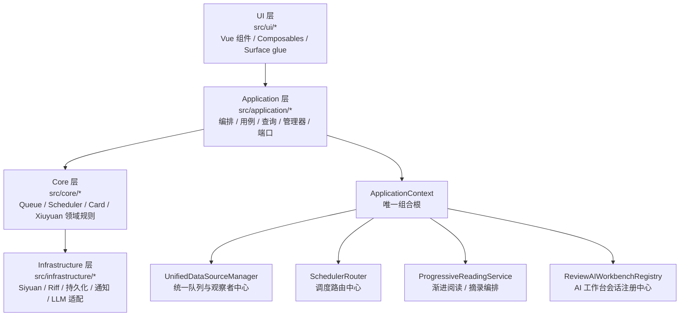
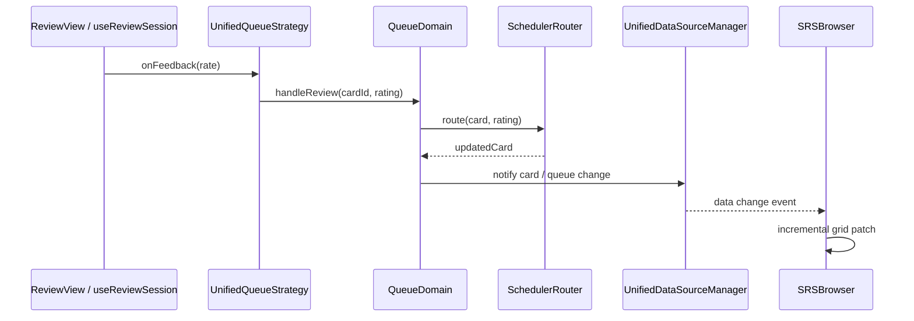

# SiyuanMemo 插件架构说明

最后更新：2026-04-15

本文是当前运行时架构与主数据流的单一事实来源（Single Source of Truth），面向协作者、贡献者与 AI 代理。它描述的是当前仍在生效的主路径，不负责保留历史迁移过程。

---

## 1. 文档目的与边界

本文覆盖：

- 当前分层架构与依赖方向
- 组合根与运行时装配
- Browser / Review / Queue / Scheduler 主链路
- Progressive / Excerpt / Topic-derived item 主链路
- AI Workbench / Capture 主链路
- 完整运行时文件职责地图
- 开发边界与改动守则

本文不覆盖：

- 历史迁移复盘
- 旧架构兼容层的设计意图
- 普通用户使用手册

主校准源如下：

1. `src/index.ts`
2. `src/application/ApplicationContext.ts`
3. `src/types/unified-data-source.ts`
4. 活跃调用链对应的 `src/` 代码

如果文档与代码冲突，以代码为准。

---

## 2. 当前分层架构总览

插件的固定主依赖方向是：

`ui -> application -> core -> infrastructure`

各层职责：

- `ui/*`：界面、用户交互、表面状态、对外可见 surface 的粘合逻辑。
- `application/*`：用例编排、管理器、查询、服务装配、端口定义、跨领域流程。
- `core/*`：队列规则、调度规则、卡片领域、修远领域、共享事件与核心能力。
- `infrastructure/*`：Siyuan / Riff / 文件 / 通知 / LLM 等外部系统适配。

当前活跃的 bounded contexts：

- Browser
- Review
- Queue / Scheduler
- Card CRUD
- Xiuyuan
- Progressive / Excerpt
- Topic-derived item
- AI Workbench / Capture
- Mobile entry
- Siyuan / Riff integration

---

## 3. 启动与装配流程（Composition Root）

运行时启动主链路：

1. `src/index.ts` 的 `onload()`
2. 调用 `ApplicationContext.create({ plugin, i18n })`
3. 由 `ApplicationContext` 统一装配并暴露运行时服务
4. `src/index.ts` 再注册顶栏、Dock、事件处理器、Slash 命令、移动端入口等外层 UI 胶水

`ApplicationContext` 是当前唯一组合根。它负责：

- 初始化 `StorageManager` / `UnifiedStorageManager`
- 初始化 `SchedulerRouter` / `RescheduleService`
- 初始化 `UnifiedDataSourceManager`
- 装配 `CardApplicationService` / `BrowserApplicationService` / `ReviewApplicationService`
- 装配 `DialogManager` / `MenuManager` / `TabManager` / `DockManager`
- 装配 `XiuyuanApplicationService` / `XiuyuanSyncService`
- 装配 `ProgressiveReadingService` / `SelectionExcerptService` / `TopicDerivedItemService`
- 装配 `ConfiguredCaptureStorageService` / `AIDailyNoteDraftService` / `ReviewAIWorkbenchRegistry` / `AIWorkbenchService`

这意味着：

- 任何运行时服务暴露、服务替换、启动顺序问题，先看 `ApplicationContext`
- 任何 surface 是如何被打开的，先看 `src/index.ts` + `DialogManager` / `TabManager`
- 任何“这个能力到底算哪个 bounded context”的争议，先看组合根里它如何被装配和谁在消费它

---

## 4. 关键运行入口与主链路

### 4.1 Browser

主要入口：

- `src/index.ts` 顶栏点击
- `src/application/managers/MenuManager.ts`
- `src/application/managers/DialogManager.ts::openBrowserDialog()`

主链路：

1. 入口动作落到 `DialogManager.openBrowserDialog()`
2. 挂载 `src/ui/browser/SRSBrowser.vue`
3. `SRSBrowser.vue` 消费：
   - `BrowserApplicationService`
   - `TabApplicationService`
   - `UnifiedDataSourceManager` facade
4. Browser 在全量 / 队列 / deck 等模式下，通过 application queries 或统一队列快照加载数据
5. UI 增量刷新由 `useBrowserAdapterSync`、`useIncrementalGridUpdates`、`useQueueBridge` 驱动

### 4.2 Review

主要入口：

- `DialogManager.openReviewDialog()`
- `DialogManager.openSubsetReviewDialog()`
- `DialogManager.openNeuralRoamDialog()`
- `DialogManager` 中的 leech / filter-group / browser handoff 等 review 打开流

主链路：

1. `DialogManager` 选择队列与 header variant，并根据 `settings.ui` 决定桌面端标准 review 入口是走 dialog 还是 `TabManager.openReviewTabInNewTab(...)`
2. dialog 路径走 `createUnifiedReviewDialog(...)`；tab 路径走 `TabManager` 的 review tab handoff
3. dialog 工厂装配：
   - `UnifiedQueueStrategy`
   - `UnifiedReviewAdapter`
   - `SchedulerRouter`
   - `UnifiedDataSourceManager`
4. 挂载 `src/ui/review/v2/ReviewView.vue`
5. `useReviewSession.ts` 绑定 `reviewSessionController.ts`；controller 统一驱动 `next / reveal / grade / skip / custom`
6. review header 的二级动作仍由 `ReviewView.vue` 编排：
   - `AI 侧栏` 统一走 `ReviewAIWorkbenchRegistry`
   - `更多` 菜单中的优先级编辑走 `CardEditorApplicationService.updatePriority(...)`
   - `更多` 菜单中的“编辑当前内容”走 `ReviewApplicationService.getBlockKramdown/updateBlockMarkdown(...)`，通过共享 `LargeTextEditorDialog` 编辑当前块原始 Markdown
   - tab 模式下插件托管的“右侧/下方分屏当前复习”先通过 `SharedReviewSessionRegistry` 提升或复用共享 review session，再交给 `TabManager.openReviewTab(...)`
   - `更多` 菜单中的暂停动作走 `CardEditorApplicationService`
   - `更多` 菜单中的删除动作走 `CardApplicationService`
   - progressive excerpt / open-as / fullscreen / SRS editor 继续复用既有 application / dialog 主链
7. `ReviewContent.vue` 继续在 `主 Protyle / special renderer` 之间路由；special renderer 现在通过 `getEditableSource()` 向 `ReviewView.vue` 暴露当前可编辑块，并用 review-local `renderEpoch` 触发同块保存后的强制重渲染
8. review tab 现在区分 `surface id` 与 `shared review session id`：前者仍用于 tab 生命周期/AI companion 绑定，后者只用于插件托管分屏共享同一套 review controller

当前 review surface 路由补充：

- `reviewOpenInNewTabByDefault` 只影响桌面端标准全局 review 入口：提取练习、渐进学习、刻意练习、筛选复习、神经漫游，以及 filter-backed retrieval / incremental handoff。
- `reviewOpenFullscreenByDefault` 只影响 dialog 模式的初始打开状态；一旦走 tab 路径，该设置被忽略。
- filter-backed retrieval / incremental 在切到 tab 时，不直接复用 live queue，而是通过 `FilterGroupQueue.serializeSessionSnapshot()` -> `ReviewTabTransferState(kind='filter-group-session')` 把 filter、临时黑名单和可见顺序交给 `TabManager` 恢复。
- `subset-review`、`temporary-drill`、`leech` 等依赖上下文/live queue 实例的会话型 review 仍保持 dialog-only，直到 tab restore parity 明确建模。

评分主链：

### 4.3 Progressive / Excerpt / Topic-derived item

当前这些能力已经在主路径上，不是临时实验分支。

主要入口：

- `DialogManager.openProgressiveSplitDialog()`
- `ProgressiveExcerptHotkeyHandler`
- `BlockMenuHandler` 中的 progressive excerpt 入口
- `ReviewView.vue` 对 `PROGRESSIVE_EXCERPT_REQUEST_EVENT` 的响应
- `AutoCardHandler` 中的 topic continuation / topic-derived item 入口

主链路分工：

- `ProgressiveReadingService`：渐进阅读、拆分、摘录、来源追踪、文档与卡片编排的核心应用服务
- `SelectionExcerptService`：把选择态 surface 接到 `ProgressiveReadingService` 的轻量门面
- `TopicDerivedItemService`：在 topic / excerpt 语境下创建 topic-derived item

集成边界：

- `ProgressiveSiyuanPort` / `ProgressiveSiyuanAdapter`
- `ProgressiveNativeRiffPort` / `ProgressiveNativeRiffAdapter`
- `ConfiguredCaptureStoragePort` / `ConfiguredCaptureStorageSiyuanAdapter`

### 4.4 AI Workbench / Capture

主要入口：

- `DialogManager.openAiWorkbenchDialog()`
- `TabManager` 打开的 review companion tab
- `ReviewView.vue` 与 `ReviewAIWorkbenchRegistry` 的 review session 交互

主链路分工：

- `ReviewAIWorkbenchRegistry`：持有 standalone service 与按 review session 隔离的 AI service
- `AIWorkbenchSessionStoreService`：通过 `FileService` 持久化 AI 会话索引与单会话记录文件，承接历史列表、重命名、删除与上下文签名回放
- `AIWorkbenchService`：AI 工作台状态机、持久化会话/线程消息流、`qa/cloze/concept-descriptor/cdf` 模式编排、候选解析与动作编排
- `src/types/settings.ts`：AI Prompt 的持久化真相源；当前使用四组 `run/followUp` prompt 对：`run` 表示用户可编辑的行为 Prompt，`followUp` 表示用户可编辑的追问 Prompt
- `AIPromptContractRegistry`：结构化首轮任务的系统契约注册表；统一维护 JSON 字段、必填项与来源约束，并为运行时追加和设置页只读说明提供同一份事实源
- `AIPromptComposer`：只负责推荐 prompt 模板描述与默认行为/追问 Prompt，不再承担运行时结构化协议拼接
- `AIDailyNoteDraftService`：候选内容写入 daily note / draft / capture 存储
- `ConfiguredCaptureStorageService`：捕获存储位置与写入策略

当前 make-card 主路径补充：

- `AiWorkbenchPane.vue` 暴露 `CDF 辅助制卡` 独立模式，但仍复用概念定义 / 概念描述符模板族与现有候选落草稿链路
- 模板选择弹窗里的 `AI 辅助制卡` 快捷入口默认走 `makeCardMode: 'cdf'` 并自动运行
- 结构化首轮任务（`tutor` / `explain` / `make-cards`）会在运行时把用户保存的行为 Prompt 与 `AIPromptContractRegistry` 中的系统结构化契约拼成最终 `system` prompt，并通过 `LLMPort` 请求 `json_object` 输出模式
- follow-up 继续直接使用用户保存的 `followUp` Prompt，保持普通文本对话，不追加结构化契约
- `AI 导师 / AI 解释` 结果与 follow-up 不再挂在单次结果面板下，而是写入持久化 session 的消息流；`AI 辅助制卡` 则把每次候选结果写成 `candidate-board` assistant message，旧候选板保留历史只读
- review/browser/template-dialog/standalone 全入口统一走同一套会话仓储；当上下文签名变化时，默认新开会话，旧会话进入历史，可手动回看并明确标记为历史上下文

UI surface：

- `src/ui/ai/AiWorkbenchDialog.vue`
- `src/ui/ai/AiWorkbenchPane.vue`

### 4.5 Mobile entry

当前移动端主路径：

1. `src/index.ts` 判断 `isMobile`
2. 顶栏动作改为 `DialogManager.openMobileQueueLauncherDialog()`
3. 挂载 `src/ui/mobile/MobileReviewLauncher.vue`
4. 用户从 launcher 继续进入 queue-specific review 或 browser

桌面端顶栏主路径仍是 `openBrowserDialog()`。

---

## 5. 文件职责地图（完整运行时地图）

说明：

- 本节覆盖当前运行时主链路与高频文件职责
- 目标不是枚举所有历史文件，而是让协作者能快速定位“这类行为该去哪一层、哪一组文件找”
- `__tests__`、备份文件、历史迁移文档不作为主架构基线

### 5.1 根入口（`src/`）

- `src/index.ts`：插件生命周期入口；创建 `ApplicationContext`，注册顶栏、Dock、命令、Slash、移动端入口与事件处理器。
- `src/main.ts`：独立前端挂载入口，主要用于调试 / standalone surface。
- `src/App.vue`：前端壳层组件。
- `src/commands.ts`：命令入口的轻量封装。
- `src/index.scss`：全局样式入口。
- `src/global.d.ts` / `src/shims-vue.d.ts`：全局与 Vue 类型声明。

### 5.2 Application 层（`src/application/*`）

组合根与管理器：

- `src/application/ApplicationContext.ts`：唯一组合根、服务注册表、生命周期与依赖注入容器。
- `src/application/managers/DialogManager.ts`：Browser / Review / AI / Progressive dialog 总入口。
- `src/application/managers/MenuManager.ts`：顶栏与菜单动作编排。
- `src/application/managers/TabManager.ts`：Browser / Review / AI companion tab 生命周期与 handoff。
- `src/application/managers/DockManager.ts`：Dock panel 初始化与交互。
- `src/application/managers/BlockMenuHandler.ts`：块菜单、文档菜单、编辑器菜单入口动作。
- `src/application/managers/PracticeQueueManager.ts` / `ReviewSyncManager.ts`：复习与同步相关的应用层管理。

核心应用服务：

- `src/application/services/UnifiedDataSourceManager.ts`：统一队列创建、缓存、失效、观察者通知中心。
- `src/application/services/CardApplicationService.ts`：卡片创建 / 更新 / 删除的应用编排入口。
- `src/application/services/BrowserApplicationService.ts`：Browser 读模型、统计与交互动作的主服务。
- `src/application/services/ReviewApplicationService.ts`：复习流程相关编排。
- `src/application/services/SettingsService.ts` / `ReviewLogService.ts` / `RiffBlacklistService.ts`：配置、日志、黑名单等横切服务。
- `src/application/services/XiuyuanSyncService.ts`：Riff 对账服务；增量只做幂等 upsert / 元数据同步，全量才允许删除 riff-owned Xiuyuan。
- `src/application/services/ReviewQueuePreparationService.ts` / `DocTreeReviewScopeService.ts`：review scope 与 queue preparation 编排。
- `src/application/services/ConfiguredCaptureStorageService.ts`：capture 目标存储解析与写入策略。
- `src/application/services/ExcerptRecordService.ts`：摘录记录与去重相关服务。
- `src/application/services/ProgressiveReadingService.ts`：progressive split / excerpt 的主编排服务。
- `src/application/services/SelectionExcerptService.ts`：选择态摘录门面。
- `src/application/services/TopicDerivedItemService.ts`：topic continuation / derived item 创建编排。
- `src/application/services/AIDailyNoteDraftService.ts`：AI 候选内容写入 daily note / draft。
- `src/application/services/AIWorkbenchSessionStoreService.ts`：AI 会话索引 + 单会话 JSON 持久化。
- `src/application/services/ReviewAIWorkbenchRegistry.ts`：AI 工作台会话注册中心。
- `src/application/services/SharedReviewSessionRegistry.ts`：插件托管 review 分屏的共享 session 注册中心。
- `src/application/services/AIWorkbenchService.ts`：AI 工作台状态与动作编排。

适配器、工厂、查询、用例：

- `src/application/factories/createUnifiedReviewDialog.ts`：统一 review dialog 工厂。
- `src/application/adapters/UnifiedQueueStrategy.ts`：review session 到 queue domain 的策略适配。
- `src/application/adapters/UnifiedReviewAdapter.ts`：review UI 状态与动作适配。
- `src/application/queries/browser/*`：Browser 查询对象与处理器。
- `src/application/queries/card/*`：卡片查询对象与处理器。
- `src/application/queries/DataAccessFacade.ts`：查询门面与统一数据访问入口。
- `src/application/usecases/card/*`：卡片 CRUD 用例。
- `src/application/usecases/xiuyuan/*`：修远创建 / 删除 / 重绑定 / 查询用例。
- `src/application/commands/card/*` / `src/application/commands/xiuyuan/*`：命令对象层。

Handlers / entries / helpers：

- `src/application/handlers/AutoCardHandler.ts`：自动制卡、topic continuation、与 Riff / Progressive 的事件联动；当前监听制卡走“transaction 只标记候选块，300ms settled 后重读真实块状态再做 planner / Xiuyuan ensure”的语义触发模型。
- `src/application/handlers/ProgressiveExcerptHotkeyHandler.ts`：编辑器 / review 摘录热键入口。
- `src/application/entries/*`：surface 级入口解析，如 block context、selection resolver、review entry registry。
- `src/application/helpers/CardCreationHelper.ts`：建卡共享辅助逻辑。

端口与接口：

- `src/application/ports/*`：应用层端口定义，约束基础设施依赖方向。
- `src/application/interfaces/*`：应用层接口契约。

### 5.3 Core 层（`src/core/*`）

队列与调度：

- `src/core/queue/domain/BaseReviewQueue.ts`：队列聚合根基类。
- `src/core/queue/domain/RetrievalPracticeQueue.ts`：检索练习队列。
- `src/core/queue/domain/FinalDrillQueue.ts`：最终训练队列。
- `src/core/queue/domain/IncrementalLearningQueue.ts`：渐进学习队列。
- `src/core/queue/domain/FilterGroupQueue.ts`：筛选复习队列。
- `src/core/queue/domain/NeuralRoamQueue.ts`：神经漫游队列。
- `src/core/queue/domain/LeechReviewQueue.ts`：难点攻坚队列。
- `src/core/queue/domain/SubsetReviewQueue.ts` / `TemporaryDrillQueue.ts`：会话性与辅助队列。
- `src/core/queue/sequencers/*` / `src/core/queue/schedulers/*`：队列内抽卡与排序策略。
- `src/core/queue/neural/*`：神经漫游引擎、历史、trace、传播相关能力。
- `src/core/scheduler/SchedulerRouter.ts`：全局调度路由器。
- `src/core/scheduler/AdvanceEngine.ts` / `PostponeEngine.ts` / `SpreadEngine.ts` / `rescheduleService.ts`：重排与计划引擎。
- `src/core/scheduler/strategies/*`：具体调度器实现。

存储、卡片、修远：

- `src/core/storage/*`：统一存储、持久化回调、底层存储管理。
- `src/core/card/*`：卡片领域对象、渲染、卡型实现与卡片规则。
- `src/core/card-builder/*`：卡型识别、元数据提取与构建辅助。
- `src/core/card-type/*`：卡型标记与规则映射。
- `src/core/xiuyuan/domain/*`：修远聚合、值对象、领域服务、领域事件。
- `src/core/xiuyuan/infrastructure/XiuyuanRepository.ts`：修远仓储核心实现。
- `src/core/xiuyuan/templates/*`：内置模板与模板注册。

共享能力：

- `src/core/shared/domain/events/EventBus.ts`：共享事件总线。
- `src/core/infrastructure/websocket/TransactionWebSocketService.ts`：事务级 `ws-main` 事件总线订阅与 handler 分发。
- `src/core/infrastructure/websocket/QuickCardWebSocketService.ts`：快速卡 websocket。
- `src/core/extensions/*`：可扩展 queue / review provider 抽象。
- `src/core/siyuan/*`：核心 Siyuan API 封装；不应成为 UI / application 直连入口。

### 5.4 Infrastructure 层（`src/infrastructure/*`）

Siyuan / Riff / LLM 适配器：

- `src/infrastructure/siyuan/BrowserSiyuanAdapter.ts`
- `src/infrastructure/siyuan/ReviewSiyuanAdapter.ts`
- `src/infrastructure/siyuan/QuerySiyuanAdapter.ts`
- `src/infrastructure/siyuan/ManagerSiyuanAdapter.ts`
- `src/infrastructure/siyuan/CardCreationSiyuanAdapter.ts`
- `src/infrastructure/siyuan/CardDeletionSiyuanAdapter.ts`
- `src/infrastructure/siyuan/AutoCardSiyuanAdapter.ts`
- `src/infrastructure/siyuan/AutoCardRiffAdapter.ts`
- `src/infrastructure/siyuan/XiuyuanSiyuanAdapter.ts`
- `src/infrastructure/siyuan/XiuyuanSyncSiyuanAdapter.ts`
- `src/infrastructure/siyuan/ProgressiveSiyuanAdapter.ts`
- `src/infrastructure/siyuan/ProgressiveNativeRiffAdapter.ts`
- `src/infrastructure/siyuan/ConfiguredCaptureStorageSiyuanAdapter.ts`
- `src/infrastructure/siyuan/AISiyuanAdapter.ts`
- `src/infrastructure/llm/OpenAICompatibleLLMAdapter.ts`

持久化与支撑：

- `src/infrastructure/persistence/*`：卡片仓储、DTO、mapper、持久化映射。
- `src/infrastructure/queries/CardReadModel.ts`：读模型实现。
- `src/infrastructure/services/FileService.ts` / `QueuePersistenceService.ts`：文件与队列持久化支撑。
- `src/infrastructure/queue/*`：队列相关副作用适配器。
- `src/infrastructure/events/*`：基础设施层事件处理。
- `src/infrastructure/notifications/SiyuanErrorNotificationAdapter.ts`：错误通知适配器。

### 5.5 UI 层（`src/ui/*`）

Browser：

- `src/ui/browser/SRSBrowser.vue`：Browser 主视图。
- `src/ui/browser/SRSBrowserAdapter.ts` / `SRSBrowserQueueView.ts`：Browser 桥接与队列视图逻辑。
- `src/ui/browser/composables/*`：Browser 状态、刷新、排序、筛选、动作封装。
- `src/ui/browser/datasource/*`：Browser 不同数据源实现。
- `src/ui/browser/components/*` / `dialogs/*` / `utils/*`：Browser 交互组件与工具。

Review：

- `src/ui/review/v2/ReviewView.vue`：复习主界面。
- `src/ui/review/v2/useReviewSession.ts`：复习会话状态机。
- `src/ui/review/v2/*`：header / actions / overlays / providers / dialogs / neural tab bridge 等 review 子组件。
- `src/ui/review/components/*`：各卡型渲染组件。
- `src/ui/review/ReviewViewAdapter.ts`：review 适配层。

移动端、渐进阅读、AI：

- `src/ui/mobile/MobileReviewLauncher.vue`：移动端队列 launcher。
- `src/ui/progressive/ProgressiveSplitDialog.vue`：progressive split surface。
- `src/ui/ai/AiWorkbenchDialog.vue`：standalone AI dialog。
- `src/ui/ai/AiWorkbenchPane.vue`：AI pane 主内容。

其他 UI：

- `src/ui/settings/SettingsPanel.vue`：设置面板。
- `src/ui/srs/*`：SRS 数据编辑与透明度相关 UI。
- `src/ui/xiuyuan/*`：修远模板与专用 UI。
- `src/ui/menu/TopBar.ts`：顶栏菜单入口。
- `src/ui/components/*` / `src/ui/shared/*`：通用 UI 原子组件与共享加载逻辑。

### 5.6 类型与工具（`src/types` / `src/utils`）

核心类型：

- `src/types/unified-data-source.ts`：`QueueType`、`IReviewQueue`、observer、Neural Roam session contract。
- `src/types/card.ts` / `review.ts` / `scheduler.ts` / `settings.ts`：各主业务域类型。
- `src/types/ai.ts`：AI workbench surface、session 与交互契约。
- `src/types/result.ts`：统一 Result 类型。
- `src/types/queue-browser.ts` / `reschedule*.ts` / `logging.ts`：各 surface 与横切类型。

共享工具：

- `src/utils/logger.ts`：统一日志入口。
- `src/utils/dialog.ts`：dialog surface 创建工具。
- `src/utils/configMigrator.ts` / `simpleModeRemovalMigrator.ts`：配置迁移工具。
- `src/utils/queryCache.ts` / `batchQuery.ts` / `sqlOptimizer.ts`：查询与缓存工具。
- `src/utils/errorReporter.ts` / `EventEmitter.ts`：错误与事件辅助。
- `src/utils/*` 下其他性能、日期、异步工具：作为横切支撑，不承载业务规则。

---

## 6. 统一队列系统（Unified Data Source）

统一队列契约定义于：

- `src/types/unified-data-source.ts`

统一队列运行时中心：

- `src/application/services/UnifiedDataSourceManager.ts`

当前主字面量队列类型：

- `retrieval-practice`
- `final-drill`
- `incremental-learning`
- `filter-group`
- `neural-roam`
- `leech`

补充说明：

- `subset`、temporary drill 等会话型 surface 存在，但不是 `QueueType` 主字面量的一部分
- `neural-roam` 的字面量不变，但当前活跃契约是 focus-first

`UnifiedDataSourceManager` 负责：

- 懒加载并缓存队列实例
- 统一暴露队列 facade
- 处理卡片变更后的队列失效与重建
- 通过 observer / data change event 通知 Browser、Review 与其他消费者

具体队列实现位于：

- `src/core/queue/domain/*`

---

## 7. Browser 架构与数据流

打开链路：

1. `DialogManager.openBrowserDialog()`
2. 挂载 `SRSBrowser.vue`
3. Browser 从 `BrowserApplicationService`、`TabApplicationService`、`UnifiedDataSourceManager` 读取数据与动作

Browser 核心职责：

- 表格视图与 hierarchy 视图
- queue / global / filtered / deck 等模式切换
- 队列计数、排序、筛选、卡片批量动作
- 文档预览与单路径打开
- Neural Roam 的 browser-side 子视图

当前 Browser 主刷新机制：

- `useBrowserAdapterSync`：订阅数据变化
- `useIncrementalGridUpdates`：按受影响 card / snapshot id 做表格补丁刷新
- `useQueueBridge`：刷新队列计数与 queue-side 状态

Browser 不应：

- 直接实现调度规则
- 绕过 application service 直接写入底层存储
- 把 `core/siyuan/*` 当成默认调用入口

当前 suspended / pause 真相源补充：

- Browser 的 `已暂停` 预设、统计与卡片投影现在以统一存储中的 `meta.suspended` / dismiss-state 为主，不再把 `attributes.custom-fsrs-suspended` 当作现行查询真相源。
- Browser 的批量暂停/恢复只更新统一存储与 cache，不再写块属性。
- `custom-fsrs-suspended` 仅保留为旧卡片兼容读取来源，不再是后台写入目标。

---

## 8. Review 架构与数据流

Review surface 的当前统一点是：

- 打开由 `DialogManager` 决策
- session 由 `createUnifiedReviewDialog` 建立
- queue 行为经 `UnifiedQueueStrategy`
- UI shape 经 `UnifiedReviewAdapter`

Review 运行时要点：

- `ReviewView.vue` 负责界面、键盘交互、progressive excerpt 触发、AI companion session 对齐，以及 review header `更多` 菜单对 `ReviewApplicationService` / `CardEditorApplicationService` / `CardApplicationService` 的二级动作编排
- `useReviewSession.ts` 负责把 Vue 生命周期绑定到共享或本地 `reviewSessionController`
- `reviewSessionController.ts` 负责真正的 review session 状态机、动作串行化，以及多 surface 共享时的单一 authoritative controller
- queue-specific header / actions / variant 由 adapter 与 queue config 决定
- `TabManager` 负责 review tab、browser handoff、AI companion tab 复用；插件托管 review 分屏时会携带 `sharedReviewSessionId + reviewState`

这意味着：

- 评分、跳过、custom action 先查 `useReviewSession.ts`
- 如果是 queue semantics，继续查 `UnifiedQueueStrategy.ts`
- 如果是 UI 展示或 header variant，继续查 `UnifiedReviewAdapter.ts`

当前 review-side suspend 补充：

- review header `更多` 菜单里的暂停/恢复统一走 `CardEditorApplicationService`，只更新统一存储中的 dismiss-state，不再写 `custom-fsrs-suspended`。
- `CardEditorApplicationService.loadSnapshot()` 仍会对缺少显式 dismissed meta 的旧卡片兼容读取 `custom-fsrs-suspended=true`，但该属性不再是现行写回目标。

---

## 9. Progressive / Excerpt / Topic-derived item

当前 progressive 相关能力已经汇聚到一条主路径：

- progressive split：`DialogManager` -> `ProgressiveSplitDialog.vue` -> `ProgressiveReadingService`
- progressive excerpt：热键 / block menu / review surface -> `SelectionExcerptService` -> `ProgressiveReadingService`
- topic continuation：`AutoCardHandler` -> `TopicDerivedItemService` -> `ProgressiveReadingService`

角色划分：

- `ProgressiveReadingService`
  - 创建 split piece / excerpt / 相关 workbench 文档
  - 维护来源块、来源文档、摘录记录、去重与回滚
  - 协调 card service、capture storage、Riff / Siyuan 边界
- `SelectionExcerptService`
  - 负责把 selection-oriented 输入适配到主 progressive 服务
- `TopicDerivedItemService`
  - 在 topic / excerpt 语境中派生 item，并保持 lineage

边界规则：

- 对 Siyuan 文档 / 块结构的实际写操作，经 `ProgressiveSiyuanPort`
- 对 native Riff 同步，经 `ProgressiveNativeRiffPort`
- 对 capture 落点，经 `ConfiguredCaptureStoragePort`

---

## 10. AI Workbench / Capture

AI 工作台的当前架构分成两层：

1. 服务注册与会话隔离
2. 持久化会话 / 线程消息流
3. UI surface 承载

服务层：

- `ReviewAIWorkbenchRegistry`
  - 管理 standalone service
  - 管理按 review session 隔离的 AI workbench service
- `AIWorkbenchSessionStoreService`
  - 通过 `FileService` 落盘 `index + per-session record`
  - 提供会话历史列表、按 id 读取、重命名、删除
  - 让 AI 工作台不再把历史塞进 settings 或内存态里
- `AIWorkbenchService`
  - 管理当前 session、历史索引、上下文抽屉 / 历史抽屉 UI 状态
  - 维护 `tutor / explain / make-cards` 三条模式线程的消息流
  - `AI 导师 / AI 解释` 的结构化结果写入 assistant-result message；`AI 辅助制卡` 的候选板写入 candidate-board message
  - 管理状态、候选、`qa/cloze/concept-descriptor/cdf` make-card mode、surface 差异
  - 读取 `settings.ai.prompts.*.{run,followUp}` 作为用户可编辑 prompt 真相源，其中 `run` 是行为层，`followUp` 是追问层
  - 对结构化首轮请求把行为 Prompt 与 `AIPromptContractRegistry` 的系统契约组合成最终 `system` prompt
  - 对结构化首轮请求显式要求 `json_object` 输出，并在本地容忍 fenced JSON 包装，降低“Prompt 正确但模型包了代码块”导致的结构化失败
  - 在 `cdf` 模式下切换到 `cardCandidateCdf` prompt 组，并复用概念定义 / 描述符模板池
  - 保持现有 JSON 候选契约；若用户自定义行为 Prompt 与系统契约冲突导致结构化输出失效，则在错误里提示检查对应行为 Prompt
- `AIPromptComposer`
  - 只提供推荐模板描述与默认行为/追问 Prompt
  - 不再承担运行时结构化协议拼接职责
- `AIDailyNoteDraftService`
  - 将候选内容写入 daily note / draft / capture 目标
- `ConfiguredCaptureStorageService`
  - 解析当前 capture 目标与持久化策略

UI 层：

- `DialogManager.openAiWorkbenchDialog()`：standalone dialog
- `TabManager.openReviewAICompanionTab(...)`：review companion tab
- `ReviewView.vue`：在 review session 生命周期里对齐 AI companion 上下文
- `AiWorkbenchPane.vue`
  - 统一渲染聊天式外壳：顶部工具条、历史抽屉、上下文抽屉、底部 composer
  - 设置页暴露的四组 Prompt 与工作台的 `CDF 辅助制卡` 模式在这里汇合到同一条候选生成路径
  - 最新候选板仍可编辑/落卡，旧候选板保留在消息流中只读回放

外部边界：

- `AISiyuanPort`：Siyuan 读写
- `LLMPort`：LLM 调用
- `ConfiguredCaptureStoragePort`：capture 存储选择

---

## 11. 调度、同步与事件系统

调度主入口：

- `src/core/scheduler/SchedulerRouter.ts`

当前职责：

- 根据卡片类型、设置与队列上下文选择调度策略
- 执行 schedule / reschedule / preview
- 对不支持的调度路径显式报错，而不是静默降级

同步与事件主入口：

- `EventBus`
- `UnifiedDataSourceManager` observer 事件
- `TransactionWebSocketService`（订阅宿主 `eventBus.on('ws-main')`，不再 monkey-patch 主 `WebSocket.onmessage`；当前只承载 AutoCard / doc tree review scope 等 transaction-local 处理）
- `XiuyuanSyncService`（生命周期触发的 Riff 增量/全量对账，不再由 transaction 近实时触发）
- `AutoCardHandler`（候选块队列 -> settled 评估 -> Xiuyuan ensure/create）

主设计原则：

- Browser / Review 刷新优先走事件与统一数据源通知
- 不依赖分散轮询来维持主状态一致性
- WebSocket、Riff、Xiuyuan 同步都属于 infrastructure / handler 边界，不应反向污染 UI 直接调用链

当前 Riff / Xiuyuan 同步边界补充：

- managed Riff Xiuyuan 现在按 `templateID === 'builtin-riff-sync'` 或 `meta.source === 'riff-sync'` 识别；后台同步判断“这张块是否已被治理”时，优先走 repository / unified storage 的 `blockId` 反查。
- `custom-xiuyuan-id` / `custom-fsrs-xiuyuan-id` 已降级为旧数据兼容兜底读取来源，不再作为自动同步里的真相源，也不再对 managed Riff Xiuyuan 做后台写入、自修复清理或删除时清空。
- 增量同步触发器现在只允许 `plugin-start` / `browser-open`；`review-open` 已无运行语义，仅作为遗留默认三件套归一化输入被折叠回 `['plugin-start']`。
- Riff 增量对账使用 `UnifiedStorageManager.riffSyncState` 持久化 checkpoint；当 Riff API 只能按时间窗拉取时，默认从上次成功增量时间回退 5 秒，再依赖 blockId / XiuyuanId 幂等 upsert 去重。
- 增量对账不执行删除，只拉取外部变化并同步合法的非调度元数据；删除检测只允许 full reconcile 执行，因此 full sync 默认周期为 24 小时。
- ownership 规则固定为 local-owned 优先：同一 block 已存在 AutoCard / 手动创建的本地 Xiuyuan 时，Riff 对账不创建第二个 Xiuyuan、不改模板/卡面结构、不覆盖本地调度数据；riff-owned 仅允许同步合法元数据并在 full reconcile 中删除。
- `UnifiedStorageManager` 提供本地写入协调与异常 merge 日志；命中存储 merge 视为多窗口/外部实例冲突兜底，不再是正常单写者流程。
- 当前仍不提供跨设备分布式锁；多窗口/多端同时写入会由 storage merge、逻辑 face 去重与稳定 Xiuyuan/card id 收敛。

---

## 12. 关键接口契约与边界规则

高频契约：

- `IReviewQueue`
- `IUnifiedDataSourceManagerFacade`
- `IDataRouter`
- `ISchedulerRouter`
- `IQueueStrategy`
- `AIWorkbenchOpenOptions`

边界规则：

1. UI 依赖 application 抽象，不直接承载核心领域规则。
2. Application 通过 `src/application/ports/*` 依赖外部系统；`src/infrastructure/*` 提供实现。
3. Domain 规则放在 `src/core/*`，不要把业务规则塞回 UI 或 adapter。
4. `src/core/siyuan/*` 不是 UI / application 默认直连边界；优先端口 + adapter。
5. 不要把以下路径当活跃架构基线：
   - `src/domain/queues/*`
   - `src/index.simplified.ts`
   - `*.backup`
   - `*.bak`
   - `*.corrupted`

---

## 13. AI/开发改动守则

改动时默认遵守：

1. 先找真实入口，再顺着 `ui -> application -> core -> infrastructure` 追主链。
2. 保持单路径确定性，不新增 fallback / dual path 去掩盖 active-path 缺陷。
3. 改动影响组合根、bounded context 归属、主数据流时，同步更新本文档。
4. Progressive / AI / Mobile / Neural Roam 都已经是活跃主路径，不要把它们当旁路实验代码。
5. 如果只是 docs / skill 变更，不写 `docs/DDD_RESCAN_BACKLOG.md`。
6. 如果触碰运行时代码，最低验证为 `pnpm build`；仅文档任务则做代码交叉核对与 grep 验证即可。

---

## 14. 当前状态快照（2026-04-13）

当前架构基线：

- 运行时唯一组合根是 `ApplicationContext`
- 插件入口是 `src/index.ts`
- Browser 与 Review 共享 `UnifiedDataSourceManager` + `SchedulerRouter`
- `DialogManager` 负责 dialog surface，`TabManager` 负责 tab surface 与 surface handoff
- 桌面端标准 review 入口现在由 `DialogManager` 按 `settings.ui.reviewOpenInNewTabByDefault` / `reviewOpenFullscreenByDefault` 做统一路由；filter-backed review 进入 tab 时通过 transfer-state 恢复 session
- 移动端入口已收敛到 `openMobileQueueLauncherDialog()` -> `MobileReviewLauncher.vue`
- Neural Roam 保持 `neural-roam` 字面量，但活跃契约是 focus-first、history/session-aware
- Progressive / Excerpt / Topic-derived item 已在主路径中
- AI Workbench / Capture 已在主路径中，并通过 registry + session service 方式集成
- AI Prompt 的持久化真相源已收敛为用户可直接编辑的 `run/followUp` 对，其中结构化首轮的 JSON 契约由系统注册表托管而不是暴露给用户编辑
- AI 制卡模式已包含 `cdf`，且模板弹窗的 AI 快捷入口默认直达该模式

当前文档定位：

- `ARCHITECTURE.md`：当前人类可读的运行时总览
- `docs/DDD_RESCAN_BACKLOG.md`：生产代码债务与任务 delta
- `QUEUE_ARCHITECTURE.md`：队列专题补充材料
- `docs/AI_HANDOFF_GUIDE.md` / `docs/DEVELOPER_GUIDE.md`：仅作历史对照，不作活跃主路径基线

再次强调：

- 代码优先于文档
- 当前主架构以 `src/` 现行调用链为准
