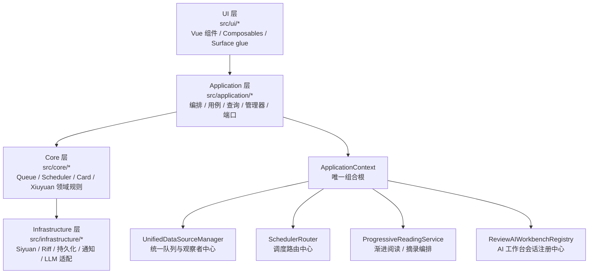
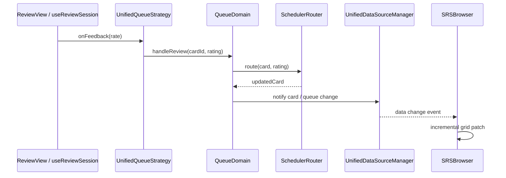

# SiyuanMemo 插件架构说明

最后更新：2026-04-22

本文是当前运行时架构与主数据流的单一事实来源（Single Source of Truth），面向协作者、贡献者与 AI 代理。它描述的是当前仍在生效的主路径，不负责保留历史迁移过程。

---

## 1. 文档目的与边界

本文覆盖：

- 当前分层架构与依赖方向
- 组合根与运行时装配
- Browser / Review / Queue / Scheduler 主链路
- Progressive / Excerpt / Topic-derived item 主链路
- AI Workbench / Capture 主链路
- 完整运行时文件职责地图
- 开发边界与改动守则

本文不覆盖：

- 历史迁移复盘
- 旧架构兼容层的设计意图
- 普通用户使用手册

主校准源如下：

1. `src/index.ts`
2. `src/application/ApplicationContext.ts`
3. `src/types/unified-data-source.ts`
4. 活跃调用链对应的 `src/` 代码

如果文档与代码冲突，以代码为准。

---

## 2. 当前分层架构总览

插件的固定主依赖方向是：

`ui -> application -> core -> infrastructure`

各层职责：

- `ui/*`：界面、用户交互、表面状态、对外可见 surface 的粘合逻辑。
- `application/*`：用例编排、管理器、查询、服务装配、端口定义、跨领域流程。
- `core/*`：队列规则、调度规则、卡片领域、修远领域、共享事件与核心能力。
- `infrastructure/*`：Siyuan / Riff / 文件 / 通知 / LLM 等外部系统适配。

当前活跃的 bounded contexts：

- Browser
- Review
- Queue / Scheduler
- Card CRUD
- Xiuyuan
- Progressive / Excerpt
- Topic-derived item
- AI Workbench / Capture
- Mobile entry
- Siyuan / Riff integration

---

## 3. 启动与装配流程（Composition Root）

运行时启动主链路：

1. `src/index.ts` 的 `onload()`
2. 调用 `ApplicationContext.create({ plugin, i18n })`
3. 由 `ApplicationContext` 统一装配并暴露运行时服务
4. `src/index.ts` 再注册顶栏、Dock、事件处理器、Slash 命令、移动端入口等外层 UI 胶水

`ApplicationContext` 是当前唯一组合根。它负责：

- 初始化 `StorageManager` / `UnifiedStorageManager`
- 初始化 `SchedulerRouter` / `RescheduleService`
- 初始化 `UnifiedDataSourceManager`
- 装配 `CardApplicationService` / `BrowserApplicationService` / `ReviewApplicationService`
- 装配 `DialogManager` / `MenuManager` / `TabManager` / `DockManager`
- 装配 `XiuyuanApplicationService` / `XiuyuanSyncService`
- 装配 `ProgressiveReadingService` / `SelectionExcerptService` / `SelectionTopicContinuationService` / `TopicDerivedItemService`
- 装配 `ConfiguredCaptureStorageService` / `ReviewAIWorkbenchRegistry` / `AIWorkbenchService`

这意味着：

- 任何运行时服务暴露、服务替换、启动顺序问题，先看 `ApplicationContext`
- 任何 surface 是如何被打开的，先看 `src/index.ts` + `DialogManager` / `TabManager`
- 任何“这个能力到底算哪个 bounded context”的争议，先看组合根里它如何被装配和谁在消费它

---

## 4. 关键运行入口与主链路

### 4.1 Browser

主要入口：

- `src/index.ts` 顶栏点击
- `src/application/managers/MenuManager.ts`
- `src/application/managers/DialogManager.ts::openBrowserDialog()`

主链路：

1. 入口动作落到 `DialogManager.openBrowserDialog()`
2. 挂载 `src/ui/browser/SRSBrowser.vue`
3. `SRSBrowser.vue` 消费：
   - `BrowserApplicationService`
   - `TabApplicationService`
   - `UnifiedDataSourceManager` facade
4. Browser 在全量 / 队列 / deck 等模式下，通过 application queries 或统一队列快照加载数据
5. UI 增量刷新由 `useBrowserAdapterSync`、`useIncrementalGridUpdates`、`useQueueBridge` 驱动

### 4.2 Review

主要入口：

- `DialogManager.openReviewDialog()`
- `DialogManager.openSubsetReviewDialog()`
- `DialogManager.openNeuralRoamDialog()`
- `DialogManager` 中的 leech / filter-group / browser handoff 等 review 打开流

主链路：

1. `DialogManager` 选择队列与 header variant，并根据 `settings.ui` 决定桌面端标准 review 入口是走 dialog 还是 `TabManager.openReviewTabInNewTab(...)`
2. dialog 路径走 `createUnifiedReviewDialog(...)`；tab 路径走 `TabManager` 的 review tab handoff
3. dialog 工厂装配：
   - `UnifiedQueueStrategy`
   - `UnifiedReviewAdapter`
   - `SchedulerRouter`
   - `UnifiedDataSourceManager`
4. 挂载 `src/ui/review/v2/ReviewView.vue`
5. `useReviewSession.ts` 绑定 `reviewSessionController.ts`；controller 统一驱动 `next / reveal / grade / skip / custom`，并且所有“直接把某张卡写成当前卡”的恢复/刷新入口都会先走 queue strategy 的 `hydrateCurrentItem()` 显示态补水，再更新 UI，避免外部刷新、会话恢复、AI 新卡同步等路径把原始 `FSRSCard` 直接塞回当前位后丢掉 runtime `nextDues`
6. review header 的二级动作仍由 `ReviewView.vue` 编排：
   - `AI 侧栏` 统一走 `ReviewAIWorkbenchRegistry`
   - `更多` 菜单中的优先级编辑走 `CardEditorApplicationService.updatePriority(...)`
   - `更多` 菜单中的“编辑当前内容”走 `ReviewApplicationService.getBlockKramdown/updateBlockMarkdown(...)`，通过共享 `LargeTextEditorDialog` 编辑当前块原始 Markdown
   - tab 模式下插件托管的“右侧/下方分屏当前复习”先通过 `SharedReviewSessionRegistry` 提升或复用共享 review session，再交给 `TabManager.openReviewTab(...)`
   - `更多` 菜单中的暂停动作走 `CardEditorApplicationService`
   - `更多` 菜单中的删除动作走 `CardApplicationService`
   - progressive excerpt / open-as / fullscreen / SRS editor 继续复用既有 application / dialog 主链
7. `ReviewContent.vue` 继续在 `主 Protyle / special renderer` 之间路由；special renderer 现在通过 `getEditableSource()` 向 `ReviewView.vue` 暴露当前可编辑块，并用 review-local `renderEpoch` 触发同块保存后的强制重渲染
8. review tab 现在区分 `surface id` 与 `shared review session id`：前者仍用于 tab 生命周期/AI companion 绑定，后者只用于插件托管分屏共享同一套 review controller

当前 review surface 路由补充：

- `reviewOpenInNewTabByDefault` 只影响桌面端标准全局 review 入口：提取练习、渐进学习、刻意练习、筛选复习、神经漫游，以及 filter-backed retrieval / incremental handoff。
- `reviewOpenFullscreenByDefault` 只影响 dialog 模式的初始打开状态；一旦走 tab 路径，该设置被忽略。
- filter-backed retrieval / incremental 在切到 tab 时，不直接复用 live queue，而是通过 `FilterGroupQueue.serializeSessionSnapshot()` -> `ReviewTabTransferState(kind='filter-group-session')` 把 filter、临时黑名单和可见顺序交给 `TabManager` 恢复。
- `subset-review`、`temporary-drill`、`leech` 等依赖上下文/live queue 实例的会话型 review 仍保持 dialog-only，直到 tab restore parity 明确建模。

评分主链：

### 4.3 Progressive / Excerpt / Topic-derived item

当前这些能力已经在主路径上，不是临时实验分支。

主要入口：

- `DialogManager.openProgressiveSplitDialog()`
- `ProgressiveExcerptHotkeyHandler`
- `BlockMenuHandler` 中的 progressive excerpt 入口
- `ReviewView.vue` 对 `PROGRESSIVE_EXCERPT_REQUEST_EVENT` 的响应
- `AutoCardHandler` 中的 topic continuation / topic-derived item 入口
- 编辑器选区右键中的 `摘录` / `在摘录下制卡`

主链路分工：

- `ProgressiveReadingService`：渐进阅读、拆分、摘录、来源追踪、文档与卡片编排的核心应用服务
- `SelectionExcerptService`：把选择态 surface 接到 `ProgressiveReadingService` 的轻量门面
- `SelectionTopicContinuationService`：把选区继续制卡的 topic/excerpt 语境判定与 planner 结果适配到 topic-derived 主链
- `TopicDerivedItemService`：在 topic / excerpt 语境下创建 topic-derived item

集成边界：

- `ProgressiveSiyuanPort` / `ProgressiveSiyuanAdapter`
- `ProgressiveNativeRiffPort` / `ProgressiveNativeRiffAdapter`
- `ConfiguredCaptureStoragePort` / `ConfiguredCaptureStorageSiyuanAdapter`

### 4.4 AI Workbench / Capture

主要入口：

- `DialogManager.openAiWorkbenchDialog()`
- `TabManager` 打开的 review companion tab
- `ReviewView.vue` 与 `ReviewAIWorkbenchRegistry` 的 review session 交互

主链路分工：

- `ReviewAIWorkbenchRegistry`：持有 standalone service 与按 review session 隔离的 AI service
- `AIChatSkillRegistry` / `AIWorkbenchSkillRegistry`：通用聊天 Skill 注册表与旧入口兼容层；运行时会把内置 `general-chat` / `concept-coach` 与 `settings.ai.userSkills[]` 合并解析为同一种 resolved skill 描述符
- `AIChatToolRegistry` / `AIChatToolExecutorService`：插件内工具、网页工具、变量缓存和制卡工具的描述符、启用策略、执行链与透明化日志；支持按组/单工具启用、执行/结果审批、变量引用和多轮工具链续跑
- `AIChatVarStoreService`：会话级变量缓存，支撑长工具结果的 `ListVars` / `ReadVar`
- `AIWorkbenchSessionStoreService`：通过 `FileService` 持久化 AI 会话索引与单会话记录文件；当前 schema v5 以统一树节点池 + per skill/tab active leaf 保存会话，并额外保存 review 队列级 `reviewChatKey`、按 `contextSignature` 分仓的 `conceptCoachResultsByContext`、工具透明化兼容字段与制卡目标记忆；旧 `skill -> tab -> thread/result` 记录会迁移到树世界线，旧 review 结构化结果会按当前上下文签名补种一次
- `AIFlashcardToolService`：AI 制卡工具的应用层门面，负责复用 AI 制卡目标记忆、解析显式目标覆盖、写入思源源块、读取 mutation 子树，并按模式桥接到 `XiuyuanApplicationService` 或思源原生 Riff 制卡；自测卡 active mode 现在只保留 `list-item / mark / heading / super-block` 四种原生路径，统一走 detailed mutation + 结构根块解析；`cdf-structure` 语义制卡则先解析概念锚点到“当前上下文已有概念文档 or 目标笔记本精确标题命中 or 当前目标笔记本手动搜索/手动新建后选定”，再把已选 anchor 物化成 AI 专用混合 CDF 源块树 `((concept-doc))::定义 / 维度;;值 / 维度;;; + 子级条目`，随后直接基于 mutation rows + kramdown 构造 `CdfScanResult` 并委托 `CreateCdfMultilineCardsUseCase.executeFromScanResult()` 建卡，不再依赖插入后第二次按根块 ID live scan
- `AISelfTestCardCreationService`：`AI 理解与制卡 / 自测卡片` 的模式分发门面，负责把当前工作台选择的 `creationMode` 与候选草稿映射到具体制卡工具，不让 UI 或 workbench runtime 直接拼装原生/插件制卡细节
- `AIWorkbenchService`：通用 AI chat runtime，负责会话编排、树节点生命周期、消息版本/分支/分隔/隐藏/固定、Skill 切换、工具执行、审批状态、结构化结果渲染适配、候选项编辑制卡和历史管理；general-chat 的工具审批通过后会在原工具链里继续执行，拒绝会把拒绝结果回传模型，达到最大轮数后仍会请求一次最终总结；composer 触发的发送/追问/编辑后重发/失败重试现在都会把失败归属到对应 `assistant-text` 节点，带上 `requestSourceMessageId + failureDiagnostic + failureRunMode` 持久化到会话树里，顶部全局 `error` 只保留给非消息类失败；review 场景下 `general-chat` 继续按 `reviewChatKey` 复用同队列聊天历史，但 `concept-coach` 的结构化结果、tab rerun 与 follow-up 改为按当前 `contextSignature` 分仓，切卡后默认切到当前卡自己的结构化工作区；`cdf-structure` 现在是 `concept-coach` 的一等结构化阶段，支持概念锚点/定义候选/描述符组选择与语义制卡；旧 `make-cards` / `tutor` / `explain` 打开请求会归一到 `concept-coach`
- `src/types/settings.ts`：AI provider / model / tool / web-search / prompt 的持久化真相源；旧 `baseUrl/apiKey/model` 会迁移为 `providers[] + defaultModelId`，旧 explain-only prompt 在 contract version 升级后直接回落到当前默认模板；内置 `concept-coach` 默认 Prompt 现在改为 Andy 兼容的方法论，但仍输出当前 canonical 结构化结果
- `AIPromptContractRegistry`：Skill-aware 系统契约注册表；维护 `concept-coach/full-run` 整份 JSON schema 与 `concept-coach/<tab>` 局部 schema，也会根据用户 structured skill 的 sections 动态生成最小 JSON contract，并为运行时追加和设置页只读说明提供同一份事实源；`self-test-cards` 现在要求模式无关的 canonical 草稿字段，由运行时再按当前 `creationMode` 本地渲染到具体卡型，并额外约束 `summary` 短、`answer` 短、`details` 默认稀疏
- `AIPromptComposer`：只负责推荐 Skill prompt 模板描述与默认 base/tab Prompt，不再承担运行时结构化协议拼接；设置页里“恢复推荐模板”拿到的是和运行时一致的 Andy 兼容默认文案
- `ConfiguredCaptureStorageService`：仍作为 Progressive / Excerpt 的捕获存储服务保留，但不再是 AI workbench 的运行依赖

当前 Skill 主路径补充：

- standalone dialog 默认打开 `general-chat`；review sidecar / companion tab 默认读取 `settings.ai.chatDefaults.reviewDefaultSkillId`（默认 `general-chat`），显式 `concept-coach` 与旧别名 `make-cards / explain / tutor` 仍会优先命中结构化流程；用户仍可在同一 shell 内切换 Skill
- review AI 会话按 `reviewChatKey = queueType + queueLabel/title` 复用最近持久化记录；`ReviewAIWorkbenchRegistry` 仍按真实 `reviewSessionId` 隔离 live runtime；切换闪卡只刷新 `liveContext/contextSignature` 与 stale 状态，不自动切换 general-chat 历史；`concept-coach` 则只显示当前卡 `contextSignature` 对应的结构化结果，没有命中时展示空态而不是继续挂上一张卡的结果
- `general-chat` 使用树上的 skill-scoped 活动 worldline 投影，可调用 `context-read`、`siyuan-read`、`review-read`、`web`、`vars` 工具组；未配置搜索 backend 时只保留 URL 抓取，不伪装搜索能力；历史回灌时只带主链 `user / assistant primary` 文本，不再把 tool-log、approval、supplemental reply、failure bubble 或 `<tool-chain-summary>` UI 摘要重新喂给模型
- 读工具默认自动执行；`FetchWebPage / SearchWeb / QueryBlocksSql` 默认 `ask-once`；`flashcard-write` 等写入意图工具默认 `ask-always`；审批通过后会恢复同一轮工具链继续执行，并有“重复相同工具+参数”防抖与总调用预算，避免无限读同一上下文
- `general-chat` 的 OpenAI / OpenAI-compatible provider 走真 SSE 文本增量和 abort；Claude/Gemini 先继续 buffered，但复用同一套运行中/停止态 UI
- 首轮运行把 `baseRun + 6 个 tab.run` 与 `concept-coach/full-run` 契约组合成最终 `system` prompt，并通过 `LLMPort` 请求 `json_object` 输出模式，一次性填充 `工作定义 -> 多视角理解 -> 整合理解 -> 自测卡 -> CDF 语义卡 -> 现实触发器`；其中 `self-test-cards` 固定输出 canonical 自测草稿，`cdf-structure` 固定输出语义 JSON，不再要求模型直接产出 `:::` / `;;;` markdown
- `concept-coach` 的首轮用户 prompt 以 skill scope 节点写入，因此会在 5 个 tabs 里共享可见；Tab 局部重跑、tab 追问和 tab 结果都以 tab scope 节点写入，只影响当前 tab 的活动 leaf
- Tab 局部重跑只组合 `baseRun + 当前 tab.run + concept-coach/<tab>`，只替换当前 tab 的结构化结果与当前 tab 世界线投影
- Tab 追问只使用当前 `tab.followUp`，并携带“当前分隔段 + pinned 节点”的当前 tab 结果上下文，隐藏节点不会进入模型上下文
- `多视角理解` / `整合理解` 的结构化结果归一化容忍别名、wrapper、直接 section、字符串/数组/对象混合形状；部分成功会显示可恢复内容和 warning，不再静默空白
- `自测卡片` section 现在保存 canonical 草稿 `{ creationMode, cards[] }`；每张草稿主结构为 `id / kind / selected / summary / prompt / answer / details / clozeTargets`，旧 `question / answer`、`draftMarkdown + mode` 和遗留 `modeDrafts.multi-mark / cdf-multiline` 结果会在读取时兼容归一，但 active path 不再生成或切换到这两种旧模式。内置默认 Prompt 语义上要求 `summary` 只作简短识别、`prompt` 短且需要回忆、`answer` 通常控制在 `3-20` 个字、`details` 默认空数组且仅在必要时补 1-2 条极短上下文，并优先覆盖辨析 / 因果 / 应用 / 反例 / 触发等题型。工作台顶部只保留 `list-item / mark / heading / super-block` 四种原生模式，本地直接重渲染，不再为 `multi-mark / cdf-multiline` 走二段 draft 生成
- structured 结果仍按 `contextSignature` 标记 stale，但 stale 现在只表示“继续追问当前结构化阶段前需要重跑”；用户仍可查看历史、编辑候选卡、切换本地自测模式并基于旧结果制卡，`general-chat` 不受该 stale 限制
- 旧 explain session 会保留历史消息作为 legacy session 打开，并显示“旧解释结果仅供查看，重跑后生成完整 tabs”的提示；重跑后生成新的 `concept-coach` 五阶段结果
- `AiWorkbenchPane.vue` 现在是通用 chat shell：顶部 Skill 切换、按 Skill 显示 tab/section、消息流支持文本、结构化结果、底部 composer 和 context 附加；主 timeline 使用 reply-first render projection，只显示用户消息/最终回复/结构化结果/分隔，tool timeline、审批历史、推理和诊断默认折叠到回复下方，pending 审批显示为当前回复下方的 inline approval card，消息操作移到消息尾部 toolbar，尾部 `•••` 菜单改为受控弹层，支持点空白、`Escape` 或执行动作后关闭；消息请求失败会直接渲染成当前会话流里的 error bubble，并在消息尾部提供“重试本次 / 编辑后重发”，不再长期占用顶部全局错误 banner

UI surface：

- `src/ui/ai/AiWorkbenchDialog.vue`
- `src/ui/ai/AiWorkbenchPane.vue`

### 4.5 Mobile entry

当前移动端主路径：

1. `src/index.ts` 判断 `isMobile`
2. 顶栏动作改为 `DialogManager.openMobileQueueLauncherDialog()`
3. 挂载 `src/ui/mobile/MobileReviewLauncher.vue`
4. 用户从 launcher 继续进入 queue-specific review 或 browser

桌面端顶栏主路径仍是 `openBrowserDialog()`。

---

## 5. 文件职责地图（完整运行时地图）

说明：

- 本节覆盖当前运行时主链路与高频文件职责
- 目标不是枚举所有历史文件，而是让协作者能快速定位“这类行为该去哪一层、哪一组文件找”
- `__tests__`、备份文件、历史迁移文档不作为主架构基线

### 5.1 根入口（`src/`）

- `src/index.ts`：插件生命周期入口；创建 `ApplicationContext`，注册顶栏、Dock、命令、Slash、移动端入口与事件处理器。
- `src/main.ts`：独立前端挂载入口，主要用于调试 / standalone surface。
- `src/App.vue`：前端壳层组件。
- `src/commands.ts`：命令入口的轻量封装。
- `src/index.scss`：全局样式入口。
- `src/global.d.ts` / `src/shims-vue.d.ts`：全局与 Vue 类型声明。

### 5.2 Application 层（`src/application/*`）

组合根与管理器：

- `src/application/ApplicationContext.ts`：唯一组合根、服务注册表、生命周期与依赖注入容器。
- `src/application/managers/DialogManager.ts`：Browser / Review / AI / Progressive dialog 总入口。
- `src/application/managers/MenuManager.ts`：顶栏与菜单动作编排。
- `src/application/managers/TabManager.ts`：Browser / Review / AI companion tab 生命周期与 handoff。
- `src/application/managers/DockManager.ts`：Dock panel 初始化与交互。
- `src/application/managers/BlockMenuHandler.ts`：块菜单、文档菜单、编辑器菜单入口动作。
- `src/application/managers/PracticeQueueManager.ts` / `ReviewSyncManager.ts`：复习与同步相关的应用层管理。

核心应用服务：

- `src/application/services/UnifiedDataSourceManager.ts`：统一队列创建、缓存、失效、观察者通知中心。
- `src/application/services/CardApplicationService.ts`：卡片创建 / 更新 / 删除的应用编排入口。
- `src/application/services/BrowserApplicationService.ts`：Browser 读模型、统计与交互动作的主服务。
- `src/application/services/ReviewApplicationService.ts`：复习流程相关编排。
- `src/application/services/SettingsService.ts` / `ReviewLogService.ts` / `RiffBlacklistService.ts`：配置、日志、黑名单等横切服务；其中 `SettingsService` 在 init/update 时负责把持久化的 `ui.enableDebugLogs` 同步到运行时 logger 级别与 console bridge。
- `src/application/services/XiuyuanSyncService.ts`：Riff 对账服务；增量/全量先规划 `SyncChangeSet`，再通过 Xiuyuan repository 单次提交；增量只做幂等 upsert / 元数据同步，全量才允许删除 riff-owned Xiuyuan；native `removeFlashcards` 现在走同服务内的 `riff-managed` 定向本地删除，而不是再依赖增量同步或 full sync 才收敛。
- `src/application/services/ReviewQueuePreparationService.ts` / `DocTreeReviewScopeService.ts`：review scope 与 queue preparation 编排。
- `src/application/services/ConfiguredCaptureStorageService.ts`：capture 目标存储解析与写入策略。
- `src/application/services/ExcerptRecordService.ts`：摘录记录与去重相关服务。
- `src/application/services/ProgressiveReadingService.ts`：progressive split / excerpt 的主编排服务。
- `src/application/services/SelectionExcerptService.ts`：选择态摘录门面。
- `src/application/services/SelectionTopicContinuationService.ts`：选区继续制卡门面，负责同步 menu 预判和异步 progressive source context 解析。
- `src/application/services/TopicDerivedItemService.ts`：topic continuation / derived item 创建编排。
- `src/application/services/AIWorkbenchSessionStoreService.ts`：AI 会话索引 + 单会话 JSON 持久化。
- `src/application/services/ReviewAIWorkbenchRegistry.ts`：AI 工作台会话注册中心。
- `src/application/services/AIChatSkillRegistry.ts`：通用 AI chat Skill 注册表；负责合并内置 Skill 与 `settings.ai.userSkills[]`，并把用户 chat / structured skill 解析成统一的 runtime 描述符与 tab/section 元数据。
- `src/application/services/AIChatToolRegistry.ts`：AI chat 工具描述符、工具组、执行策略与可见性注册。
- `src/application/services/AIChatToolExecutorService.ts`：AI chat 工具执行链，负责插件内读工具、网页抓取/搜索、制卡工具执行、执行/结果审批、长参数/长结果变量缓存与 `$VAR_REF{{...}}` 引用解析。
- `src/application/services/AIChatApprovalService.ts`：AI chat 写工具审批请求的轻量状态服务。
- `src/application/services/AIChatVarStoreService.ts`：AI chat 会话级变量缓存，支撑 `ListVars` / `ReadVar`。
- `src/application/services/AIFlashcardToolService.ts`：AI 制卡工具门面，集中处理制卡目标解析、块写入、mutation 子树定位，以及原生 Riff / Xiuyuan 制卡桥接。
- `src/application/services/AISelfTestCardCreationService.ts`：自测卡模式分发门面，把 `creationMode + draftMarkdown` 映射到原生列表项/标记/标题/超级块或插件多标记/CDF 工具。
- `src/application/services/SharedReviewSessionRegistry.ts`：插件托管 review 分屏的共享 session 注册中心。
- `src/application/services/AIWorkbenchService.ts`：通用 AI chat runtime 与 concept-coach 结构化 renderer 的状态和动作编排。

适配器、工厂、查询、用例：

- `src/application/factories/createUnifiedReviewDialog.ts`：统一 review dialog 工厂。
- `src/application/adapters/UnifiedQueueStrategy.ts`：review session 到 queue domain 的策略适配；`IncrementalLearning` 现在走独立的 requery-after-feedback 模式，评分/跳过后只记录一次性 `avoidOnceCardId + avoidOnceBlockId` 可见身份，下一次 `next()` 会重新读取 queue 视图并优先切到不同 source block 的卡，只有没有替代 block 时才退化到同 block 兄弟卡或同卡，而不是继续复用 `pendingRotateCardId + currentIndex + cache hot patch` 的本地轮转链；同时它也是 review 当前卡显示态 hydration 的唯一活跃入口，`next()/goBack()` 之外的 restore/refresh/load-by-block 会复用同一套 `maybeAddNextDues()` 逻辑，而不是在 controller 再复制一份预览计算
- `src/application/adapters/UnifiedReviewAdapter.ts`：review UI 状态与动作适配。
- `src/application/queries/browser/*`：Browser 查询对象与处理器。
- `src/application/queries/card/*`：卡片查询对象与处理器。
- `src/application/queries/DataAccessFacade.ts`：查询门面与统一数据访问入口。
- `src/application/usecases/card/*`：卡片 CRUD 用例。
- `src/application/usecases/xiuyuan/*`：修远创建 / 删除 / 重绑定 / 查询用例。
- `src/application/commands/card/*` / `src/application/commands/xiuyuan/*`：命令对象层。

Handlers / entries / helpers：

- `src/application/handlers/AutoCardHandler.ts`：自动制卡、topic continuation、与 Riff / Progressive 的事件联动；当前监听制卡走“transaction 只标记候选块，300ms settled 后重读真实块状态再做 planner / Xiuyuan ensure”的语义触发模型。
- `src/application/handlers/ProgressiveExcerptHotkeyHandler.ts`：编辑器 / review 摘录热键入口。
- `src/application/entries/*`：surface 级入口解析，如 block context、selection resolver、review entry registry。
- `src/application/helpers/CardCreationHelper.ts`：建卡共享辅助逻辑。

端口与接口：

- `src/application/ports/*`：应用层端口定义，约束基础设施依赖方向。
- `src/application/interfaces/*`：应用层接口契约。

### 5.3 Core 层（`src/core/*`）

队列与调度：

- `src/core/queue/domain/BaseReviewQueue.ts`：队列聚合根基类。
- `src/core/queue/domain/RetrievalPracticeQueue.ts`：检索练习队列。
- `src/core/queue/domain/FinalDrillQueue.ts`：最终训练队列。
- `src/core/queue/domain/IncrementalLearningQueue.ts`：渐进学习队列。
- `src/core/queue/domain/FilterGroupQueue.ts`：筛选复习队列。
- `src/core/queue/domain/NeuralRoamQueue.ts`：神经漫游队列。
- `src/core/queue/domain/LeechReviewQueue.ts`：难点攻坚队列。
- `src/core/queue/domain/SubsetReviewQueue.ts` / `TemporaryDrillQueue.ts`：会话性与辅助队列。
- `src/core/queue/sequencers/*` / `src/core/queue/schedulers/*`：队列内抽卡与排序策略。
- `src/core/queue/neural/*`：神经漫游引擎、历史、trace、传播相关能力。
- `src/core/scheduler/SchedulerRouter.ts`：全局调度路由器。
- `src/core/scheduler/AdvanceEngine.ts` / `PostponeEngine.ts` / `SpreadEngine.ts` / `rescheduleService.ts`：重排与计划引擎。
- `src/core/scheduler/strategies/*`：具体调度器实现。

存储、卡片、修远：

- `src/core/storage/*`：统一存储、持久化回调、底层存储管理。
- `src/core/card/*`：卡片领域对象、渲染、卡型实现与卡片规则。
- `src/core/card-builder/*`：卡型识别、元数据提取与构建辅助。
- `src/core/card-type/*`：卡型标记与规则映射。
- `src/core/xiuyuan/domain/*`：修远聚合、值对象、领域服务、领域事件。
- `src/core/xiuyuan/infrastructure/XiuyuanRepository.ts`：修远仓储核心实现。
- `src/core/xiuyuan/templates/*`：内置模板与模板注册。

共享能力：

- `src/core/shared/domain/events/EventBus.ts`：共享事件总线。
- `src/core/infrastructure/websocket/TransactionWebSocketService.ts`：事务级 `ws-main` 事件总线订阅与 handler 分发；当前是 AutoCard、doc tree review scope、native riff add/remove 路由的唯一活跃 transaction 入口。
- `src/core/infrastructure/websocket/QuickCardWebSocketService.ts`：旧快速卡 websocket；当前不在 active runtime 链路中，仅保留作历史实现参考，不应重新接回第二条监听源。
- `src/core/extensions/*`：可扩展 queue / review provider 抽象。
- `src/core/siyuan/*`：核心 Siyuan API 封装；不应成为 UI / application 直连入口。

### 5.4 Infrastructure 层（`src/infrastructure/*`）

Siyuan / Riff / LLM 适配器：

- `src/infrastructure/siyuan/BrowserSiyuanAdapter.ts`
- `src/infrastructure/siyuan/ReviewSiyuanAdapter.ts`
- `src/infrastructure/siyuan/QuerySiyuanAdapter.ts`
- `src/infrastructure/siyuan/ManagerSiyuanAdapter.ts`
- `src/infrastructure/siyuan/CardCreationSiyuanAdapter.ts`
- `src/infrastructure/siyuan/CardDeletionSiyuanAdapter.ts`
- `src/infrastructure/siyuan/AutoCardSiyuanAdapter.ts`
- `src/infrastructure/siyuan/AutoCardRiffAdapter.ts`
- `src/infrastructure/siyuan/XiuyuanSiyuanAdapter.ts`
- `src/infrastructure/siyuan/XiuyuanSyncSiyuanAdapter.ts`
- `src/infrastructure/siyuan/ProgressiveSiyuanAdapter.ts`
- `src/infrastructure/siyuan/ProgressiveNativeRiffAdapter.ts`
- `src/infrastructure/siyuan/ConfiguredCaptureStorageSiyuanAdapter.ts`
- `src/infrastructure/siyuan/AISiyuanAdapter.ts`
- `src/infrastructure/llm/OpenAICompatibleLLMAdapter.ts`：统一 `LLMPort` 的基础设施适配器，支持 OpenAI-compatible / OpenAI / Claude / Gemini 协议和结构化输出传输诊断；provider 自定义 endpoint 既可写完整 URL，也可写 sy-f-misc 风格的相对路径（如 `/chat/completions`、`/messages`、`/models/{model}:generateContent`），运行时会先按 `baseUrl` 解析成最终请求地址，再发起真实上游请求，避免相对地址误打到宿主环境。

持久化与支撑：

- `src/infrastructure/persistence/*`：卡片仓储、DTO、mapper、持久化映射。
- `src/infrastructure/queries/CardReadModel.ts`：读模型实现。
- `src/infrastructure/services/FileService.ts` / `QueuePersistenceService.ts`：文件与队列持久化支撑。
- `src/infrastructure/queue/*`：队列相关副作用适配器。
- `src/infrastructure/events/*`：基础设施层事件处理。
- `src/infrastructure/notifications/SiyuanErrorNotificationAdapter.ts`：错误通知适配器。

### 5.5 UI 层（`src/ui/*`）

Browser：

- `src/ui/browser/SRSBrowser.vue`：Browser 主视图。
- `src/ui/browser/SRSBrowserAdapter.ts` / `SRSBrowserQueueView.ts`：Browser 桥接与队列视图逻辑。
- `src/ui/browser/composables/*`：Browser 状态、刷新、排序、筛选、动作封装。
- `src/ui/browser/datasource/*`：Browser 不同数据源实现。
- `src/ui/browser/components/*` / `dialogs/*` / `utils/*`：Browser 交互组件与工具。

Review：

- `src/ui/review/v2/ReviewView.vue`：复习主界面。
- `src/ui/review/v2/useReviewSession.ts`：复习会话状态机。
- `src/ui/review/v2/*`：header / actions / overlays / providers / dialogs / neural tab bridge 等 review 子组件。
- `src/ui/review/components/*`：各卡型渲染组件。
- `src/ui/review/ReviewViewAdapter.ts`：review 适配层。

移动端、渐进阅读、AI：

- `src/ui/mobile/MobileReviewLauncher.vue`：移动端队列 launcher。
- `src/ui/progressive/ProgressiveSplitDialog.vue`：progressive split surface。
- `src/ui/ai/AiWorkbenchDialog.vue`：standalone AI dialog。
- `src/ui/ai/AiWorkbenchPane.vue`：AI pane 主内容。

其他 UI：

- `src/ui/settings/SettingsPanel.vue`：设置面板。
- `src/ui/srs/*`：SRS 数据编辑与透明度相关 UI。
- `src/ui/xiuyuan/*`：修远模板与专用 UI。
- `src/ui/menu/TopBar.ts`：顶栏菜单入口。
- `src/ui/components/*` / `src/ui/shared/*`：通用 UI 原子组件与共享加载逻辑。

### 5.6 类型与工具（`src/types` / `src/utils`）

核心类型：

- `src/types/unified-data-source.ts`：`QueueType`、`IReviewQueue`、observer、Neural Roam session contract。
- `src/types/card.ts` / `review.ts` / `scheduler.ts` / `settings.ts`：各主业务域类型。
- `src/types/ai.ts`：AI workbench surface、session 与交互契约。
- `src/types/result.ts`：统一 Result 类型。
- `src/types/queue-browser.ts` / `reschedule*.ts` / `logging.ts`：各 surface 与横切类型。

共享工具：

- `src/utils/logger.ts`：统一日志入口；通过 `applyDebugLogPreference()` 把设置层的“调试日志”开关映射到运行时 `debug/warn` 级别和 legacy console bridge。
- `src/utils/dialog.ts`：dialog surface 创建工具。
- `src/utils/configMigrator.ts` / `simpleModeRemovalMigrator.ts`：配置迁移工具。
- `src/utils/queryCache.ts` / `batchQuery.ts` / `sqlOptimizer.ts`：查询与缓存工具。
- `src/utils/errorReporter.ts` / `EventEmitter.ts`：错误与事件辅助。
- `src/utils/*` 下其他性能、日期、异步工具：作为横切支撑，不承载业务规则。

---

## 6. 统一队列系统（Unified Data Source）

统一队列契约定义于：

- `src/types/unified-data-source.ts`

统一队列运行时中心：

- `src/application/services/UnifiedDataSourceManager.ts`

当前主字面量队列类型：

- `retrieval-practice`
- `final-drill`
- `incremental-learning`
- `filter-group`
- `neural-roam`
- `leech`

补充说明：

- `subset`、temporary drill 等会话型 surface 存在，但不是 `QueueType` 主字面量的一部分
- `neural-roam` 的字面量不变，但当前活跃契约是 focus-first
- 活跃队列语义以 `QUEUE_ARCHITECTURE.md` 为专题事实源；其中固定了 6 个活跃队列的 `membership rule / base order / post-review retention`
- 浏览器列排序是 view-only 行为，不允许通过 `queue.sort()` 或 `reorder()` 改写真实队列顺序
- 复习后是否留队由具体队列自己的 active-window 语义决定，而不是统一 today-window 或历史启发式

`UnifiedDataSourceManager` 负责：

- 懒加载并缓存队列实例
- 统一暴露队列 facade
- 处理卡片变更后的队列失效与重建
- 通过 observer / data change event 通知 Browser、Review 与其他消费者

具体队列实现位于：

- `src/core/queue/domain/*`

当前 6 个活跃队列的运行时摘要：

- `RetrievalPractice` / `IncrementalLearning`：today-window 队列，基础顺序 `due -> priority -> id`，允许 outstanding/manual 稀疏插入；其中 `IncrementalLearning` 的 unified review 推进现在以“反馈后重新读取 queue.getCards() 视图”为单一真相源，评分或跳过后把同一 source block 的兄弟卡视为同一个可见卡单元并优先避开，存在不同 block 替代卡时强制切过去，不再在 unified 层本地 splice/rotate 当前缓存数组
- `FilterGroup`：filter-backed 队列，复习后按当前 filter 镜像留队
- `FinalDrill`：静态练习队列，评分 `4` 出队，评分 `1/2/3` 留队并移到尾部
- `NeuralRoam`：engine-session 队列，不因窗口自动出队
- `Leech`：按 `lapses/manual membership` 建队列，但复习后仍按 today-window 判定留队

---

## 7. Browser 架构与数据流

打开链路：

1. `DialogManager.openBrowserDialog()`
2. 挂载 `SRSBrowser.vue`
3. Browser 从 `BrowserApplicationService`、`TabApplicationService`、`UnifiedDataSourceManager` 读取数据与动作

Browser 核心职责：

- 表格视图与 hierarchy 视图
- queue / global / filtered / deck 等模式切换
- 队列计数、排序、筛选、卡片批量动作
- 文档预览与单路径打开
- Neural Roam 的 browser-side 子视图

当前 Browser 主刷新机制：

- `useBrowserAdapterSync`：订阅数据变化
- `useIncrementalGridUpdates`：按受影响 card / snapshot id 做表格补丁刷新
- `useQueueBridge`：刷新队列计数与 queue-side 状态

Browser 不应：

- 直接实现调度规则
- 绕过 application service 直接写入底层存储
- 把 `core/siyuan/*` 当成默认调用入口

当前 suspended / pause 真相源补充：

- Browser 的 `已暂停` 预设、统计与卡片投影现在以统一存储中的 `meta.suspended` / dismiss-state 为主，不再把 `attributes.custom-fsrs-suspended` 当作现行查询真相源。
- Browser 的批量暂停/恢复只更新统一存储与 cache，不再写块属性。
- `custom-fsrs-suspended` 仅保留为旧卡片兼容读取来源，不再是后台写入目标。

---

## 8. Review 架构与数据流

Review surface 的当前统一点是：

- 打开由 `DialogManager` 决策
- session 由 `createUnifiedReviewDialog` 建立
- queue 行为经 `UnifiedQueueStrategy`
- UI shape 经 `UnifiedReviewAdapter`

Review 运行时要点：

- `ReviewView.vue` 负责界面、键盘交互、progressive excerpt 触发、AI companion session 对齐，以及 review header `更多` 菜单对 `ReviewApplicationService` / `CardEditorApplicationService` / `CardApplicationService` 的二级动作编排
- `useReviewSession.ts` 负责把 Vue 生命周期绑定到共享或本地 `reviewSessionController`
- `reviewSessionController.ts` 负责真正的 review session 状态机、动作串行化，以及多 surface 共享时的单一 authoritative controller；它不自己计算 `nextDues`，只在 restore/refresh/load-by-block 等直写当前卡路径上调用 queue strategy 的显示态 hydration
- queue-specific header / actions / variant 由 adapter 与 queue config 决定
- `TabManager` 负责 review tab、browser handoff、AI companion tab 复用；插件托管 review 分屏时会携带 `sharedReviewSessionId + reviewState`

这意味着：

- 评分、跳过、custom action 先查 `useReviewSession.ts`
- 如果是 queue semantics，继续查 `UnifiedQueueStrategy.ts`
- 如果是 UI 展示或 header variant，继续查 `UnifiedReviewAdapter.ts`

当前 review-side suspend 补充：

- review header `更多` 菜单里的暂停/恢复统一走 `CardEditorApplicationService`，只更新统一存储中的 dismiss-state，不再写 `custom-fsrs-suspended`。
- `CardEditorApplicationService.loadSnapshot()` 仍会对缺少显式 dismissed meta 的旧卡片兼容读取 `custom-fsrs-suspended=true`，但该属性不再是现行写回目标。

---

## 9. Progressive / Excerpt / Topic-derived item

当前 progressive 相关能力已经汇聚到一条主路径：

- progressive split：`DialogManager` -> `ProgressiveSplitDialog.vue` -> `ProgressiveReadingService`
- progressive excerpt：热键 / block menu / review surface -> `SelectionExcerptService` -> `ProgressiveReadingService`
- editor manual continuation：`ProgressiveExcerptHotkeyHandler` -> `SelectionTopicContinuationService` -> `TopicDerivedItemService` -> `ProgressiveReadingService`
- topic continuation：`AutoCardHandler` -> `TopicDerivedItemService` -> `ProgressiveReadingService`

角色划分：

- `ProgressiveReadingService`
  - 创建 split piece / excerpt / 相关 workbench 文档
  - 维护来源块、来源文档、摘录记录、去重与回滚
  - 协调 card service、capture storage、Riff / Siyuan 边界
- `SelectionExcerptService`
  - 负责把 selection-oriented 输入适配到主 progressive 服务
- `SelectionTopicContinuationService`
  - 负责在菜单打开时同步判断当前选区是否位于 topic / excerpt 语境
  - 负责把选区 DOM/文本归一成可供 `UnifiedPostCreationPlanner` 识别的 manual continuation 内容
- `TopicDerivedItemService`
  - 在 topic / excerpt 语境中派生 item，并保持 lineage
  - excerpt-doc 下强制直挂子练习文档；excerpt-block 下保留 daily-note 文档容器并写回 `parentExcerptId`

边界规则：

- 对 Siyuan 文档 / 块结构的实际写操作，经 `ProgressiveSiyuanPort`
- 对 native Riff 同步，经 `ProgressiveNativeRiffPort`
- 对 capture 落点，经 `ConfiguredCaptureStoragePort`

Progressive 制卡契约：

- split / excerpt / topic-derived 生成物创建的是本地 Xiuyuan / FSRS 卡，并通过 `ProgressiveNativeRiffPort` 注册到原生 Riff；linear split 只立即为当前 active piece 建 Topic 卡，完成当前片后再释放下一片，nonlinear split 则立即为全部 piece 建 Topic 卡。
- 摘录即 Topic：摘录文档、全局摘录库摘录和 Daily Note 摘录块上的后续符号/选区制卡，都会落到本地 derived Item 卡 + 原生 Riff 注册，而不是把块级 card-type 属性当作事实源。
- 这些 progressive 卡的类型真相源保存在本地 Xiuyuan / FSRS 数据里，不依赖块级 `custom-fsrs-card-type`；块属性只保留必要的 `custom-xiuyuan-id`、原生 Riff 标记，以及 `custom-fsrs-reading-*` 来源/lineage 信息。
- 新的 progressive-owned `piece` / `excerpt` / `derived-item` 不再写 deprecated `custom-fsrs-card-type`，但非 progressive 的历史 quick/card/sync 路径仍可能兼容读写该旧属性。

---

## 10. AI Workbench / Capture

AI 工作台的当前架构已经从“固定 tab 工作台”升级为通用聊天壳，分成五层：

1. 服务注册与会话隔离
2. Skill registry / prompt contract
3. 通用 chat runtime / tool runtime / approval runtime
4. 版本化 session store / 统一树形会话与兼容投影
5. UI surface 与结构化 renderer

服务层：

- `ReviewAIWorkbenchRegistry`
  - 管理 standalone service
  - 管理按 review session 隔离的 AI workbench service
  - standalone 默认从 `general-chat` 启动；review sidecar / companion tab 默认从 `settings.ai.chatDefaults.reviewDefaultSkillId` 启动（默认 `general-chat`），显式 legacy explain/make-cards/tutor 打开请求仍会归一到 `concept-coach`
  - review 队列共享聊天只在新 runtime 初次打开时按 `reviewChatKey` 加载最近持久化会话，不把同队列不同 review 窗口合并成一个 live runtime
- `AIChatSkillRegistry`
  - 注册内置 Skill 描述符：`general-chat` 与 `concept-coach`
  - `general-chat` 是默认通用聊天 Skill，可使用读工具、网页工具与变量工具
  - `concept-coach` 保留 `AI 理解与制卡` 的结构化 prompt、五阶段结果和候选卡 renderer，但 tab 不再是独立运行时主路径
- `AIChatToolRegistry`
  - 注册工具描述符、工具组、参数 schema、执行策略和可见性
  - 当前工具组为 `context-read`、`siyuan-read`、`review-read`、`flashcard-write`、`web`、`vars`
  - `SearchWeb` 只有在配置 `tavily | bocha | google-cse` backend 时可见；`FetchWebPage` 始终可用；`QueryBlocksSql / FetchWebPage / SearchWeb` 默认走 `ask-once`，上下文/思源/复习读取工具默认自动执行，写工具继续 `ask-always`
- `AIChatToolExecutorService`
  - 通过 `AISiyuanPort` 和浏览器 `fetch` 执行读工具与网页工具
  - 长参数 / 长结果写入 `AIChatVarStoreService`，再通过 `ListVars` / `ReadVar` 或 `$VAR_REF{{...}}` 回读
  - 支持执行审批与结果审批；`ask-once` 命中缓存后会继续真实执行工具，而不是只返回假成功
  - 写工具通过 `AIFlashcardToolService` 写入思源源块并调用 Xiuyuan，不直接在 UI 层拼装建卡细节
- `AIFlashcardToolService`
  - 复用 AI 自测卡最近一次目标记忆，或解析工具参数中的显式 `targetMode/notebookId/targetBlockId`
  - 统一用思源 detailed mutation API 写入 Markdown，再按 mutation 子树解析原生列表项 / 标记 / 标题 / 超级块或插件列表模板结构
  - 原生 list-item 会在 SQL 短时不可读时回退到根列表项 `getBlockKramdown()`，但只接受实际列表项根块，不把外层 list 容器当作制卡根
  - 原生模式通过 `AISiyuanPort.addRiffCards()` 创建思源原生卡片，插件模式继续调用 `XiuyuanApplicationService.createFromBlocks()` / `createListTemplateCards()`，并把成功目标回写为新的默认制卡位置
  - `cdf-structure` 语义制卡继续先做概念解析预览，但现在支持只在当前目标笔记本内搜索 `type='d'` 文档块，或在该笔记本根目录一键新建概念文档并把锚点写成 `resolved-manual`；自动解析不会覆盖手动结果，目标笔记本变化时 `resolved-notebook / resolved-manual` 会按 `notebookId` 变 stale；真正建卡时不再逐定义/逐描述符直接 `createFromBlocks()`，而是先写入一棵真实 CDF 源块树，再复用 `CreateCdfMultilineCardsUseCase`
- `AISelfTestCardCreationService`
  - 自测卡候选制卡的应用层分发门面
  - 根据当前工作台 `creationMode` 解析每张 canonical 自测草稿：active path 只保留原生 `list-item / mark / heading / super-block` 本地渲染；旧 `multi-mark / cdf-multiline` 仅作历史读取兼容
  - 汇总每项 `mode / insertedRootBlockId / sourceBlockIds / warnings / error`，供 pane 直接透明展示
- `AIWorkbenchSessionStoreService`
  - 通过 `FileService` 落盘 `index + per-session record`
  - 提供会话历史列表、按 id 读取、重命名、删除
  - 当前 `schemaVersion: 5` 保存树形会话、`reviewChatKey`、按 `contextSignature` 分仓的 concept-coach 结构化结果、线程兼容投影与 CDF 解析状态；读取旧记录时继续迁移为树世界线，并补齐缺失的 review 队列 key / 结构化结果索引
  - 额外保存 `AI 理解与制卡 / 自测卡片` 的最近制卡目标记忆，独立于会话 record 与设置页 schema
- `AIWorkbenchService`
  - 管理当前 session、历史索引、上下文抽屉 / 历史抽屉 UI 状态
  - 维护 `activeSkillId + activeTabId`、树节点、兼容 thread 投影、compact render 投影、tool timeline、pending approvals、vars、diagnostics
  - `general-chat` 走多轮 `LLMPort -> tool calls -> tool results` 循环；读工具自动执行，`QueryBlocksSql / FetchWebPage / SearchWeb` 默认首次审批后缓存决定，写工具继续每次审批；审批工具暂停等待用户确认，确认后在原轮次继续执行
  - `general-chat` 每次回复链路写入 `runGroupId`，中间 assistant/tool/approval 标记为 `presentation=supplemental`，最终回复标记为 `presentation=primary`
  - 每条最终回复下方都可折叠查看工具调用次数、轮次、耗时、参数摘要、结果摘要、变量缓存引用与审批历史；这些透明化摘要只用于 UI，不再回灌模型历史；运行时仍会对重复相同工具+参数与总调用预算做保护；达到最大工具轮数后会再请求一次“不要再调用工具”的最终答复
  - `concept-coach` 仍走结构化 JSON 主链：首轮全量生成 `工作定义 / 多视角理解 / 整合理解 / 自测卡片 / CDF 语义卡 / 现实触发器` 6 个 stage，局部重跑只替换当前 stage，follow-up 只带当前 stage 结果
  - review 同队列切卡只更新 live context，不截断模型历史；structured skill 旧结果会按 context signature 标为 stale，但 Pane 只在 stale 时禁用该结构化阶段的 follow-up，仍允许查看、编辑、切换自测模式与制卡
  - `多视角理解` / `整合理解` 的归一化容忍字段别名、wrapper、直接 section、字符串/数组/对象混合形状，并把 `full / partial / empty` 诊断挂到 assistant structured result；concept-coach tab 结果现在统一先经过 `AIWorkbenchResultFormatter` 转成 markdown，所以 `多视角理解` 的 `标签项 -> 解释项` 层级可同时复用到 UI 与导出
  - `自测卡片` 的勾选项/编辑状态按当前结果消息版本保存；结果数据主结构为 `creationMode + canonical cards[]`，旧问答卡和旧 mode-specific 草稿会在读取时兼容归一
  - 工作台切换自测模式时，会同步更新 `settings.ai.conceptCoach.selfTest.defaultCreationMode`；当前只存在原生模式切换与本地预览，不再对 `multi-mark / cdf-multiline` 触发二段 draft 生成
  - 自测制卡不再硬编码 `builtin-basic-qa`；服务层通过 `AISelfTestCardCreationService` 分发到原生列表项/标记/标题/超级块四种 active mode，本地 UI 不直接调用思源 API、原生 Riff 或 Xiuyuan use case；旧 `multi-mark / cdf-multiline` 仅保留历史会话读取兼容
  - concept-coach assistant result 现在支持 `发送到思源`：复用自测制卡目标记忆，把当前 tab 的 markdown 追加成时间戳分节块写回日记或指定块，UI 仍只调 `AIWorkbenchService -> AISiyuanPort`
  - 对 DeepSeek / OpenAI-compatible 等 provider 保留 `json_object` 默认路径和 prompt-only JSON 传输兜底，诊断记录 profile / transport / status / raw body
  - 旧 explain-only 会话保留历史消息作为 legacy session 查看，重跑后再生成完整 `concept-coach` sections
- `AIPromptComposer`
  - 只提供推荐 Skill 模板描述与默认 base/tab Prompt，并与 Andy 兼容的内置 `concept-coach` 默认文案保持一致
  - 不再承担运行时结构化协议拼接职责
- `AIPromptContractRegistry`
  - 注册 `concept-coach/full-run` 与 `concept-coach/<tab>` JSON contract
  - `self-test-cards` contract 现在要求模式无关的 canonical 草稿字段（`id / kind / selected / summary / prompt / answer / details / clozeTargets`）；首轮结构化 prompt 不再追加 mode-specific 合同，具体卡型格式由本地 renderer 或插件模式二段 draft 生成决定
  - contract 语义明确要求短 `summary`、短 `answer`、默认稀疏的 `details` 与“宁缺毋滥”的候选卡质量阈值，而不是鼓励长 explanation
  - 作为运行时 prompt 追加和设置页只读 contract 说明的共同事实源
- `ConfiguredCaptureStorageService`
  - 解析 Progressive / Excerpt 当前 capture 目标与持久化策略；AI workbench 不再直接依赖它

模型与设置边界：

- `LLMPort`：上层统一使用 OpenAI-shaped `messages / tools / toolChoice / responseFormat / reasoning / stream / modelRef` 请求形状
- `OpenAICompatibleLLMAdapter`：在基础设施层适配 OpenAI-compatible / OpenAI / Claude / Gemini 协议，并把 provider diagnostic 统一回传给 runtime
- `src/types/settings.ts`：AI 设置主结构为 `providers[] + defaultModelId + chatDefaults + webSearch + toolPolicies + skillPromptOverrides + userSkills[]`
- 旧 `baseUrl/apiKey/model` 仍可读，并在归一化时迁移为默认 provider；新设置写入不再以旧字段作为主结构

UI 层：

- `DialogManager.openAiWorkbenchDialog()`：standalone dialog，默认 `general-chat`
- `TabManager.openReviewAICompanionTab(...)`：review companion tab，默认遵循 `settings.ai.chatDefaults.reviewDefaultSkillId`
- `ReviewView.vue`：在 review session 生命周期里对齐 AI companion 上下文
- `AiWorkbenchPane.vue`
  - 渲染通用 chat shell：Skill 切换、模型/工具入口、标题、历史/上下文抽屉、底部 composer
  - 消息区使用 compact render projection：主列表只显示用户消息、最终回复、结构化 Skill 结果和分隔；tool log、审批历史、reasoning、diagnostics 默认折叠到最终回复下方的透明化面板
  - pending approval 在对应回复下方显示 inline approval card；消息复制、编辑、分支、隐藏上下文、固定、插入分隔等操作统一落到消息尾部 toolbar；尾部 `•••` 菜单使用受控弹层而不是原生 `
`；消息请求失败会以内联 error bubble 归属到本次对话分支，并提供“重试本次 / 编辑后重发”
  - `concept-coach` 的五阶段 tab 作为结构化结果卡的 section/switch 展示；`general-chat` 隐藏 tab，直接显示单时间线；自测卡模式切换时，native 模式直接本地重渲染，插件模式显示“生成中 / 重试”并按需补齐缓存后的 preview 与制卡 payload；stale 结果显示轻量提示而不是整块锁死

外部边界：

- `AISiyuanPort`：Siyuan 读写
- `LLMPort`：LLM 调用
- `ConfiguredCaptureStoragePort`：capture 存储选择

---

## 11. 调度、同步与事件系统

调度主入口：

- `src/core/scheduler/SchedulerRouter.ts`

当前职责：

- 根据卡片类型、设置与队列上下文选择调度策略
- 执行 schedule / reschedule / preview
- 对不支持的调度路径显式报错，而不是静默降级

同步与事件主入口：

- `EventBus`
- `UnifiedDataSourceManager` observer 事件
- `TransactionWebSocketService`（订阅宿主 `eventBus.on('ws-main')`，不再 monkey-patch 主 `WebSocket.onmessage`；当前承载 AutoCard、doc tree review scope，以及统一的 native Riff transaction 路由）
- `XiuyuanSyncService`（仍是唯一的 Riff 增量/全量对账执行器；transaction 侧的 native riff add/update 走 debounced `incrementalSync()`，native `removeFlashcards` 走同服务内的 managed-local delete route，不恢复旧的 transaction-driven 拉取主链）
- `AutoCardHandler`（候选块队列 -> settled 评估 -> Xiuyuan ensure/create）

主设计原则：

- Browser / Review 刷新优先走事件与统一数据源通知
- 不依赖分散轮询来维持主状态一致性
- WebSocket、Riff、Xiuyuan 同步都属于 infrastructure / handler 边界，不应反向污染 UI 直接调用链

当前 Riff / Xiuyuan 同步边界补充：

- Xiuyuan ownership 的主字段是 `xiuyuan.meta.ownership`，只允许 `local-owned` / `riff-managed`；历史数据缺失时才从 `templateID === 'builtin-riff-sync'` 或 `meta.source === 'riff-sync'` 懒推断并在保存/canonicalization 时回填。
- canonical Xiuyuan 裁决固定为 `local-owned > riff-managed > updatedAt > createdAt > id`，不再直接依赖模板/source 作为主判据。
- `XiuyuanSyncService` 的增量/全量同步是两阶段：`buildIncrementalChangeSet()` / `buildFullChangeSet()` 只读规划 `creates / metadataUpdates / deletes / blacklistCleanup / checkpointAdvance / postDetectTargets / stats`，`applyPlannedSync()` 只把已决策的变更交给 repository。
- `XiuyuanRepository.applySyncChangeSet()` 是同步主提交边界：creates、metadata updates、deletes、blacklist cleanup 和 checkpoint 在一个 `UnifiedStorageManager.runWriteTransaction(...)` 内变更并只调用一次 `storage.save()`；保存成功后才执行块属性/领域事件等副作用。
- `postDetectTargets` 属于提交后的幂等跟进步骤；失败只记录日志和计数，不回滚已经成功提交的同步结果。
- `custom-xiuyuan-id` / `custom-fsrs-xiuyuan-id` 已降级为旧数据兼容兜底读取来源，不再作为自动同步里的真相源，也不再对 managed Riff Xiuyuan 做后台写入、自修复清理或删除时清空。
- 增量同步触发器现在只允许 `plugin-start` / `browser-open`；`review-open` 已无运行语义，仅作为遗留默认三件套归一化输入被折叠回 `['plugin-start']`。
- 原生思源闪卡的近实时同步现在走独立 `NativeRiffSyncTriggerHandler`：native add/update 事务只在命中相关 attrs/块变化时 debounce 调度一次 `XiuyuanSyncService.incrementalSync()`；native `removeFlashcards` 则直接把 blockIds 路由到 `XiuyuanSyncService.handleNativeRiffRemove()`，只删除本地 `riff-managed` 记录，并做队列化防重入；它不放回 `AutoCardHandler`，也不重新承担即时 settle 猜测逻辑。
- Riff 增量对账使用 `UnifiedStorageManager.riffSyncState` 持久化 checkpoint；checkpoint 必须和 canonical store 同轮提交，提交失败时不会前进；当 Riff API 只能按时间窗拉取时，默认从上次成功增量时间回退 5 秒，再依赖 blockId / XiuyuanId 幂等 upsert 去重。
- 增量对账不执行删除，只拉取外部变化并同步合法的非调度元数据；native 删除由 transaction 路由直接落本地，除此之外的遗漏删除仍只允许 full reconcile 兜底，因此 full sync 默认周期为 24 小时。
- ownership 规则固定为 local-owned 优先：同一 block 已存在 AutoCard / 手动创建的本地 Xiuyuan 时，Riff 对账不创建第二个 Xiuyuan、不改模板/卡面结构、不覆盖本地调度数据；riff-owned 仅允许同步合法元数据并在 full reconcile 中删除。
- `UnifiedStorageManager` 提供本地写入协调与异常 merge 日志；命中存储 merge 视为多窗口/外部实例冲突兜底，不再是正常单写者流程。
- 当前仍不提供跨设备分布式锁；多窗口/多端同时写入会由 storage merge、逻辑 face 去重与稳定 Xiuyuan/card id 收敛。

---

## 12. 关键接口契约与边界规则

高频契约：

- `IReviewQueue`
- `IUnifiedDataSourceManagerFacade`
- `IDataRouter`
- `ISchedulerRouter`
- `IQueueStrategy`
- `AIWorkbenchOpenOptions`

边界规则：

1. UI 依赖 application 抽象，不直接承载核心领域规则。
2. Application 通过 `src/application/ports/*` 依赖外部系统；`src/infrastructure/*` 提供实现。
3. Domain 规则放在 `src/core/*`，不要把业务规则塞回 UI 或 adapter。
4. `src/core/siyuan/*` 不是 UI / application 默认直连边界；优先端口 + adapter。
5. 不要把以下路径当活跃架构基线：
   - `src/domain/queues/*`
   - `src/index.simplified.ts`
   - `*.backup`
   - `*.bak`
   - `*.corrupted`

---

## 13. AI/开发改动守则

改动时默认遵守：

1. 先找真实入口，再顺着 `ui -> application -> core -> infrastructure` 追主链。
2. 保持单路径确定性，不新增 fallback / dual path 去掩盖 active-path 缺陷。
3. 改动影响组合根、bounded context 归属、主数据流时，同步更新本文档。
4. Progressive / AI / Mobile / Neural Roam 都已经是活跃主路径，不要把它们当旁路实验代码。
5. 如果只是 docs / skill 变更，不写 `docs/DDD_RESCAN_BACKLOG.md`。
6. 如果触碰运行时代码，最低验证为 `pnpm build`；仅文档任务则做代码交叉核对与 grep 验证即可。

---

## 14. 当前状态快照（2026-04-17）

当前架构基线：

- 运行时唯一组合根是 `ApplicationContext`
- 插件入口是 `src/index.ts`
- Browser 与 Review 共享 `UnifiedDataSourceManager` + `SchedulerRouter`
- `DialogManager` 负责 dialog surface，`TabManager` 负责 tab surface 与 surface handoff
- 桌面端标准 review 入口现在由 `DialogManager` 按 `settings.ui.reviewOpenInNewTabByDefault` / `reviewOpenFullscreenByDefault` 做统一路由；filter-backed review 进入 tab 时通过 transfer-state 恢复 session
- 移动端入口已收敛到 `openMobileQueueLauncherDialog()` -> `MobileReviewLauncher.vue`
- Neural Roam 保持 `neural-roam` 字面量，但活跃契约是 focus-first、history/session-aware
- Progressive / Excerpt / Topic-derived item 已在主路径中
- AI Workbench / Capture 已在主路径中，并升级为通用 chat shell + Skill runtime；standalone 默认 `general-chat`，review 默认 Skill 由 `settings.ai.chatDefaults.reviewDefaultSkillId` 决定（默认 `general-chat`），review 聊天按队列级 `reviewChatKey` 复用持久化会话但 live runtime 仍按真实 review session 隔离
- AI 设置主结构是 `providers[] + defaultModelId + chatDefaults + webSearch + toolPolicies + skillPromptOverrides + userSkills[]`；旧 `baseUrl/apiKey/model` 只作为读取兼容和迁移来源
- AI 设置页现在区分“内置 Skill 覆盖”和“用户声明式 Skill 管理”：`concept-coach` 仍沿用 `skills.conceptCoach.baseRun` 与 `skills.conceptCoach.tabs.<tab>.{run,followUp}`，默认推荐模板已经切到 Andy 兼容语义；用户 skill 通过 `userSkills[]` 声明 Prompt、工具组、sections、renderer 和 surface hints；结构化 JSON 契约仍由系统注册表托管，不开放 JS/HTML/runtime 脚本
- AI chat runtime 当前支持插件内读工具、网页抓取/可选搜索、变量缓存、tool timeline、树形 worldline、compact reply projection 和写工具审批卡；第一阶段不做本地文件系统/脚本执行，也不做独立图形化 world-tree 页面
- AI 理解与制卡的 `自测卡片` section 支持候选草稿编辑/选择、全选/取消全选、模式切换和“制卡选中项”；候选结果现在以 canonical 草稿字段保存，再按当前模式本地渲染到原生列表项/标记/标题/超级块四种 active mode；默认模板会把 Andy 风格的理解与出题要求压进 canonical 字段，而不是回退到 mode-specific Markdown。写入位置可记忆为目标笔记本今日日记或指定文档/块 ID，stale 结果仍可查看、编辑和制卡，只在继续追问该阶段前要求重跑
- AI 理解与制卡的 `CDF 语义卡` section 与 `自测卡片` 解耦：模型输出的是概念锚点/定义候选/描述符组的语义 JSON，UI 先做概念文档解析预览与勾选，再走独立语义制卡；未命中时可在当前目标笔记本内搜索 `type='d'` 文档块，或直接在笔记本根目录一键新建概念文档并立即绑定；旧 `cdf-multiline` 仍作为历史兼容可读，但不再是新的主入口

当前文档定位：

- `ARCHITECTURE.md`：当前人类可读的运行时总览
- `docs/DDD_RESCAN_BACKLOG.md`：生产代码债务与任务 delta
- `QUEUE_ARCHITECTURE.md`：队列专题补充材料
- `docs/AI_HANDOFF_GUIDE.md` / `docs/DEVELOPER_GUIDE.md`：仅作历史对照，不作活跃主路径基线

再次强调：

- 代码优先于文档
- 当前主架构以 `src/` 现行调用链为准
