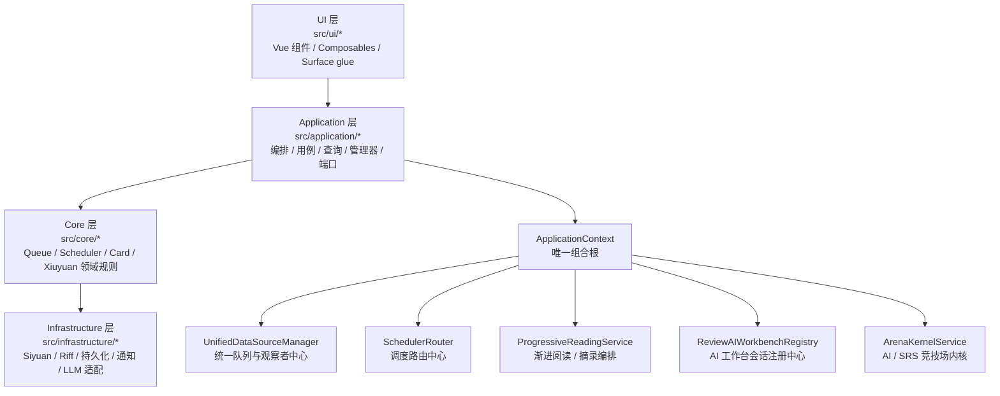
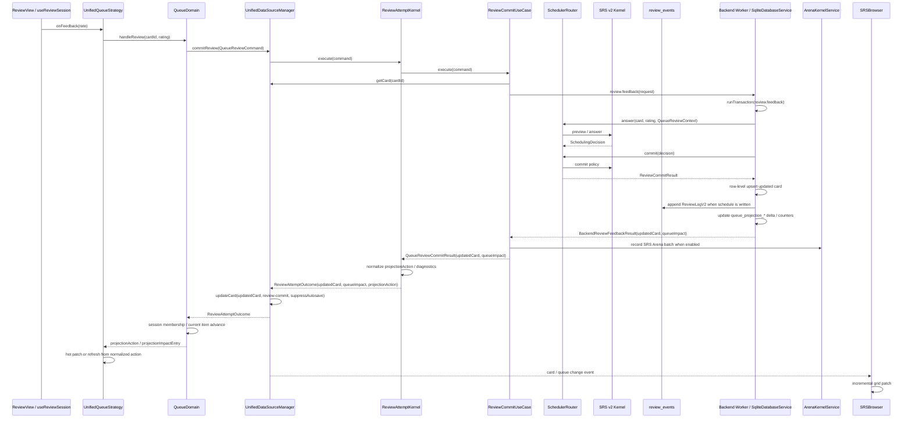

# SiyuanMemo 插件架构说明

最后更新：2026-05-21

本文是当前运行时架构与主数据流的单一事实来源（Single Source of Truth），面向协作者、贡献者与 AI 代理。它描述的是当前仍在生效的主路径，不负责保留历史迁移过程。

---

## 1. 文档目的与边界

本文覆盖：

- 当前分层架构与依赖方向
- 组合根与运行时装配
- Browser / Review / Queue / Scheduler 主链路
- Progressive / Excerpt / Topic-derived item 主链路
- AI Workbench / Capture 主链路
- Kernel companion / backend worker / AI kernel streaming fast paths
- Runtime performance diagnostics
- Arena 主链路（AI 策略包竞技 + SRS 算法只读竞技，默认关闭）
- 完整运行时文件职责地图
- 开发边界与改动守则

本文不覆盖：

- 历史迁移复盘
- 旧架构兼容层的设计意图
- 普通用户使用手册

主校准源如下：

1. `src/index.ts`
2. `src/application/ApplicationContext.ts`
3. `src/types/unified-data-source.ts`
4. 活跃调用链对应的 `src/` 代码

如果文档与代码冲突，以代码为准。

---

## 2. 当前分层架构总览

插件的固定主依赖方向是：

`ui -> application -> core -> infrastructure`

各层职责：

- `ui/*`：界面、用户交互、表面状态、对外可见 surface 的粘合逻辑。
- `application/*`：用例编排、管理器、查询、服务装配、端口定义、跨领域流程。
- `core/*`：队列规则、调度规则、卡片领域、修远领域、共享事件与核心能力。
- `infrastructure/*`：Siyuan / Riff / 文件 / 通知 / LLM 等外部系统适配。

当前活跃的 bounded contexts：

- Browser
- Review
- Queue / Scheduler
- Card CRUD
- Xiuyuan
- Progressive / Excerpt
- Topic-derived item
- AI Workbench / Capture
- Arena
- Mobile entry
- Siyuan / Riff / Kernel companion integration

---

## 3. 启动与装配流程（Composition Root）

运行时启动主链路：

1. `src/index.ts` 的 `onload()` 先同步注册 Browser / Review / Review AI custom tab 类型
2. 每个 custom tab 的 `init` 先渲染 loading shell，并等待 `contextReady`
3. 调用 `ApplicationContext.create({ plugin, i18n })`
4. `ApplicationContext.create()` 完成后 resolve `contextReady`，由 `TabManager` runtime helper 真正 mount Vue tab surface
5. `src/index.ts` 再注册顶栏、Dock、事件处理器、Slash 命令、移动端入口等外层 UI 胶水

启动期只同步建立插件 shell、命令、topbar / menu / custom tab 注册与应用组合根。Browser、Review、AI Workbench、Settings、Arena、Mobile launcher、Progressive split、Template select 这些可见 surface，以及统一 Review dialog 工厂，都通过 `src/application/managers/lazySurfaceComponents.ts` 的 cached dynamic import 在首次打开时加载。`TabManager` 的 custom tab init 允许异步 mount，并用 runtime mount token 防止异步组件返回后挂载到已销毁的 tab runtime。发布构建遵守思源官方插件样例的扁平包形态：`vite.config.ts` 保持 `inlineDynamicImports: true`，输出单个 `index.js`、`index.css`、`kernel.js` 与静态资源，不生成 `chunks/*` 或额外入口 loader；其中 packaged `kernel.js` 由 `src/kernel.ts` 经 `webpack.kernel.config.cjs` 独立构建到 `build/kernel/kernel.js` 后复制进包根。这里的 dynamic import 只是源码级生命周期边界，用来避免 manager 静态导入可见 surface；release 包仍是单 JS 文件。新增 startup lazy boundary test 保护 `DialogManager` / `TabManager` 不再静态导入 Browser / Review / AI surface 组件，并保护 Vite 不重新打开 chunk 输出。

`ApplicationContext` 是当前唯一组合根。它负责：

- 初始化 `StorageManager` / `UnifiedStorageManager`
- 初始化 `SchedulerRouter` / `RescheduleService`
- 初始化 `UnifiedDataSourceManager`，并在组合根注入队列持久化与 `LeechActionEffectsPort`；Leech queue 不在 manager 内部默认构造 Siyuan effects adapter
- 装配 `CardApplicationService` / `BrowserApplicationService` / `ReviewApplicationService`；其中 Card CRUD usecases 的 `CardCreationSiyuanPort` / `CardDeletionSiyuanPort`、Xiuyuan write usecases 的 `XiuyuanSiyuanPort`、`ReviewApplicationService` 的 `ReviewSiyuanPort`、`CardContentQueryService` / `DataAccessFacade` 的 `QuerySiyuanPort` 由组合根注入，不在 usecase/service/facade 内默认构造基础设施 adapter
- SQL active 时给 `CardApplicationService` 注入 `SqlCardReadModel`，并把 `SqlUnifiedStorageRepository` 作为 `BrowserDeckReadPort` 注入 `DocTreeReviewScopeService`；Browser deck 主表的 page / matched ids / rows-by-ids / count / stats 通过 `BrowserCardUniverseReadModule -> SrsBackendClient -> worker Browser RPC` 读取 SQL card universe，source-existence cache 与 refresh 只作为显式后台/可见行 patch，不在 active deck read 失败时回到 `UnifiedStorageManager` / snapshot 读模型
- 装配 `DialogManager` / `MenuManager` / `TabManager` / `DockManager`；`DialogManager`、`MenuManager`、`TabManager`、`BlockMenuHandler`、`PracticeQueueManager`、`ReviewScopeCardCreationSyncService` 的 Siyuan / Progressive / Leech effects 依赖由 `ApplicationContext` 通过应用端口注入，不在 manager/service 内部默认构造基础设施 adapter
- 装配 Browser 所需的 Siyuan port 与 datasource factory；`BrowserApplicationService` 不直接依赖 `src/ui/browser/*`
- 装配 Review special renderer service；`ReviewContent.vue` 不直接创建 core infrastructure repository
- 装配 `XiuyuanApplicationService` / `XiuyuanSyncService`；SQL active 时 `ApplicationContext` 给 `XiuyuanRepository` 注入 `SqlXiuyuanReadRepository`，`findById()` 读 `xiuyuans` 主键，`findByBlockId()` 通过 `cards.block_id + cards.xiuyuan_id` 索引 join 到 `xiuyuans`，再用 `cards.dto_json` 恢复 ADR-004 aggregate card links；这两个读路径不扫描 `UnifiedStorageManager.getAllXiuYuans()`。`findAll()` 仍是同步/管理面的全量枚举，暂不纳入本阶段 SQL-first active path。`XiuyuanApplicationService` 的修缘写入 usecases 共享组合根注入的 `XiuyuanSiyuanAdapter`，`XiuyuanSyncService` 的 Riff sync API 依赖由组合根注入 `XiuyuanSyncSiyuanAdapter`
- 装配 `ProgressiveReadingService` / `SelectionExcerptService` / `SelectionTopicContinuationService` / `TopicDerivedItemService`
- 装配 `ConfiguredCaptureStorageService` / `ReviewAIWorkbenchRegistry` / `AIWorkbenchService`
- 装配 `KernelCompanionPort` 与 `KernelSidecarClient`，把可选内核伴生 JSON-RPC、RPC WebSocket push、kernel network proxy、private SSE 细节限制在 Siyuan integration 边界内；Settings / UI 只通过应用端口读状态，不直接调用 `/api/plugin/rpc/*`、`/ws/plugin/rpc/*` 或 private SSE endpoint
- 装配 `SrsBackendClient` 的真实 browser Worker transport；`BackendKernel` 与 sql.js backend compute 在 `worker/bootstrap/backend-worker.entry.ts` 内运行，renderer 只通过 typed host-effect bridge 执行文件持久化、SiYuan sync conflict source cleanup、SiYuan block existence、NeuralRoam graph query、AutoCard host side effect 与 AI kernel network proxy；`BrowserSrsBackendWorkerTransport` 现在是 Worker supervisor：每个 Worker generation 有 startup/request/probe deadline、liveness diagnostics、bounded restart budget、no-replay pending request cleanup，`ApplicationContext` 把该 health provider 注入 `FrontendInstanceRuntime`，让 writer lease 在 backend Worker unhealthy 时释放或停止续租；`FrontendInstanceRuntime` 的 ownership 策略保持主窗口优先但非强绑定：canonical desktop primary-app 在 heartbeat/relay 遇到空 lease gap 时保持 writer mode 并立即 reacquire，观察到另一个 primary writer 或 backend unhealthy 时仍按 fail-closed 降级；NeuralRoam graph query host effect 复用 `UnifiedDataSourceManager` 提供的 SQL card facts（node type + priority），让 worker advance 与应用内 NeuralRoam 使用同一套 active-source card / syntax detection 节点类型语义，而不是在 renderer graph adapter 内另起一条 `fsrs_cards` 判定路径；发布构建把 worker bootstrap 作为 inline Worker 打进 `index.js`，保持官方插件样例的扁平 package 形态，不生成 `assets/`
- 安装 opt-in Runtime performance diagnostics session helper：`src/utils/runtimePerformanceDiagnostics.ts` 只在当前 renderer session 内记录 bounded in-memory span/counter/longtask 摘要，默认关闭，不持久化、不上报、不记录正文内容；控制台入口为 `window.siyuanMemoRuntimePerformance.enable()/report()/copyReport()/disable()`
- 初始化 `siyuanmemo.db` 的 sql.js 持久化层；首次启动先把旧 `unified-cards.msgpack`、`queues.msgpack`、月度 review logs 与 `arena/store.json` 迁入 SQL，迁移失败以 `STORAGE_UNAVAILABLE` fail closed，不再允许 env 触发 legacy storage rollback；SQL active 后 DB 以二进制文件写入，旧 base64 envelope 只作为读取兼容与迁移备份
- 装配 `ArenaStoreService` / `ArenaKernelService`，把 AI 策略包竞技和 SRS 只读算法竞技挂到同一个应用层内核；`arena.enabled` 默认为 `false`，关闭时不接入复习建议或 AI 策略包覆盖；开启后 Arena 数据写入 SQL
- 外部 SRS 算法第一版边界在 `src/application/services/external-srs/ExternalSrsAlgorithmRuntime.ts`：只从用户控制的本地算法目录发现 manifest，经校验后以 `external:*` 通用 id 写入 `algorithm_registry`，默认 `disabled`；`ExternalSrsAlgorithmRuntimeAdapter` 只传结构化快照和参数，不传数据库、思源 API、writer port 或 plugin service 对象，输出保持 advisory-only，不接管正式 FSRS v6 due 写入
- 运行路径收口由 `scripts/check-backend-runtime-paths.cjs` 兜底：它在 `pnpm run check:boundaries` 里核对 queue projection、neural-roam.advance、review.feedback、autocard.decision.resolve/autocard.execute、private.command.execute、ai.session/job 的 contract -> worker -> client -> `ApplicationContext` -> caller 链路；External SRS 继续停留在 advisory-only foundation，只有当 `ApplicationContext` 显式接入并补齐 UI 入口后才算 active runtime
- SRS v2 队列策略集中在 `src/core/queue/domain/SrsV2QueuePolicy.ts`：`IncrementalLearning` 是 Mixed SRS Queue，Learning/Relearning 按精确 `now` 到期，Review 按 `fsrs.dayStartHour` 派生的 review day 到期，New 只在该队列按每日上限引入；`RetrievalPractice` 是 review-oriented 队列，默认不引入 New。普通队列清空后，Review UI 可触发显式 `Learn Ahead`，只取未来 Learning/Relearning，受 `scheduler.srsV2.learnAhead.windowMinutes` 与 `maxCards` 双重限制。

这意味着：

- 任何运行时服务暴露、服务替换、启动顺序问题，先看 `ApplicationContext`
- 任何 custom tab 恢复失败或重载后消失的问题，先看 `src/index.ts` 的提前注册 + `contextReady` lazy mount 桥接
- 任何 surface 是如何被打开的，先看 `src/index.ts` + `DialogManager` / `TabManager`
- 任何“这个能力到底算哪个 bounded context”的争议，先看组合根里它如何被装配和谁在消费它

---

## 4. 关键运行入口与主链路

### 4.1 Browser

主要入口：

- `src/index.ts` 顶栏点击
- `src/application/managers/MenuManager.ts`
- `src/application/managers/DialogManager.ts::openBrowserDialog()`

主链路：

1. 入口动作落到 `DialogManager.openBrowserDialog()`
2. 首次使用时通过 `lazySurfaceComponents` 加载并挂载 `src/ui/browser/SRSBrowser.vue`
3. `SRSBrowser.vue` 消费：
   - `BrowserApplicationService`
   - `TabApplicationService`
   - `UnifiedDataSourceManager` facade
4. Browser 在全量 / 队列 / deck 等模式下，通过 application queries、统一队列快照或 SQL card-universe read module 加载数据；SQL active 的 deck 主表由 `BrowserCardUniverseReadModule` owns expressibility/fail-closed boundary、page reads、matched ids、row hydration、stats 与 source-existence marking，走 `COUNT + LIMIT/OFFSET + page hydrate`，`getDeckMatchedIds()` 用 SQL 返回完整匹配 id 列表，active deck page / matched ids / rows-by-ids / count / stats 失败时返回 explicit `BACKEND_UNAVAILABLE`，不再读取旧 snapshot。六个活跃 review 队列都有 backend projection read surface：RetrievalPractice / IncrementalLearning / FilterGroup / FinalDrill / Leech 的 Review progression 由 projection rows/counters 驱动；NeuralRoam 的 projection 只用于 Browser、计数、诊断和 repair visibility，Review progression 必须走 backend `neural-roam.advance`。Browser Queue View Lifecycle 由 `src/ui/browser/BrowserQueueViewModule.ts` 承接：队列 datasource attach 前先通过 `UnifiedDataSourceManager.ensureQueueProjectionReady()` 消费共享 `ready | refreshing | unavailable` readiness contract；`UnifiedDataSourceManager` 的公开 projection read façade 通过 `QueueProjectionReadModule` 统一转发 readiness、snapshot、rows-by-ids hydration、counters diagnostics 与 live identity subscription，Browser 和 `BaseReviewQueue` 不再各自编码 backend projection readiness 规则。`ready` 才创建 datasource，`refreshing` 保持 preparing/loading 并按 bounded retry guidance 重新请求，`unavailable` 显式错误，不由 UI repair/materialize/SQL fallback；projection live identity event 只携带 queue/policy/generation/reason/source/timestamp，Browser 只在当前可见 queue 与已挂载 projection identity 匹配且 generation 更新时调度 `browserLoadDataRuntime` 重新进入同一 readiness/load/datasource attach 路径，invalidated/echo-cleared 只触发 bounded recheck，不直接 patch rows。`SRSBrowser.vue` 只保留 shell、typed subscription、grid attach、first-row milestone 与真实 side effects。Browser 排序/过滤只作用在展示副本，不改真实 projection order；队列计数 force refresh 会透传到 queue `getCounterSnapshot(forceRefresh)`，让 Browser 和 Review 共用同一 generation 的 projection counters。`getQueueProjectionRolloutState()` 只保留为显式 rollback/parity override。
5. Browser DTO、query parser、stable row id 与排序显示契约以 `src/types/browser.ts` 为共享契约；application query kernel 只依赖 `src/application/queries/browser/shared/*` 与 `src/types/browser.ts`，不再 import UI browser module
6. 右键批量动作通过当前数据源持有的 `UnifiedDataSourceManager` 批量入口执行：删卡走 `batchDeleteCards(cardIds, { blockIds })`，优先级/重置/暂停/恢复走 `batchUpdateCards(cards)`，加入队列优先走 `batchAddToQueue()`，从当前队列移除优先走 `batchRemoveFromQueue()`；只有 manager 缺少批量命令时才回到 queue `addCards()` / `removeCards()` 兼容路径。SRS Browser 的“选中复习”不再只传 block scope，而是通过 `plugin.openSubsetReviewDialog(blockIds, { cardIds, preferredCardId })` 把 exact card scope 交给 `DialogManager`；`postpone/advance/spread` 走 `RescheduleService -> UnifiedStorageCardUpdateAdapter -> UnifiedStorageManager.batchUpdateCards()`，SQL active 时再一次 `cards` upsert + persist；这些入口在应用层分块 upsert / 批量删除 / 一次队列持久化后统一发布 `CardDeleted / CardsDeleted`、`card-updated` 与 `queue-changed`，单卡 API 只作为旧调用 fallback
7. UI 增量刷新由 `useBrowserAdapterSync`、`useIncrementalGridUpdates`、`useQueueBridge` 驱动；Browser SQL、文档树读取、queue block projection、preview breadcrumb 等 Siyuan 调用必须显式拿到 Browser 侧 Siyuan port，不再依赖 browser service 模块全局状态，也不从 UI 直接 import infrastructure Siyuan API
8. Browser surface profile 默认值由 `layoutProfile.ts` 维护；profile-scoped chrome preference 读写、legacy dialog key 迁移与 storage failure contract 由 `browserChromePreferences.ts` 维护；open-state capture、初始 open-state normalization、legacy `__lost__` 归一与 neural subview / queue-id 投影由 `browserSurfaceState.ts` 维护，`SRSBrowser.vue` 只负责把这些 projection 应用到当前 UI state 并调度加载 / 刷新副作用
9. Browser neural 子视图的 trace/list projection、jump/focus/source/anchor/history commands、engine/navigation/bookmark/review-surface handoff commands，以及 trace refresh/enrichment/convergence/preview controller state 由 `src/ui/browser/neural/*` helpers 维护；`SRSBrowser.vue` 只持有 Browser shell、template binding 与跨 surface 依赖注入
10. Browser Semantic Entry / Navigator / Review helper 代码仍在 `src/ui/browser/semantic/*`，但用户可见入口已临时隐藏：`BrowserToolbar.vue` 不再渲染 `Start Semantic`，`NeuralNavigationBar.vue` 只展示 Orbit/Hyperspace 两个 workspace mode，`SRSBrowser.vue` 不再从 toolbar 路由到 Browser Semantic workspace。保留的 helper 边界仍是只读/显式命令边界：`browserSemanticFocus.ts` 只解析 Browser 选中卡是否为 Concept focus；`BrowserSemanticEntryController` 只负责从 Browser Concept 启动或恢复同 root active Semantic session；`BrowserSemanticBackendReadAdapter` 通过 application/backend read client 调 `semantic.browser.read`，不让 UI 读 SQL；`browserSemanticReadModel.ts` 产出 Browser-owned review model（root/current/timeline、edge explanations、selected node、later、suggestions、archived branches、empty-vs-unavailable）；`BrowserSemanticStateController` 串接 session start/restore、local selected-node review state、end session 与 Review handoff。`BrowserSemanticNavigator.vue` 是 Browser 的单会话回顾 surface：只做 timeline 本地选择、edge/detail/review-section 展示，不渲染 candidate lens follow/new-path/station controls，也不渲染 reveal / Again / Hard / Good / Easy / scheduling / auto-create-card controls。`semantic.browser.read` 是只读 RPC，返回 active same-root session、current session review model、projection/tree/timeline、selected node、edge explanations、later、suggestions 与 archived branches，并显式区分 missing session 与可用空 candidates。
11. Browser grid snapshot hydration、selection scope/fingerprint/filter-summary projection、batch action label/result/reload policy、reschedule parameter dialogs、action/context/practice menu runtime、loadData datasource controller 与 toolbar Spread dialog 由 `browserDataSnapshots.ts`、`browserSelectionScope.ts`、`browserActionFeedback.ts`、`browserActionParamDialogs.ts`、`browserActionMenuRuntime.ts`、`browserSpreadDialog.ts` 维护；`SRSBrowser.vue` 只串联 refs、datasource、dialog deps 与真实 side effects。AG Grid 首块/page/cache/rowBuffer 预算由 `browserGridSizing.ts` 统一维护：桌面首块 32 行、rowBuffer 6，移动端保留 120 行滚动块但同样限制 rowBuffer；首屏 shell/loading/empty/grid/overlay 判定由 `browserGridFirstPageState.ts` 统一解析，projection-not-ready 只显示 grid-frame refreshing overlay，不触发 UI SQL、projection materialization 或旧 queue fallback；AG Grid row identity 由共享 Browser stable id 契约提供。allRows/focus snapshot 属于首屏后的后台 hydrate：默认延迟 4800 ms 后再启动，hydrate 按 24-row chunk 执行并在 chunk 间 yield，close/reopen/search 会通过 snapshot task id 取消旧任务，避免全量快照抢占 Browser 首屏。source-existence refresh/sweep 只先使用 cache 标记首屏行；后台 page refresh 会按 active page 合并、取消 stale 结果，并且 `getDeckRowsByIds()` 的 snapshot hydration 不触发 page refresh。refresh 得到 changed block ids 后由 `BrowserApplicationService.subscribeSourceExistenceUpdates()` 通知 Browser UI，UI 只 patch 当前 rows、focus rows、bounded allRows cache 与可见 AG Grid nodes，不重新阻塞当前页 datasource。
12. Runtime performance diagnostics 开启后会记录 Browser `open.shell-attached`、`open.first-rows-visible`、`loadData`、search reload、force refresh、grid `getRows/successCallback/ui update/first-data-rendered/model-updated/filter-changed/sort-reload`、allRows/focus snapshot hydrate chunk/yield、source-existence refresh/sweep 与 backend deck page/rows/stats 的耗时，用来判断打开 SRS Browser 时是否是 UI hydrate、AG Grid、后台 snapshot 或 source sweep 抢占 renderer；首行事件与各 span 的 started/ended time 一起构成 first-row overlap 证据，不把搜索正文写入 metadata（只记录 query length / sort count / row counts 等低敏信息）

### 4.2 Review

主要入口：

- `DialogManager.openReviewDialog()`
- `DialogManager.openSubsetReviewDialog()`
- `DialogManager.openNeuralRoamDialog()`
- `DialogManager` 中的 leech / filter-group / browser handoff 等 review 打开流

主链路：

1. `DialogManager` 选择队列与 header variant，并根据 `settings.ui` 决定桌面端标准 review 入口是走 dialog 还是 `TabManager.openReviewTabInNewTab(...)`。所有 Review entry 在队列创建、tab delegation、queue switch、subset/static queue materialization 和 `createUnifiedReviewDialog()` 前先走 `ReviewDomainSyncSafetyService -> ApplicationContext.readDomainSyncDiagnostics()`；`repairable`、`needs-direction`、`divergent`、`source-error` 或 diagnostics unavailable 都 fail-closed，并打开 plugin-owned manual sync conflict recovery dialog，不用 toast 或隐藏 local fallback 放行。
   - 块菜单 / 文档菜单的提取练习、渐进学习、临时练习由 `CoreReviewEntryService` 先把当前 scope 解析成 exact `cardIds` + `preferredCardId`，再交给 `DialogManager`；`DialogManager.openRetrievalPracticeWithFilter()` / `openIncrementalLearningWithFilter()` 现在创建一次性 `SubsetReviewQueue`，不再修改共享 `FilterGroupQueue.setFilter()`、不再携带 filter session transfer state。打开到 tab 时使用 `ReviewTabTransferState(kind='static-subset-session')` 序列化 `blockIds/cardIds/preferredCardId`，由 `TabManager` 恢复 detached `SubsetReviewQueue`，不会在 tab init 时退回普通 FilterGroup。dialog 内再点“打开为标签页 / 拆分”时，`ReviewView` 也优先复用传入的 `static-subset-session`，而不是重新尝试 `FilterGroupQueue.serializeSessionSnapshot()`。`openTemporaryDrill()` 同样把 exact card scope 注入 `TemporaryDrillQueue`，避免同块多卡时只靠 block id 重新扩展出错误集合；Image Occlusion 编辑器里的“提取练习 - 全部 / 临时练习”按钮会从 `custom-fsrs-image-occlusion-card-ids` 读取 ordered card ids 并传同一 exact scope。
2. dialog 路径首次使用时加载 `createUnifiedReviewDialog(...)`；tab 路径走 `TabManager` 的 review tab handoff
3. dialog 工厂装配：
   - `UnifiedQueueStrategy`
   - `UnifiedReviewAdapter`
   - `SchedulerRouter`
   - `UnifiedDataSourceManager`
4. 挂载 `src/ui/review/v2/ReviewView.vue`
5. `useReviewSession.ts` 绑定 `reviewSessionController.ts`；controller 统一驱动 `next / reveal / grade / skip / custom`，并且所有“直接把某张卡写成当前卡”的恢复/刷新入口都会先走 queue strategy 的 `hydrateCurrentItem()` 显示态补水，再更新 UI，避免外部刷新、会话恢复、AI 新卡同步等路径把原始 `FSRSCard` 直接塞回当前位后丢掉 runtime `nextDues`；当当前队列项在评分前已被删除或失效时，queue strategy 会抛出 `QueueItemUnavailableError`，controller 只重新 `queue.next()` 跳到下一张，不记录复习历史，也不把 session 误置为空完成态。grade/skip/custom 在 `queue.onFeedback()` 前还会调用注入的 domain-sync action guard；unsafe 或 diagnostics unavailable 会保留当前卡和 `showAnswer`，打开同一个 conflict recovery dialog，并阻止 backend `review.feedback`、writer relay feedback、local queue advancement、session counter increment 和 projection patch。dialog 中 retry/apply 让 diagnostics 重新变 safe 后会触发现有 `hook.reload()`，从 backend-owned queue/card state 重新装载。普通 action 失败时，controller 恢复当前卡片与 `showAnswer`，通过 `ReviewSessionActionError.action` 带上原 grade/skip/custom 意图；`ReviewView.vue` 只把该 payload 交给纯 `reviewWriterUnavailableRecovery.ts` 分类 writer relay unavailable / no active writer / backend unavailable / generic error，并在 writer/backend unavailable 时显示可 dismiss 的紧凑 notice。retry 只调用既有 `hook.grade/skip/executeCommand`，刷新只调用既有 `hook.reload()`，不会引入本地 schedule write、queue bypass 或自动后台重试。
   - 评分切卡仍等待正式 `queue.onFeedback()` / backend writer 提交成功后才前进；RetrievalPractice / IncrementalLearning / FilterGroup / FinalDrill / Leech 默认 projection-backed，`BaseReviewQueue` 会优先读 backend projection snapshot，复习提交时把 projection generation / policy hash 传给 `ReviewAttemptKernel -> ReviewCommitUseCase`，kernel 把 backend `queueImpact` 归一成 `projectionAction`，`UnifiedQueueStrategy` 保持 Review-facing façade，但把 Review Feedback Advancement 委托给 `ReviewFeedbackAdvancementCoordinator`：普通 rate / skip / hide-current-in-scope、unavailable current item cleanup、failed-feedback local compensation 都通过该 coordinator 应用 `ReviewSessionCursor` 与 `ReviewCurrentItemCommand` 的本地状态变化；queue membership、scheduler commit、writer relay 与 NeuralRoam next-item selection 仍留在 coordinator 外。Review Transaction Safety Envelope 由 `ReviewTransactionSafetyEnvelope` 承接：反馈前捕获 pre-review card snapshot、queue rollback snapshots 与 session-local exclusions，go-back 时执行 persistent rollback，feedback 失败时执行 no-persist card restore 并把恢复后的可见 item 交回 local advancement。projection patch/refresh 由 `ReviewSessionProjectionAdvancePolicy` 调用 `ReviewSessionProjectionApplier`，失败反馈补偿顺序由 `ReviewFeedbackCompensationPolicy` 计划，IncrementalLearning avoid-once visible identity 与候选选择由 `IncrementalRequeryAdvancePolicy` 负责，Learn Ahead 进入/退出由 `ReviewLearnAheadAdvancePolicy` 负责。策略层仍只提交 ordinary feedback、协调 safety envelope、记录日志、触发 reload 或抛出显式 unavailable；需要完整 reload 时会强制刷新 projection snapshot 再 hydrate rows，避免 stale snapshot rows 与 active-source hydrate 结果行数不一致。NeuralRoam 不再用静态 projection cursor 作为切卡权威：初始 next、rate、skip 与后续 next 都调用 `neural-roam.advance`，`NeuralRoamAdvanceCoordinator` 消费 backend advance contract、归一 outcome、同步 renderer 本地 NeuralRoam queue state、维护 pending next 与 counter snapshot，并通过 `ReviewCurrentItemCommand` 应用可见 item；worker 内运行现有 NeuralRoam 引擎并通过 typed SiYuan graph host effect 查询图事实；advance result 必须携带 worker 导出的 v8 `queueState`，展示 `nextItem` 前会同步到 renderer 本地 `NeuralRoamQueue`，供 Review “查看双链轨道”与 Browser neural history/trace 继续读取同一轨道状态；该 host effect 注入应用侧 node-type resolver，ConceptQueryEngine 的 formal-review neighbor 过滤走同一 resolver 后才会触碰 local SQL schema。Semantic Activation 的 Review concept session/navigation 先由 `SemanticActivationSessionController` 组装 `semantic.command.execute`，再交给 `SemanticActivationCommandClient` 走 writer-owned backend/follower relay；start/follow/switch/end/restore 都返回显式 session/result，不写 Orbit/Hyperspace pools，也不允许 UI 直接 SQL。FinalDrill 的 drill-only feedback 不写正式 schedule；FilterGroup preview-only feedback 只更新队列投影/计数。`onReviewDetailed` / Arena 反馈后处理在下一张卡 UI commit 后异步启动，不再阻塞可见切卡。Runtime performance diagnostics 开启后会记录 `grade.total / feedback / next / state.to-ui-state / state.prepare-before-commit / state.commit-notify / state.fetch-auxiliary-data`，以及 `ReviewAttemptKernel` / `ReviewCommitUseCase` / `neural-roam.advance` 内的 backend worker / writer relay / Arena 记录耗时。
6. review header 的二级动作仍由 `ReviewView.vue` 编排；Review presentation chrome 的 queue/header/title/snapshot-key 语义统一由 `src/types/review-presentation-semantics.ts` 提供纯 resolver，`UnifiedReviewAdapter`、`DialogManager`、`TabManager` 与 `reviewShellCommands.ts` 共享该 resolver，不再各自维护 standard queue/header/title map。该 resolver 只处理 presentation identity，不读取队列、不 materialize projection、不提交 review、不写 scheduler/DB；card body/source/special renderer identity 仍由 `reviewPresentationPreparer.ts`、payload seam 与 Review content 主链负责。more-menu 的纯分组 / label / disabled projection 由 `reviewMoreMenuItems.ts` 承接，neural toolbar/menu command projection 由 `reviewNeuralCommands.ts` 承接，progressive excerpt / source / complete-piece command runtime 由 `reviewProgressiveExcerptCommands.ts` 承接，open-as 菜单命令由 `reviewOpenAsCommands.ts` 承接，standard queue switch / native titlebar / fullscreen shell runtime 由 `reviewShellCommands.ts` 承接，SRS editor dialog glue 由 `reviewSrsEditorCommands.ts` 承接，Arena conflict/advisory、current-content editor、review card action、filter/scope、data observer/doc-scope queue 与 native split runtime 分别由 `reviewArenaCommands.ts`、`reviewCurrentContentEditorRuntime.ts`、`reviewCardActionCommands.ts`、`reviewFilterCommands.ts`、`reviewDataObserverRuntime.ts`、`reviewNativeSplitRuntime.ts` 承接，source transaction refresh 队列由 `reviewSourceRefreshRuntime.ts` 承接，键盘去重与全局事件绑定由 `reviewKeyboardRuntime.ts` 承接；SFC 只注入当前状态、依赖与真实命令回调：
   - `AI 侧栏` 统一走 `reviewAICommands.ts` 组装 review-bound open options / visible-only context sync / sidecar or companion tab command，再交给 `ReviewAIWorkbenchRegistry`、`DialogManager` 或 `TabManager`
   - `更多` 菜单中的优先级编辑走 `CardEditorApplicationService.updatePriority(...)`
   - `更多` 菜单中的“编辑当前内容”走 `ReviewApplicationService.getBlockKramdown/updateBlockMarkdown(...)`，通过共享 `LargeTextEditorDialog` 编辑当前块原始 Markdown；保存后只调用 `ReviewContent.refreshVisibleContent()` 原地刷新当前内容，不重建 review session
   - tab 模式下插件托管的“在新页签中打开”走 `TabManager.openReviewTabInNewTab(...)`，而“右侧/下方分屏当前复习”先通过 `SharedReviewSessionRegistry` 提升或复用共享 review session，再交给 `TabManager.openReviewTab(...)`
   - `更多` 菜单中的暂停动作走 `CardEditorApplicationService`
   - `更多` 菜单中的删除动作走 `CardApplicationService`
   - progressive excerpt 仍复用 `SelectionExcerptService` / `ProgressiveReadingService` 主链，Review helper 只负责 selection/materialize/highlight/duplicate-open/review-route/hyperspace-inject 的命令编排
   - fullscreen / queue switch / native titlebar 仍只在 Review shell helper 内做 DOM/runtime 编排，真实 dialog / tab manager 由 `ReviewView.vue` 注入
   - SRS editor 继续复用既有 application / dialog 主链，Review helper 只集中 card lookup、deck/scheduling context 和 scheduled/dismissed event glue
7. `ReviewContent.vue` 继续在 `主 Protyle / special renderer` 之间路由；special renderer 所需的 quick / descriptor render services 由 `ApplicationContext.createReviewRenderServices()` 在 composition root 创建 Siyuan block adapters 后，经 `ReviewView.vue` 注入 `ReviewContent.vue`；`createReviewRenderServices()` 只接收已注入 adapter，不再默认 new block adapter，`ReviewContent.vue` 也不再自建 fallback render services；Image Occlusion 与 Xiuyuan list-template 读取块属性 / Markdown / breadcrumb 时只接收 `ReviewSiyuanPort` 投影，不直连 `@/infrastructure/siyuan/api`；其中普通 `builtin-multi-cloze` Item 已回到主 Protyle / 原生编辑路径，历史 `quick-default` 标记也会被普通 multi-cloze 契约压回 native path，只有 `inline-formula-cloze` 继续走专用 `MultiClozeCardRenderer`；`UnifiedReviewAdapter` 会把普通 multi-cloze 与 topic-derived Item 标记为 native inline hidden 候选，最终由 `ReviewContent` 的 DOM 检测按思源 flashcard 配置给 `mark/list/heading/superBlock` 加隐藏 class；special renderer 仍通过 `getEditableSource()` 向 `ReviewView.vue` 暴露当前可编辑块，同块编辑保存或经 `TransactionWebSocketService` 共享 transaction stream 命中的源块刷新由 `reviewSourceRefreshRuntime.ts` 做 debounce、suppression 和依赖块匹配，命中后走 `refreshVisibleContent()`：主 Protyle 调 `reload(false)`，special renderer 只重挂自身子组件，外层 review content key 只表达卡片身份
8. review tab 现在区分 `surface id` 与 `shared review session id`：前者仍用于 tab 生命周期/AI companion 绑定，后者只用于插件托管分屏共享同一套 review controller
9. SQL active 的队列候选真相是 `cards` 当前状态；`queue_state` 只保存筛选配置、临时黑名单、手动加入、session 排除和手动顺序等 overlay。手动加入卡解析按 card id / block id 定点查询，查不到才清理无效 manual entry，不再常规回退到无过滤全量 `getCards()`。`queue_projection_*` 表现在作为 backend/writer owned derived storage 存在，用来记录可重建的队列 rows、counters、invalidations、generation、policy hash 与 rebuild/repair 命令状态；projection build/read/hydrate 三个边界统一使用 active-source 语义：`source_exists = 0` 的卡不会进入 build source、snapshot rows、rowsByIds/card-id hydration 或 Review/Browser 可见集，`source_exists IS NULL` 仍按既有 fail-open 策略保留并等待 source-existence repair；`DataAccessFacade.getCards()` 在 SiYuan sync 后 host block index 暂未追上时，对 root/content source metadata 尚不完整且仍有合法 SiYuan block id 的 source-unchecked 卡同样 fail-open，不把这种短窗口误判写成 ready projection 缺卡；空/`undefined`/非 SiYuan block id 的旧卡不会进入队列物化。worker `queue.projection.snapshot` / `queue.projection.rowsByIds` / `queue.projection.replace` 由 `worker/queue-projection/WorkerQueueProjectionRuntime.ts` owns projection read、row hydration、replace validation、counter rebuild 与 `queue.projection.replace` transaction；source-existence 状态变化后的 projection generation invalidation 由 `worker/queue-projection/SourceExistenceProjectionInvalidator.ts` owns queue coverage、dedupe、reason/metadata/generation shaping；`sync.conflict.merge` 若合并进来的 cards 改变，会用 `sync-conflict-merge` 使六类 queue projection invalidated，避免 SiYuan conflict DB 合并后 `cards` 已有 due 卡但旧 `queue_projection_*` 仍显示 ready+0 rows；`SqliteDatabaseService` 只注入 repository / projection / transaction runtime。`QueueProjectionBuilder` 现在覆盖 RetrievalPractice、IncrementalLearning、FilterGroup、FinalDrill、Leech、NeuralRoam 六个队列：前两者复用 `SrsV2QueuePolicy` 生成正式 review projection row / counter / frontier / affected-set，deferred 四队列把 filter/drill/leech/neural 专属事实写入 typed payload metadata，并提供同块、manual、drill、leech、neural session/history 的 affected-set 计划；其中 NeuralRoam rows 是 Browser/count/diagnostic/repair 快照，不是 next-item authority。worker `review.feedback` 由 `worker/review/WorkerReviewFeedbackRuntime.ts` owns queue mode / commit policy validation、SchedulerRouter commit、`review_events` append、review commit idempotency enforcement 和 queue projection impact/delta；`SqliteDatabaseService` 只注入 repository / projection / transaction runtime 并保留 counters。普通用户评分在 `ReviewSessionController` 生成单次 feedback attempt 的 `commitIdempotencyKey`，`UnifiedQueueStrategy -> BaseReviewQueue -> ReviewCommitUseCase` 保持该 key，经 backend worker 或 follower->writer relay 传入 `review.feedback`；worker 把 key 写入 `review_events.commit_idempotency_key` 和 `ReviewLogV2.commitIdempotencyKey`，兼容重复 key 只返回 duplicate success，不再追加 review event、推进 card state 或改 queue projection；同 key 但 card/rating/queue mode/commit policy 不一致会 explicit `INVALID_REQUEST` 且不 mutate。RetrievalPractice / IncrementalLearning 正式提交事务内重算 projection delta；deferred queue 基于现有 projection rows 做 hot-patch delta，FinalDrill low rating 移尾且不写正式 schedule，其余 ordinary feedback 移除/更新行并推进 counters/generation。worker 暴露 `queue.projection.snapshot` / `queue.projection.rowsByIds` / `queue.projection.replace` RPC，`SrsBackendClient` 与 `UnifiedDataSourceManager` 将其收口成 application manager port；`BaseReviewQueue`、Browser query kernel 和 `UnifiedQueueStrategy` 通过这些 port 读取 projection rows/counters、按 projection row id hydrate 卡片，并在 ordinary feedback 后热补丁或按 refresh-required 重新加载；Review full reload 会以 `forceRefresh=true` 重新读取 snapshot 与 rowsByIds，确保 snapshot rows 和 active-source hydration 来自同一刷新边界；若 projection generation 还不存在，`QueueProjectionRuntime` 会从真实 queue `getCards()` 显式物化 ordered rows，再用 `queue.projection.replace` 写入 backend/writer projection storage 并重新读取 snapshot，follower 模式必须经 writer relay 提交，不允许 follower-local writer bypass。writer relay materialization 成功后，runtime 会把这次 writer 返回的 rows/counters 作为同 generation 的短期 materialization echo 用于当前 snapshot 与 row hydration；echo 在队列失效、全量失效或正式 review commit 后通过 manager 委托清除，避免 follower 本地 worker 旧 DB 把刚写成功的 projection 读回 unavailable。`QueueProjectionRuntime` 也是 projection live identity event owner：materialized / refreshed ready identity 只在可读 policy/generation 成立后发布，invalidated / echo-cleared 只发布 recheck signal，payload 不含 rows/cards/source markdown/review feedback/scheduler decision；`UnifiedDataSourceManager.subscribeQueueProjectionLiveIdentityEvents()` 只暴露 typed subscription，不新增 backend/kernel broadcast。projection-backed 队列若 snapshot / row hydration / counter / materialization 依赖不可用，会显式 `QUEUE_PROJECTION_UNAVAILABLE` 或 `BACKEND_UNAVAILABLE`，不再悄悄回退 strategy rows、size methods 或本地计数。`QueueProjectionRuntime` 显式报告 `existing-queue-strategy` / `parity-checking` / `backend-projection` / `backend-advance` / `advance-contract-unavailable` / `projection-unavailable`，`UnifiedDataSourceManager.getQueueProjectionRolloutDiagnostics()` 只保留公开 façade；NeuralRoam 只有在 backend advance 可用时才是 review-ready；`getQueueProjectionRolloutState()` 只作为显式 rollback/parity override，不引入 UI direct SQL/RPC 或 follower-local writer bypass。

10. `sync.conflict.merge` 合并 review/card 事实时保持 `review_events` append-only/idempotent：缺失的正式 `review-v2` 事件只追加，重复事件忽略，不用 review history 直接重放或重算 scheduler。card row 冲突不再用单个 coarse stamp，而按显式 review-sync 新鲜度比较：positive `last_review` 较新者胜，其次 `updated_at`，再其次 `reps`，完全相同则保留本机 row；incoming card row 胜出时仍携带 `source_exists=0` 的 missing-source projection，避免另一端已确认删除的有效 block-id 卡在本机保持 `source_exists NULL` 并经 source-unchecked fail-open 回到 Review/Browser 队列。只有 card row 实际改变时才用 `sync-conflict-merge` invalidating 六类 queue projection；event-only merge 不触发 projection invalidation。worker/SQLite owner 同时返回只读 `reviewCardDivergences` diagnostics，报告 `review-history-newer-than-card-state` 与 `review-event-count-exceeds-card-reps`，供后续人工/显式修复判断；该诊断路径不写 cards、due、scheduler state、review_events 或 queue projection。`BackendKernel.handle()` 在非 exempt RPC 前执行 `mergeExternalDatabaseIfChanged()` 后，会把非空 merge summary 记录到 bounded `preRequestMerge` diagnostics ring；`diagnostics.status` 暴露 latest/history、source ids、merged/ignored review/card counts、skipped sources、divergence count 与 reason counts，让调用方确认某个普通请求前是否先合并了 synced/conflict DB 内容。该 diagnostics 只读、非阻塞，不改变原 RPC result shape，也不把 merge failure 降级成 warning。`sync.reviewDivergence.audit` 复用同一 evidence builder 对当前数据库做 on-demand 只读审计，返回 bounded records、per-reason counts、truncated flag 与 source metadata；`SrsBackendClient -> ReviewSyncDivergenceAuditApplicationService -> ApplicationContext.auditReviewSyncDivergence()` 只暴露 typed diagnostic surface 和日志摘要，不改变 Review/Queue/Sync 成功语义，也不允许 UI/kernel/follower 直读或修写 SQLite。

11. Domain sync ledger 是 backend/SQLite owned 的 domain-level convergence record；`domain_sync_operations` 记录 review commit、card tombstone、source-existence update、repair-applied 等不可变操作，`domain_sync_processed_sources` 记录已扫描的 SiYuan 主库/冲突库 source fingerprint、import/ignore/skipped 计数与原因，`domain_sync_sanity_snapshots` 和 `domain_sync_repair_plans` 只保存诊断/计划元数据。SiYuan sync 在这里仅作为数据库字节传输与 conflict-copy transport，不是独立 sync server，也不承担调度器 replay、card state 推导或投影修复。`domainSync.status` / `diagnostics.status.domainSync` 给出只读 sanity、ledger/source/skipped/import evidence，并在 processed conflict DB source 上给出 cleanup eligibility；只有已处理、非 skipped、有 path、当前不处于 `needs-direction` / `source-error` 的 SiYuan conflict DB source 才能清理。`domainSync.repair.preview` 从 ledger、review_events、cards、scheduler evidence 建 bounded read-only plan，最多持久化 non-authoritative plan fingerprint/status，不写 cards、review_events、due、scheduler state、tombstones 或 queue projection。`domainSync.repair.apply` 必须带 plan id、确认元数据和 apply idempotency key；writer/local 由 backend 执行，follower runtime 必须经 writer relay，不允许 follower-local SQLite writer bypass。`domainSync.conflictSources.cleanup` 必须带 source ids、确认时间和 idempotency key，writer/local 由 backend 经 typed host effect 删除/归档 eligible conflict-copy evidence，follower runtime 必须经 writer relay；结果只返回 cleaned/skipped/failed bounded counts，不写 cards、review_events、scheduler state 或 queue projection，也不会删除 unprocessed/skipped/source-error/needs-direction evidence。apply 在同一 backend transaction 内校验 ledger generation、card state fingerprint、review history fingerprint 与 scheduler config hash，拒绝 stale plan；只执行 plan 内 card-state repair，追加 `repair-applied` audit operation，touch sync metadata，并用 `explicit-repair` invalidating 六类 queue projection。重复 apply key 返回 duplicate success，不重复 mutation。非目标：不做隐藏自动修复、不按 review history 私自重放 scheduler、不让 UI/kernel/follower 直读或修写 ledger SQLite 表、不承诺独立多端同步协议。

当前 review surface 路由补充：

- `reviewOpenInNewTabByDefault` 只影响桌面端标准全局 review 入口：提取练习、渐进学习、刻意练习、筛选复习、神经漫游，以及块/文档菜单触发的 scoped retrieval / incremental handoff。
- `reviewOpenFullscreenByDefault` 只影响 dialog 模式的初始打开状态；一旦走 tab 路径，该设置被忽略。
- `TabManager.openReviewTabInNewTab(...)` 不再隐式退化成右侧分屏；只有显式 `position: 'right' | 'bottom'` 才会走分屏。
- scoped retrieval / incremental / subset / temporary drill 在切到 tab 或从 dialog 再打开为 tab 时携带 `static-subset-session` transfer state，并由 `TabManager` 重建 detached `SubsetReviewQueue` / `TemporaryDrillQueue`；不复用 live `FilterGroupQueue`，也不通过 `FilterGroupQueue.serializeSessionSnapshot()` 做 filter-session 恢复。
- Browser / Review / Review AI companion 的 restore 现在统一走“提前注册 custom tab -> loading shell -> `contextReady` 后 mount runtime”主链，不再依赖 `ApplicationContext.create()` 之后才晚注册 tab。
- `subset-review`、`temporary-drill`、`leech` 等依赖上下文/live queue 实例的会话型 review 仍保持 dialog-only，直到 tab restore parity 明确建模；块/文档菜单的 scoped retrieval / incremental 是标准 review entry，允许按桌面设置打开到 tab，但其 authority 是 exact-card `SubsetReviewQueue`。
- Semantic Activation 运行时 foundation 保留，但不再作为用户可见 Neural Roam 第三模式：`semantic-activation` 旧偏好会归一回 `orbit`，Review header 的 Neural engine picker 只暴露 Orbit/Hyperspace，Review content 的 Concept roam 入口不再因旧偏好启动 Semantic session，而是继续打开普通 Neural Roam。Review side-area 只显示 AI tab；Semantic sidebar / temporary Semantic review / Browser Semantic workspace 暂时隐藏，底层 `SemanticActivationSessionController -> SemanticActivationCommandClient -> semantic.command.execute`、`semantic.sidebar.read`、`semantic.browser.read` 与 SQLite Semantic owner 仍作为后台契约留存，后续若恢复入口必须重新补验入口、侧栏、Browser handoff 与两窗口 writer/follower smoke。2026-05-17 的 Semantic Exploration redesign foundation 将展示/回顾所需契约前移到 core/backend：`SemanticRealNodePresentation` 负责 display title/summary/node kind/breadcrumb/availability/source block/card/debug id，`SemanticEdgeExplanation` 负责 lens/explanation/reason/evidence/created-by/time；virtual/inferred knowledge 在 bind/materialize 到真实块或卡前不能作为 path node 或主候选。SQLite Semantic owner 现在持久化 branch edge、active cursor branch state、archived/restored branch、later、irrelevant feedback、suggestion 与 fork metadata，`SemanticSessionProjectionBuilder` 从这些 owner 数据推导 tree、active path、branch 列表、archived branches、inherited context、later、suggestions 与 ended/fork 状态。Worker/backend 读面分三层：`semantic.session.read` 返回核心 session/tree/presentation truth，`semantic.sidebar.read` 返回 Review 侧栏 binding/current/path/branch/candidate/edge-explanation/later/suggestion model，`semantic.browser.read` 保留旧兼容字段但新增 Browser 回顾所需 projection、selected node、edge explanations、later、suggestions、archived branches；UI/read RPC 只能消费这些投影或显式 unavailable，不直接用 bare block id 当主标签。Semantic session root 可携带 `rootFocusNodeType`，不再被强制解释为 Concept；候选读会过滤 unreadable/bare-id 节点与 session/root irrelevant feedback，`add-later/remove-later`、scoped `mark-irrelevant`、suggestion create/ignore/bind/materialize 都是 writer-owned command，且 bind/materialize 不自动 follow 到路径。
- Semantic Session Read Model 现在由 `worker/semantic/SemanticSessionReadModelBuilder.ts` 通过窄 reader Interface 组装 presentation-ready read model；`worker/db/SqliteDatabaseService.ts` 只作为 SQLite owner/Adapter 委托 `semantic.session.read`、`semantic.sidebar.read`、`semantic.browser.read` 三类 read surface，writer-owned `semantic.command.execute` 仍留在 DB owner 内。

评分主链：

失败补偿语义：

- `QueueItemUnavailableError` 只表示当前卡评分前已消失，继续沿用“清理 stale item -> 下一张”的专用路径，不写 review history，也不套普通补偿
- 其他 feedback 失败，尤其是 SQL persist 失败，`UnifiedQueueStrategy` 会丢弃刚压入的失败 history，恢复 queue rollback snapshot、session 排除、当前项、计数/cache，并通过 `UnifiedDataSourceManager.restoreCardSnapshotForFailedFeedback()` 用 `suppressAutosave` 恢复评分前 card 内存态；补偿本身不再触发第二次落盘

Review Attempt Kernel 边界：

- `ReviewAttemptKernel` 位于 `src/application/usecases/review`，是一次评分/预览/drill attempt 的应用层深 module；它保持 `ReviewCommitUseCase` 作为 backend-worker / writer-relay authority adapter，不接管 DB 写入，也不把 fallback local schedule write 带回复习路径。
- kernel 输出统一 `projectionAction`：`patch-applied`、`refresh-required`、`generation-mismatch`、`not-applicable`、`unavailable`。`BaseReviewQueue` 只透传 outcome，`UnifiedQueueStrategy` 只消费 action 做本地 session cache hot patch 或强制刷新，不再独立解析 backend `queueImpact.affectedQueues` 来决定投影后续动作。
- `ReviewCommitUseCase` 是 kernel 下层的 backend feedback adapter，只保留 card read、runtime policy、backend `review.feedback`、writer relay、scheduler config 与 Arena 批次记录依赖；旧本地 scheduler / review log / transaction runner 构造依赖已移除。`deepen-sql-first-card-runtime` 的首个 Review mutation slice 选定普通 `review.feedback`：worker 内通过 `WorkerReviewCardMutationPersistenceModule` 在现有 `runTransaction('review.feedback')` transaction owner 下提交 SQL card state、review event/domain sync ledger、sync metadata，并回调同一 transaction 内的 queue projection impact builder；projection persistence failure 会让 card/review event/domain sync/projection counters 一起回滚，不留下 hidden partial success。ReviewCommit/ReviewAttempt/BackendKernel 测试覆盖 projection generation mismatch、hot-patch impact、projection unavailable、writer-required fail-closed 与 projection 写失败回滚。
- `src/application/adapters/review-session/*` 是 Review session advancement 的应用层模块区：`ReviewSessionCursor` owns in-memory Review Session Cursor state（cached cards/current index/forward buffer/pending rotation/avoid-once/session-local exclusions/projection patch state/snapshot restore），`ReviewCurrentItemCommand` owns 当前可见 item 的 select/restore/clear mutation（ordinary next、snapshot restore、failed-feedback compensation、stale item clear），`ReviewTransactionRuntime` owns Strategy-facing Review transaction interface（capture、record history、go-back rollback、failed-feedback compensation、clear），并在内部组合 `ReviewTransactionSafetyEnvelope`（pre-review snapshot / queue rollback snapshots / session exclusions / persistent rollback / no-persist compensation）与 `ReviewHistoryStack`（clone-on-push previous items、optional transaction identity、failed-entry discard、clear/reset），`ReviewSessionProjectionAdvancePolicy` 包装 `ReviewSessionProjectionApplier` 的 patch/refresh 判断，`ReviewFeedbackCompensationPolicy` 给出失败反馈补偿动作顺序，`IncrementalRequeryAdvancePolicy` 维护 avoid-once visible identity 和 snapshot 兼容字段，`ReviewLearnAheadAdvancePolicy` 管理 Learn Ahead enter/exit，`NeuralRoamAdvanceOutcomePolicy` 只消费 backend advance outcome，不读取静态 projection cursor。`UnifiedQueueStrategy` 只负责调用这些 policy/module、应用返回 state、执行现有 side effect、或触发 reload。

### 4.3 Progressive / Excerpt / Topic-derived item

当前这些能力已经在主路径上，不是临时实验分支。

主要入口：

- `DialogManager.openProgressiveSplitDialog()`
- `ProgressiveExcerptHotkeyHandler`
- `BlockMenuHandler` 中的 progressive excerpt 入口
- `ReviewView.vue` 对 `PROGRESSIVE_EXCERPT_REQUEST_EVENT` 的响应
- `AutoCardHandler` 中的 topic continuation / topic-derived item 入口
- 编辑器选区右键中的 `摘录` / `在 Topic 下创建 Item`
- 插件命令与热键中的 `⌥⇧X`（摘录为 Topic）/ `⌥⇧Z`（当前选区创建 Item）

`⌥⇧X` 的 editor fallback 会先解析原生文本 Range，保留单块/跨块局部选区切片；如果当前没有文本 Range，则继续识别 SiYuan 的 `.protyle-wysiwyg--select` 块选区，并复用块菜单同一套 full-block snapshot 与 `SelectionExcerptService` 下游链路。

主链路分工：

- `ProgressiveReadingService`：渐进阅读、拆分、摘录、来源追踪、文档与卡片编排的核心应用服务
- `SelectionExcerptService`：把选择态 surface 接到 `ProgressiveReadingService` 的轻量门面
- `SelectionTopicContinuationService`：把选区继续制卡的 topic/excerpt 语境判定、planner 结果适配，以及“普通选区改 source mark + 立刻创建 1 个 Item”的 manual-cloze 分流收敛到 topic-derived 主链，同时负责“从当前块高亮补齐 Item”的块级 fan-out
- `TopicDerivedItemService`：在 topic / excerpt 语境下创建 topic-derived item

当前 manual-cloze 的 DOM / 错误契约补充：

- Topic / 摘录语境里的 `⌥⇧Z` 与右键 `在 Topic 下创建 Item` 会先把 source 选区写成 tokenized `mark`：默认是 `data-type="text mark"`，如果选区本身就是单个内联 `span[data-type]`，则保留原 token（例如 `block-ref`）并追加 `mark`
- `SelectionTopicContinuationService` 生成的 manual-cloze `artifactContentDom` 与 source 写回共用同一套 tokenized mark helper，因此 block-ref 这类选区不会因为高亮而丢掉原有内联语义
- `applyPreparedSelectionClozeMark()` 成功时返回显式 `applied / already-applied`，失败时直接抛底层 Siyuan kernel 错误；`ProgressiveExcerptHotkeyHandler` 只负责记录上下文日志并把原始错误消息透传到 toast，而不是再把保存失败折叠成泛化布尔值
- mark 识别主链按 `data-type` token 列表是否包含 `mark` 判定，不再要求精确字符串 `data-type="mark"`
- Siyuan 3.6.5 的 `/block/updateBlock` 返回会先在 `infrastructure/siyuan/api.ts` 归一化成统一 mutation result；如果 update 成功但响应里没有新的 op id，则回退返回请求 block id，避免 active path 再碰到 `result.doOperations is not iterable`
- `⌥⇧Z` 固定只处理当前这 1 个空；如果选区里已经覆盖多个高亮，则直接提示改走块菜单的 `从当前块高亮补齐 Item`

集成边界：

- `ProgressiveSiyuanPort` / `ProgressiveSiyuanAdapter`
- `ProgressiveNativeRiffPort` / `ProgressiveNativeRiffAdapter`
- `ConfiguredCaptureStoragePort` / `ConfiguredCaptureStorageSiyuanAdapter`

### 4.4 AI Workbench / Capture

主要入口：

- `DialogManager.openAiWorkbenchDialog()`
- `TabManager` 打开的 review companion tab
- `ReviewView.vue` 与 `ReviewAIWorkbenchRegistry` 的 review session 交互

主链路分工：

- `ReviewAIWorkbenchRegistry`：持有 standalone service 与按 review session 隔离的 AI service
- `AIChatSkillRegistry` / `AIWorkbenchSkillRegistry`：通用聊天 Skill 注册表与旧入口兼容层；运行时会把内置 `general-chat` / `concept-coach` 与 `settings.ai.userSkills[]` 合并解析为同一种 resolved skill 描述符
- `AIChatToolRegistry` / `AIChatToolExecutorService`：插件内工具、网页工具、变量缓存和制卡工具的描述符、启用策略、执行链与透明化日志；支持按组/单工具启用、执行/结果审批、变量引用和多轮工具链续跑
- `AIChatVarStoreService`：会话级变量缓存，支撑长工具结果的 `ListVars` / `ReadVar`
- `AIWorkbenchSessionStoreService`：通过 `FileService` 持久化 AI 会话索引与单会话记录文件；当前 schema v5 以统一树节点池 + per skill/tab active leaf 保存会话，并额外保存 review 队列级 `reviewChatKey`、按 `contextSignature` 分仓的 `conceptCoachResultsByContext`、工具透明化兼容字段与制卡目标记忆；旧 `skill -> tab -> thread/result` 记录会迁移到树世界线，旧 review 结构化结果会按当前上下文签名补种一次
- `AIWorkbenchSessionRuntime`：AI workbench session runtime helper，维护空树/initial threads scaffold、new/current session record build、record basic apply projection 与 delayed persist scheduler；`AIWorkbenchService` 只调用 projection 并负责实际状态赋值、history refresh 和 `AIWorkbenchSessionStoreService.saveSession()` side effects
- `AIWorkbenchThreadNormalization`：AI persisted thread/message normalization helper，承接旧 thread map、assistant/user/tool/approval/separator message shape、concept tab contextSignature backfill、user skill thread keepalive 和 initial view state scaffold；session schema 与 tool approval policy 不变
- `AIWorkbenchContextProjection`：AI review/browser/template context projection helper，承接 `contextSignature`、review queue chat key、review card meta/neural virtual card semantics、document block type 判定；`AIWorkbenchService` 继续负责实际 block/context load side effects
- `AIWorkbenchContextRuntime`：AI context snapshot / attachment runtime helper，承接 manual/selection/block-ref/current-doc attachments 与 context snapshot build；session schema 与 LLM request wire shape 不变
- `AIWorkbenchRunProjection`：AI run-status/title projection helper，承接 chat/tool-chain/tab-rerun/follow-up 文案与 session title fallback；`AIWorkbenchService` 只传入当前 skill/tab/context 状态
- `AIWorkbenchApprovalRuntime`：AI approval/tool-log message bridge helper，承接 pending approval resolver、approval message projection 与 tool log append；tool approval policy 不变
- `AIWorkbenchRunRuntime`：AI run orchestration tail helper，承接 create run status 与 task runner tail；`AIWorkbenchService` 继续保留 public API wrapper、persistence 与 service state side effects
- `AIWorkbenchResultNormalization`：AI structured result normalization helper，承接 concept-coach / CDF / user structured skill 的 alias 容错、tab merge、diagnostic derivation、legacy result clone 与 explain projection；`AIWorkbenchService` 只保存结果、追加消息和触发制卡 side effects
- `AIWorkbenchConversationTreeRuntime`：AI 会话树 runtime helper，承接 active leaf resolution、context-scoped projection、thread rebuild、node append/version/patch 与 render-entry supplemental grouping；session record schema 不变
- `AIWorkbenchGeneralChatRuntime`：general-chat 多轮工具链 runtime helper，承接 tool-call loop、重复/预算 guard、工具结果回灌、streaming placeholder patch 与最终 summary request；`AIWorkbenchService` 继续负责失败物化、Arena event、persist 与 approval UI 消息入口
- `AIWorkbenchPromptRuntime`：AI prompt / request runtime helper，承接 concept-coach 与用户 structured skill 的 request payload/system prompt/follow-up payload、general-chat history 回灌过滤、`LLMPort.chat` request shape、abort controller 与 provider/error diagnostics；`AIWorkbenchService` 只负责运行编排、结果落树和 persistence side effects，LLM request wire shape 不改
- `AIWorkbenchSelfTestRuntime`：AI self-test runtime helper，承接自测目标记忆归一化、原生模式候选筛选、旧插件模式草稿 payload / extract 与 appendable block policy；`AIWorkbenchService` 继续负责实际日记/块写入、制卡 service 调用和 session persistence side effects
- `AIWorkbenchCdfRuntime`：AI CDF/write runtime helper，承接 CDF anchor/definition/descriptor 选择、preview/create dispatch、概念文档 search/manual bind/create-or-reuse、assistant result markdown/send-to-Siyuan 写入编排与 Arena create metadata；`AIWorkbenchService` 只保留同名 public API wrapper、target resolution delegate 与 persistence/Arena bridge，Siyuan write mode 和 markdown shape 不改
- `AIFlashcardToolService`：AI 制卡工具的应用层门面，负责复用 AI 制卡目标记忆、解析显式目标覆盖、写入思源源块、读取 mutation 子树，并按模式桥接到 `XiuyuanApplicationService` 或思源原生 Riff 制卡；自测卡 active mode 现在只保留 `list-item / mark / heading / super-block` 四种原生路径，统一走 detailed mutation + 结构根块解析；`cdf-structure` 语义制卡则先解析概念锚点到“当前上下文已有概念文档 or 目标笔记本精确标题命中 or 当前目标笔记本手动搜索/手动新建后选定”，再把已选 anchor 物化成 AI 专用混合 CDF 源块树 `((concept-doc))::定义 / 维度;;值 / 维度;;; + 子级条目`；描述符条目仍只保存 `items[].text`，但当同一 descriptor group 下有多个 items 时，契约要求每个 text 都直接编码 `提示→答案`（例如 `前身→恒星`），后续继续依赖 `parseCueAndAnswer()` 在 scan/create 阶段拆回 cue/answer；随后直接基于 mutation rows + kramdown 构造 `CdfScanResult` 并委托 `CreateCdfMultilineCardsUseCase.executeFromScanResult()` 建卡，不再依赖插入后第二次按根块 ID live scan
- `AISelfTestCardCreationService`：`AI 理解与制卡 / 自测卡片` 的模式分发门面，负责把当前工作台选择的 `creationMode` 与候选草稿映射到具体制卡工具，不让 UI 或 workbench runtime 直接拼装原生/插件制卡细节
- `AIWorkbenchService`：通用 AI workbench application orchestrator，负责会话打开/切换、Skill 切换、审批状态、失败物化、结构化结果落库、候选项编辑制卡和历史管理；thread/message normalization、context signature/card projection、context attachment runtime、approval/tool-log message bridge、run-status/title projection、run orchestration tail、tree projection、general-chat tool-loop、prompt/request runtime、self-test target/draft runtime、CDF/write runtime 和 structured result normalization 已拆到 focused runtime helpers。composer 触发的发送/追问/编辑后重发/失败重试现在都会把失败归属到对应 `assistant-text` 节点，带上 `requestSourceMessageId + failureDiagnostic + failureRunMode` 持久化到会话树里，顶部全局 `error` 只保留给非消息类失败；review 场景下 `general-chat` 继续按 `reviewChatKey` 复用同队列聊天历史，但 `concept-coach` 的结构化结果、tab rerun 与 follow-up 改为按当前 `contextSignature` 分仓，切卡后默认切到当前卡自己的结构化工作区；`cdf-structure` 现在是 `concept-coach` 的一等结构化阶段，支持概念锚点/定义候选/描述符组选择与语义制卡；旧 `make-cards` / `tutor` / `explain` 打开请求会归一到 `concept-coach`
- `aiWorkbenchPaneProjection.ts`：AI pane 的 UI-only pure projection helper，负责 assistant result notice/sections、legacy explain JSON projection、自测候选卡 draft/count/disabled state、CDF preview merge / stale resolution / selection counts / creation disabled state，以及 message supplemental/tool/approval/reasoning/footer metadata projection；`AiWorkbenchPane.vue` 只把 projection 结果接回 refs/template，并保留 service commands 与 UI side effects
- `aiWorkbenchPaneCdfSearchRuntime.ts`：AI pane CDF concept search helper，集中 concept search dialog refs、busy/error/result state 与 projection helpers；pane 只调用 service/search commands 并绑定 template
- `src/types/settings.ts`：AI provider / model / tool / web-search / prompt 的持久化真相源；旧 `baseUrl/apiKey/model` 会迁移为 `providers[] + defaultModelId`，旧 explain-only prompt 在 contract version 升级后直接回落到当前默认模板；内置 `concept-coach` 默认 Prompt 现在改为 Andy 兼容的方法论，但仍输出当前 canonical 结构化结果；`cdf-structure` 默认提示词会显式要求模型在任一描述符组拥有超过 1 个子项时，把每个描述符条目都写成 `提示→答案`
- `AIPromptContractRegistry`：Skill-aware 系统契约注册表；维护 `concept-coach/full-run` 整份 JSON schema 与 `concept-coach/<tab>` 局部 schema，也会根据用户 structured skill 的 sections 动态生成最小 JSON contract，并为运行时追加和设置页只读说明提供同一份事实源；`self-test-cards` 现在要求模式无关的 canonical 草稿字段，由运行时再按当前 `creationMode` 本地渲染到具体卡型，并额外约束 `summary` 短、`answer` 短、`details` 默认稀疏；`cdf-structure` 则继续要求语义 JSON，并把“multi-item descriptor group 的每个 `items[].text` 必须使用 `提示→答案`”作为系统契约
- `AIPromptComposer`：只负责推荐 Skill prompt 模板描述与默认 base/tab Prompt，不再承担运行时结构化协议拼接；设置页里“恢复推荐模板”拿到的是和运行时一致的 Andy 兼容默认文案
- `ConfiguredCaptureStorageService`：仍作为 Progressive / Excerpt 的捕获存储服务保留，但不再是 AI workbench 的运行依赖

当前 Skill 主路径补充：

- standalone dialog 默认打开 `general-chat`；review sidecar / companion tab 默认读取 `settings.ai.chatDefaults.reviewDefaultSkillId`（默认 `general-chat`），显式 `concept-coach` 与旧别名 `make-cards / explain / tutor` 仍会优先命中结构化流程；用户仍可在同一 shell 内切换 Skill
- review AI 会话按 `reviewChatKey = queueType + queueLabel/title` 复用最近持久化记录；`ReviewAIWorkbenchRegistry` 仍按真实 `reviewSessionId` 隔离 live runtime；切换闪卡只在 review sidecar 可见或 companion tab 存在时刷新 runtime-only `liveContext/contextSignature` 与 stale 状态，不自动读写 AI session index，也不自动切换 general-chat 历史；显式打开、发送消息、AI 结果变化仍按原会话持久化规则落盘；`concept-coach` 则只显示当前卡 `contextSignature` 对应的结构化结果，没有命中时展示空态而不是继续挂上一张卡的结果
- `general-chat` 使用树上的 skill-scoped 活动 worldline 投影，可调用 `context-read`、`siyuan-read`、`review-read`、`web`、`vars` 工具组；未配置搜索 backend 时只保留 URL 抓取，不伪装搜索能力；历史回灌时只带主链 `user / assistant primary` 文本，不再把 tool-log、approval、supplemental reply、failure bubble 或 `<tool-chain-summary>` UI 摘要重新喂给模型
- 读工具默认自动执行；`FetchWebPage / SearchWeb / QueryBlocksSql` 默认 `ask-once`；`flashcard-write` 等写入意图工具默认 `ask-always`；审批通过后会恢复同一轮工具链继续执行，并有“重复相同工具+参数”防抖与总调用预算，避免无限读同一上下文
- `general-chat` 的 OpenAI / OpenAI-compatible provider 走真 SSE 文本增量和 abort；Claude/Gemini 先继续 buffered，但复用同一套运行中/停止态 UI
- 首轮运行把 `baseRun + 6 个 tab.run` 与 `concept-coach/full-run` 契约组合成最终 `system` prompt，并通过 `LLMPort` 请求 `json_object` 输出模式，一次性填充 `工作定义 -> 多视角理解 -> 整合理解 -> 自测卡 -> CDF 语义卡 -> 现实触发器`；其中 `self-test-cards` 固定输出 canonical 自测草稿，`cdf-structure` 固定输出语义 JSON，不再要求模型直接产出 `:::` / `;;;` markdown；当某个描述符组下有超过 1 个子项时，模型必须把每个 `items[].text` 写成 `提示→答案`
- `concept-coach` 的首轮用户 prompt 以 skill scope 节点写入，因此会在 5 个 tabs 里共享可见；Tab 局部重跑、tab 追问和 tab 结果都以 tab scope 节点写入，只影响当前 tab 的活动 leaf
- Tab 局部重跑只组合 `baseRun + 当前 tab.run + concept-coach/<tab>`，只替换当前 tab 的结构化结果与当前 tab 世界线投影
- Tab 追问只使用当前 `tab.followUp`，并携带“当前分隔段 + pinned 节点”的当前 tab 结果上下文，隐藏节点不会进入模型上下文
- `多视角理解` / `整合理解` 的结构化结果归一化容忍别名、wrapper、直接 section、字符串/数组/对象混合形状；部分成功会显示可恢复内容和 warning，不再静默空白
- `自测卡片` section 现在保存 canonical 草稿 `{ creationMode, cards[] }`；每张草稿主结构为 `id / kind / selected / summary / prompt / answer / details / clozeTargets`，旧 `question / answer`、`draftMarkdown + mode` 和遗留 `modeDrafts.multi-mark / cdf-multiline` 结果会在读取时兼容归一，但 active path 不再生成或切换到这两种旧模式。内置默认 Prompt 语义上要求 `summary` 只作简短识别、`prompt` 短且需要回忆、`answer` 通常控制在 `3-20` 个字、`details` 默认空数组且仅在必要时补 1-2 条极短上下文，并优先覆盖辨析 / 因果 / 应用 / 反例 / 触发等题型。工作台顶部只保留 `list-item / mark / heading / super-block` 四种原生模式，本地直接重渲染，不再为 `multi-mark / cdf-multiline` 走二段 draft 生成
- structured 结果仍按 `contextSignature` 标记 stale，但 stale 现在只表示“继续追问当前结构化阶段前需要重跑”；用户仍可查看历史、编辑候选卡、切换本地自测模式并基于旧结果制卡，`general-chat` 不受该 stale 限制
- 旧 explain session 会保留历史消息作为 legacy session 打开，并显示“旧解释结果仅供查看，重跑后生成完整 tabs”的提示；重跑后生成新的 `concept-coach` 五阶段结果
- `AiWorkbenchPane.vue` 现在是通用 chat shell：顶部 Skill 切换、按 Skill 显示 tab/section、消息流支持文本、结构化结果、底部 composer 和 context 附加；主 timeline 使用 reply-first render projection，只显示用户消息/最终回复/结构化结果/分隔，tool timeline、审批历史、推理和诊断默认折叠到回复下方，pending 审批显示为当前回复下方的 inline approval card，消息操作移到消息尾部 toolbar，尾部 `•••` 菜单改为受控弹层，支持点空白、`Escape` 或执行动作后关闭；消息请求失败会直接渲染成当前会话流里的 error bubble，并在消息尾部提供“重试本次 / 编辑后重发”，不再长期占用顶部全局错误 banner；CDF / self-test / message detail 的纯展示投影由 `aiWorkbenchPaneProjection.ts` 维护

UI surface：

- `src/ui/ai/AiWorkbenchDialog.vue`
- `src/ui/ai/AiWorkbenchPane.vue`
- `src/ui/ai/aiWorkbenchPaneProjection.ts`

### 4.5 Mobile entry

当前移动端主路径：

1. `src/index.ts` 判断 `isMobile`
2. 顶栏动作改为 `DialogManager.openMobileQueueLauncherDialog()`
3. 挂载 `src/ui/mobile/MobileReviewLauncher.vue`
4. 用户从 launcher 继续进入 queue-specific review 或 browser

桌面端顶栏主路径仍是 `openBrowserDialog()`。

---

## 5. 文件职责地图（完整运行时地图）

说明：

- 本节覆盖当前运行时主链路与高频文件职责
- 目标不是枚举所有历史文件，而是让协作者能快速定位“这类行为该去哪一层、哪一组文件找”
- `__tests__`、备份文件、历史迁移文档不作为主架构基线

### 5.1 根入口与插件伴生脚本

- `src/index.ts`：插件生命周期入口；创建 `ApplicationContext`，注册顶栏、Dock、命令、Slash、移动端入口与事件处理器。
- `src/main.ts`：独立前端挂载入口，主要用于调试 / standalone surface。
- `src/App.vue`：前端壳层组件。
- `src/commands.ts`：命令入口的轻量封装。
- `src/index.scss`：全局样式入口。
- `src/global.d.ts` / `src/shims-vue.d.ts`：全局与 Vue 类型声明。
- `kernel.js`：SiYuan 内核插件伴生脚本，当前负责同 kernel port 单例协调、writer lease、writer command queue、RPC WebSocket broadcast wake-up、queue projection identity-only broadcast relay、`network.fetchExternal` / `network.streamExternal`、private `GET /status` / `POST /command` 窄 facade 与 private `/ai/stream/:streamId` SSE relay；projection relay 只转发 queue/policy/generation/source instance 等身份字段，不携带 rows/cards、不写 `siyuanmemo.db`，不运行 sql.js，不接管 scheduler、Riff 写入、review commit、Browser query、projection materialization 或 AI 会话业务状态；backend Worker liveness 只通过 renderer transport diagnostics 影响 writer lease 续租/释放，不把 DB owner 迁入 kernel。

### 5.2 Application 层（`src/application/*`）

组合根与管理器：

- `src/application/ApplicationContext.ts`：唯一组合根、服务注册表、生命周期与依赖注入容器。
- `src/application/managers/DialogManager.ts`：Browser / Review / AI / Progressive dialog 总入口。
- `src/application/managers/MenuManager.ts`：顶栏与菜单动作编排。
- `src/application/managers/TabManager.ts`：Browser / Review / AI companion tab 生命周期与 handoff。
- `src/application/managers/DockManager.ts`：Dock panel 初始化与交互。
- `src/application/managers/BlockMenuHandler.ts`：块菜单、文档菜单、编辑器菜单入口动作。
- `src/application/managers/PracticeQueueManager.ts` / `ReviewSyncManager.ts`：复习与同步相关的应用层管理。

核心应用服务：

- `src/application/services/UnifiedDataSourceManager.ts`：统一队列创建、缓存、失效、观察者通知中心；Browser / Review 仍通过公开 manager 方法读取 projection snapshot、rowsByIds、readiness 与 rollout diagnostics，但这些 projection runtime 细节已经委托给 `QueueProjectionRuntime`。manager 只负责注入 backend client、follower command client、frontend runtime、queue factory 与 rollout override，并在 review commit / queue invalidation / full invalidation 时显式清 runtime echo。
- `src/application/services/CardApplicationService.ts`：卡片创建 / 更新 / 删除的应用编排入口；SQL active 时通过 read model `countCards()` 提供 due / total 计数。
- `src/application/services/BrowserApplicationService.ts`：Browser 读模型、统计与交互动作的主服务；deck page/matched ids/rows-by-ids/count/stats 与 source-existence sweep 统一走 Worker RPC（含 worker-side sweep apply 聚合）。当 backend worker 不可用时显式返回 `BACKEND_UNAVAILABLE`，不再回退 SQL/legacy snapshot 主路径。
- `src/application/services/ReviewApplicationService.ts`：复习流程相关编排；依赖 `ReviewSiyuanPort`，由 `ApplicationContext` 注入 `ReviewSiyuanAdapter`。
- `src/application/services/SettingsService.ts` / `ReviewLogService.ts` / `RiffBlacklistService.ts`：配置、日志、黑名单等横切服务；其中 `ReviewLogService` 在 SQL active 时写 `review_events / drill_events / reschedule_events`，旧 JSON 月度分片只作为迁移来源或 SQL 失败后的 fallback；`SettingsService` 在 init/update 时负责把持久化的 `ui.enableDebugLogs` 同步到 SiYuanMemo 运行时 logger 级别，不再 patch 宿主全局 `console`。
- `src/application/services/XiuyuanSyncService.ts`：Riff 对账服务；Siyuan/Riff API 通过 `XiuyuanSyncSiyuanPort` 从 `ApplicationContext` 注入，不在 service 内默认构造 infrastructure adapter；增量/全量先规划 `SyncChangeSet`，再通过 Xiuyuan repository 单次提交；增量只做幂等 upsert / 元数据同步，全量才允许删除 riff-owned Xiuyuan；native `removeFlashcards` 现在走同服务内的 `riff-managed` 定向本地删除，而不是再依赖增量同步或 full sync 才收敛；native-riff 增量若只跳过 local-owned/已处理卡，也会推进 checkpoint，避免同一批旧 Riff 卡在多窗口事务后反复扫描；旧 `custom-xiuyuan-id` / `custom-fsrs-xiuyuan-id` 只作为显式兼容读取源，读取 attrs 或 existing lookup 失败时 fail closed，不再把依赖失败当作无绑定、跳过卡片或默认 priority。
- `src/application/services/ReviewQueuePreparationService.ts` / `DocTreeReviewScopeService.ts`：review scope 与 queue preparation 编排；SQL active 时 doc-tree scope 先用 `root_id IN (...)` 查询候选 card id，再按 id hydrate，SQL 不可用时回 storage scan。
- `src/application/services/ReviewScopeCardCreationSyncService.ts`：review scope 内的卡片增删事件桥接；监听 `CardCreated / CardDeleted / CardsDeleted`，把新增或删除同步到 `UnifiedDataSourceManager`，让打开中的 Browser / Review 队列通过统一 observer 链路刷新。
- `src/application/services/ConfiguredCaptureStorageService.ts`：capture 目标存储解析与写入策略。
- `src/application/services/ExcerptRecordService.ts`：摘录记录与去重相关服务。
- `src/application/services/ProgressiveReadingService.ts`：progressive split / excerpt 的主编排服务。
- `src/application/services/SelectionExcerptService.ts`：选择态摘录门面。
- `src/application/services/SelectionTopicContinuationService.ts`：选区继续制卡门面，负责同步 menu 预判和异步 progressive source context 解析。
- `src/application/services/TopicDerivedItemService.ts`：topic continuation / derived item 创建编排。
- `src/application/services/AIWorkbenchSessionStoreService.ts`：AI 会话索引 + 单会话 JSON 持久化。
- `src/application/services/AIWorkbenchSessionRuntime.ts`：AI workbench session runtime helper；负责 session record build/apply projection、空树/initial threads scaffold 与 delayed persist scheduler。
- `src/application/services/AIWorkbenchResultNormalization.ts`：AI structured result normalization helper；负责 concept-coach / CDF / user structured skill 的 alias 容错、tab merge、diagnostic derivation 与 explain projection。
- `src/application/services/AIWorkbenchConversationTreeRuntime.ts`：AI conversation tree runtime helper；负责 active leaf、view projection、thread rebuild、node append/version/patch 与 render-entry grouping。
- `src/application/services/AIWorkbenchGeneralChatRuntime.ts`：general-chat tool-loop runtime helper；负责多轮工具调用、重复/预算 guard、工具结果回灌与最终 summary request。
- `src/application/services/AIWorkbenchPromptRuntime.ts`：AI prompt / request runtime helper；负责 structured request payload/system prompt/follow-up、general-chat history 回灌过滤、`LLMPort.chat` 请求形状、abort 与 provider diagnostics。
- `src/application/services/AIWorkbenchSelfTestRuntime.ts`：AI self-test runtime helper；负责自测目标记忆归一化、候选卡筛选、旧插件模式草稿 payload/extract 与 appendable target 判定。
- `src/application/services/AIWorkbenchCdfRuntime.ts`：AI CDF/write runtime helper；负责 CDF 选择状态、预览/建卡、概念文档搜索/绑定/新建，以及 assistant result 发送到思源的写入编排。
- `src/application/services/ArenaStoreService.ts`：Arena store facade；SQL active 时写 `algorithm_registry / arena_predictions / arena_outcomes / arena_metric_bins / arena_score_snapshots / ai_arena_events / ai_card_attributions`，旧 `arena/store.json` 只作为迁移来源或 fallback；非复习 AI 动作通过 `commitBatch()` 把 match、score snapshot、card attribution 合成一次 store 提交，SQL path 只触发一次 persist，legacy JSON path 只读改写一次。
- `src/application/services/ArenaKernelService.ts`：Arena 统一内核；负责 AI 场景池、策略包加权抽样、pin/retire/clone/challenge 管理、AI 行为评分、SRS 内置 FSRS v6 只读 baseline/advisory、Universal/Calibration metric、learning-curve evidence 诊断消费与 delayed attribution；`buildSrsRecommendation()` 通过 composition-provided `ReviewLogLearningCurveEvidenceReader` 读取 bounded recent review history，把 ready / insufficient-history / low-quality-history / unavailable evidence 状态作为 advisory diagnostics 附到推荐 read model；`recordAIEvent / applyAttributedReviewFeedback / selectAIPack` 以“一逻辑 AI 动作最多一次 persist”为边界提交。
- `src/application/services/external-srs/ExternalSrsAlgorithmRuntime.ts`：外部 SRS 算法 manifest / discovery / registry / runtime adapter 契约；支持 `worker-module` / `wasm-worker` manifest 声明、`advisory-preview` / `arena-prediction` 能力声明、disabled-by-default 注册、显式 `enabled/disabled/unavailable/validation-error` 状态，以及 timeout / missing-file / runtime-error fail-closed 结果。该模块不执行动态 import，不给用户算法任何写端口。
- `src/application/services/queue-projection/QueueProjectionRuntime.ts` / `QueueProjectionBuilder.ts` / `QueueProjectionParityDiagnostics.ts` / `QueueProjectionReadinessService.ts`：`QueueProjectionRuntime` 是 application-level projection runtime module，owns projection-readable queue checks、rollout state normalization、readiness service composition、snapshot reads、row hydration、explicit materialization、writer-relay replace、short-lived materialized echo cache、unavailable diagnostic recording/clearing 和 rollout diagnostic construction；`UnifiedDataSourceManager` 只委托它。Builder / parity / readiness 继续分别负责六队列 row materialization、parity harness 与 canonical `ready | refreshing | unavailable` orchestration；RetrievalPractice / IncrementalLearning 复用 core `SrsV2QueuePolicy` 保持现有队列顺序，把当前可见卡、manual outstanding、rotation cards、due bucket、sort key、counter、frontier candidate、普通 feedback affected-set 与 broad invalidation plan 物化为 backend/writer 可持久化事实；FilterGroup / FinalDrill / Leech / NeuralRoam builder 保留共享 projection row contract，把 filter hash/session transfer/preview policy、drill entry/log/FlipElement order、lapse/manual/action retention、neural synthetic/associated-review/history cursor 等事实放入 typed payload metadata；所有 builder source query 必须请求 active-source cards，projection snapshot/rowsByIds hydrate 也会过滤 known missing source cards。NeuralRoam projection 只表达 Browser/count/diagnostic/repair 视图，不表达 advance cursor；Browser 只消费 readiness/runtime 结果，不生成 policy、不 repair、不读 SQL。parity harness 用于比较现有 strategy snapshot rows/counters 与 projection rows/counters，输出缺行、多行、顺序差异与 counter delta；worker `review.feedback` 已复用 projection rows 生成 delta，`queue.projection.snapshot` / `queue.projection.rowsByIds` RPC 暴露 rows/counters/hydration，`queue.projection.replace` 只允许 application runtime 为缺失 generation 做显式 materialization 或 writer relay 写入；follower 成功 relay 后只复用本次 writer materialization echo，不落本地 worker DB，不给 UI 写 projection。materialized/refreshed ready identity 会通过 `FrontendInstanceRuntime -> KernelSidecarClient -> queueProjection.publishIdentityChanged` 发出 cross-window identity-only broadcast；其他窗口的 runtime 过滤本地 echo、重复和不完整身份后，交回 `QueueProjectionRuntime.acceptRemoteLiveIdentityEvent()`，再以原 `QueueProjectionLiveIdentityEvent` 形状通知 Browser。Browser 因此仍只走已有 readiness/load/datasource attach 路径重载可见队列，不直接消费 kernel API，也不 patch 旧 rows。
- `src/infrastructure/services/ExternalSrsAlgorithmFileHost.ts`：思源插件数据目录下的外部算法本地文件 host；只调用 `/api/file/readDir` 和 `/api/file/getFile` 读取用户本地目录，不提供内置下载 URL 或自动下载行为。
- `src/infrastructure/persistence/sqlite/SqlExternalSrsAlgorithmRegistryRepository.ts`：`algorithm_registry` 的外部算法 metadata adapter；只管理 `external:*` id，内置 `fsrs-v6` / `a-factor-v2` 行由 SQL seed 路径继续拥有。
- `src/application/services/ReviewAIWorkbenchRegistry.ts`：AI 工作台会话注册中心。
- `src/application/services/AIChatSkillRegistry.ts`：通用 AI chat Skill 注册表；负责合并内置 Skill 与 `settings.ai.userSkills[]`，并把用户 chat / structured skill 解析成统一的 runtime 描述符与 tab/section 元数据。
- `src/application/services/AIChatToolRegistry.ts`：AI chat 工具描述符、工具组、执行策略与可见性注册。
- `src/application/services/AIChatToolExecutorService.ts`：AI chat 工具执行链，负责插件内读工具、网页抓取/搜索、制卡工具执行、执行/结果审批、长参数/长结果变量缓存与 `$VAR_REF{{...}}` 引用解析。
- `src/application/services/AIChatApprovalService.ts`：AI chat 写工具审批请求的轻量状态服务。
- `src/application/services/AIChatVarStoreService.ts`：AI chat 会话级变量缓存，支撑 `ListVars` / `ReadVar`。
- `src/application/services/AIFlashcardToolService.ts`：AI 制卡工具门面，集中处理制卡目标解析、块写入、mutation 子树定位，以及原生 Riff / Xiuyuan 制卡桥接。
- `src/application/services/AISelfTestCardCreationService.ts`：自测卡模式分发门面，把 `creationMode + draftMarkdown` 映射到原生列表项/标记/标题/超级块或插件多标记/CDF 工具。
- `src/application/services/SharedReviewSessionRegistry.ts`：插件托管 review 分屏的共享 session 注册中心。
- `src/application/services/AIWorkbenchService.ts`：通用 AI chat runtime 与 concept-coach 结构化 renderer 的状态和动作编排；session record scaffold/build/apply projection、persist scheduling、prompt/request runtime、self-test target/draft runtime 与 CDF/write runtime 已下沉到 focused helpers。

Browser UI runtime helpers：

- `src/ui/browser/BrowserQueueViewModule.ts`：Browser Queue View Lifecycle 深 module；负责 browser queue id 到 `QueueType` 的解析、消费 `QueueProjectionReadiness`、维护 Browser-side bounded retry、把 unavailable cause 映射成用户可见错误、创建 queue datasource，并返回 `ready / refreshing / unavailable / missing-datasource` 生命周期结果。它只消费 application/backend readiness contract，不生成 policy identity、不 materialize projection、不读 SQL、不做 legacy strategy fallback。
- `src/ui/browser/BrowserGridFirstRowsLifecycle.ts`：Browser grid first-row lifecycle helper；负责 empty datasource、loaded rows、projection-not-ready、hard getRows error 四类首行状态的 UI 应用，更新 `loading / hasFirstDataBlockLoaded / rows / rowsForFocus / totalRowCount`，记录 first-row milestone，并保留 `grid.datasource-ui-update` runtime performance span。
- `src/ui/browser/BrowserGridDatasourceLifecycle.ts`：Browser grid datasource lifecycle helper；负责 AG Grid `IDatasource` 构造、`getRows` fetch orchestration、random-sort rows 分页、datasource version / sort revision stale 检查、pending datasource 延迟 attach，并把 projection-not-ready / hard error 继续委托给 `BrowserGridFirstRowsLifecycle`。它保留 `grid.get-rows`、`grid.fetch-rows`、`grid.success-callback`、`grid.apply-datasource` performance spans；`SRSBrowser.vue` 只保留 shell state、grid api、load-data 入口和真实 side effects wiring。
- `src/ui/browser/browserLoadDataRuntime.ts`：Browser load runtime；负责全量 / deck / SQL / queue 模式调度、加载取消、selection/preview 清理、调用 Browser Queue View Module、应用 datasource 到 grid 前的通用 snapshot 调度。
- `src/types/memory-content-payload-seam.ts`：Browser / Queue 共用的 memory/content payload seam；`MemoryItemSnapshot` 只承载调度与学习状态，`SourceContentProjection` 只承载 source block 内容、deck/root、tags、note、blockType 与 existence，`BrowserRowProjection` / `BrowserCard` / `QueueSnapshotRow` 由该 seam 统一组合。`browserService` 的 no-card block virtual rows 与 `QueryDataSource` 的 template-backed SQL rows 都通过这里构造，不在 Browser datasource 内手工混合 schedule/source/display 字段。

适配器、工厂、查询、用例：

- `src/application/factories/createUnifiedReviewDialog.ts`：统一 review dialog 工厂。
- `src/application/factories/createReviewRenderServices.ts`：review special renderer service 装配边界，接收 composition root 注入的 quick / descriptor block adapters 后创建 render services。
- `src/application/adapters/UnifiedQueueStrategy.ts`：review session 到 queue domain 的策略适配；projection-backed queues 会消费 backend `queueImpact`：ordinary hot-patchable impact 按 removed/updated/inserted projection rows 更新本地 cache 与 counter snapshot，不做完整 reload；refresh-required / generation mismatch 会失效 cache，下一次 `next()` 从 projection-backed queue snapshot 重新加载，完整 reload 时强制刷新 snapshot + rowsByIds，避免 stale rows 与 active-source hydrate 结果行数错位。FilterGroup / FinalDrill / Leech 走同一 hot-patch/refresh 分支，FinalDrill drill-only 低评分保留移尾语义，不触发正式 schedule write。NeuralRoam 的 `next()` / `onFeedback()` 不读静态 projection cursor，而是调用 `UnifiedDataSourceManager.neuralRoamAdvance()` 并消费 backend 返回的 next/exhausted/unavailable/mismatch；缺 advance capability 会显式 `NEURAL_ROAM_ADVANCE_UNAVAILABLE`。`IncrementalLearning` 现在走独立的 requery-after-feedback 模式，评分/跳过后只记录一次性 `avoidOnceCardId + avoidOnceBlockId` 可见身份，下一次 `next()` 会重新读取 queue 视图并优先切到不同 source block 的卡，只有没有替代 block 时才退化到同 block 兄弟卡或同卡，而不是继续复用 `pendingRotateCardId + currentIndex + cache hot patch` 的本地轮转链；同时它也是 review 当前卡显示态 hydration 的唯一活跃入口，`next()/goBack()` 之外的 restore/refresh/load-by-block 会复用同一套 `maybeAddNextDues()` 逻辑，而不是在 controller 再复制一份预览计算；它直接注册为 `UnifiedDataSourceManager` observer，收到当前队列 `queue-changed` 会失效本地缓存，收到 `card-deleted` 会从缓存与前进 buffer 移除匹配卡；如果评分时确认当前 active item 已不存在，或 pre-review snapshot 捕获到 missing card/block/source，则清理 stale item 并抛 `QueueItemUnavailableError`，让 `ReviewSessionController` 清本地状态并前进；其他 feedback 失败会做不落盘补偿，恢复 queue snapshot、session exclusions、当前卡与评分前 card 内存态
- `src/application/adapters/UnifiedReviewAdapter.ts`：review UI 状态与动作适配。
- `src/application/queries/browser/*`：Browser 查询对象与处理器；shared 目录承载 application 可用的 browser row projection / sort / filter helper，并为 SQL page hydrate 复用同一套 Browser row 投影。
- `src/application/queries/card/*`：卡片查询对象与处理器。
- `src/application/queries/DataAccessFacade.ts`：查询门面与统一数据访问入口；依赖 `QuerySiyuanPort`，由 `ApplicationContext` 注入 `QuerySiyuanAdapter`。
- `src/application/queries/CardContentQueryService.ts`：批量块内容查询服务，依赖 `QuerySiyuanPort`，由 `ApplicationContext` 注入 `QuerySiyuanAdapter`。
- `src/application/usecases/card/*`：卡片 CRUD 用例；Siyuan block text / attrs / Riff 删除能力通过 `CardCreationSiyuanPort` / `CardDeletionSiyuanPort` 从 `ApplicationContext` 注入，不在 usecase 内默认构造 infrastructure adapters。
- `src/application/usecases/xiuyuan/*`：修远创建 / 删除 / 重绑定 / 查询用例；创建 / 列表模板 / 概念描述符 / 自动探路 / 重绑定等写入 usecase 通过 `XiuyuanApplicationService` 接收组合根注入的 `XiuyuanSiyuanPort`，不在 usecase 内默认构造 infrastructure adapter。
- `src/application/commands/card/*` / `src/application/commands/xiuyuan/*`：命令对象层。

Handlers / entries / helpers：

- `src/application/handlers/AutoCardHandler.ts`：自动制卡、topic continuation、与 Riff / Progressive 的事件联动；当前监听制卡走“transaction 只标记候选块，300ms settled 后重读真实块状态再做 planner / Xiuyuan ensure”的语义触发模型；handler 侧会对 insert/update 事务里可检查且明显不含 quick-card marker 的内容做 cheap prefilter，直接计入 `autocard.candidate.prefilter-no-op`，避免普通编辑先读 kramdown/attrs；handler 只接收 `AutoCardSiyuanPort` / `AutoCardRiffPort`，真实 adapters 由 `ApplicationContext.createAutoCardHandler()` 在组合根创建并注入；listener candidate lifecycle 委托给 `AutoCardListenerCandidateRuntime`，AutoCard decision resolve routing 委托给 `AutoCardDecisionRelayRuntime`，AutoCard execute backend/write routing 委托给 `AutoCardExecuteRelayRuntime`，handler 只保留 transaction façade、local planner decision implementation、local execute side effects 与 backend callback；Runtime performance diagnostics 开启后会记录 handler no-op/候选入队、prefilter、settle/retry latency、`getBlockKramdown/getBlockAttrs`、card type/source context、worker/writer decision、execute envelope 与 Xiuyuan 创建耗时。
- `src/application/handlers/AutoCardListenerCandidateRuntime.ts`：AutoCard listener candidate lifecycle module，统一保存 candidate context、settle timer、transient retry delay、already-processing follow-up、bounded lifecycle diagnostics 与 dispose cleanup；按 block id 记录 accepted / retry-scheduled / created / skipped / retry-exhausted / failed 终态，`missing-block` 与空 kramdown 这类 SiYuan index/editor lag 会做短重试，同块 in-flight 更新会保留最新 context 并在当前评估完成后 follow-up；它只通过注入的 handler-facing evaluator 触发评估，不直接调用 backend client、writer relay、Xiuyuan 或 TopicDerived side effects。
- `src/application/handlers/AutoCardDecisionRelayRuntime.ts`：AutoCard decision relay module，统一构造 `autocard.decision.resolve` request、backend worker 调用、follower `FollowerCommandClient.submitAndWait()` relay、writer-relay unavailable/timeout diagnostics、backend payload normalization 与 policy-disabled local compatibility-read delegation；不执行 Xiuyuan / TopicDerived writes，也不处理 `autocard.execute` envelope。
- `src/application/handlers/AutoCardExecutionRuntime.ts`：AutoCard app-side execute envelope 运行时，统一执行 `planner-decision` 与 `topic-derived` side effects（Xiuyuan / TopicDerived / toast），把 worker-first 决策后的执行入口从 `AutoCardHandler` 内联逻辑中收口到单一边界。
- `src/application/handlers/ProgressiveExcerptHotkeyHandler.ts`：编辑器 / review 摘录热键入口。
- `src/application/entries/*`：surface 级入口解析，如 block context、selection resolver、review entry registry。
- `src/application/helpers/CardCreationHelper.ts`：建卡共享辅助逻辑。

端口与接口：

- `src/application/ports/*`：应用层端口定义，约束基础设施依赖方向；`BrowserDeckReadPort` 是 Browser deck 读优化端口，`QueueProjectionPort` 定义 backend/writer owned 队列投影 rows/counters/invalidation/rebuild/diagnostics 读写契约，`KernelCompanionPort` 是可选内核伴生 RPC / broadcast / private SSE 状态与调用端口，`AINetworkProxyPort` 是 AI backend runtime 的 kernel network 边界，UI 不直接依赖 SQLite、Worker transport、Siyuan RPC endpoint、RPC WebSocket 或 private SSE。
- `src/application/interfaces/*`：应用层接口契约。

### 5.3 Core 层（`src/core/*`）

队列与调度：

- `src/core/queue/domain/BaseReviewQueue.ts`：队列聚合根基类。
- `src/core/queue/domain/RetrievalPracticeQueue.ts`：检索练习队列。
- `src/core/queue/domain/FinalDrillQueue.ts`：最终训练队列。
- `src/core/queue/domain/IncrementalLearningQueue.ts`：渐进学习队列。
- `src/core/queue/domain/FilterGroupQueue.ts`：筛选复习队列。
- `src/core/queue/domain/NeuralRoamQueue.ts`：神经漫游队列。
- `src/core/queue/domain/LeechReviewQueue.ts`：难点攻坚队列。
- `src/core/queue/domain/SubsetReviewQueue.ts` / `TemporaryDrillQueue.ts`：会话性与辅助队列。
- `src/core/queue/sequencers/*` / `src/core/queue/schedulers/*`：队列内抽卡与排序策略。
- `src/core/queue/neural/*`：神经漫游引擎、历史、trace、传播相关能力。
- `src/core/scheduler/SchedulerRouter.ts`：全局调度路由器。
- `src/core/scheduler/AdvanceEngine.ts` / `PostponeEngine.ts` / `SpreadEngine.ts` / `rescheduleService.ts`：重排与计划引擎；浏览器 Spread 全局默认只收 due/outstanding，勾选“考虑未来复习”才纳入收集期内未来卡，队列模式用 `collectAllCards` 分摊当前队列全集。
- `src/core/scheduler/strategies/*`：具体调度器实现；运行时只内置 FSRS v6 formal memory scheduler 与 Topic/Concept 内部 A-Factor v2 rotation scheduler，旧 SM-family 只读选手不再随插件发布。

存储、卡片、修远：

- `src/core/storage/*`：统一存储、持久化回调、底层存储管理；`UnifiedStorageManager.batchUpdateCards()` 用于调度/浏览器批量写，批内只重排一次 due 索引、只安排一次 autosave。
- `src/core/card/*`：卡片领域对象、渲染、卡型实现与卡片规则。
- `src/core/card-builder/*`：卡型识别、元数据提取与构建辅助。
- `src/core/card-type/*`：卡型标记与规则映射。
- `src/core/xiuyuan/domain/*`：修远聚合、值对象、领域服务、领域事件。
- `src/core/xiuyuan/infrastructure/XiuyuanRepository.ts`：修缘仓储核心实现；SQL read port 存在时，按 ID 与 block ID 读路径优先走 `XiuyuanSqlReadPort`，并用同一 `toDomain()` aggregate hydration 逻辑恢复 faces、metadata 与 card scheduling links。
- `src/core/xiuyuan/templates/*`：内置模板与模板注册。

共享能力：

- `src/core/shared/domain/events/EventBus.ts`：共享事件总线。
- `src/core/infrastructure/websocket/TransactionWebSocketService.ts`：事务级 `ws-main` 事件总线订阅与 handler 分发；当前是 AutoCard、doc tree review scope、native riff add/remove/upsert 信号路由、review source refresh 的唯一活跃 transaction 入口；Runtime performance diagnostics 开启后会记录插件启用后日常编辑中的 `ws-main` 消息、transaction 数量、handler 分发耗时与 no-op 成本。普通编辑是否进入 AutoCard expensive read 由 worker/app cheap marker prefilter 再收敛，Riff upsert 长同步不在 ws-main dispatch 或 action pump poll span 内等待完成。
- `src/core/infrastructure/websocket/QuickCardWebSocketService.ts`：旧快速卡 websocket；当前不在 active runtime 链路中，仅保留作历史实现参考，不应重新接回第二条监听源。
- `src/core/siyuan/*`：核心 Siyuan API 封装；不应成为 UI / application 直连入口。

### 5.4 Infrastructure 层（`src/infrastructure/*`）

Siyuan / Riff / LLM 适配器：

- `src/infrastructure/siyuan/BrowserSiyuanAdapter.ts`
- `src/infrastructure/siyuan/ReviewSiyuanAdapter.ts`
- `src/infrastructure/siyuan/QuerySiyuanAdapter.ts`
- `src/infrastructure/siyuan/ManagerSiyuanAdapter.ts`
- `src/infrastructure/siyuan/CardCreationSiyuanAdapter.ts`
- `src/infrastructure/siyuan/CardDeletionSiyuanAdapter.ts`
- `src/infrastructure/siyuan/AutoCardSiyuanAdapter.ts`
- `src/infrastructure/siyuan/AutoCardRiffAdapter.ts`
- `src/infrastructure/siyuan/XiuyuanSiyuanAdapter.ts`
- `src/infrastructure/siyuan/XiuyuanSyncSiyuanAdapter.ts`
- `src/infrastructure/siyuan/ProgressiveSiyuanAdapter.ts`
- `src/infrastructure/siyuan/ProgressiveNativeRiffAdapter.ts`
- `src/infrastructure/siyuan/ConfiguredCaptureStorageSiyuanAdapter.ts`
- `src/infrastructure/siyuan/SiyuanKernelCompanionAdapter.ts`：调用 `/api/plugin/getLoadedPlugin`、`/api/plugin/rpc/siyuan-plugin-siyuanmemo`、`/ws/plugin/rpc/siyuan-plugin-siyuanmemo` 与 narrow private SSE `/plugin/private/siyuan-plugin-siyuanmemo/ai/stream/:streamId`，把内核伴生加载、运行、capability、RPC error、broadcast、AI stream event 映射为应用端口 DTO；它是唯一允许访问 kernel companion RPC/WebSocket/private SSE endpoint 的插件前端适配器。
- `src/infrastructure/siyuan/SiyuanNeuralRoamGraphQueryAdapter.ts`：Worker `neural-roam.advance` 的 typed graph host-effect adapter；组合根必须注入应用侧 `NeuralRoamCardFacts`（node type + priority，当前由 `UnifiedDataSourceManager` 的 SQL-active card universe 解析）让 `fetchNeighbors` / `isConceptCard` / `fetchNodePriority` / hyperspace edges 与应用内 NeuralRoamQueue 使用同一 card facts 语义，并避免 renderer graph query 在缺 `fsrs_cards` schema 时绕过现有 card/source/detection 端口。
- `src/infrastructure/siyuan/AISiyuanAdapter.ts`
- `src/infrastructure/llm/OpenAICompatibleLLMAdapter.ts`：统一 `LLMPort` 的基础设施适配器，支持 OpenAI-compatible / OpenAI / Claude / Gemini 协议和结构化输出传输诊断；provider 自定义 endpoint 既可写完整 URL，也可写 sy-f-misc 风格的相对路径（如 `/chat/completions`、`/messages`、`/models/{model}:generateContent`），运行时会先按 `baseUrl` 解析成最终请求地址，再发起真实上游请求，避免相对地址误打到宿主环境。

持久化与支撑：

- `src/infrastructure/persistence/*`：卡片仓储、DTO、mapper、持久化映射。
- `src/infrastructure/persistence/sqlite/*`：sql.js 单文件持久化层；`SqliteDatabaseService` 负责 `siyuanmemo.db`、schema、算法注册、FTS5 能力检测、二进制 DB 落盘、事务级 persist 合并与 persist 失败后的 SQL 内存状态恢复，schema v4 在 `cards` 增加 Browser 常用投影、`search_text/card_type_marker`、`source_exists/source_checked_at/source_missing_at` 与索引，并新增 `queue_projection_generations / rows / counters / invalidations / rebuilds` 作为可重建队列投影底座；repository 负责 unified store、Browser deck SQL read port、source-existence cache、Xiuyuan SQL read port、queue state、queue projection、review logs 与 Arena append-only 数据。SQL active 时 `algorithm_card_state` 是当前调度状态权威来源，`cards`/DTO 的调度字段只作为兼容快照与查询投影；`SqliteMigrationService` 负责旧 msgpack/JSON 到 SQL 的一次性迁移，并执行 `algorithm-card-state-production-v1` 回填、备份与 dirty diagnostic。
- `src/infrastructure/queries/CardReadModel.ts` / `SqlCardReadModel.ts`：卡片读模型实现；legacy 读内存 `UnifiedStorageManager`，SQL active 读 `SqlUnifiedStorageRepository.queryCards()/countCards()`，先走 `cards` 表索引字段，再执行 suspended/tags/customFilter 等残余过滤。
- `src/infrastructure/services/FileService.ts` / `QueuePersistenceService.ts`：文件与队列持久化支撑；SQL active 时 `QueuePersistenceService` 只读写 `queue_state`，旧 `queues.msgpack` 只作为迁移来源或 fallback。`SqlQueueProjectionRepository` 单独实现 `QueueProjectionPort`，不替代 `queue_state` overlay。
- `src/infrastructure/queue/*`：队列相关副作用适配器。
- `src/infrastructure/events/*`：基础设施层事件处理。
- `src/infrastructure/notifications/SiyuanErrorNotificationAdapter.ts`：错误通知适配器。

### 5.5 UI 层（`src/ui/*`）

Browser：

- `src/ui/browser/SRSBrowser.vue`：Browser 主视图，负责应用当前 chrome/open-state projection、加载数据与调度 UI 交互。
- `src/ui/browser/layoutProfile.ts` / `browserChromePreferences.ts` / `browserSurfaceState.ts`：Browser surface profile、默认 chrome 状态、profile-scoped preference 持久化、open-state capture 与初始 hydration projection。
- `src/ui/browser/{browserDataSnapshots.ts,browserSelectionScope.ts,browserGridSizing.ts,browserActionFeedback.ts,browserActionParamDialogs.ts,browserActionMenuRuntime.ts,browserLoadDataRuntime.ts,browserSpreadDialog.ts}`：Browser grid snapshot/queryable hydration、desktop/mobile grid sizing budget、selection projection、batch action feedback/reload policy、action 参数 dialogs、action/context/practice menu runtime、loadData datasource controller 与 toolbar Spread dialog orchestration。
- `src/ui/browser/neural/{neuralTraceViewModel.ts,neuralListViewModels.ts,neuralBrowserCommands.ts,neuralNavigationCommands.ts,useNeuralBrowserController.ts}`：Browser neural trace/list projection、command orchestration 与 controller state；不访问 infrastructure。
- `src/ui/browser/SRSBrowserAdapter.ts` / `SRSBrowserQueueView.ts`：Browser 桥接与队列视图逻辑。
- `src/ui/browser/composables/*`：Browser 状态、刷新、排序、筛选、动作封装。
- `src/ui/browser/datasource/*`：Browser UI-side datasource 实现；共享 DTO、query parser、row id、sort contract 已迁到 `src/types/browser.ts`，application query 不从这里取契约；deck datasource 在 service 提供 `getDeckPage/getDeckMatchedIds` 时直接使用应用层分页端口，不再先构造全量 snapshot。
- `src/ui/browser/components/*` / `dialogs/*` / `utils/*`：Browser 交互组件与工具。

Review：

- `src/ui/review/v2/ReviewView.vue`：复习主界面。
- `src/ui/review/v2/reviewAICommands.ts`：Review AI sidecar / companion command helper。
- `src/ui/review/v2/reviewMoreMenuItems.ts`：Review `更多` 菜单纯 projection helper，集中分组顺序、separator、文案和禁用态。
- `src/ui/review/v2/reviewNeuralCommands.ts`：Review neural toolbar/menu command helper，集中 lock-focus、engine/nav-mode/bookmark actions、focus/source 菜单与 history 菜单项；真实 queue mutation、loadCard 与 toast 仍由 `ReviewView.vue` 注入。
- `src/ui/review/v2/reviewProgressiveExcerptCommands.ts`：Review progressive excerpt command runtime，集中 setting gate、Topic/selection guard、materialize/create、source highlight、duplicate open、progressive queue insertion、hyperspace injection、source open 与 complete-piece command glue；真实 service、current card/root/filter/neural queue、toast 与 grade side effect 仍由 `ReviewView.vue` 注入。
- `src/ui/review/v2/reviewOpenAsCommands.ts`：Review open-as / locate-source / tab-dialog handoff menu command helper。
- `src/ui/review/v2/reviewShellCommands.ts`：Review shell command/runtime helper，集中 standard queue switch presets/menu dispatch、native dialog titlebar queue trigger sync/restore、pointer containment 与 fullscreen class / Protyle resize glue；真实 dialog/tab manager、DOM roots 与 toast 仍由 `ReviewView.vue` 注入。
- `src/ui/review/v2/reviewSrsEditorCommands.ts`：Review SRS editor dialog command helper，集中 app/service/card guard、deck/scheduling context projection、`SrsEditorDialog` props 与 scheduled/dismissed events；真实 scheduling context resolver 与 local advance side effect 仍由 `ReviewView.vue` 注入。
- `src/ui/review/v2/{reviewArenaCommands.ts,reviewCurrentContentEditorRuntime.ts,reviewCardActionCommands.ts,reviewFilterCommands.ts,reviewDataObserverRuntime.ts,reviewNativeSplitRuntime.ts}`：Review Arena conflict/advisory、current-content editor、card action、filter/scope、data observer/doc-scope queue 与 native split runtime helpers。
- `src/ui/review/v2/reviewSourceRefreshRuntime.ts`：Review source transaction refresh debounce / suppression / dependency matching runtime。
- `src/ui/review/v2/reviewKeyboardRuntime.ts`：Review duplicate key guard 与全局键盘 / command event binding helper。
- `src/ui/review/v2/useReviewSession.ts`：复习会话状态机。
- `src/ui/review/v2/*`：header / actions / overlays / providers / dialogs / neural tab bridge 等 review 子组件。
- `src/ui/review/components/*`：各卡型渲染组件。
- `src/ui/review/index.ts`：只导出 active v2 review surface；历史 `ReviewViewAdapter` / provider-backed review path 不再是运行时入口。

移动端、渐进阅读、AI：

- `src/ui/mobile/MobileReviewLauncher.vue`：移动端队列 launcher。
- `src/ui/progressive/ProgressiveSplitDialog.vue`：progressive split surface。
- `src/ui/ai/AiWorkbenchDialog.vue`：standalone AI dialog。
- `src/ui/ai/AiWorkbenchPane.vue`：AI pane 主内容。
- `src/ui/ai/aiWorkbenchPaneProjection.ts`：AI pane 纯展示投影 helper，覆盖 assistant sections/notice、自测候选、CDF resolution/counts 与 message detail/footer metadata。
- `src/ui/ai/aiWorkbenchPaneCdfSearchRuntime.ts`：AI pane CDF concept search state / projection helper。

其他 UI：

- `src/ui/settings/SettingsPanel.vue`：设置面板；保留 Vue refs、dialog / cleanup bridge、load/save/form command wiring 与 scroll side effects。
- `src/ui/settings/SettingsPanel.css`：Settings 面板 scoped CSS；由 `SettingsPanel.vue` 通过 scoped src 引入。
- `src/ui/settings/settingsPanelViewModel.ts`：Settings 面板 tab/subtab navigation view-model helper；负责 tab label projection、legacy tab normalization、active subtab fallback、disabled selection guard 与 footer visibility。
- `src/ui/settings/settingsAIViewModel.ts`：Settings 面板 AI prompt / user-skill view-model helper；负责 Prompt 使用状态、preset card、editor tab、user-skill option/default/reorder/upsert/duplicate projection。
- `src/ui/settings/settingsSavePayload.ts`：Settings 面板 save payload helper；负责保存时的 numeric/list normalization、queue legacy key removal、Riff trigger projection、AI provider/prompt normalization 与 final payload assembly。
- `src/ui/settings/settingsStateDefaults.ts`：Settings 面板默认/merge state helper；负责 Settings form default、quick-card/queue/AI/Arena/UI/capture-storage clone 与 merge，以及 recommended prompt reset。
- `src/ui/settings/settingsMaintenanceViewModel.ts`：Settings 面板 maintenance view-model helper；负责 block-attrs cleanup scan/run projection、attr rows、run guard、confirm copy 与 error message projection。
- `src/ui/settings/settingsMaintenanceCommands.ts`：Settings 面板 maintenance command helper；负责 block-attrs cleanup busy/error state、scan/run event bridge、confirm gating 与 mode-change stale preview reset。
- `src/ui/settings/settingsLoadState.ts`：Settings 面板 props load hydration helper；负责 FSRS/queue/scheduler/Riff/AI/Arena/UI 初始状态 normalization、legacy queue spacing key 读取与 trigger projection。
- `src/ui/settings/settingsFormViewModel.ts`：Settings 面板表单展示 helper；负责参数预览、今日范围文本、capture notebook options、storage mode predicates 与 dayStartHour clamp。
- `src/ui/settings/settingsFormCommands.ts`：Settings 面板 form command helper；负责 footer reset、SRS v2 step input parsing、Arena SRS write checkbox inversion、dayStartHour quick set/clamp 与 queue numeric field normalization。
- `src/ui/settings/settingsLoadSaveCommands.ts`：Settings 面板 load/save command helper；负责 props source 读取、load state 应用到 refs、save payload assembly、save emit 与 quick-card debug logging。
- `src/ui/settings/settingsAIDialogs.ts`：Settings 面板 AI dialog / user-skill command helper；负责 AI tool permission、built-in prompt、user skill editor dialog lifecycle，以及 prompt reset / user-skill reorder/upsert/duplicate/remove。
- `src/ui/srs/*`：SRS 数据编辑与透明度相关 UI。
- `src/ui/arena/ArenaManagerDialog.vue`：Arena Manager 管理面板，用于查看 AI / SRS 排名、时间线和策略包管理动作。
- `src/ui/xiuyuan/*`：修远模板与专用 UI。
- `src/ui/menu/TopBar.ts`：顶栏菜单入口。
- `src/ui/components/*` / `src/ui/shared/*`：通用 UI 原子组件与共享加载逻辑。

### 5.6 类型与工具（`src/types` / `src/utils`）

核心类型：

- `src/types/unified-data-source.ts`：`QueueType`、`IReviewQueue`、observer、Neural Roam session contract。
- `src/types/browser.ts`：Browser 共享 DTO、open-state、筛选/排序契约、query parser、stable card id helper；用于隔离 application query 与 UI browser module。
- `src/types/card.ts` / `review.ts` / `scheduler.ts` / `settings.ts`：各主业务域类型。
- `src/types/ai.ts`：AI workbench surface、session 与交互契约。
- `src/types/result.ts`：统一 Result 类型。
- `src/types/queue-browser.ts` / `reschedule*.ts` / `logging.ts`：各 surface 与横切类型。

共享工具：

- `src/utils/logger.ts`：统一日志入口；通过 `applyDebugLogPreference()` 把设置层的“调试日志”开关映射到运行时 `debug/warn` 级别。思源插件共享 renderer，`installConsoleBridge()` 保留为兼容 no-op，不再修改全局 `console.*`，避免把其他插件错误误标成 `[SiYuanMemo]`。
- `src/utils/dialog.ts`：dialog surface 创建工具。
- `src/utils/configMigrator.ts` / `simpleModeRemovalMigrator.ts`：配置迁移工具。
- `src/utils/queryCache.ts` / `batchQuery.ts` / `sqlOptimizer.ts`：查询与缓存工具。
- `src/utils/errorReporter.ts` / `EventEmitter.ts`：错误与事件辅助。
- `src/utils/*` 下其他性能、日期、异步工具：作为横切支撑，不承载业务规则。

---

## 6. 统一队列系统（Unified Data Source）

统一队列契约定义于：

- `src/types/unified-data-source.ts`

统一队列运行时中心：

- `src/application/services/UnifiedDataSourceManager.ts`

当前主字面量队列类型：

- `retrieval-practice`
- `final-drill`
- `incremental-learning`
- `filter-group`
- `neural-roam`
- `leech`

补充说明：

- `subset`、temporary drill 等会话型 surface 存在，但不是 `QueueType` 主字面量的一部分
- `neural-roam` 的字面量不变，但当前活跃契约是 focus-first
- `neural-roam` 主路径只产出 practice-only 虚拟 topic 节点：concept、topic、普通块和其他非闪卡虚拟节点统一走 topic 复习界面，不再按原生 Riff/list/heading 或概念卡类型投成有答案卡；真实有答案闪卡只通过 associated-review 的 item/descriptor 卡进入评分界面
- 活跃队列语义以 `QUEUE_ARCHITECTURE.md` 为专题事实源；其中固定了 6 个活跃队列的 `membership rule / base order / post-review retention`
- 浏览器列排序是 view-only 行为，不允许通过 `queue.sort()` 或 `reorder()` 改写真实队列顺序
- 复习后是否留队由具体队列自己的 active-window 语义决定，而不是统一 today-window 或历史启发式

`UnifiedDataSourceManager` 负责：

- 懒加载并缓存队列实例
- 统一暴露队列 facade
- 统一暴露 Browser 可用批量 facade：`batchUpdateCards`、`batchDeleteCards`、`batchAddToQueue`、`batchRemoveFromQueue`
- 处理卡片变更后的队列失效与重建
- 统一处理卡片删除同步：发布 `card-deleted` 数据事件，并为所有可能受影响的队列发布 `queue-changed`
- 通过 observer / data change event 通知 Browser、Review 与其他消费者

具体队列实现位于：

- `src/core/queue/domain/*`

当前 6 个活跃队列的运行时摘要：

- `RetrievalPractice` / `IncrementalLearning`：today-window 队列，基础顺序 `due -> priority -> id`，允许 outstanding/manual 稀疏插入；其中 `IncrementalLearning` 的 unified review 推进现在以“反馈后重新读取 queue.getCards() 视图”为单一真相源，评分或跳过后把同一 source block 的兄弟卡视为同一个可见卡单元并优先避开，存在不同 block 替代卡时强制切过去，不再在 unified 层本地 splice/rotate 当前缓存数组
- `FilterGroup`：filter-backed 队列，复习后按当前 filter 镜像留队
- `FinalDrill`：静态练习队列，评分 `4` 出队，评分 `1/2/3` 留队并移到尾部
- `NeuralRoam`：engine-session 队列，不因窗口自动出队；review advance 权威是 backend `neural-roam.advance`，worker 运行现有 NeuralRoam engine，应用侧只提供 typed SiYuan graph host effect；主路径始终是 topic 练习节点，只有 item/descriptor 且带明确答案契约的本地卡会作为 associated-review 进入正式评分/调度；associated-review 从 pending buffer surface 时会在当前 active engine 追加 `associationType='associated-review'` 的 history entry，并用来源虚拟节点的 `sourceEventId` 接回双链轨道
- `Leech`：按 `lapses/manual membership` 建队列，但复习后仍按 today-window 判定留队

Projection rollout status: RetrievalPractice / IncrementalLearning / FilterGroup / FinalDrill / Leech default to `backend-projection` for review progression. NeuralRoam default review progression is `backend-advance`; its projection rows remain readable for Browser/count/diagnostic/repair only. `getQueueProjectionRolloutState()` remains only as explicit rollback/parity override so operators can force `existing-queue-strategy` / `parity-checking` while investigating a projection issue; normal Browser/projection reads are projection-backed, NeuralRoam advance unavailable reports `advance-contract-unavailable`, and unavailable paths fail closed instead of silently falling back to strategy reads.

---

## 7. Browser 架构与数据流

打开链路：

1. `DialogManager.openBrowserDialog()`
2. 挂载 `SRSBrowser.vue`
3. Browser 从 `BrowserApplicationService`、`TabApplicationService`、`UnifiedDataSourceManager` 读取数据与动作

Browser 核心职责：

- 表格视图与 hierarchy 视图
- queue / global / filtered / deck 等模式切换
- 队列计数、排序、筛选、卡片批量动作
- 文档预览与单路径打开
- Neural Roam 的 browser-side 子视图

Browser 分层边界：

- `src/types/browser.ts` 是 Browser surface 与 application query 共用的 DTO / open state / query parser / row identity / sort display contract 来源。
- `src/types/memory-content-payload-seam.ts` 是 Browser row 与 Queue snapshot row 的 payload ownership seam：memory state、source content、Browser presentation composition 分开维护；Browser block-id virtual rows 和 SQL query template-backed rows 也走同一 composition helper，不再在 Browser caller 手工拼整张 `BrowserCard`。
- `src/application/queries/browser/shared/*` 承载 application 可复用的 row projection、filter 与排序逻辑；`BrowserApplicationService`、`BrowserDeckQueryKernel`、`QueueBrowserQueryKernel` 不从 `src/ui/browser/*` 导入契约或 helper。
- SQL active 的 Browser deck 主表读取由 `BrowserCardUniverseReadModule` 承接：`DeckDataSource.fetchRows()` 调 `BrowserApplicationService.getDeckPage()`，backend worker 对 SQL card universe 做 `COUNT + LIMIT/OFFSET` 后只 hydrate 当前页；选择“全部匹配”调 `getDeckMatchedIds()` 取完整有序 id 列表，批量动作再按 id hydrate。模块内统一把 backend/SQL 不可用映射成 explicit unavailable，不回扫 `UnifiedStorageManager.getAllCards()`。
- Source existence 以 SiYuan `blocks` 为真源、SQLite 为懒刷新缓存：正常 deck 查询排除 known missing 且 unknown fail-open，`__lost__` / `missing-block-only` 读取 known missing；stats 先返回 SQL 当前统计并后台刷新 stale/unknown；`QueueBrowserQueryKernel` 只用 SQL source cache 标记 missing，不物化队列 membership/order。
- Browser 搜索优先使用 `search_text/content_text/tags/root/deck` 投影；当前 sql.js 构建不支持 FTS5 时走 `LIKE` fallback，不硬建 FTS 表；retrievability 等 SQL 不可表达查询显式回 snapshot。
- `src/ui/browser/browserService.ts` 只保留 UI-side helper；SQL、消息、文档树和 block projection 必须显式传入 `BrowserSiyuanPort` / `UnifiedDataSourceManager`，不再维护全局 browser context。
- Browser neural helpers 只处理 UI projection / command orchestration / controller state，实际 queue 语义继续来自 `NeuralRoamSessionQueue`，review tab/dialog handoff 通过显式注入的 manager deps 进入 application manager surface。
- Browser 右键批量动作不直连底层 infra：删除、优先级、重置、暂停/恢复经 `UnifiedDataSourceManager.batchDeleteCards()` / `batchUpdateCards()`，队列加入/移除经 `batchAddToQueue()` 或 queue domain `addCards()` / `removeCards()`；完成后 datasource 只做一次 cache invalidate / reload / forceRefresh。
- Browser allRows/focus 快照是 page-first 之后的后台 hydrate：`browserLoadDataRuntime` 先重建 datasource 触发 AG Grid 当前页，`SRSBrowser.vue` 等 `hasFirstDataBlockLoaded` 后再启动 snapshot；`browserDataSnapshots.ts` 用小块 hydrate、chunk 间 yield 和 task-id abort 降低 renderer long task 风险。AG Grid 当前桌面首块预算是 32 行、rowBuffer 6；这个预算只减少首屏 commit 面积，不改变排序、筛选、选择或 source_missing 语义。
- Browser global stats 与由 stats 触发的 source-existence background sweep 也受首屏门控：打开或强制刷新时先让 datasource/AG Grid 当前页进入可见状态，再刷新 stats/queue counts；`BrowserApplicationService.getDeckPage()` / `getDeckRowsByIds()` 只用当前 source-existence cache 标记行，source refresh/sweep 通过后台任务更新 cache，不再为了 current-page sweep/refetch 阻塞首屏返回。当前页 source-existence refresh 会至少延后 250 ms 调度，避免紧贴 deck page return 的第一个 macrotask 抢占 AG Grid first rows。后台 refresh/sweep 若产生 `changedBlockIds`，会通过 application service 的 source-existence update 订阅通知 Browser UI patch 已渲染行，避免为了 source missing 状态重建首屏 datasource。
- `src/ui/browser/browserService.v2.ts` 已删除，旧 import 不应恢复。

当前 Browser 主刷新机制：

- `useBrowserAdapterSync`：订阅数据变化
- `useIncrementalGridUpdates`：按受影响 card / snapshot id 做表格补丁刷新
- `useQueueBridge`：刷新队列计数与 queue-side 状态

Browser 不应：

- 直接实现调度规则
- 绕过 application service 直接写入底层存储
- 把 `core/siyuan/*` 当成默认调用入口
- 让 application query/service 反向 import `@/ui/browser/*`

当前 suspended / pause 真相源补充：

- Browser 的 `已暂停` 预设、统计与卡片投影现在以统一存储中的 `meta.suspended` / dismiss-state 为主，不再把 `attributes.custom-fsrs-suspended` 当作现行查询真相源。
- Browser 的批量暂停/恢复只更新统一存储与 cache，不再写块属性。
- `custom-fsrs-suspended` 仅保留为旧卡片兼容读取来源，不再是后台写入目标。

---

## 8. Review 架构与数据流

Review surface 的当前统一点是：

- 打开由 `DialogManager` 决策
- session 由 `createUnifiedReviewDialog` 建立
- queue 行为经 `UnifiedQueueStrategy`
- UI shape 经 `UnifiedReviewAdapter`
- special renderer service 由 `ApplicationContext.createReviewRenderServices()` 经 `ReviewView.vue` 注入 `ReviewContent.vue`

Review 运行时要点：

- `ReviewView.vue` 负责界面、progressive excerpt 触发、review header 二级动作编排，以及把当前 review/card/queue/neural/Arena snapshot 传给 Review helpers；`reviewMoreMenuItems.ts` 只负责 `更多` 菜单纯 projection，不读取 Vue refs 或插件 context；`reviewNeuralCommands.ts` 只负责 neural toolbar/menu command projection，不读取 Vue refs 或插件 context；`reviewProgressiveExcerptCommands.ts` 只负责 review-side progressive excerpt command runtime，不读取 Vue refs 或插件 context，真实 selection root、service、filter queue、neural queue、toast 和 grade side effect 仍由 `ReviewView.vue` 注入；`reviewOpenAsCommands.ts` 只负责 locate-source / open tab / right split / dialog conversion 菜单 command projection，真实 tab/dialog/source side effect 仍由注入回调执行；`reviewShellCommands.ts` 只负责 standard queue switch、native titlebar trigger 和 fullscreen shell runtime，不读取 Vue refs 或插件 context；`reviewSrsEditorCommands.ts` 只负责 SRS editor dialog props/events glue，不直接推进 review session；`reviewSourceRefreshRuntime.ts` 负责 source transaction debounce、local-save suppression、依赖块匹配和主 Protyle 编辑态跳过；`reviewKeyboardRuntime.ts` 负责重复按键 guard 与全局 keyboard / command event binding；块内容编辑与当前依赖块 transaction 命中时只软刷新当前 `ReviewContent`，其中 transaction 来自共享 `TransactionWebSocketService` 而非每个复习面单独监听 `ws-main`
- `reviewAICommands.ts` 是 Review-bound AI command helper：维护 `reviewChatKey`、默认/active AI view 选择、open options、companion title、visible-only context sync，以及 standalone dialog / embedded sidecar / companion tab 的打开命令；它不直接读取 Vue refs 或插件 context
- `useReviewSession.ts` 负责把 Vue 生命周期绑定到共享或本地 `reviewSessionController`
- `reviewSessionController.ts` 负责真正的 review session 状态机、动作串行化，以及多 surface 共享时的单一 authoritative controller；它不自己计算 `nextDues`，只在 restore/refresh/load-by-block 等直写当前卡路径上调用 queue strategy 的显示态 hydration
- queue-specific header / actions / variant 由 adapter 与 queue config 决定
- `UnifiedReviewAdapter` 对 `neuralContext.isFlashcard === false` 的 neural-roam 节点强制投影为 topic actions，不显示答案阶段，不携带 answer pane；这只是 UI contract 对 queue 语义的边界校验，不替代 queue domain 的闪卡判定
- `TabManager` 负责 review tab、browser handoff、AI companion tab 复用；插件托管 review 分屏时会携带 `sharedReviewSessionId + reviewState`
- deprecated provider-backed path 已移除：`ProviderBackedQueueStrategy`、`QueueProvider`、`ReviewViewAdapter`、`ReviewViewController` 与 `src/core/extensions/*` 不再属于 active review runtime

这意味着：

- 评分、跳过、custom action 先查 `useReviewSession.ts`
- 如果是 queue semantics，继续查 `UnifiedQueueStrategy.ts`
- 如果是 UI 展示或 header variant，继续查 `UnifiedReviewAdapter.ts`
- 如果是 special renderer infrastructure 装配，查 `ApplicationContext.createReviewRenderServices()` 与 `createReviewRenderServices.ts`，不要在 UI 组件里直接创建 repository / Siyuan adapter，也不要给 `ReviewContent.vue` 增加 fallback factory

当前 review-side suspend 补充：

- review header `更多` 菜单里的暂停/恢复统一走 `CardEditorApplicationService`，只更新统一存储中的 dismiss-state，不再写 `custom-fsrs-suspended`。
- `CardEditorApplicationService.loadSnapshot()` 仍会对缺少显式 dismissed meta 的旧卡片兼容读取 `custom-fsrs-suspended=true`，但该属性不再是现行写回目标。

---

## 9. Progressive / Excerpt / Topic-derived item

当前 progressive 相关能力已经汇聚到一条主路径：

- progressive split：`DialogManager` -> `ProgressiveSplitDialog.vue` -> `ProgressiveReadingService`
- progressive excerpt：热键 / block menu / review surface -> `reviewProgressiveExcerptCommands.ts`（review surface command runtime）或 `ProgressiveExcerptHotkeyHandler` -> `SelectionExcerptService` -> `ProgressiveReadingService`
- editor manual continuation：`ProgressiveExcerptHotkeyHandler` -> `SelectionTopicContinuationService` -> `TopicDerivedItemService` -> `ProgressiveReadingService`
- topic continuation：`AutoCardHandler` -> `TopicDerivedItemService` -> `ProgressiveReadingService`

角色划分：

- `ProgressiveReadingService`
  - 创建 split piece / excerpt / 相关 workbench 文档
  - 维护来源块、来源文档、摘录记录、去重与回滚
  - 协调 card service、capture storage、Riff / Siyuan 边界
- `SelectionExcerptService`
  - 负责把 selection-oriented 输入适配到主 progressive 服务
- `SelectionTopicContinuationService`
  - 负责在菜单打开时同步判断当前选区是否位于 topic / excerpt 语境
  - 负责把选区 DOM/文本拆成 `plannerContent` 与 `artifactContentDom` 两份载荷：前者保留 block-ref 等 planner 语义，后者保留 `[*]` 锚文本、高亮和内联结构供 Item 子文档直接落地
  - 负责当前块 native `mark` 的批量扫描与 fan-out，把每个高亮拆成 1 个 `manual-cloze` candidate，并在 artifact DOM 里只保留当前目标高亮、展平其它高亮
- `TopicDerivedItemService`
  - 在 topic / excerpt 语境中派生 item，并保持 lineage
  - excerpt-doc 下强制直挂 `Item` 子文档；excerpt-block 下保留 daily-note 文档容器并写回 `parentExcerptId`
  - 手动 Topic cloze 优先使用 `contentDom` 创建 Item 子文档，而不是把 `[*]` / `mark` 退化成纯 `((id))` / `==...==` 文本

块级入口补充：

- 编辑器右键 / `⌥⇧Z`：单空即时处理，只允许单块单目标
- `BlockMenuHandler`：为 Topic / excerpt 语境且当前块已有 native `mark` 的块图标菜单增加 `从当前块高亮补齐 Item`，只扫描当前块，不做整篇 Topic 文档批量补齐

边界规则：

- 对 Siyuan 文档 / 块结构的实际写操作，经 `ProgressiveSiyuanPort`
- 对 native Riff 同步，经 `ProgressiveNativeRiffPort`
- 对 capture 落点，经 `ConfiguredCaptureStoragePort`

Progressive 制卡契约：

- split / excerpt / topic-derived 生成物创建的是本地 Xiuyuan / FSRS 卡，并通过 `ProgressiveNativeRiffPort` 注册到原生 Riff；linear split 只立即为当前 active piece 建 Topic 卡，完成当前片后再释放下一片，nonlinear split 则立即为全部 piece 建 Topic 卡。
- 术语约定：自动生成的摘录统一视为 `Topic`，在 Topic / 摘录语境里自动或手动生成的练习统一视为 `Item`。
- 新创建的 progressive artifact 标题统一使用 `Topic / Item` 前缀，内建容器标题也同步为 `Topic 工作台`、`SiYuanMemo Topic`、`SiYuanMemo Topic 库`；历史已生成文档不做批量重命名。
- 摘录即 Topic：摘录文档、全局摘录库摘录和 Daily Note 摘录块上的后续符号/选区制卡，都会落到本地 derived Item 卡 + 原生 Riff 注册，而不是把块级 card-type 属性当作事实源。
- `⌥⇧Z` 与右键 `在 Topic 下创建 Item` 的 active path 一致：在 Topic / 摘录语境里，只要有非空单块选区就允许继续创建 Item；结构化 quick 语法沿用 planner-derived，普通选区则先把 source 选区包成原生 `data-type="mark"`，再立刻创建 1 个 manual-cloze Item。离开 Topic / 摘录语境后，`⌥⇧Z` 会退回普通文档选区包裹挖空并沿用现有普通制卡链路。
- Topic / excerpt 中的 `mark` 型 cloze 归手动 continuation 所有：程序性加亮会注册一次性 suppression，避免 `AutoCardHandler` 再按 topic-derived 自动生成第二张；手打 `==...==` / `{{...}}` / `>>` / `::` / `;;` 仍保留现有 auto symbol 链。
- `Alt+X` / Review / block-menu 摘录成功后可按 `progressiveReading.sourceMarkingEnabled` 写回原文可见标记。该标记使用 SiYuan 原生 `text mark`/背景色表现，但带 `data-siyuanmemo-excerpt-mark="source"` 与 `siyuanmemo-progressive-excerpt-mark` 身份；普通用户 mark 不视为插件摘录标记，标记只作视觉证据，不参与重复摘录拦截，也不会根据历史摘录记录自动修复被用户删改的标记。
- 摘录与 Topic-derived Item 的内容生成优先使用 selection / artifact `contentDom`，保留 `span[data-type]`、block-ref、asset/resource link、`siyuan://` 与普通链接 token；缺少 DOM 证据时允许纯文本创建，但如果文本证据像链接或块引用，入口层记录降级诊断并提示用户链接/引用可能未完整保留，纯文本不提示。
- derived Item 默认按普通 `Item` 契约复习；即使保留 symbol/question/answer 等派生元数据，也不会再仅凭旧式 quick-like metadata 被稳定 quick force path 误送进 quick renderer，只有显式 quick 契约卡才走 quick 渲染。
- 这些 progressive 卡的类型真相源保存在本地 Xiuyuan / FSRS 数据里，不依赖块级 `custom-fsrs-card-type`；块属性只保留必要的 `custom-xiuyuan-id`、原生 Riff 标记，以及 `custom-fsrs-reading-*` 来源/lineage 信息。
- 新的 progressive-owned `piece` / `excerpt` / `derived-item` 不再写 deprecated `custom-fsrs-card-type`，保存 / 更新 / sync 触达时也会显式 scrub 旧 attr；但非 progressive 的历史 quick/card/sync 路径仍可能兼容读写该旧属性。

---

## 10. AI Workbench / Capture

AI 工作台的当前架构已经从“固定 tab 工作台”升级为通用聊天壳，分成五层：

1. 服务注册与会话隔离
2. Skill registry / prompt contract
3. 通用 chat runtime / tool runtime / approval runtime
4. 版本化 session store / 统一树形会话与兼容投影
5. UI surface 与结构化 renderer

服务层：

- `ReviewAIWorkbenchRegistry`
  - 管理 standalone service
  - 管理按 review session 隔离的 AI workbench service
  - standalone 默认从 `general-chat` 启动；review sidecar / companion tab 默认从 `settings.ai.chatDefaults.reviewDefaultSkillId` 启动（默认 `general-chat`），显式 legacy explain/make-cards/tutor 打开请求仍会归一到 `concept-coach`
  - review 队列共享聊天只在新 runtime 初次打开时按 `reviewChatKey` 加载最近持久化会话，不把同队列不同 review 窗口合并成一个 live runtime
- `ArenaKernelService`
  - AI Arena 使用显式场景注册，不靠自由推断入池；v1 注册 `topic-auto-card / candidate-card-generation / card-prompt-rewrite / descriptor-augmentation / concept-expression-coach / note-refinement`
  - 池 key 固定由 `surface + scenarioId + targetKind + skillId/tabId` 组成；`AIWorkbenchService` 在 standalone、review sidecar、review companion 入口把 pool 上下文传给内核
  - 策略包只覆盖 prompt 与工具策略，不覆盖模型；模型选择继续由用户当前 AI settings 决定
  - 用户行为事件（exposure / accept / edit / rerun / abandon / create / manual-bad）和低权重 judge 信号会更新同一份评分快照；制卡成功会记录 card attribution，后续复习反馈再回流到来源策略包；SQL active 时这些事件全部进入 `ai_arena_events / ai_card_attributions`
- `AIChatSkillRegistry`
  - 注册内置 Skill 描述符：`general-chat` 与 `concept-coach`
  - `general-chat` 是默认通用聊天 Skill，可使用读工具、网页工具与变量工具
  - `concept-coach` 保留 `AI 理解与制卡` 的结构化 prompt、五阶段结果和候选卡 renderer，但 tab 不再是独立运行时主路径
- `AIChatToolRegistry`
  - 注册工具描述符、工具组、参数 schema、执行策略和可见性
  - 当前工具组为 `context-read`、`siyuan-read`、`review-read`、`flashcard-write`、`web`、`vars`
  - `SearchWeb` 只有在配置 `tavily | bocha | google-cse` backend 时可见；`FetchWebPage` 始终可用；`QueryBlocksSql / FetchWebPage / SearchWeb` 默认走 `ask-once`，上下文/思源/复习读取工具默认自动执行，写工具继续 `ask-always`
- `AIChatToolExecutorService`
  - 通过 `AISiyuanPort` 和浏览器 `fetch` 执行读工具与网页工具
  - 长参数 / 长结果写入 `AIChatVarStoreService`，再通过 `ListVars` / `ReadVar` 或 `$VAR_REF{{...}}` 回读
  - 支持执行审批与结果审批；`ask-once` 命中缓存后会继续真实执行工具，而不是只返回假成功
  - 写工具通过 `AIFlashcardToolService` 写入思源源块并调用 Xiuyuan，不直接在 UI 层拼装建卡细节
- `AIFlashcardToolService`
  - 复用 AI 自测卡最近一次目标记忆，或解析工具参数中的显式 `targetMode/notebookId/targetBlockId`
  - 统一用思源 detailed mutation API 写入 Markdown，再按 mutation 子树解析原生列表项 / 标记 / 标题 / 超级块或插件列表模板结构
  - 原生 list-item 会在 SQL 短时不可读时回退到根列表项 `getBlockKramdown()`，但只接受实际列表项根块，不把外层 list 容器当作制卡根
  - 原生模式通过 `AISiyuanPort.addRiffCards()` 创建思源原生卡片，插件模式继续调用 `XiuyuanApplicationService.createFromBlocks()` / `createListTemplateCards()`，并把成功目标回写为新的默认制卡位置
  - `cdf-structure` 语义制卡继续先做概念解析预览，但现在支持只在当前目标笔记本内搜索 `type='d'` 文档块，或在该笔记本根目录一键新建概念文档并把锚点写成 `resolved-manual`；自动解析不会覆盖手动结果，目标笔记本变化时 `resolved-notebook / resolved-manual` 会按 `notebookId` 变 stale；真正建卡时不再逐定义/逐描述符直接 `createFromBlocks()`，而是先写入一棵真实 CDF 源块树，再复用 `CreateCdfMultilineCardsUseCase`
- `AISelfTestCardCreationService`
  - 自测卡候选制卡的应用层分发门面
  - 根据当前工作台 `creationMode` 解析每张 canonical 自测草稿：active path 只保留原生 `list-item / mark / heading / super-block` 本地渲染；旧 `multi-mark / cdf-multiline` 仅作历史读取兼容
  - 汇总每项 `mode / insertedRootBlockId / sourceBlockIds / warnings / error`，供 pane 直接透明展示
- `AIWorkbenchSessionStoreService`
  - 通过 `FileService` 落盘 `index + per-session record`
  - 提供会话历史列表、按 id 读取、重命名、删除
  - 当前 `schemaVersion: 5` 保存树形会话、`reviewChatKey`、按 `contextSignature` 分仓的 concept-coach 结构化结果、线程兼容投影与 CDF 解析状态；读取旧记录时继续迁移为树世界线，并补齐缺失的 review 队列 key / 结构化结果索引
  - 额外保存 `AI 理解与制卡 / 自测卡片` 的最近制卡目标记忆，独立于会话 record 与设置页 schema
- `AIWorkbenchService`
  - 管理当前 session、历史索引、上下文抽屉 / 历史抽屉 UI 状态
  - 调用 `AIWorkbenchSessionRuntime` 生成/投影 session records，并通过 delayed persist scheduler 合并高频消息树变更；实际 `saveSession()` 与历史刷新仍由 service 编排
  - 维护 `activeSkillId + activeTabId`、树节点、兼容 thread 投影、compact render 投影、tool timeline、pending approvals、vars、diagnostics
  - 调用 `AIWorkbenchContextRuntime`、`AIWorkbenchApprovalRuntime` 与 `AIWorkbenchRunRuntime` 承接 context attachments、approval/tool-log message bridge 与 run orchestration tail；public API、session schema、LLM request wire shape 和 tool approval policy 不变
  - 运行前按当前 surface / scenario / target kind 选择 Arena 策略包，并把策略包 prompt/tool 覆盖合入 resolved skill；低信心、高分歧或连续不满意时只显示轻量挑战者提示，不做高频 head-to-head
  - `general-chat` 走 `AIWorkbenchPromptRuntime` 构造 system/context/history 后进入多轮 `LLMPort -> tool calls -> tool results` 循环；读工具自动执行，`QueryBlocksSql / FetchWebPage / SearchWeb` 默认首次审批后缓存决定，写工具继续每次审批；审批工具暂停等待用户确认，确认后在原轮次继续执行
  - `general-chat` 每次回复链路写入 `runGroupId`，中间 assistant/tool/approval 标记为 `presentation=supplemental`，最终回复标记为 `presentation=primary`
  - 每条最终回复下方都可折叠查看工具调用次数、轮次、耗时、参数摘要、结果摘要、变量缓存引用与审批历史；这些透明化摘要只用于 UI，不再回灌模型历史；运行时仍会对重复相同工具+参数与总调用预算做保护；达到最大工具轮数后会再请求一次“不要再调用工具”的最终答复
  - `concept-coach` 仍走结构化 JSON 主链：`AIWorkbenchPromptRuntime` 负责 request payload、system prompt contract、follow-up payload 与 `json_object` LLM request；首轮全量生成 `工作定义 / 多视角理解 / 整合理解 / 自测卡片 / CDF 语义卡 / 现实触发器` 6 个 stage，局部重跑只替换当前 stage，follow-up 只带当前 stage 结果
  - review 同队列切卡只更新 live context，不截断模型历史；structured skill 旧结果会按 context signature 标为 stale，但 Pane 只在 stale 时禁用该结构化阶段的 follow-up，仍允许查看、编辑、切换自测模式与制卡
  - `多视角理解` / `整合理解` 的归一化容忍字段别名、wrapper、直接 section、字符串/数组/对象混合形状，并把 `full / partial / empty` 诊断挂到 assistant structured result；concept-coach tab 结果现在统一先经过 `AIWorkbenchResultFormatter` 转成 markdown，所以 `多视角理解` 的 `标签项 -> 解释项` 层级可同时复用到 UI 与导出
  - `自测卡片` 的勾选项/编辑状态按当前结果消息版本保存；结果数据主结构为 `creationMode + canonical cards[]`，旧问答卡和旧 mode-specific 草稿会在读取时兼容归一
  - 工作台切换自测模式时，会同步更新 `settings.ai.conceptCoach.selfTest.defaultCreationMode`；当前只存在原生模式切换与本地预览，不再对 `multi-mark / cdf-multiline` 触发二段 draft 生成
  - 自测制卡不再硬编码 `builtin-basic-qa`；服务层通过 `AISelfTestCardCreationService` 分发到原生列表项/标记/标题/超级块四种 active mode，本地 UI 不直接调用思源 API、原生 Riff 或 Xiuyuan use case；旧 `multi-mark / cdf-multiline` 仅保留历史会话读取兼容
  - `CDF 语义卡` 的 anchor / definition / descriptor 选择、概念文档 search/manual bind/create-or-reuse、预览/建卡和 `发送到思源` 都由 `AIWorkbenchCdfRuntime` 承接；`AIWorkbenchService` 只负责同名 public API wrapper、目标解析和 session/Arena bridge
  - concept-coach assistant result 现在支持 `发送到思源`：复用自测制卡目标记忆，把当前 tab 的 markdown 追加成时间戳分节块写回日记或指定块，UI 仍只调 `AIWorkbenchService` public API
  - 对 DeepSeek / OpenAI-compatible 等 provider 保留 `json_object` 默认路径和 prompt-only JSON 传输兜底，诊断记录 profile / transport / status / raw body
  - 旧 explain-only 会话保留历史消息作为 legacy session 查看，重跑后再生成完整 `concept-coach` sections
- `AIPromptComposer`
  - 只提供推荐 Skill 模板描述与默认 base/tab Prompt，并与 Andy 兼容的内置 `concept-coach` 默认文案保持一致
  - 不再承担运行时结构化协议拼接职责
- `AIPromptContractRegistry`
  - 注册 `concept-coach/full-run` 与 `concept-coach/<tab>` JSON contract
  - `self-test-cards` contract 现在要求模式无关的 canonical 草稿字段（`id / kind / selected / summary / prompt / answer / details / clozeTargets`）；首轮结构化 prompt 不再追加 mode-specific 合同，具体卡型格式由本地 renderer 或插件模式二段 draft 生成决定
  - contract 语义明确要求短 `summary`、短 `answer`、默认稀疏的 `details` 与“宁缺毋滥”的候选卡质量阈值，而不是鼓励长 explanation
  - 作为运行时 prompt 追加和设置页只读 contract 说明的共同事实源
- `ConfiguredCaptureStorageService`
  - 解析 Progressive / Excerpt 当前 capture 目标与持久化策略；AI workbench 不再直接依赖它

模型与设置边界：

- `LLMPort`：上层统一使用 OpenAI-shaped `messages / tools / toolChoice / responseFormat / reasoning / stream / modelRef` 请求形状
- `OpenAICompatibleLLMAdapter`：在基础设施层适配 OpenAI-compatible / OpenAI / Claude / Gemini 协议，并把 provider diagnostic 统一回传给 runtime
- `src/types/settings.ts`：AI 设置主结构为 `providers[] + defaultModelId + chatDefaults + webSearch + toolPolicies + skillPromptOverrides + userSkills[]`
- 旧 `baseUrl/apiKey/model` 仍可读，并在归一化时迁移为默认 provider；新设置写入不再以旧字段作为主结构

UI 层：

- `DialogManager.openAiWorkbenchDialog()`：standalone dialog，默认 `general-chat`
- `DialogManager.openArenaManagerDialog()`：Arena Manager dialog；仅在 `arena.enabled === true` 时可打开，用于管理 AI / SRS 双域排名、时间线、pin / retire / clone / challenge 动作
- `TabManager.openReviewAICompanionTab(...)`：review companion tab，默认遵循 `settings.ai.chatDefaults.reviewDefaultSkillId`
- `ReviewView.vue`：在 review session 生命周期里对齐 AI companion 上下文；仅在 Arena 开启时，对 item / descriptor 复习前后接入 SRS Arena advisory 与复习反馈记录
- `AiWorkbenchPane.vue`
  - 渲染通用 chat shell：Skill 切换、模型/工具入口、标题、历史/上下文抽屉、底部 composer
  - 消息区使用 compact render projection：主列表只显示用户消息、最终回复、结构化 Skill 结果和分隔；tool log、审批历史、reasoning、diagnostics 默认折叠到最终回复下方的透明化面板
  - pending approval 在对应回复下方显示 inline approval card；消息复制、编辑、分支、隐藏上下文、固定、插入分隔等操作统一落到消息尾部 toolbar；尾部 `•••` 菜单使用受控弹层而不是原生 `
`；消息请求失败会以内联 error bubble 归属到本次对话分支，并提供“重试本次 / 编辑后重发”
  - `concept-coach` 的五阶段 tab 作为结构化结果卡的 section/switch 展示；`general-chat` 隐藏 tab，直接显示单时间线；自测卡模式切换时，native 模式直接本地重渲染，插件模式显示“生成中 / 重试”并按需补齐缓存后的 preview 与制卡 payload；stale 结果显示轻量提示而不是整块锁死
  - CDF 概念文档搜索的 open/query/busy/error/result 状态由 `aiWorkbenchPaneCdfSearchRuntime.ts` 承接；pane 只绑定当前 helper projection 和 service commands

外部边界：

- `AISiyuanPort`：Siyuan 读写
- `LLMPort`：LLM 调用
- `ConfiguredCaptureStoragePort`：capture 存储选择

---

## 11. 调度、同步与事件系统

调度主入口：

- `src/core/scheduler/SchedulerRouter.ts`
- `src/core/scheduler/srs-v2/*`
- `src/application/usecases/review/ReviewCommitUseCase.ts`
- `src/application/services/ReviewLogService.ts`
- `src/application/services/ArenaKernelService.ts` 的 SRS Arena 只读 advisory 默认关闭，开启后也不改变正式调度路由

当前职责：

- `ReviewAttemptKernel` 是 review caller 面向的一次 attempt 边界：接收 `QueueReviewCommand`，调用 backend-authoritative `ReviewCommitUseCase`，并把 `queueImpact` 归一成 `projectionAction + projectionImpactEntry + diagnostics`。它不写 DB，不构造 local scheduler fallback；backend/writer 不可用时沿用显式 unavailable/error。
- `ReviewCommitUseCase` 是正式复习提交 adapter：读取当前卡 -> 校验 backend/writer runtime -> 提交 `review.feedback` 给 backend worker 或 writer relay -> 返回 `QueueReviewCommitResult(updatedCard, queueImpact)` -> 记录 SRS Arena 批次。它不再接收本地 scheduler、review log writer 或 transaction runner；正式 scheduling / review_events / projection delta 全部由 worker `review.feedback` 事务处理。Worker 内部的 `WorkerReviewFeedbackRuntime` 把 `SchedulerRouter.answer()/commit()`、card 行级 upsert、`review_events` 追加与 projection-backed queue 的 `queue_projection_*` delta/counter/generation 写入包进 `SqliteDatabaseService.runTransaction('review.feedback')`；`SqliteDatabaseService` 作为 SQLite owner/Adapter 只提供 repository、projection repository、transaction runtime 和诊断 counters。RetrievalPractice / IncrementalLearning 会从当前 `cards` 状态重算 projection，promoted deferred queues 基于既有 projection rows 做 queue-specific delta，最终只触发一次二进制 DB persist。队列只提交 `QueueReviewCommand`，不再自己拼正式 revlog 或补丁式写 due
- `UnifiedDataSourceManager.commitReview` 负责通过 `ReviewAttemptKernel` 提交 attempt，并把已提交的 `updatedCard` 以 `review-commit + suppressAutosave` 镜像回前端 read model，再发卡片/队列事件；队列 reload 之后读取的是 worker 提交后的 due，而不是旧前端投影，也不会触发前端二次持久化
- `SchedulerRouter` 是薄门面：保留旧 `preview` 兼容入口，负责把 SRS v2 的 `preview -> answer -> commit` 决策流转交给内核；它只持久化调度结果，不拥有正式 revlog。调度与重排写入统一经过 `UnifiedStorageCardUpdateAdapter`，review commit 写入必须携带 `preferIncomingScheduling + schedulingWriteSource='review-commit'`；批量卡片使用 `UnifiedStorageManager.batchUpdateCards()` 更新内存索引，SQL active 时同批 `SqlUnifiedStorageRepository.upsertCards()` 后一次 persist
- `src/core/scheduler/schedulerStateSnapshot.ts` 是 Scheduler read-model seam：从 `FSRSCard` 构建 JSON-safe `SchedulerStateSnapshot`、dirty/repaired diagnostics 与 preview/cache identity。它复用 scheduler policy 与 scheduling-state cleanliness 规则，只做只读诊断，不写卡片、review log、queue projection 或 DB；`TSFSRSScheduler` preview cache 与 `UnifiedQueueStrategy` nextDues cache key 通过该 snapshot identity 避免重复拼装调度字段。
- `src/core/scheduler/learningCurveEvidence.ts` 是 Scheduler read-model evidence seam：接收 `SchedulerStateSnapshot` 与 normalized review-history records，计算 sample size、observation window、observed recall、expected retention、confidence、drift direction、data-quality diagnostics 与 advisory-only suggestions。它不读取 `ReviewLogService`、SQL `review_events`、UI、queue projection、backend 或 kernel 路径；`ReviewLogV2` 通过结构化 mapper 转成 normalized history 后才进入该模块。证据不足或低质量时返回 `insufficient-data` / `low-quality-data`，不伪造趋势，不写 due、参数、卡片、review log、queue projection 或 DB。`SrsTransparencyApplicationService` 与 `ArenaKernelService` 都通过 application-owned `ReviewLogLearningCurveEvidenceReader` 读取 bounded recent `ReviewLogV2` 卡片历史，构建 `SchedulerStateSnapshot` 后分别把 evidence 作为透明层 display-only facts 或 Arena advisory diagnostics 输出；reader 不拥有 persistence，只调用既有 `ReviewLogService.getReviewLogsV2()`。
- `SrsV2Kernel` 显式建模 `SchedulingChoices / ReviewAttempt / SchedulingDecision / ReviewCommitResult`，并在同一入口处理 `reviewTime + memoryStateAsOf` 的提前复习锚点语义
- `SrsV2QueuePolicy` 统一 `RetrievalPractice / IncrementalLearning` 的 formal 取卡顺序：Learning/Relearning 到点卡、今日 Review、每日上限内 New；同层按 `due -> priority -> stable noise -> id` 排序。Incremental 的 Topic/Concept/阅读/网页材料继续走 rotation 回访语义
- 队列通过 `QueueReviewSchedulingContext` 只声明成员资格之外的会话语义，例如 `queueType / queueMode / commitPolicy / isFiltered / customStudy`；调度写入是否发生由 SRS v2 commit policy 决定。手动 future 卡和 `FilterGroup` future 卡默认 `filtered-preview + preview-only`，只有显式重排/设置切换才 `write-schedule`
- `FinalDrill` 是练习覆盖层，不走正式调度，只追加独立 `DrillLogV2` 月度分片；`NeuralRoam` 绑定真实卡时可提交正式 SRS，但不会因 due 窗口自动退出 session；`Leech` 只负责难点治理成员资格，正式复习仍走 SRS v2
- 成功写正式排期时，backend worker 在 `review.feedback` 事务内追加 `ReviewLogV2` 到 `review_events`；旧月度 JSON 分片只作为 fallback/迁移来源；旧 `ReviewLog` 保留只读/兼容，`DrillLogV2` 默认不参与 FSRS 参数优化和 Arena 正式归因
- 对不支持的队列/调度路径显式报错；对卡片上残留的不支持 `schedulerType`，正式 item / descriptor 调度按卡型回落到 FSRS v6，不迁移为内置旧算法或外部 writer
- 对 item / descriptor 复习，Arena 开启后只保留内置 `fsrs-v6` baseline/advisory；旧 SM-family contestant adapters 已移除，不再随插件提供 shadow prediction。外部算法 runtime 已作为独立 manifest/registry/adapter 边界存在，但本轮只允许 advisory-only，不可接管正式 due 写入
- SRS Arena 主评分是 Universal/Calibration metric：按 predicted retrievability 进入 0.0-1.0 十分箱，SQL 中维护 `arena_metric_bins`，快照里的 score 用负 RMS 表示“越接近 0 越好”；Brier/即时误差只做诊断信号
- `SrsTransparencyApplicationService` / `ArenaKernelService` / `SrsEditorDialog.vue` / `ReviewView.vue` 只展示轻量分歧提示、学习曲线 evidence facts、Arena learning evidence diagnostics 和透明度事实；learning-curve evidence 只读 bounded review history 并输出 `ready / insufficient-data / low-quality-data / unavailable` display diagnostics，Arena read model 会映射为 `ready / insufficient-history / low-quality-history / unavailable`，不触发 UI SQL、queue projection、backend/kernel RPC、scheduler commit、Arena score policy 改写或参数写入；只有 `arena.srs.advisoryOnly === false` 且样本数达到 `minimumReviewsForConfidence` 时才允许进入实验写入路径，默认不接管正式 due

同步与事件主入口：

- `EventBus`
- `UnifiedDataSourceManager` observer 事件
- `TransactionWebSocketService`（订阅宿主 `eventBus.on('ws-main')`，不再 monkey-patch 主 `WebSocket.onmessage`；当前承载 AutoCard、doc tree review scope、review source refresh，以及统一的 native Riff transaction 路由）
- `XiuyuanSyncService`（仍是唯一的 Riff 增量/全量对账执行器；transaction 侧的 native riff add/update 走 debounced `incrementalSync()`，native `removeFlashcards` 走同服务内的 managed-local delete route，不恢复旧的 transaction-driven 拉取主链）
- `AutoCardHandler`（由 `ApplicationContext.createAutoCardHandler()` 装配 AutoCard Siyuan/Riff ports；候选块队列 -> settled 评估 -> worker-first 决策（可选）-> `AutoCardExecutionRuntime` 执行 envelope（planner-decision/topic-derived）；MenuManager one-click scan 复用同一 factory）

主设计原则：

- Browser / Review 刷新优先走事件与统一数据源通知
- 不依赖分散轮询来维持主状态一致性
- WebSocket、Riff、Xiuyuan 同步都属于 infrastructure / handler 边界，不应反向污染 UI 直接调用链
- `ReviewScopeCardCreationSyncService` 是 Xiuyuan 领域事件进入 review scope 数据源同步的应用层桥；`CardCreated` 继续走新增同步，`CardDeleted / CardsDeleted` 统一转发到 `UnifiedDataSourceManager.onCardsDeleted(cardIds, blockIds)`，由后者负责 `card-deleted` 与各队列 `queue-changed` 通知

当前 Riff / Xiuyuan 同步边界补充：

- Xiuyuan ownership 的主字段是 `xiuyuan.meta.ownership`，只允许 `local-owned` / `riff-managed`；历史数据缺失时才从 `templateID === 'builtin-riff-sync'` 或 `meta.source === 'riff-sync'` 懒推断并在保存/canonicalization 时回填。
- canonical Xiuyuan 裁决固定为 `local-owned > riff-managed > updatedAt > createdAt > id`，不再直接依赖模板/source 作为主判据。
- `XiuyuanSyncService` 的增量/全量同步是两阶段：`buildIncrementalChangeSet()` / `buildFullChangeSet()` 只读规划 `creates / metadataUpdates / deletes / blacklistCleanup / checkpointAdvance / postDetectTargets / stats`，`applyPlannedSync()` 只把已决策的变更交给 repository。
- `XiuyuanRepository.applySyncChangeSet()` 是同步主提交边界：creates、metadata updates、deletes、blacklist cleanup 和 checkpoint 在一个 `UnifiedStorageManager.runWriteTransaction(...)` 内变更并只调用一次 `storage.save()`；保存成功后才执行块属性/领域事件等副作用。
- `postDetectTargets` 属于提交后的幂等跟进步骤；失败只记录日志和计数，不回滚已经成功提交的同步结果。
- `custom-xiuyuan-id` / `custom-fsrs-xiuyuan-id` 已降级为旧数据兼容兜底读取来源，不再作为自动同步里的真相源，也不再对 managed Riff Xiuyuan 做后台写入、自修复清理或删除时清空。
- 增量同步触发器现在只允许 `plugin-start` / `browser-open`；`review-open` 已无运行语义，仅作为遗留默认三件套归一化输入被折叠回 `['plugin-start']`。
- 原生思源闪卡的近实时同步现在走独立 `NativeRiffSyncTriggerHandler`：native add/update 事务只在命中相关 attrs/块变化时 debounce 调度一次 `XiuyuanSyncService.incrementalSync()`；native `removeFlashcards` 则直接把 blockIds 路由到 `XiuyuanSyncService.handleNativeRiffRemove()`，只删除本地 `riff-managed` 记录，并做队列化防重入；它不放回 `AutoCardHandler`，也不重新承担即时 settle 猜测逻辑。
- Riff 增量对账使用 `UnifiedStorageManager.riffSyncState` 持久化 checkpoint；checkpoint 必须和 canonical store 同轮提交，提交失败时不会前进；当 Riff API 只能按时间窗拉取时，默认从上次成功增量时间回退 5 秒，再依赖 blockId / XiuyuanId 幂等 upsert 去重。
- `getRiffNewCards()` 会先用 Riff block 的 `created/updated`，缺失时批量读取 block metadata，再用 SiYuan block id 前缀时间兜底；仍无法解析时间戳的卡只参与 full sync，不再在带 `since` 的 native incremental 扫描中永久重复。
- local-owned Xiuyuan 是同步保护规则，不代表重复创建失败：同块已有 `local-owned` 时，Riff 对账只计 skip，不创建第二个 `riff-managed` Xiuyuan；日志输出聚合计数和少量 sample id，单卡 debug 也只保留前几个 sample，避免真实复习/制卡时刷屏。
- 增量对账不执行删除，只拉取外部变化并同步合法的非调度元数据；native 删除由 transaction 路由直接落本地，除此之外的遗漏删除仍只允许 full reconcile 兜底，因此 full sync 默认周期为 24 小时。
- 插件主动删除走 `blockId` 驱动的事件链：`DeleteCardUseCase / DeleteCardsUseCase` 不再直接调用 Riff 删除 API，只负责本地 Xiuyuan / CardDTO 删除、块属性清理与短期 `deletionTracker` 标记；`RiffSyncEventHandler` 只把事件里的 `blockId / blockIds` 转发给 `XiuyuanSyncService.deleteSync*()`，缺失 blockId 时只记 `warn` 并跳过，不再把 `cardId` 误传给 `removeRiffCards()`。
- `XiuyuanSyncService.deleteSync*()` 的失败兜底现在与增量对账共享持久黑名单：`removeRiffCards()` 多次失败且 `deleteSync.useBlacklistFallback === true` 时，会把 blockId 落到 `RiffBlacklistService`，避免浏览器/复习页刷新后又被增量或全量对账补回。
- ownership 规则固定为 local-owned 优先：同一 block 已存在 AutoCard / 手动创建的本地 Xiuyuan 时，Riff 对账不创建第二个 Xiuyuan、不改模板/卡面结构、不覆盖本地调度数据；riff-owned 仅允许同步合法元数据并在 full reconcile 中删除。
- `UnifiedStorageManager` 的 canonical store 现已升级到 version 2：除 `xiuyuans / cardDTOs / riffBlacklist / riffSyncState` 外，还持久化 `deletedCardDTOs / deletedXiuyuans` tombstone；冲突 hash 从 32-bit 升级为 64-bit FNV-1a，并把 tombstone 与 checkpoint 一起纳入内容哈希。
- `UnifiedStorageManager` 的 merge 先合并 tombstone 再合并实体；若实体 `updatedAt` 不晚于 tombstone 的 `deletedAt`，实体会被直接丢弃，防止多窗口/外部旧快照把已删卡片或 Xiuyuan 合并回来。只有远端 `lastModifiedBy === instanceId` 的同实例异常回退才记 `error`，正常多窗口/外部 writer 恢复保留 `warn`。
- `UnifiedStorageManager.runWriteTransaction()` 是同一 writer 进程内的写入串行边界：独立写任务必须排队；只有由当前 `runWriteTransaction` 回调显式传下来的 `StorageWriteTransaction` token 才允许嵌套 `create/update/delete/save` 直接复用当前事务。Xiuyuan repository 与 scheduler adapter 会把该 token 继续传给 storage 写入/保存，避免 auto-card 创建、Riff sync、rootId 补写、review/scheduler 写回在同一个 writer 内并发穿插，触发 `lastModifiedBy === instanceId` 的异常 merge。
- 当前仍不提供跨设备分布式锁；多窗口/多端同时写入会由 storage merge、逻辑 face 去重与稳定 Xiuyuan/card id 收敛。

---

## 12. 关键接口契约与边界规则

高频契约：

- `IReviewQueue`
- `IUnifiedDataSourceManagerFacade`
- `IDataRouter`
- `ISchedulerRouter`
- `IQueueStrategy`
- `AIWorkbenchOpenOptions`
- `BrowserCard` / `BrowserOpenState` / `ParsedBrowserQuery` in `src/types/browser.ts`

边界规则：

1. UI 依赖 application 抽象，不直接承载核心领域规则。
2. Application 通过 `src/application/ports/*` 依赖外部系统；`src/infrastructure/*` 提供实现。
3. Domain 规则放在 `src/core/*`，不要把业务规则塞回 UI 或 adapter。
4. `src/core/siyuan/*` 不是 UI / application 默认直连边界；优先端口 + adapter。
5. Application query/service 不从 `@/ui/browser/*` 取 Browser 契约；共享契约放在 `src/types/browser.ts` 或 application query shared helper。
6. UI 不新增 `@/infrastructure/*` 直连；确有历史例外时需要在 `scripts/check-boundaries.cjs` allowlist 中显式说明。
7. Kernel companion 是 Siyuan integration 的可选 RPC 能力。UI / application manager 只能通过 `KernelCompanionPort` 获取状态或调用方法；不要从 Settings、usecase、scheduler、Riff sync 或 persistence 代码直接 fetch `/api/plugin/rpc/*`。JSON-RPC 请求由 `SiyuanKernelCompanionAdapter` 统一组装；无参调用发送 `params: []`，不要发送 `params: null`，否则当前内核会返回 `-32600 Invalid Request`。
8. Guarded runtime paths (`src/application/*`、`src/core/queue/*`、`worker/*`、`packages/contracts/src/*`) 的依赖异常不能被 catch 后变成 `null`、空集合、0、空 Map 或陈旧状态；hidden fallback gate 会把所有 dependency-empty 行为升为 failure。Review count、writer lease observe、Native Riff context、Progressive/BlockMenu preparation、Settings capture notebooks、Xiuyuan legacy attrs、queue projection reads、manual-card lookup、NeuralRoam graph/query/session/hyperspace reads 都必须返回显式 unavailable/error；`scripts/check-backend-runtime-paths.cjs` 把这些已迁移 runtime path 的 contract -> worker -> client -> composition root 链路和 External SRS deferred foundation 状态一并锁定，防止 UI/文档把 foundation 误写成 active runtime。
9. 不要把以下路径当活跃架构基线：
   - `src/domain/queues/*`
   - `src/index.simplified.ts`
   - `src/core/extensions/*`
   - `*.backup`
   - `*.bak`
   - `*.corrupted`

---

## 13. AI/开发改动守则

改动时默认遵守：

1. 先找真实入口，再顺着 `ui -> application -> core -> infrastructure` 追主链。
2. 保持单路径确定性，不新增 fallback / dual path 去掩盖 active-path 缺陷。
3. 改动影响组合根、bounded context 归属、主数据流时，同步更新本文档。
4. Progressive / AI / Mobile / Neural Roam 都已经是活跃主路径，不要把它们当旁路实验代码。
5. 如果只是 docs / skill 变更，不写 `docs/DDD_RESCAN_BACKLOG.md`。
6. 如果触碰运行时代码，最低验证为 `pnpm build`；仅文档任务则做代码交叉核对与 grep 验证即可。

---

## 14. 当前状态快照（2026-05-01）

当前架构基线：

- 运行时唯一组合根是 `ApplicationContext`
- 插件入口是 `src/index.ts`
- Browser 与 Review 共享 `UnifiedDataSourceManager` + `SchedulerRouter`
- 正式评分链路已切到 application 层 `ReviewCommitUseCase` + backend worker：队列提交 `QueueReviewCommand`，use case 提交 `review.feedback`，worker 调用 `SchedulerRouter.answer()/commit()` 写正式 due 或保持 preview-only/drill-only，并在正式写入时追加 `ReviewLogV2`；projection-backed queue 的 `BaseReviewQueue` 先读 `queue.projection.snapshot` / `queue.projection.rowsByIds`，正式提交会携带 projection generation / policy hash，worker 同事务更新 `queue_projection_*` 并返回 `queueImpact`；`UnifiedDataSourceManager.commitReview` 把 worker 返回的 `updatedCard` 以 `suppressAutosave` 镜像回前端 read model 后再发布队列/卡片事件
- `SchedulerRouter` 保持 SRS v2 薄门面职责；`RetrievalPractice / IncrementalLearning` 的正式记忆取卡由 `SrsV2QueuePolicy` 统一日内到点、复习上限、新卡上限与稳定排序，`FinalDrill` 只写独立 `DrillLogV2`
- Browser 共享契约已收口到 `src/types/browser.ts`；application query kernel 不再 import UI browser helper，UI-side browser service 也不再保存全局 manager/api/query 状态
- `DialogManager` 负责 dialog surface，`TabManager` 负责 tab surface 与 surface handoff
- 桌面端标准 review 入口现在由 `DialogManager` 按 `settings.ui.reviewOpenInNewTabByDefault` / `reviewOpenFullscreenByDefault` 做统一路由；filter-backed review 进入 tab 时通过 transfer-state 恢复 session
- Review runtime 只保留 `ReviewView.vue` v2 + `UnifiedQueueStrategy` + `UnifiedReviewAdapter` 主链；旧 provider-backed review extension path 已删除，special renderer service 由 application factory 注入
- 主数据持久化优先使用 `siyuanmemo.db`；数据 owner 仍在 backend worker / application writer 链路，不在 `kernel.js`。`kernel.js` 只拥有同 kernel port 小状态：capability/status、writer lease、command queue、broadcast wake-up、kernel network proxy、private status/command facade、AI stream relay buffer 与轻量 diagnostics；kernel 不直接写 DB，不运行 sql.js，不迁移 scheduler，不接管 Riff 写入或 Browser query。
- 后端迁移 `Phase 0-1` 已落地第一批基线：新增 `docs/ADR-001..004` 约束 runtime split / SQL authority / kernel sidecar coordinator / no-ui-sql；并把 `scripts/check-no-ui-sql.cjs` 与 `scripts/check-no-kernel-db-owner.cjs` 接入 `pnpm run check:boundaries`
- `worker/` 已从同进程骨架推进到真实 browser Worker runtime：`worker/bootstrap/backend-worker.entry.ts` 在 Worker 内构造 `BackendKernel` + `WorkerSqliteDatabaseService`，通过 request id、ready/shutdown、terminal failure 与 typed host effects 接收 renderer 文件/host side effects；`ApplicationContext` 的 backend worker runtime 开启时使用 `BrowserSrsBackendWorkerTransport`，enabled production path 不再 renderer-local `new BackendKernel(...)`；发布构建通过 Vite inline Worker 把 worker bundle 内嵌到 `index.js`，避免 dist/package 出现 `assets/` 或独立 worker chunk。
- `packages/contracts/src/backend-rpc.ts` 与 `packages/contracts/src/kernel-rpc.ts` 作为 worker/kernel envelope 契约；`src/application/clients/SrsBackendClient.ts`、`BrowserSrsBackendWorkerTransport.ts` 与 `KernelSidecarClient.ts` 作为应用层唯一调用入口，不让 UI/feature 代码直接碰 Worker postMessage、RPC、RPC WebSocket 或 private SSE 细节。
- 后端迁移 `Phase 2` 已推进到第二批 Browser query 收口：Worker 新增 `browser.deck.page`、`browser.deck.matchedIds`、`browser.deck.rowsByIds`、`browser.count`、`browser.stats` 与 `browser.sourceExistence.*`（含 `applySweep` / `applySweepHost`）RPC；组合根现在按 release 默认注入 `SrsBackendClient`，`VITE_SIYUANMEMO_ENABLE_SRS_BACKEND_WORKER=false` 只作为显式 rollback 开关。
- `Phase 3` 已收口：Worker `review.feedback` 已覆盖 `retrieval-practice`、`incremental-learning`、`neural-roam`、`leech` 的 formal/write-schedule 提交，`filter-group` 的 `filtered-preview/preview-only` 与 `filtered-rescheduling/write-schedule` contract，以及 `final-drill` 的 `drill/drill-only`（suppress schedule write）contract；`ReviewCommitUseCase` 已切到 backend-worker ownership 主链（无本地 scheduler commit fallback），backend 不可用时显式返回 `BACKEND_UNAVAILABLE`（不做隐藏 fallback 双写）。Review cutover 会把 `SettingsService` 当前 `scheduler.defaultScheduler` 与 `fsrs` 参数透传到 `BackendReviewFeedbackRequest.scheduler`，worker 侧用该配置创建 `SchedulerRouter`，避免落回 `DEFAULT_SETTINGS.fsrs`；worker 返回的 `updatedCard` 由 `UnifiedDataSourceManager.commitReview` 以 `review-commit + suppressAutosave` 镜像到前端 read model，确保 Review/Browser 后续重载与计数读取最新 due。Queue projection 现在覆盖六个活跃队列的 Browser/count/read surface，但 Review progression 的权威分开：RetrievalPractice / IncrementalLearning / FilterGroup / FinalDrill / Leech 读 backend projection snapshot/rowsByIds；NeuralRoam 读 backend `neural-roam.advance`，projection rows 只保留诊断/计数/repair 作用。缺失 generation 时由 `UnifiedDataSourceManager` 显式 materialize ordered rows 并通过 `queue.projection.replace` 写入 backend/writer storage，follower 读本次 writer echo，writer 重读 backend snapshot，不走 strategy fallback；`getQueueProjectionRolloutState()` 只保留 rollback/parity override。`UnifiedQueueStrategy` 对普通 `queueImpact` 做本地 hot patch，对 projection unavailable / generation mismatch / refresh-required impact 失效缓存并刷新；follower->writer relay 会保留该字段。
- `Phase 4` 已推进到 relay 闭环灰度：kernel companion 除 `writer.hello/getLease/acquireLease/renewLease/releaseLease` 外，新增 `writer.submitCommand/getCommandResult/takeCommand/completeCommand/failCommand`；`FrontendInstanceRuntime` 负责等待 kernel companion 进入 `running` 后再执行 hello/acquire/renew/release 生命周期，并在 writer 模式优先由 RPC WebSocket `memo.writer.command` push wake-up 后执行 relay command，watchdog 轮询只做 missed notification / reconnect recovery，避免前端插件早于 `kernel.js` RPC running 时把 writer runtime 永久置空；`FollowerCommandClient` 负责 follower 提交/等待结果，并用 `memo.writer.commandResult` push 唤醒等待中的 result confirmation；`ReviewCommitUseCase` 的 worker-first `review.feedback`、`UnifiedDataSourceManager` 的 `queue.projection.replace` materialization、`BrowserApplicationService` 的 worker-side `browser.sourceExistence.applySweepHost` 写入在 follower 模式都支持 follower->writer relay；composition root relay dispatch 已覆盖当前全部 worker mutation（`review.feedback`、`queue.projection.replace`、`browser.sourceExistence.applySweepHost/update/applySweep`、`kernel.transaction.ingest/dequeue/requeue`、`autocard.decision.resolve`、`autocard.execute`）；`packages/contracts/src/kernel-rpc.ts` 的 `KERNEL_RELAY_METHODS` runtime list 与 `KernelRelayMethod` 类型同步声明这些 relay method，避免 Browser source-existence relay 落在合同外；另外 kernel relay queue 在 writer 接管时会把未完成 pending command 重绑定到新 owner，runtime 在 relay wake/drain 遇到 lease unavailable 时会先 `writer.getLease` 观察当前 owner，再自动降级 follower，正常 active writer handover 不输出 warn，避免多窗口 handover 下命令悬挂和误报；writer relay 不可用时返回 explicit unavailable，不做隐藏 fallback 双写。直接 backend 写入路径在直写前必须刷新真实 writer lease：`ReviewCommitUseCase`、`PrivateApiClient.mutate()`、`AutoCardHandler` 的 `autocard.execute` 直写路径，以及 `BrowserApplicationService` 的 `browser.sourceExistence.applySweepHost` host mutation 都先调用 `FrontendInstanceRuntime.ensureWritable()`；若 guard 后本地已降级 follower，则改走 writer relay，否则 fail closed。每个 `FrontendInstanceRuntime` 现在有稳定 `runtimeScopeId`，并作为 kernel writer lease 的 `surfaceId` 传入；同一个 JS 运行域内再次启动 runtime 会先 dispose 前一个 runtime，避免同一窗口热重载/重复装配留下隐藏 writer。启动、mode change、relay submit/take/complete/fail/timeout 日志会输出 instanceId、runtimeScopeId、leaseSurfaceId/ownerSurfaceId、visibilityState、locationHref、commandId、method、requester/owner/status、wakeReason 等诊断，真实双窗口 smoke 可按 `ownerSurfaceId` 对回某个窗口的 `runtimeScopeId`；若 `ownerSurfaceId` 缺失或对不上当前两个窗口，说明仍有旧 bundle / 旧 runtime lease 残留，需要完整 reload 或等待 lease TTL 过期。follower 心跳先观察 active holder，已有 holder 时不再主动 acquire；writer 心跳与 writer visibility refresh 走 `writer.renewLease`，不再用 `writer.acquireLease` 反复抢同一把锁；renew/relay watchdog 发现 owner 已切到 active writer 是健康 handover，只按当前 holder 设置 writer/follower，不输出 warn；只有没有 active writer、启动/手动 acquire 异常、relay command 执行失败/超时才进入 operator-visible warning；`kernel.transaction.dequeue` 是 action pump polling 命令，空结果不输出 info，只有非空 action、失败、超时或无 active writer才进入 operator-visible 日志。
- Phase 4 stable writer lease（2026-05-06）：writer lease 默认 TTL 统一提升到 60 秒（`FrontendInstanceRuntime`、旧 `KernelWriterLeaseGuard`、`kernel.js` capability 与 `.env.example`），降低 SiYuan 多窗口/后台 renderer 定时器节流导致的 writer 误过期；SiYuan 源码里的 `app/src/plugin/loader.ts` 会在每个 frontend renderer 执行 `plugin.onload()`，而 `getFrontend()` 通过 `toolbar` 区分 `desktop` 主界面与 `desktop-window` 文档窗口，所以 writer lease 不能把所有 `/stage/build/app` renderer 当同级普通主窗口。当前策略按 `locationHref` 分 role：`primary-app`（`/stage/build/app/` 且不是 `/window.html`）> `document-window`（`/window.html`）> auxiliary（`enhance=true` / QuickNote 等）> unknown；active `primary-app` writer 一旦成功持有 lease，即使 hidden/unfocused 也不被后开的文档窗口抢占，`primary-app` 可立即 reclaim `document-window`/auxiliary holder，`document-window` 不能反抢 `primary-app`，只在无主界面 owner 且另一个 `document-window` holder 超过 30 秒并 hidden 或 `documentHasFocus=false` 时才可 reclaim。`FrontendInstanceRuntime` 在 follower startup/manual/visibility/heartbeat refresh 都先 `writer.getLease` observe，已有别的 writer 时默认保持 follower 且不主动 `writer.acquireLease`；只有 observe 到空 lease 且窗口可见时才 acquire，或由上述 role/stale 规则触发 reclaim；窗口 `visibilitychange` / `focus` 回到可见时会立即 refresh ownership。启动新 runtime 前会释放同一 JS context registry 里的全部旧 runtime（即使 `runtimeScopeId` 不同），避免单窗口重复装配留下另一个 active writer；runtime 会把 `visibilityState`、`documentHasFocus`、`locationHref` 随 `writer.hello/acquireLease/renewLease` 上报到 kernel，并在 observe 路径保留 lease metadata 用于 stale-owner 判断；`kernel.js` 仍拒绝 hidden requester 抢空 lease，release、TTL 过期、无 active lease、同 instance renew/acquire 仍允许接任/续租。writer lease payload 带 `leaseEpoch` 与 `ownerChangedAt`；只有 holder 真实变更才递增 `leaseEpoch`，续租只更新 heartbeat/expiry，避免用相同 `acquiredAt` 误判双 writer。
- Writer profile detector（2026-05-13）：`FrontendInstanceRuntime` 现在随 `writer.hello/acquireLease/renewLease` 传递结构化 `writerProfile`，轴包括 `backendContainer`（`std/docker/android/ios/harmony/unknown`）、`frontendKind`（`desktop/desktop-window/browser-desktop/browser-mobile/mobile/unknown`）、`surfaceRole`（`primary-app/document-window/active-frontend/auxiliary/unknown`）、`writerEligibility`（`canonical/follower-only/provisional-candidate/never/unavailable`）、confidence、reason 与已清洗 URL。组合根把 SiYuan `frontEnd`、`plugin.isBrowser/isMobile`、`window.siyuan.config.system.container` 传入 runtime；detector 只记录 origin/path/query keys，不记录用户路径、文档内容、prompt 或密钥。桌面 Electron `std + desktop + isBrowser=false + isMobile=false + /stage/build/app` 是 canonical primary-app writer；桌面 Electron `desktop-window/body--window/window.html + isBrowser=true` 是 follower-only document-window，即使无 active lease 也 fail closed，不再接管空 writer。浏览器前端只作为 `active-frontend` provisional candidate，当前桌面内核上的 browser probe 不能当作 Docker backend 证据；Docker backend 与 mobile WebView 需要各自安装包/运行时 payload 后再提升策略。旧 `locationHref` role detection 只作为没有 profile 的兼容信号，不能覆盖结构化 profile 的 eligibility。
- Relay drain budget（2026-05-07）：`kernel.js` 的 `writer.takeCommand` 回传 `pendingCommandCount`，`FrontendInstanceRuntime` 的 writer relay drain 每 wake 仍保持最多 4 条命令，但新增默认 24ms 时间预算；超过预算且 kernel 仍有可派发命令时，会记录 `relay.writer.drain-pending-commands` 的 `commandCount/pendingCommandCount/budgetExceeded/yieldReason/commandLimit/budgetMs`，并调度 continuation，避免一个 relay wake 连续吞掉多个长命令而抢占 renderer。2026-05-08 起，fresh `kernel.transaction.ingest/dequeue/requeue` 预算 yield 若仍有 pending command，会默认延后 48ms 再续跑；若已处理命令 age 达到 750ms max-delay cap，则立即续跑并记录 max-delay counter，避免积压命令被继续隐藏延迟。drain diagnostics 同步记录 `commandTypeSummary/transactionCommandCount/freshTransactionCommandCount/staleTransactionCommandCount/maxCommandAgeMs/maxDelayCapHit/transactionCommandAgeClass/transactionMaxDelayMs/continuationDelayMs`；`writer.take-command` 与 `writer.complete-command` span 只记录 bounded metadata（wake reason/source、push relay state/reconnect attempts/unavailable reason、queue status、command id/method/requester、pending count、command age、fresh/stale/cap/completion status），不记录 command params 或 result payload。Push/reconnect/watchdog 期间的新 wake 会 coalesce；同一 command 正在处理或同一 wake 已处理过时不会重复执行，writer command order 仍由 kernel queue 和逐条 complete/fail 保证。2026-05-08 以后，当 RPC push relay 已 open 且 watchdog 连续拿不到 command 时，watchdog 只做 bounded no-command backoff；push command、reconnect drain、pending command、错误/不可用路径仍立即 drain 或保持显式失败语义。
- Kernel transaction empty-poll stabilization（2026-05-08）：`KernelTransactionIngestHandler` 成功写入 transaction inbox 后会唤醒 `KernelTransactionActionPump`，writer relay 收到 `kernel.transaction.ingest` 并落入 backend 后也会唤醒本窗口 action pump；`KernelTransactionActionPump` 对连续 `actionCount=0` 且无 pending AutoCard/native-Riff follow-up 的 poll 做 bounded empty backoff，避免普通编辑期间固定空 `dequeue-local/dequeue-relay` 抢占 renderer。真实 ingest/push 活动在没有 empty backoff 时可即时 poll；若刚连续空 poll，activity wake 不会重置 backoff，只等待 bounded 窗口，避免普通 typing transaction storm 反复打空 dequeue。writer relay required / follower relay unavailable / self-relay repair 等 explicit error contract 不变。
- Daily editing jank mitigation（2026-05-07）：`SqliteDatabaseService.collectAutoCardCandidateOperations()` 先用 transaction operation payload 做 cheap quick-card marker prefilter；可检查的 insert/update 内容不含 `>>`、`::`、`;;`、cloze 等 marker 时不再发出 `auto-card-candidates`，delete 与无法检查内容的 operation 继续保守通过，避免漏掉真实 marker。`AutoCardHandler.handle()` 对直接 listener path 做同样 prefilter 并记录 `autocard.candidate.prefilter-no-op`。`KernelTransactionActionPump` 不再在 `pollOnce()` 内 await native Riff upsert 全量耗时：poll 只标记 pending，后台 timer 运行 `handleNativeRiffUpsert()` 或 `incrementalSync()`，同一 cooldown 窗口内合并多次 upsert，失败/服务不可用保留 pending 并按 cooldown 重试，诊断 span 为 `daily-editing.kernel-action-pump.native-riff-upsert-background`。
- Shared transaction hot path（2026-05-08）：`TransactionWebSocketService` 现在对每个 `ws-main` transaction batch 只做一次共享分类，抽取 changed block ids、AutoCard marker/maybe-scan、native Riff、doc-tree 与 review-source dependency hint，并只记录 content-free counters/spans；`KernelTransactionIngestHandler`、`AutoCardHandler`、`NativeRiffSyncTriggerHandler`、`DocTreeReviewScopeService` 通过 consumer predicate 跳过普通无关编辑，避免把 no-op batch 推进 kernel ingest/relay、昂贵 AutoCard 检查、native Riff sync 或 doc-tree rebuild。Review source refresh 改走共享 coordinator：每个复习 surface 只订阅自己的 source dependency，coordinator 绑定同一个 transaction service 并按 block id fan-out，保留 self-edit suppression、native Protyle edit skip、advance-pending drop、quiet debounce 与 in-flight dirty follow-up；`ReviewView` 的 dependency index 同时合并 `ReviewContent` precise deps 与当前 `content.id/answerBlockID/card.blockId` fallback，且可见 content/block signature 变化会刷新订阅，避免真实 Protyle source 切换后当前 source edit 被错判 unrelated；仅启用 review source refresh 时不再启动 kernel ingest/action pump 或 doc-tree hydrate。
- `Phase 5` 已完成收口（灰度主线）：worker `kernel.transaction.ingest` 支持事务 envelope inbox（ws-main batch 由 transaction 内容生成稳定 `idempotencyKey`，多窗口重复事件在 worker 去重；事务/队列/action queue 背压显式 unavailable），通过 `kernel.transaction.dequeue` 输出 action 队列，并在 dequeue 时释放已接受的 raw ingest envelope 容量，避免 inbox 只入不出触发 `pending=256`；同时提供 `kernel.transaction.requeue` 消费失败回灌；action queue 增加本地快照持久化与启动恢复（`kernel-transaction-actions.snapshot.json`），ingest inbox 也增加本地快照持久化与启动恢复（`kernel-transaction-ingest.snapshot.json`），避免 worker 重建时 pending envelope/action 丢失；应用层在 `VITE_SIYUANMEMO_ENABLE_KERNEL_TRANSACTION_INGEST` 开启时启用 `KernelTransactionIngestHandler + KernelTransactionActionPump`，writer 模式直写/直读 worker，follower 模式统一走 kernel writer relay；若 pump 本地 mode 滞后为 follower，但 kernel 拒绝 self-relay 并指出当前 instance 已是 writer，pump 会把本轮 `kernel.transaction.dequeue/requeue` 改为本地 worker 调用，避免健康接管窗口里 action polling 被 `INVALID_REQUEST` 卡住；action 已覆盖 `native-riff-remove`、`native-riff-upsert` 与 `auto-card-candidates`，worker dequeue 会在单次批次内合并 remove/upsert/auto-card 三类动作，pump 侧包含“单轮 upsert 合并 + 冷却窗口”、remove blockIds 合并去重，以及 auto-card 候选的同块收敛与冷却批处理，减少无效触发与抖动；ingest diagnostics 提供 `actionRequeuedTotal/actionRejectedTotal/autoCardActionQueuedTotal/maxActionQueueLength` 等可观测字段。P6 已新增 `autocard.decision.resolve` worker RPC（planner + settings gating + semantic-first 冲突选主 + topic-derivation 判定），并新增 `ruleScope`（`all`/`single-block`/`structural`）以支持按决策范围收口；`AutoCardHandler.checkQuickSymbols` 在 backend 可用时改为 worker-first 决策；`DocumentPostCreationScanService` 的单块与 structural 扫描路径都可注入该决策核心，`AutoCardHandler.scanDocumentByRootId` 在 backend 可用时已接入 `single-block` 与 `structural` 两条 worker-first resolver，默认无 backend client 时仍保持 structural pass 关闭。P6-5 进一步把决策后的 side effects 收口到 `AutoCardExecutionRuntime` app-side execute envelope（`planner-decision` / `topic-derived`）统一入口，应用层暂仍保留 Xiuyuan/TopicDerived 执行 ownership。P6-6 补齐 `autocard.execute` worker/app contract（DTO + client + relay dispatch）；P6-7 激活 execute callback 后，worker `autocard.execute` 可落到 active `AutoCardHandler` 本地执行，并在 follower 模式优先走 writer relay 提交 `autocard.execute`。P6-8 继续收口 `autocard.decision.resolve`：follower 模式下决策请求改为 writer relay-only（无 follower 本地 fallback），决策结果新增 `candidateId/decisionEventId/status/unavailableClass`，并通过 `AutoCardHandler` trace + worker diagnostics `autoCard.*` 计数把 candidate -> decision -> execute 链路串联；当 relay/writer 不可用时返回显式 unavailable，不隐藏错误。2026-05-18 以后，`AutoCardDecisionRelayRuntime` 独立承接 `autocard.decision.resolve` 请求塑形、backend/follower relay、结果归一与 policy-disabled local compatibility-read；`AutoCardExecuteRelayRuntime` 独立承接 `autocard.execute` 请求塑形、backend 结果归一、follower relay、writer `ensureWritable` 与 stale-writer handoff；`AutoCardListenerCandidateRuntime` 独立承接 transaction-derived candidate context、settle/retry/follow-up timer、bounded lifecycle diagnostics 与 dispose cleanup。`AutoCardHandler` 只保留 transaction/app façade、本地 decision/execute side effects、document scan orchestration 与 backend callback。2026-05-06 closure live smoke 在 `http://127.0.0.1:6806` follower runtime 通过 `manual-autocard-execute:motmotwqh4d` 显式提交 `autocard.execute`，writer relay 返回 `executed=true/created=1/skipped=0`，测试块 `20260506182128-9y2rheq` 写入 `custom-xiuyuan-id/custom-riff-decks/custom-fsrs-card-type`；同轮观察到一次 symbol-listener 首次 insert 的 SQL index lag 与一次 merge 型 storage conflict warning，功能未失败，已进 backlog 跟踪。
- P6 ownership closure（2026-05-06）：`BackendKernel` 新增 `p6.ownership.query` / `p6.ownership.command` handlers；读类 ownership report 明确返回 `compatibility-read`，side-effect ownership report 明确返回 `writer-relay`，都带 `diagnosticEventId`，不再让 P6 owner 查询落成 `METHOD_NOT_FOUND`。旧 Phase 6 direct boundary debt 已从 application 层移走：Xiuyuan scanners/usecases、AutoCard scanner、BlockMenu、DialogManager、DataAccessFacade、BlockAttr cleanup、DocumentPostCreation scan 等不再直接 `siyuanApi.sql(...)`，统一通过 `HostBlockQueryPort` 与 `HostBlockQuerySiyuanAdapter` 获取语义化 host block reads；Progressive / Topic-derived / Native Riff trigger 需要的块属性名进入 `BlockAttrContract` / `ProgressiveAttrContract`，application 层不再 import `@/core/siyuan/block`。这只声明 direct SQL/helper boundary 已闭合；更宽的 Xiuyuan / Progressive / Topic-derived backend-worker command ownership 仍是 staged write scope，当前写 owner 是 writer relay。
- Phase 8 runtime policy exposed（2026-05-02）已把 private API 从 foundation wiring 收口为组合根受控运行时 surface：`ApplicationContext` 新增 `privateApiAuditService/privateApiClient/privateApiService` factories，并通过 `getPrivateApiService({ mutation? })` 做 fail-closed gate（`privateApiReadEnabled`、`privateApiMutationEnabled`、writer runtime instance 必须存在）；`PrivateApiClient` mutation 默认要求 writer relay runtime（仅显式 single-writer mode 可关闭），follower 场景统一走 `FollowerCommandClient.submitAndWait`；`PrivateApiService` capability source 改为 runtime policy 驱动并合并调用方 override，避免漏传 capability 时误放行；mutation 以 `idempotencyKey` 做 result replay，重复调用不重复提交 backend；`BackendKernel.private.command.execute` 拒绝缺少授权 `capabilityResult` 的直接调用，并在 worker 边界复用同一 idempotency result。对应 tests 覆盖 unavailable/rejection、payload limit、audit trail、idempotency/direct-call rejection 与 backend private health/diagnostics 证据。
- Phase 8 private command/HTTP closure（2026-05-06）：`private.command.execute.params` 现在只接受 `{ operation: "browser.sourceExistence.applySweepHost", request?, checkedAt? }`，成功时返回 `result.committed=true` 与 `changed.blockIds`，未知 operation 直接 `INVALID_REQUEST`。`kernel.js` 注册 `siyuan.server.private.http.handler`（宿主支持时），只提供 `GET /status` 与 `POST /command`；`POST /command` 通过现有 writer relay 提交 `private.command.execute`，最多等待 30 秒，完成返回 200，超时/无 writer/失败返回 503。2026-05-06 live smoke 已在 `http://127.0.0.1:6806` 真实浏览器会话确认 `/status` 200 且 `writesSiyuanMemoDb=false`，`/command` 对 `browser.sourceExistence.applySweepHost` 返回 `committed=true` / `checked=1` / `updated=1` / `changed.blockIds=[20260430101444-otdi7bu]`；同一 idempotency key 重复提交 replay 到同一 `commandId=manual-private-idem-a-motw2g9t` 与 `diagnosticEventId=private-command:manual-private-idem-a-motw2g9t`；fake writer 持 lease 时 `/command` 约 30 秒后返回 503 / `BACKEND_UNAVAILABLE`，释放 fake writer 后原 writer lease 可恢复。kernel 侧仍不查 DB、不写 DB、不拥有 `siyuanmemo.db`。
- Phase 7 foundation（2026-05-01，network proxy closure 2026-05-06，SSE fast path 2026-05-06）已接入 AI backend session/job/stream 最小主链：`BackendKernel` 新增 `ai.session.*`、`ai.stream.*`、`job.*` RPC dispatch，`worker/bootstrap/BackendJobRuntime.ts` 负责会话与作业状态机（create/update/cancel/timeout/unavailable），`WorkerSqliteDatabaseService` diagnostics 增加 `ai.*` 计数；application 层新增 `AIBackendSessionService` + `AINetworkProxyPort`，当前 AI backend runtime 使用 `KernelAINetworkProxyAdapter` 通过 `KernelSidecarClient.networkFetchExternal()` 调 kernel `network.fetchExternal`，非 streaming prompt 仍走 `/api/network/proxy?u=<base64url>&h=<base64url>`。SiYuan Go proxy 的 `h` 参数实际要求 `map[string][]string` 的 base64url JSON，kernel 会把前端 header record 转成数组值后再编码；live Goja runtime 中不能用 JS `Promise.race` 包 `siyuan.client.fetch(...)`，否则 RPC 会得到 `promise rejected: <nil>`，因此 kernel network proxy 依赖 SiYuan `/api/network/proxy` 的安全超时与 AI job 外层 timeout。2026-05-06 live smoke 已确认 `network.fetchExternal` 通过该 proxy 拉取 `https://example.com/` 返回 200、HTML body 与 `Siyuan-Proxy-*` response headers；同日 fresh AI Workbench dialog 真实 provider prompt 完成，日志包含 `backend ai prompt submitted/completed`、`providerId=openai`、`modelId=deepseek-v4-flash`、`status=200`、`diagnosticEventId=ai-prompt-completed:1778062329218:h4di1w`，未记录 prompt/body/API key。reload 前遗留 AI pane 可持有 disposed `ApplicationContext`，需要刷新/重开 dialog，已作为 UI lifecycle debt 记录。当 `VITE_SIYUANMEMO_ENABLE_AI_BACKEND_RUNTIME=true` 且 kernel sidecar 不可用时，prompt path 显式返回 `KERNEL_SIDECAR_UNAVAILABLE`，不落回 renderer/raw `fetch` adapter 或 frontend `llmPort.chat(...)`；cutover checker 会阻止重新接入旧 `BackendAINetworkProxyAdapter`。`AIWorkbenchPromptRuntime` 在 backend runtime 路径输出 operator-visible `backend ai prompt submitted/completed/canceled/failed` 日志，带 sessionId/streamId/jobId/providerId/modelId/surface/skillId/status/diagnosticEventId，且不记录 prompt body、response body 或 API key，供 live smoke 证明真实消息走 backend prompt/job/kernel-network 边界。streaming prompt 现在有 `network.streamExternal` + private `/ai/stream/:streamId` SSE + `memo.ai.stream` broadcast fast path，UI/application 只消费 normalized token/progress/error/final/canceled/timeout/close event；但本地 SiYuan Go `/es/network/proxy` 源码当前只构造 upstream GET request，带 body 或非 GET streaming 会显式 `streaming-unsupported` fail closed，不回落 whole-response fetch，因此 OpenAI/Claude/Gemini 这类 POST SSE provider token delta 仍需真实 upstream 支持或改走单独安全 streaming transport 后才能默认声明完成。
- Phase 9 cutover（2026-05-01）已执行首轮旧路径 retirement：新增 `parityHarness`、`featureGateMatrix`、`check-backend-migration-cutover.cjs` 并接入 `pnpm run check:boundaries`；`ReviewCommitUseCase` 已移除本地 review commit 主路径、`SchedulerRouter` 已移除 `route()` 主入口、`BrowserDeckQueryKernel` 已移除 `sql-fallback-getAllCards` 主路径、`AutoCardHandler` 执行已改为 backend-worker ownership（backend 不可用时 explicit unavailable）。R10（2026-05-02）继续完成 Browser backend-only cutover：`BrowserApplicationService` 不再在 backend deck/matched-id/rows/count/stats 失败时回退 SQL/legacy 快照，owner map 与 cutover allowlist 已同步移除 Browser compatibility-read 保留项。
- Hidden fallback governance（2026-05-09）新增 `scripts/check-hidden-fallbacks.cjs`、`scripts/hidden-fallback-allowlist.json` 与 focused checker tests，并接入 `pnpm run check:boundaries`。`scripts/hidden-fallback-allowlist.json` 的 `entries` 必须为空，非空会阻断边界检查；当前 runtime inline `hidden-fallback-ok` approval 也已清零。生产 guarded paths（`src/application/`、`src/core/queue/`、`worker/`、`packages/contracts/src/`）里的依赖失败不能再靠日志降级、旧路径继续、local mutation、旧 storage、空队列、空图或旧 snapshot 来隐藏 active-path 缺陷；所有 dependency-empty catch / promise catch 都是 gate failure。已收口的显式失败包括：SQLite 初始化失败 `STORAGE_UNAVAILABLE`（无 env rollback）、AutoCard card-type detection `AUTOCARD_CARD_TYPE_DETECTION_UNAVAILABLE`、filter-group review tab transfer `REVIEW_TRANSFER_UNAVAILABLE`、Browser queue count `QUEUE_COUNT_UNAVAILABLE` / `QUEUE_PROJECTION_UNAVAILABLE`、DocTree scope `DOC_TREE_SCOPE_UNAVAILABLE`、Topic-derived settings `TOPIC_DERIVED_SETTINGS_UNAVAILABLE`、CDF attrs `CDF_ATTRS_UNAVAILABLE`、NeuralRoam SQL card facts / graph / query / session / hyperspace dependency reads `NEURAL_ROAM_QUERY_UNAVAILABLE` / `NEURAL_QUEUE_STORAGE_UNAVAILABLE`、`UnifiedQueueStrategy` count/stat/reload/snapshot `QUEUE_COUNT_UNAVAILABLE` / `QUEUE_REVIEW_SNAPSHOT_UNAVAILABLE`、Browser queue lookup `QUEUE_UNAVAILABLE`、AutoCard context/backend/runtime/follower client lookup `AUTOCARD_RUNTIME_UNAVAILABLE` / `BACKEND_UNAVAILABLE`、queue projection read/hydration `QUEUE_PROJECTION_UNAVAILABLE`、manual-card lookup `QUEUE_CARD_LOOKUP_UNAVAILABLE`、NeuralRoam advance capability missing `NEURAL_ROAM_ADVANCE_UNAVAILABLE` / `advance-contract-unavailable`、missing source snapshot 转 `QueueItemUnavailableError`。
- Runtime policy remediation（2026-05-01，default-on closure 2026-05-06，Android WebView surface fix 2026-05-20）已新增 `src/application/backendMigration/runtimePolicy.ts` 统一解析 backend migration gates/env defaults 与能力位，并在 `ApplicationContext`/`ReviewCommitUseCase`/`AutoCardHandler`/`KernelTransactionIngestHandler`/`KernelTransactionActionPump`/`PrivateApiClient` 消费：`ApplicationContext` 通过 `collectBackendMigrationRuntimeEnv(import.meta.env, process.env)` 先读 Vite 注入的 `VITE_*`，再读 process fallback，缺省时补齐 release 默认值（`backend worker + writer lease + autocard decision relay + kernel transaction ingest + private API + AI backend runtime` 全部开启），避免只配置 workspace path 的构建把已迁移主链判成 disabled；surface 判定除 SiYuan `container/frontEnd/isMobile` 外，还传入 `window.location.href`、`navigator.userAgent` 与 `document.body.className`，因此 Android/iOS/Harmony WebView 即使被 SiYuan 报成 `std + desktop + isMobile=false`，只要位于 `/stage/build/app` 且 UA/body 带移动端证据，Review/AutoCard 等 backend write family 仍由本地 backend worker owns writes，不会错误要求桌面 writer relay；当 backend write family 需要 writer relay 但 runtime 不可用时统一 fail-closed（`BACKEND_UNAVAILABLE`/`WRITER_UNAVAILABLE`）；`.env.example` 的 release 示例现在保持 backend migration gates 全开，显式 `false` 仍作为 rollback 开关。
- Remediation closure status（2026-05-02）：
  - owner map + feature gates 已由 production runtime 消费，`check:boundaries` 包含 no-ui-sql/no-kernel-db-owner/cutover 三重检查；
  - `check-no-ui-sql` 与 `check-backend-migration-cutover` 的 allowlist 必须同时匹配 `file + kind + symbolPattern`，同文件同类但不同 symbol 不再被宽放行；
  - Browser 已切到 backend-only read ownership（R10），`BrowserApplicationService` 对 deck/matched-id/rows/count/stats 的 backend 不可用场景统一 fail-closed，不再走 SQL/legacy fallback；
  - Private API 已 runtime exposed（`RM032-RM035`），因此 foundation-only truthfulness 任务 `RM036` 不适用；
  - old-path retirement 以已执行 cutover checker、targeted tests 与 2026-05-06 live smoke 为证据；backend migration gates 已切为 release default-on，显式 `false` 只保留为 rollback。
  - R14 fallback debt sweep（2026-05-03）新增“分类式 checker fixture”能力：`check-backend-migration-cutover` 在 fixture 模式可对 fallback/legacy/compat/degrade 分支执行分类校验（`migration-source | explicit-unavailable | bounded-compat-read | bug`），未分类分支会失败；
  - R14 performance smoke（2026-05-03）新增 `scripts/backend-migration-performance-smoke.cjs`，可对 Browser/Review/AI workload 以 `legacy-like` vs `backend+writer` env 做基线耗时对比；是否可宣称“性能显著提升”仍取决于真实/代表性数据集上的实测证据（见 acceptance review）。
- 移动端入口已收敛到 `openMobileQueueLauncherDialog()` -> `MobileReviewLauncher.vue`
- Neural Roam 保持 `neural-roam` 字面量，但活跃契约是 backend-owned advance、focus-first、history/session-aware；projection rows 不能冒充 advance engine
- Progressive / Excerpt / Topic-derived item 已在主路径中
- AI Workbench / Capture 已在主路径中，并升级为通用 chat shell + Skill runtime；standalone 默认 `general-chat`，review 默认 Skill 由 `settings.ai.chatDefaults.reviewDefaultSkillId` 决定（默认 `general-chat`），review 聊天按队列级 `reviewChatKey` 复用持久化会话但 live runtime 仍按真实 review session 隔离
- Arena 已在组合根中作为应用层内核装配，但默认关闭：启用后 AI Arena 管理显式场景池和策略包评分，SRS Arena 当前只使用内置 `fsrs-v6` baseline/advisory；旧 SM-family contestants 不再发布，外部算法接入必须走本地 manifest/runtime 边界且保持 advisory-only。Arena 只提供透明度、权重建议、挑战者管理和 delayed attribution，默认不接管正式模型选择或调度写回
- AI 设置主结构是 `providers[] + defaultModelId + chatDefaults + webSearch + toolPolicies + skillPromptOverrides + userSkills[]`；旧 `baseUrl/apiKey/model` 只作为读取兼容和迁移来源
- AI 设置页现在区分“内置 Skill 覆盖”和“用户声明式 Skill 管理”：`concept-coach` 仍沿用 `skills.conceptCoach.baseRun` 与 `skills.conceptCoach.tabs.<tab>.{run,followUp}`，默认推荐模板已经切到 Andy 兼容语义；用户 skill 通过 `userSkills[]` 声明 Prompt、工具组、sections、renderer 和 surface hints；结构化 JSON 契约仍由系统注册表托管，不开放 JS/HTML/runtime 脚本
- AI chat runtime 当前支持插件内读工具、网页抓取/可选搜索、变量缓存、tool timeline、树形 worldline、compact reply projection 和写工具审批卡；第一阶段不做本地文件系统/脚本执行，也不做独立图形化 world-tree 页面
- AI 理解与制卡的 `自测卡片` section 支持候选草稿编辑/选择、全选/取消全选、模式切换和“制卡选中项”；候选结果现在以 canonical 草稿字段保存，再按当前模式本地渲染到原生列表项/标记/标题/超级块四种 active mode；默认模板会把 Andy 风格的理解与出题要求压进 canonical 字段，而不是回退到 mode-specific Markdown。写入位置可记忆为目标笔记本今日日记或指定文档/块 ID，stale 结果仍可查看、编辑和制卡，只在继续追问该阶段前要求重跑
- AI 理解与制卡的 `CDF 语义卡` section 与 `自测卡片` 解耦：模型输出的是概念锚点/定义候选/描述符组的语义 JSON，UI 先做概念文档解析预览与勾选，再走独立语义制卡；未命中时可在当前目标笔记本内搜索 `type='d'` 文档块，或直接在笔记本根目录一键新建概念文档并立即绑定；旧 `cdf-multiline` 仍作为历史兼容可读，但不再是新的主入口

当前文档定位：

- `ARCHITECTURE.md`：当前人类可读的运行时总览
- `docs/DDD_RESCAN_BACKLOG.md`：生产代码债务与任务 delta
- `QUEUE_ARCHITECTURE.md`：队列专题补充材料
- `docs/AI_HANDOFF_GUIDE.md` / `docs/DEVELOPER_GUIDE.md`：仅作历史对照，不作活跃主路径基线

再次强调：

- 代码优先于文档
- 当前主架构以 `src/` 现行调用链为准
