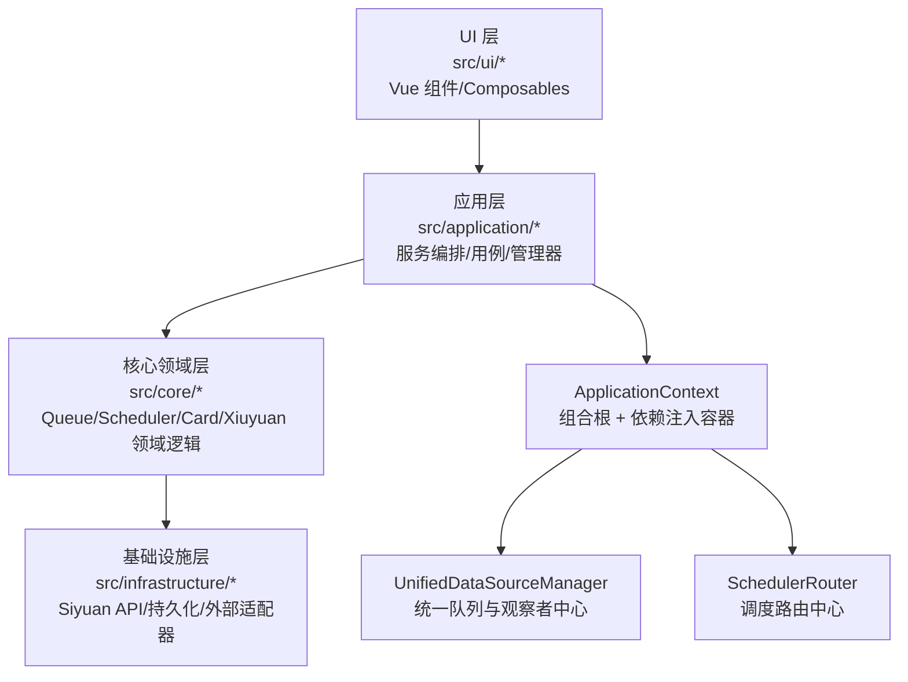
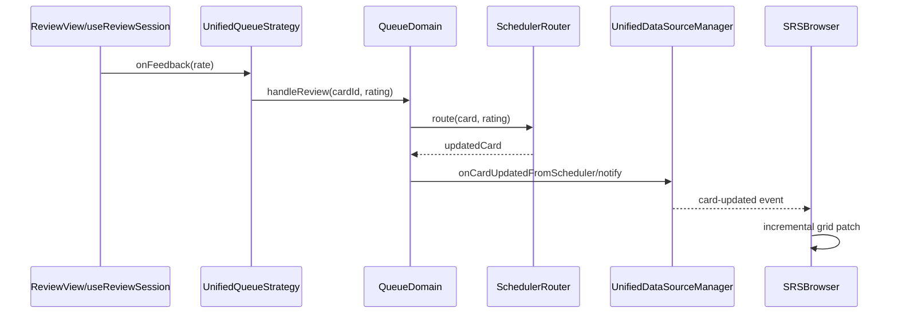

# SiyuanMemo 插件架构说明

最后更新：2026-02-26

本文是当前运行时架构与数据流的单一事实来源（Single Source of Truth），供开发者与 AI 代理协作使用。

---

## 1. 文档目的与边界

本文只描述**当前生效**架构，不保留历史迁移过程。

覆盖范围：

- 当前分层架构与职责边界
- 真实运行入口（启动、Browser、Review）
- 关键数据流（浏览器增量刷新、复习评分链路）
- DDD 改动边界与开发守则

如果历史文档与 `src/` 现行代码冲突，以 `src/` 为准。

---

## 2. 当前分层架构总览

插件按 DDD 思路分层，主依赖方向固定为：

`ui -> application -> core -> infrastructure`

---

## 3. 文件职责地图（初版风格）

说明：

- 本节覆盖生产运行主链路文件（不含 `__tests__`、历史备份文件）。
- 目标是让 AI/开发者拿到路径后可直接定位“这个文件负责什么”。

### 3.1 根入口（`src/`）

- `src/index.ts`：插件生命周期入口；创建 `ApplicationContext`，注册顶栏、Dock、事件处理器。
- `src/main.ts`：独立前端挂载入口（调试/开发场景）。
- `src/App.vue`：应用壳层组件。
- `src/index.scss`：全局样式入口。
- `src/commands.ts`：插件命令入口。
- `src/global.d.ts`：全局类型声明。
- `src/shims-vue.d.ts`：Vue 模块类型声明。

### 3.2 Application 层（`src/application/*`）

组合根与主编排：

- `src/application/ApplicationContext.ts`：运行时组合根；装配依赖、服务与生命周期。
- `src/application/services/UnifiedDataSourceManager.ts`：统一队列创建/缓存/观察者通知中心。
- `src/application/managers/DialogManager.ts`：Browser/Review/Settings 对话框总入口。
- `src/application/factories/createUnifiedReviewDialog.ts`：统一复习对话框工厂。
- `src/application/adapters/UnifiedQueueStrategy.ts`：Review 会话到队列域对象的策略适配。
- `src/application/adapters/UnifiedReviewAdapter.ts`：Review UI 数据与动作适配。

高频应用服务：

- `src/application/services/CardApplicationService.ts`：卡片用例聚合服务。
- `src/application/services/BrowserApplicationService.ts`：Browser 查询与统计主服务。
- `src/application/services/ReviewApplicationService.ts`：复习流程服务。
- `src/application/services/TabApplicationService.ts`：文档打开单路径服务。
- `src/application/services/SettingsService.ts`：插件配置管理服务。
- `src/application/services/ReviewLogService.ts`：复习日志服务。
- `src/application/services/RiffBlacklistService.ts`：Riff 黑名单服务。
- `src/application/services/XiuyuanApplicationService.ts`：修远场景应用编排。
- `src/application/services/XiuyuanSyncService.ts`：修远同步主服务。

管理器与处理器：

- `src/application/managers/MenuManager.ts`：菜单编排管理器。
- `src/application/managers/BlockMenuHandler.ts`：块菜单事件处理。
- `src/application/managers/TabManager.ts`：标签页管理。
- `src/application/managers/DockManager.ts`：Dock 管理。
- `src/application/managers/PracticeQueueManager.ts`：练习队列管理。
- `src/application/managers/ReviewSyncManager.ts`：复习同步管理。
- `src/application/handlers/AutoCardHandler.ts`：自动制卡处理链路。
- `src/application/handlers/RiffSyncHandler.ts`：Riff 同步事件处理链路。
- `src/application/helpers/CardCreationHelper.ts`：建卡共享辅助逻辑。

查询与用例：

- `src/application/queries/DataAccessFacade.ts`：查询路由门面（AdvancedDataRouter）。
- `src/application/queries/CardContentQueryService.ts`：卡片内容查询服务。
- `src/application/queries/browser/GetBrowserCardsQuery.ts`：Browser 查询请求对象。
- `src/application/queries/browser/GetBrowserCardsQueryHandler.ts`：Browser 查询处理器。
- `src/application/queries/card/GetCardQuery*.ts`：卡片查询对象/处理器。
- `src/application/queries/card/GetCardsQuery*.ts`：批量卡片查询对象/处理器。
- `src/application/queries/card/GetDueCardsQuery*.ts`：到期卡查询对象/处理器。
- `src/application/usecases/card/*.ts`：卡片创建/更新/删除用例族。
- `src/application/usecases/xiuyuan/*.ts`：修远创建/查询/删除/重绑定用例族。
- `src/application/commands/card/*.ts`：卡片命令对象。
- `src/application/commands/xiuyuan/*.ts`：修远命令对象。

接口与端口：

- `src/application/interfaces/*.ts`：应用层接口契约。
- `src/application/ports/*.ts`：应用层端口定义（由 infrastructure 实现）。

### 3.3 Core 层（`src/core/*`）

队列与调度主链路：

- `src/core/queue/domain/BaseReviewQueue.ts`：队列聚合根基类。
- `src/core/queue/domain/RetrievalPracticeQueue.ts`：检索练习队列。
- `src/core/queue/domain/FinalDrillQueue.ts`：冲刺队列。
- `src/core/queue/domain/IncrementalLearningQueue.ts`：增量学习队列。
- `src/core/queue/domain/FilterGroupQueue.ts`：过滤组队列。
- `src/core/queue/domain/NeuralRoamQueue.ts`：神经漫游队列。
- `src/core/queue/domain/LeechReviewQueue.ts`：顽固卡队列。
- `src/core/queue/domain/SubsetReviewQueue.ts`：子集复习队列。
- `src/core/queue/domain/TemporaryDrillQueue.ts`：临时训练队列。
- `src/core/queue/sequencers/*.ts`：队列抽卡顺序策略族。
- `src/core/queue/schedulers/*.ts`：队列内调度策略族。
- `src/core/queue/neural/*.ts`：神经漫游引擎与存储。
- `src/core/scheduler/SchedulerRouter.ts`：全局调度路由器。
- `src/core/scheduler/rescheduleService.ts`：重排服务。
- `src/core/scheduler/AdvanceEngine.ts`：提前复习引擎。
- `src/core/scheduler/PostponeEngine.ts`：延期复习引擎。
- `src/core/scheduler/SpreadEngine.ts`：分散复习引擎。
- `src/core/scheduler/strategies/TSFSRSScheduler.ts`：FSRS 调度策略。
- `src/core/scheduler/strategies/SM15Scheduler.ts`：SM15 调度策略。
- `src/core/scheduler/strategies/ImprovedTopicScheduler.ts`：主题调度策略。

存储、卡片、修远：

- `src/core/storage/UnifiedStorageManager.ts`：统一存储门面。
- `src/core/storage/UnifiedStoragePersistence.ts`：统一持久化回调。
- `src/core/storage/manager.ts`：存储管理器。
- `src/core/storage/infrastructure/BlockRepository.ts`：块仓储实现。
- `src/core/card/common/application/BaseCardRenderService.ts`：卡片渲染基类。
- `src/core/card/quick-card/**`：快速卡领域模型、策略与仓储。
- `src/core/card/descriptor-card/**`：描述符卡领域与仓储。
- `src/core/card/concept/**`：概念卡渲染服务。
- `src/core/card/concept-definition/**`：概念定义卡渲染服务。
- `src/core/card/multi-cloze/**`：多 Cloze 渲染服务。
- `src/core/card-builder/**`：卡片类型识别与元数据提取。
- `src/core/card-type/**`：卡型标记与规则映射。
- `src/core/xiuyuan/domain/*.ts`：修远聚合、实体和值对象。
- `src/core/xiuyuan/domain/events/*.ts`：修远领域事件。
- `src/core/xiuyuan/domain/services/*.ts`：修远领域服务。
- `src/core/xiuyuan/infrastructure/XiuyuanRepository.ts`：修远仓储实现。
- `src/core/xiuyuan/templates/*.ts`：内置模板与模板注册中心。

事件与基础能力：

- `src/core/shared/domain/events/EventBus.ts`：事件总线。
- `src/core/infrastructure/websocket/TransactionWebSocketService.ts`：事务 WebSocket 同步。
- `src/core/infrastructure/websocket/QuickCardWebSocketService.ts`：快速卡 WebSocket 同步。
- `src/core/extensions/*.ts`：可扩展 Queue/Review Provider 抽象。
- `src/core/siyuan/*.ts`：核心 Siyuan API 封装。

### 3.4 Infrastructure 层（`src/infrastructure/*`）

端口实现：

- `src/infrastructure/siyuan/BrowserSiyuanAdapter.ts`：Browser 端口实现。
- `src/infrastructure/siyuan/ReviewSiyuanAdapter.ts`：Review 端口实现。
- `src/infrastructure/siyuan/QuerySiyuanAdapter.ts`：查询端口实现。
- `src/infrastructure/siyuan/ManagerSiyuanAdapter.ts`：管理端口实现。
- `src/infrastructure/siyuan/CardCreationSiyuanAdapter.ts`：建卡端口实现。
- `src/infrastructure/siyuan/CardDeletionSiyuanAdapter.ts`：删卡端口实现。
- `src/infrastructure/siyuan/AutoCardSiyuanAdapter.ts`：自动制卡端口实现。
- `src/infrastructure/siyuan/AutoCardRiffAdapter.ts`：自动制卡 Riff 端口实现。
- `src/infrastructure/siyuan/XiuyuanSiyuanAdapter.ts`：修远端口实现。
- `src/infrastructure/siyuan/XiuyuanSyncSiyuanAdapter.ts`：修远同步端口实现。

持久化与支撑：

- `src/infrastructure/persistence/CardRepository.ts`：卡片仓储实现。
- `src/infrastructure/persistence/dto/CardPersistenceDTO.ts`：持久化 DTO。
- `src/infrastructure/persistence/mappers/*.ts`：Card/Riff/Xiuyuan 映射器。
- `src/infrastructure/queries/CardReadModel.ts`：读模型实现。
- `src/infrastructure/services/FileService.ts`：文件服务。
- `src/infrastructure/services/QueuePersistenceService.ts`：队列持久化服务。
- `src/infrastructure/queue/SiyuanLeechActionEffectsAdapter.ts`：Leech 副作用适配。
- `src/infrastructure/queue/SiyuanNeuralRoamCardTypeResolverAdapter.ts`：神经漫游卡型解析适配。
- `src/infrastructure/events/RiffSyncEventHandler.ts`：Riff 事件处理基础设施层。
- `src/infrastructure/notifications/SiyuanErrorNotificationAdapter.ts`：错误通知适配器。

### 3.5 UI 层（`src/ui/*`）

Browser：

- `src/ui/browser/SRSBrowser.vue`：Browser 主视图。
- `src/ui/browser/SRSBrowserAdapter.ts`：Browser 适配器桥接层。
- `src/ui/browser/SRSBrowserQueueView.ts`：队列视图逻辑。
- `src/ui/browser/browserService*.ts`：Browser 服务接口层。
- `src/ui/browser/composables/useBrowserAdapterSync.ts`：事件同步到 UI。
- `src/ui/browser/composables/useIncrementalGridUpdates.ts`：增量网格刷新。
- `src/ui/browser/composables/useQueueBridge.ts`：队列计数桥接。
- `src/ui/browser/composables/useCardActions.ts`：卡片动作封装。
- `src/ui/browser/composables/useCardFilter.ts`：筛选状态。
- `src/ui/browser/composables/useSorting.ts`：排序状态。
- `src/ui/browser/datasource/*.ts`：不同模式数据源实现。
- `src/ui/browser/config/columnDefs.ts`：表格列定义。
- `src/ui/browser/dialogs/*.vue`：Browser 操作对话框（advance/postpone/spread/priority/filter/reschedule）。
- `src/ui/browser/components/*.vue`：筛选与交互组件。
- `src/ui/browser/utils/*.ts`：Browser 工具函数。

Review：

- `src/ui/review/v2/ReviewView.vue`：复习主界面。
- `src/ui/review/v2/useReviewSession.ts`：复习会话状态机。
- `src/ui/review/v2/ReviewHeader.vue`：复习头部。
- `src/ui/review/v2/ReviewContent.vue`：复习内容区。
- `src/ui/review/v2/ReviewActions.vue`：评分动作区。
- `src/ui/review/v2/adapters/SubsetPracticeAdapter.ts`：子集练习适配器。
- `src/ui/review/v2/components/*.vue`：v2 组件（跳过菜单、修远模板卡等）。
- `src/ui/review/v2/dialogs/*.vue`：v2 辅助对话框。
- `src/ui/review/v2/overlays/*.vue`：叠加层组件。
- `src/ui/review/v2/providers/utils/SessionManager.ts`：会话管理工具。
- `src/ui/review/components/*.vue`：卡型渲染组件（Quick/Concept/Descriptor/MultiCloze）。
- `src/ui/review/ReviewViewAdapter.ts`：Review 适配层。

设置与通用组件：

- `src/ui/settings/SettingsPanel.vue`：设置面板。
- `src/ui/xiuyuan/TemplateSelectDialog.vue`：修远模板选择对话框。
- `src/ui/srs/*.vue`：SRS 相关编辑与设置 UI。
- `src/ui/components/SiyuanTheme/*.vue`：主题化 UI 原子组件。
- `src/ui/components/neural/NeuralNavigationBar.vue`：神经导航组件。
- `src/ui/menu/TopBar.ts`：顶栏菜单入口。

### 3.6 类型与工具（`src/types` / `src/utils`）

类型契约：

- `src/types/unified-data-source.ts`：`QueueType` 与统一队列契约。
- `src/types/card.ts`：卡片领域类型。
- `src/types/review.ts`：复习流程类型。
- `src/types/scheduler.ts`：调度类型。
- `src/types/settings.ts`：配置类型。
- `src/types/result.ts`：统一 Result 类型。
- `src/types/reschedule*.ts`：重排类型与错误定义。
- `src/types/logging.ts`：日志类型定义。

工具基建：

- `src/utils/logger.ts`：统一日志入口。
- `src/utils/dialog.ts`：Vue 对话框创建工具。
- `src/utils/configMigrator.ts`：配置迁移工具。
- `src/utils/simpleModeRemovalMigrator.ts`：simple 模式移除迁移工具。
- `src/utils/cardMigration.ts`：卡片数据迁移工具。
- `src/utils/queryCache.ts`：查询缓存工具。
- `src/utils/batchQuery.ts`：批量查询工具。
- `src/utils/sqlOptimizer.ts`：SQL 优化工具。
- `src/utils/dateUtils.ts`：日期工具。
- `src/utils/asyncHelpers.ts` / `debounce.ts`：异步与节流防抖工具。
- `src/utils/performance*.ts`：性能监控与预算工具。
- `src/utils/errorReporter.ts`：错误上报工具。
- `src/utils/EventEmitter.ts`：事件工具。

---

## 4. 启动与装配流程（Composition Root）

运行启动链路：

1. `src/index.ts` 的 `onload()`
2. 调用 `ApplicationContext.create({ plugin, i18n })`
3. 由 `ApplicationContext` 统一装配核心服务：
- `UnifiedStorageManager`
- `UnifiedDataSourceManager`
- `SchedulerRouter`
- `CardApplicationService`
- `BrowserApplicationService`
- `ReviewApplicationService`
- `DialogManager` / `MenuManager` / `TabApplicationService`
4. 注册顶栏、Dock、事件处理器

`ApplicationContext` 是运行时唯一服务组合根。

---

## 5. 统一队列系统（Unified Data Source）

队列类型（字面量必须一致）：

- `retrieval-practice`
- `final-drill`
- `incremental-learning`
- `filter-group`
- `neural-roam`
- `leech`

统一队列中心：

- `UnifiedDataSourceManager`（单例）

职责：

- 懒加载创建并缓存队列实例（`getQueue`/`createQueue`）
- 通过 Router 统一卡片读写
- 卡片变更后使相关队列缓存失效
- 通过观察者机制派发合并后的数据变更事件

队列具体实现位于：

- `src/core/queue/domain/*`

---

## 6. Browser 架构与数据流

打开链路：

1. `DialogManager.openBrowserDialog()`
2. 挂载 `SRSBrowser.vue`
3. 注入：
- `browserService`（`BrowserApplicationService`）
- `tabApplicationService`（文档打开单路径）

`SRSBrowser` 加载逻辑：

- 队列模式：使用统一队列数据源
- 全量模式：`browserService.getBrowserCards()`
- 通过 AG Grid 渲染卡片与层级视图

增量刷新逻辑：

- `useBrowserAdapterSync` 监听队列/数据变更
- `useIncrementalGridUpdates` 按受影响 ID 补丁更新行
- `useQueueBridge` 刷新队列计数（`browserService.getQueueCounts()`）

Browser 打开文档为单路径：

- `tabApplicationService.openDocumentTab({ docId })`

---

## 7. Review 架构与数据流

打开链路：

1. `DialogManager.openReviewDialog*()`
2. `createUnifiedReviewDialog(...)`
3. 创建：
- `UnifiedQueueStrategy`
- `UnifiedReviewAdapter`
4. 挂载 `ReviewView.vue`

会话驱动：

- `useReviewSession.ts` 统一处理 `next/reveal/grade/skip/custom`

评分链路（主链）：

1. `useReviewSession.grade()`
2. `queueStrategy.onFeedback({ action: 'rate', rating })`
3. 队列域对象 `handleReview()`
4. `SchedulerRouter` 计算并更新卡片
5. `UnifiedDataSourceManager` 发出数据变更事件
6. Browser 侧收到增量事件并刷新显示

---

## 8. 调度系统（Scheduler）

核心路由器：

- `src/core/scheduler/SchedulerRouter.ts`

职责：

- 按卡片类型/覆盖配置/卡片调度字段选择调度器
- 执行调度计算并持久化更新
- 对不支持调度类型显式报错（不做静默降级）

调度器工厂：

- `src/core/scheduler/index.ts`

当前支持引擎：

- `simple-fsrs`
- `sm15`
- `a-factor-v2`

`sm2` 已不再支持（显式错误）。

---

## 9. 同步与事件系统

同步相关组件：

- `XiuyuanSyncService`
- `TransactionWebSocketService`
- `RiffSyncHandler`
- `AutoCardHandler`

事件体系：

- 共享 `EventBus`（由 `ApplicationContext` 管理）
- `UnifiedDataSourceManager` 的观察者通知驱动 UI 刷新
- Browser/Review 的状态更新遵循事件驱动，而非分散轮询

---

## 10. 关键接口契约

关键契约（改动前必须确认）：

- `IReviewQueue`（`types/unified-data-source.ts`）
- `IUnifiedDataSourceManagerFacade`
- `IDataRouter`
- `IQueueStrategy`

约束：

- UI 层依赖应用层抽象，不直接耦合底层基础设施细节
- 领域逻辑放在 `core/*/domain`，应用层只做编排

---

## 11. AI/开发改动守则

改动时按以下规则执行：

1. 优先改主链路入口（第 3 节）
2. 保持单路径确定性，不新增“兜底降级”分支
3. 在触达切片内顺手去重与清债
4. 严守 DDD 边界：
- 领域规则在 `core`
- 流程编排在 `application`
- API/持久化细节在 `infrastructure`
5. 最低验证：
- `pnpm build`

默认不要把以下路径当主架构：

- `src/domain/queues/*`
- `src/index.simplified.ts`
- 各类备份/损坏文件（`*.backup`, `*.bak`, `*.corrupted`）

---

## 12. 当前状态快照

当前收敛状态：

- Browser/Review 主链路已统一
- 队列访问统一收口到 `UnifiedDataSourceManager`
- 调度路径为显式约束，不做静默回退

非测试生产代码复扫结果（当前基线）：

- `Result<any>`：0
- `as any`：0
- 运行时 `getAllItems(` 调用：0

剩余重点：

- 历史文档/注释中的编码乱码（mojibake）属于文档债务，非运行时架构债务

---

## 13. Mobile Entry & Review Flow (2026-02-27)

新增移动端复习入口链路：

1. `src/index.ts`
- 移动端顶栏单击：`DialogManager.openMobileQueueLauncherDialog()`
- 桌面端顶栏单击：保持 `DialogManager.openBrowserDialog()`

2. `src/application/managers/DialogManager.ts`
- `openMobileQueueLauncherDialog()` 打开底部队列面板（Bottom Sheet）。
- 面板内点击任意队列会直接进入对应 Review 对话框。
- 面板内可直接跳转 Browser。

3. `src/ui/mobile/MobileReviewLauncher.vue`
- 展示 5 个队列（提取/渐进/刻意/神经漫游/筛选）及数量。
- 入口动作：`openQueue` / `openBrowser` / `close`。

4. Review / Browser 移动端尺寸策略
- 移动端统一使用 `100vw x 100vh` 对话框。
- Review 通过 `isMobile` 关闭桌面 `maxWidth=1024` 限制并使用移动布局。
- Browser 通过 `mobileMode` 默认 `flat + preview=false`，保留核心筛选与开始练习能力。

---

## 14. Neural Roam Focus Model (2026-02-27)

Neural Roam keeps queue type literal `neural-roam`, but the active contract is fully focus-first.

1. Public contract updates
- `NeuralRoamHistoryEntry.seedId` -> `focusId`
- Added `sessionId`, `isVirtual`, `nodePreview`
- `NeuralRoamSessionQueue` now exposes `getConceptBlocks`, `startRoamingFromFocus`, `getSessionFocusStack`, `getPinnedFocusBlocks`, `setPinnedFocusBlock`, `jumpToHistoryNode`, `clearHistory(scope)`

2. Persistence strategy
- Neural roam state schema is v3 only.
- Legacy/v2 payloads are silently reset to v3 (no migration aliases in active path).
- History keeps cross-session boundaries via `sessionId`.

3. Browser integration (`SRSBrowser.vue`)
- Neural roam has in-browser subviews (no separate page):
- `Concept Cards` (AG Grid, concept-only)
- `Focus Blocks` (session stack + pinned pool)
- `Roam History` (current/all scope, collapsible session groups)
- Neural queue card-type filter is constrained to `concept-only`.

4. Review actions and naming
- Action IDs: `lock-focus`, `neural-focuses`
- Terminology moved from seed to focus in active flow.
- Main product name stays `Neural Roam`.
