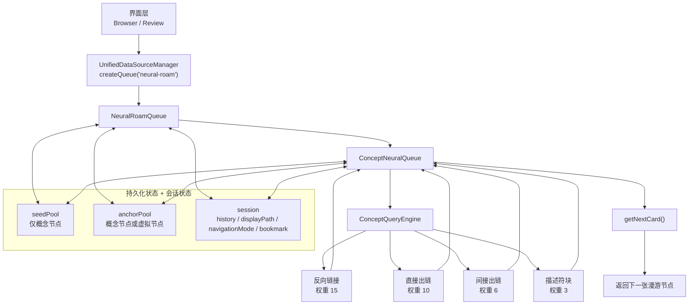
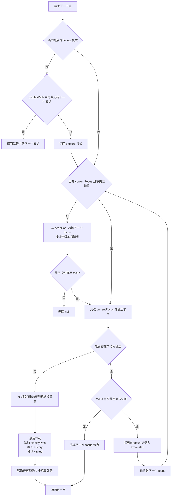
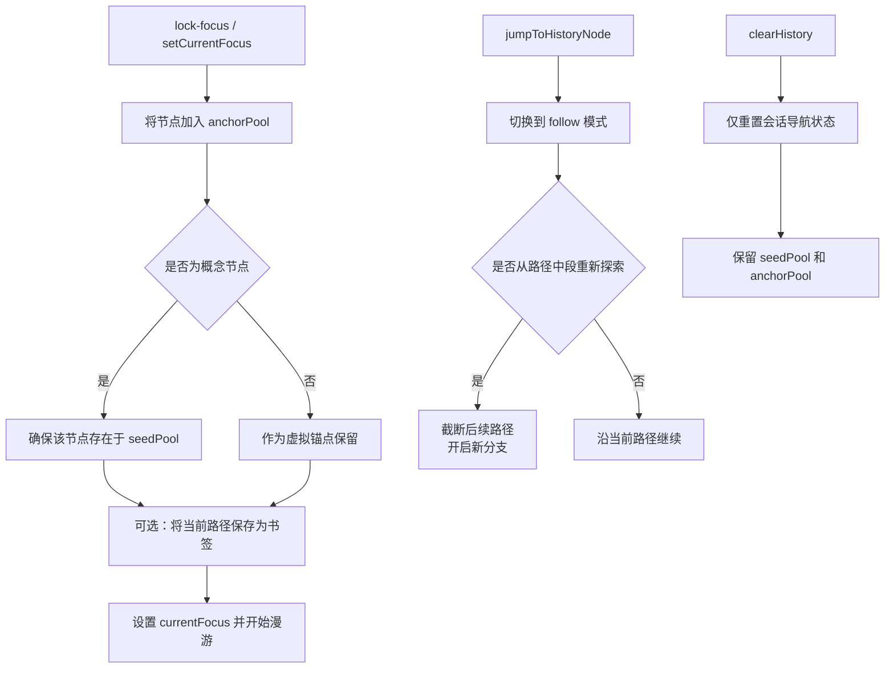

# 神经漫游引擎流程图

本文档说明当前生效的神经漫游引擎实现，以及它在浏览器、复习界面和队列内部的实际运行规则。

当前主链路：

- `UnifiedDataSourceManager -> NeuralRoamQueue -> ConceptNeuralQueue -> ConceptQueryEngine`
- 仓库里虽然还保留了旧版 `NeuralQueue.ts` / `QueryEngine.ts`，但当前 `neural-roam` 队列实例并不走那条路径。

## 1. 当前架构流程

## 2. 下一节点选择流程

## 3. 焦点与分支流程

## 4. 实际规则

- 队列类型字面量仍然是 `neural-roam`。
- 浏览器切到神经漫游时，卡片类型过滤会被强制为 `concept-only`。
- 只有 Concept 卡可以加入 `seedPool`，也就是漫游种子池。
- 浏览器显示的神经漫游数量，本质上是 `seedPool` 的数量，不是历史记录长度。
- `seedPool` 用于自动轮换 focus。
- `anchorPool` 用于锁定焦点、跳转历史节点、作为分支重启点。
- 如果一个节点同时通过多种关系被命中，只保留最高权重的那条关系。
- `explore` 模式会继续向图上的邻居扩散。
- `follow` 模式只沿着现有的 `displayPath` 往前走。
- `clearHistory()` 只会清理会话导航状态，不会删除种子和锚点。

## 5. 关键参数

- `neighborsPerRound = 5`
- `prefetchNeighborCount = 2`
- `historyLimit = 300`
- 种子优先级：
  - 普通：`0.65`
  - 高优先级：`0.9`
- focus 选择加权：
  - 概念节点会额外获得 `1.6x` 加成

## 6. 补充说明

- `NeuralRoamQueue.handleReview()` 中的评分结果，不直接决定漫游路径的下一跳。
- 当前代码持久化使用的是 `v5` 状态结构。
- 有些旧文档还写着 `v3`，以当前源码实现为准。
