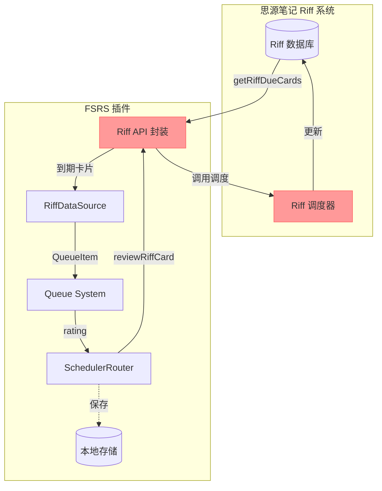
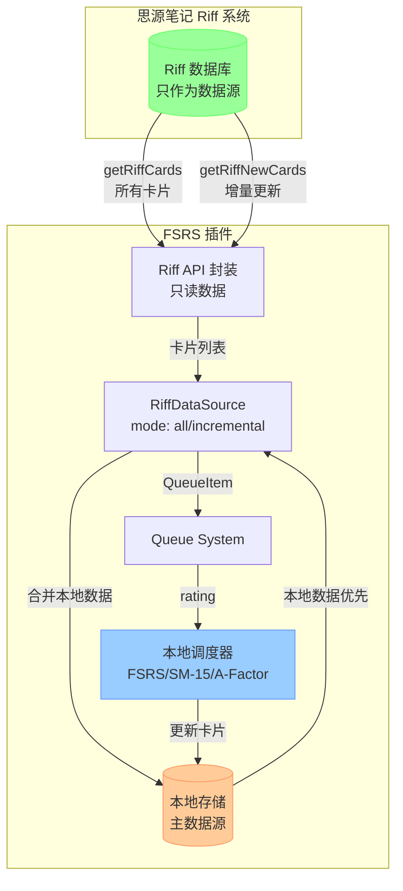
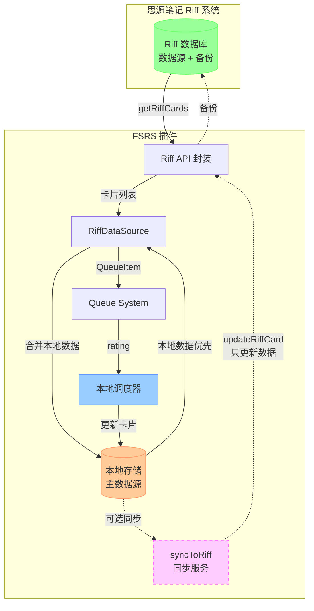
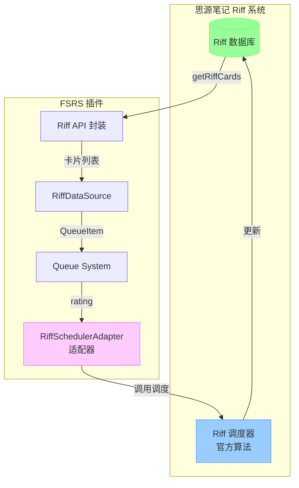
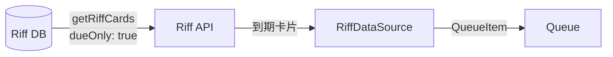
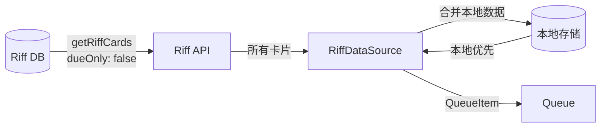
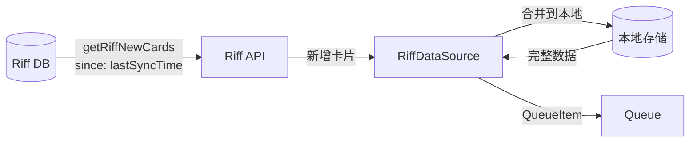

# Riff 数据流图

## 当前架构（紧耦合）



**问题**:
- 🔴 `reviewRiffCard()` 既提交数据又依赖 Riff 调度
- 🔴 无法独立使用本地调度器
- 🔴 无法在不使用 Riff 调度的情况下使用 Riff 数据

---

## 目标架构（解耦）

### 模式 1: 完全独立模式（默认）



**特点**:
- ✅ Riff 只作为数据源
- ✅ 本地调度器完全独立
- ✅ 本地数据优先
- ✅ 不依赖 Riff 调度

---

### 模式 2: 双向同步模式



**特点**:
- ✅ Riff 作为数据源和备份
- ✅ 本地调度器独立
- ✅ 可选同步到 Riff
- ✅ 同步失败不影响本地

---

### 模式 3: 简单模式（将来支持）



**特点**:
- ✅ 完全使用 Riff 调度器
- ✅ 不增加新卡片数据
- ✅ 适合简单用户
- ✅ 等待官方更新

---

## 数据流对比

### 复习流程对比

#### 当前流程（紧耦合）

```
用户评分
  ↓
Queue.onFeedback()
  ↓
SchedulerRouter.route()
  ↓
reviewRiffCard(deckID, cardID, rating)  ← 依赖 Riff 调度
  ↓
Riff API 调度 + 更新数据库
  ↓
本地存储保存（可选）
```

#### 新流程 - 模式 1（独立）

```
用户评分
  ↓
Queue.onFeedback()
  ↓
SchedulerRouter.route()
  ↓
LocalScheduler.schedule(card, rating)  ← 本地调度
  ↓
Storage.setCard(updatedCard)  ← 保存到本地
  ↓
Storage.saveCards()
```

#### 新流程 - 模式 2（同步）

```
用户评分
  ↓
Queue.onFeedback()
  ↓
SchedulerRouter.route()
  ↓
LocalScheduler.schedule(card, rating)  ← 本地调度
  ↓
Storage.setCard(updatedCard)  ← 保存到本地
  ↓
Storage.saveCards()
  ↓
syncToRiff(deckID, updatedCard)  ← 可选同步（失败不影响）
  ↓
updateRiffCard(deckID, cardID, updates)  ← 只更新数据
```

#### 新流程 - 模式 3（简单）

```
用户评分
  ↓
Queue.onFeedback()
  ↓
SchedulerRouter.route()
  ↓
RiffSchedulerAdapter.schedule(card, rating)  ← Riff 调度
  ↓
Riff API 调度 + 更新数据库
```

---

## 数据源模式对比

### 模式 1: due-only（兼容模式）



**特点**:
- 只获取到期卡片
- 兼容现有逻辑
- 性能最优

### 模式 2: all（全量模式）



**特点**:
- 获取所有卡片
- 本地数据优先
- 支持自定义过滤

### 模式 3: incremental（增量模式）



**特点**:
- 只获取新增卡片
- 减少 API 调用
- 性能最优

---

## 接口设计

### Riff API 接口

```typescript
// ✅ 新接口：只获取数据
interface RiffAPI {
  // 获取卡片（不调度）
  getRiffCards(
    deckID: string,
    options?: {
      dueOnly?: boolean;
      notebook?: string;
      rootID?: string;
      includeNew?: boolean;
    }
  ): Promise<RiffCard[]>;
  
  // 增量更新
  getRiffNewCards(
    deckID: string,
    since?: number
  ): Promise<RiffCard[]>;
  
  // 更新卡片数据（不调度）
  updateRiffCard(
    deckID: string,
    cardID: string,
    updates: Partial<RiffCard>
  ): Promise<void>;
  
  // 同步本地数据到 Riff
  syncToRiff(
    deckID: string,
    card: FSRSCard
  ): Promise<void>;
}

// ❌ 旧接口：紧耦合（保留用于兼容）
interface RiffAPILegacy {
  // 获取到期卡片 + 依赖 Riff 调度
  getRiffDueCards(
    deckID: string,
    notebook?: string,
    rootID?: string
  ): Promise<{ cards: RiffCard[] }>;
  
  // 复习卡片 + 依赖 Riff 调度
  reviewRiffCard(
    deckID: string,
    cardID: string,
    rating: Rating
  ): Promise<void>;
}
```

### RiffDataSource 接口

```typescript
interface RiffDataSourceOptions {
  deckId: string;
  
  // 🆕 数据源模式
  mode?: 'due-only' | 'all' | 'incremental';
  
  // 🆕 增量更新配置
  incrementalUpdateInterval?: number;
  
  // 现有配置
  notebook?: string;
  rootID?: string;
  storage?: StorageManager;
  schedulerRouter?: SchedulerRouter;
  blacklistProvider?: () => Set<string>;
}
```

### SchedulerRouter 配置

```typescript
interface SchedulerRouterConfig {
  defaultScheduler: SchedulerType;
  schedulerOverrides?: Map<string, SchedulerType>;
  
  // 🆕 Riff 集成配置
  riffIntegration?: {
    mode: 'disabled' | 'data-only' | 'full-scheduler';
    syncToRiff?: boolean;
    useRiffScheduler?: boolean;
  };
}
```

---

## 实施计划

### Phase 1: API 层（1-2 天）

- [ ] 实现 `getRiffCards()` API
- [ ] 实现 `getRiffNewCards()` API
- [ ] 实现 `updateRiffCard()` API
- [ ] 实现 `syncToRiff()` 辅助函数
- [ ] 编写 API 单元测试

### Phase 2: RiffDataSource（2-3 天）

- [ ] 添加 `mode` 配置选项
- [ ] 实现三种数据源模式
- [ ] 实现增量更新逻辑
- [ ] 优化数据合并性能
- [ ] 编写数据源测试

### Phase 3: SchedulerRouter（2-3 天）

- [ ] 添加 `riffIntegration` 配置
- [ ] 实现 `syncToRiff` 选项
- [ ] 实现模式切换逻辑
- [ ] 保留 `RiffSchedulerAdapter` 接口
- [ ] 编写调度器测试

### Phase 4: UI 配置（1-2 天）

- [ ] 添加设置面板选项
- [ ] 实现模式切换 UI
- [ ] 显示同步状态
- [ ] 添加增量更新按钮

### Phase 5: 测试和文档（2-3 天）

- [ ] 编写集成测试
- [ ] 更新架构文档
- [ ] 编写迁移指南
- [ ] 编写用户手册

**总计**: 8-13 天

---

## 总结

这个架构方案实现了：

1. ✅ **独立于 Riff**: 只使用 Riff 作为数据来源，不依赖其调度
2. ✅ **增量更新**: 支持获取所有卡片 + 增量更新新卡片
3. ✅ **留下接口**: 为将来的 Riff 调度器留下 `RiffSchedulerAdapter`
4. ✅ **简单模式**: 支持只使用 Riff 不新增卡片数据的模式
5. ✅ **向后兼容**: 保留现有 API，支持渐进式迁移
6. ✅ **灵活切换**: 支持三种模式，可随时切换

**核心优势**:
- 🎯 解耦 Riff 调度和数据存储
- 🎯 本地调度器完全独立
- 🎯 为将来官方更新留下接口
- 🎯 支持多种使用场景
