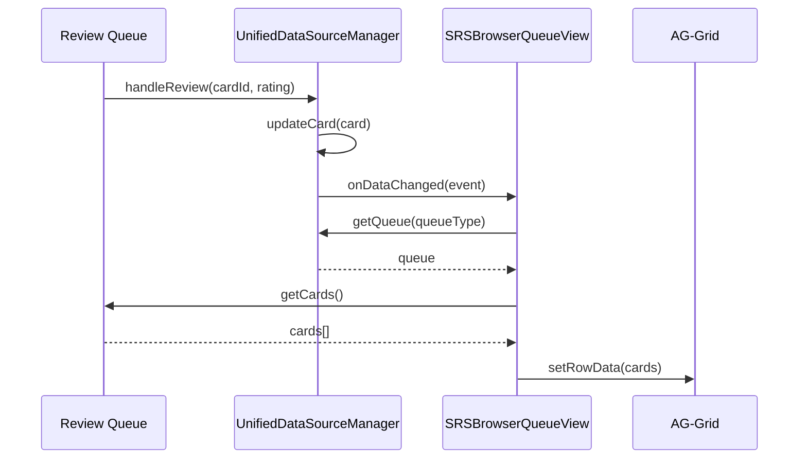
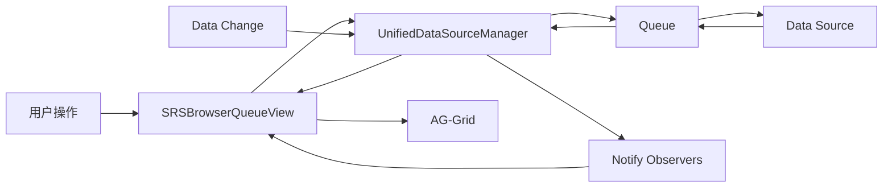

# SRS Browser Queue View

## 概述

`SRSBrowserQueueView` 是 SRS 浏览器的队列视图组件，实现了统一数据源架构的观察者模式。它允许用户在浏览器中查看和管理不同类型的复习队列，并确保与复习队列的数据一致性。

## 核心功能

### 1. 队列视图切换

用户可以在不同的队列类型之间切换：

```typescript
const view = new SRSBrowserQueueView(manager);
await view.switchToQueueView(QueueType.RetrievalPractice);
```

支持的队列类型：
- **检索练习** (RetrievalPractice): 到期的项目卡片
- **最终训练** (FinalDrill): 手动管理的练习卡片
- **渐进学习** (IncrementalLearning): 到期的项目和主题卡片
- **过滤组** (FilterGroup): 基于过滤条件的卡片
- **神经漫游** (NeuralRoam): 知识图谱导航

### 2. 自动数据同步

实现 `IDataSourceObserver` 接口，当队列数据变化时自动刷新视图：

```typescript
onDataChanged(event: DataChangeEvent): void {
    // 自动刷新队列数据
    if (this.currentQueueType) {
        this.loadQueueData();
    }
}
```

### 3. 添加卡片到队列

从浏览器直接添加卡片到当前队列：

```typescript
await view.addCardToQueue('card-id-123');
```

### 4. 获取可用队列类型

根据当前模式（简单/高级）获取可用的队列类型：

```typescript
const queueTypes = view.getAvailableQueueTypes();
// 简单模式: ['retrieval-practice', 'final-drill']
// 高级模式: ['retrieval-practice', 'final-drill', 'incremental-learning', 'filter-group', 'neural-roam']
```

## 使用示例

### 基本使用

```typescript
import { SRSBrowserQueueView } from '@/ui/browser';
import { UnifiedDataSourceManager } from '@/managers/UnifiedDataSourceManager';
import { QueueType } from '@/types/unified-data-source';

// 获取管理器实例
const manager = UnifiedDataSourceManager.getInstance();

// 创建队列视图
const queueView = new SRSBrowserQueueView(manager);

// 设置 AG-Grid API
queueView.setGridApi(gridApi);

// 切换到检索练习队列
await queueView.switchToQueueView(QueueType.RetrievalPractice);

// 添加卡片到队列
await queueView.addCardToQueue('card-id-123');

// 清理资源
queueView.destroy();
```

### 与 AG-Grid 集成

```typescript
import { Grid } from 'ag-grid-community';

// 创建 AG-Grid
const grid = new Grid(gridDiv, gridOptions);

// 设置 Grid API
queueView.setGridApi(grid.api);

// 队列数据会自动填充到 Grid 中
await queueView.switchToQueueView(QueueType.FinalDrill);
```

### 响应数据变化

```typescript
// 视图会自动响应数据变化，无需手动刷新

// 例如：在复习队列中评分卡片
const queue = manager.getQueue(QueueType.RetrievalPractice);
await queue.handleReview('card-id-123', 4);

// SRSBrowserQueueView 会自动收到通知并刷新显示
// 无需手动调用 loadQueueData()
```

## API 文档

### 构造函数

```typescript
constructor(manager: UnifiedDataSourceManager)
```

创建 SRS 浏览器队列视图实例。

**参数：**
- `manager`: 统一数据源管理器实例

### 公共方法

#### switchToQueueView

```typescript
async switchToQueueView(queueType: QueueType): Promise<void>
```

切换到指定队列视图并加载数据。

**参数：**
- `queueType`: 队列类型

**验证需求：** 16.1

#### loadQueueData

```typescript
async loadQueueData(): Promise<void>
```

从当前队列加载数据并更新 Grid。

**验证需求：** 16.1, 16.2

#### onDataChanged

```typescript
onDataChanged(event: DataChangeEvent): void
```

响应数据变化事件，自动刷新队列视图。

**参数：**
- `event`: 数据变更事件

**验证需求：** 16.3

#### addCardToQueue

```typescript
async addCardToQueue(cardId: string): Promise<void>
```

从浏览器添加卡片到当前队列。

**参数：**
- `cardId`: 卡片 ID

**验证需求：** 16.4

**抛出：**
- `Error`: 当没有选中队列时

#### getAvailableQueueTypes

```typescript
getAvailableQueueTypes(): QueueType[]
```

获取当前模式下可用的队列类型。

**返回：** 队列类型数组

**验证需求：** 16.5

#### setGridApi

```typescript
setGridApi(gridApi: GridApi): void
```

设置 AG-Grid API 实例。

**参数：**
- `gridApi`: AG-Grid API 实例

#### getCurrentQueueType

```typescript
getCurrentQueueType(): QueueType | null
```

获取当前队列类型。

**返回：** 当前队列类型，如果未选择则返回 null

#### destroy

```typescript
destroy(): void
```

销毁视图，取消注册观察者，清理资源。

## 架构设计

### 观察者模式



### 数据流



## 验证需求

本实现验证以下需求：

- **需求 16.1**: 当用户在 SRS浏览器中选择队列视图时，系统应显示该队列的所有卡片
- **需求 16.2**: 当用户在 SRS浏览器队列视图中查看卡片时，系统应显示与复习队列中相同的卡片数据
- **需求 16.3**: 当卡片在复习队列中被修改时，SRS浏览器队列视图应在 100 毫秒内自动更新
- **需求 16.4**: 当用户从 SRS浏览器队列视图添加卡片到队列时，复习队列应立即反映该变化
- **需求 16.5**: SRS浏览器应提供对所有可用队列类型的访问（基于当前模式）

## 测试

### 单元测试

所有核心功能都有完整的单元测试覆盖：

```bash
npm test -- SRSBrowserQueueView.test.ts
```

测试覆盖：
- ✅ 构造函数注册观察者
- ✅ 切换队列视图
- ✅ 加载队列数据
- ✅ 响应数据变化
- ✅ 添加卡片到队列
- ✅ 获取可用队列类型
- ✅ 销毁视图
- ✅ 集成测试

### 集成测试

验证与其他组件的集成：

1. **与复习队列的数据一致性**
   - 在复习队列中修改卡片后，浏览器视图自动更新
   
2. **从浏览器添加卡片**
   - 从浏览器添加卡片后，复习队列立即反映变化

## 错误处理

### 常见错误

1. **没有选中队列**
   ```typescript
   // 错误：在切换队列前调用 addCardToQueue
   await view.addCardToQueue('card-id'); // 抛出 Error: No queue type selected
   
   // 正确：先切换队列
   await view.switchToQueueView(QueueType.FinalDrill);
   await view.addCardToQueue('card-id');
   ```

2. **Grid API 未初始化**
   ```typescript
   // 警告：在设置 Grid API 前加载数据
   await view.switchToQueueView(QueueType.RetrievalPractice);
   // 控制台警告: [SRSBrowserQueueView] Grid API not initialized
   
   // 正确：先设置 Grid API
   view.setGridApi(gridApi);
   await view.switchToQueueView(QueueType.RetrievalPractice);
   ```

## 性能优化

### 异步刷新

数据变化时使用 `setTimeout` 确保在下一个事件循环中执行，避免阻塞：

```typescript
onDataChanged(event: DataChangeEvent): void {
    if (this.currentQueueType) {
        setTimeout(() => {
            this.loadQueueData().catch(error => {
                console.error('Failed to refresh queue data:', error);
            });
        }, 0);
    }
}
```

### 避免重复刷新

只有在选中队列时才响应数据变化：

```typescript
if (this.currentQueueType) {
    // 刷新数据
}
```

## 未来扩展

### 计划功能

1. **批量操作**
   - 批量添加卡片到队列
   - 批量移除卡片

2. **过滤和排序**
   - 在队列视图中应用额外的过滤条件
   - 自定义排序规则

3. **性能优化**
   - 虚拟滚动支持大量卡片
   - 增量加载

4. **用户体验**
   - 加载状态指示器
   - 错误提示优化
   - 撤销/重做操作

## 相关文档

- [统一数据源架构需求文档](../../../.kiro/specs/unified-data-source-architecture/requirements.md)
- [统一数据源架构设计文档](../../../.kiro/specs/unified-data-source-architecture/design.md)
- [统一数据源架构任务列表](../../../.kiro/specs/unified-data-source-architecture/tasks.md)
- [UnifiedDataSourceManager](../../managers/UnifiedDataSourceManager.ts)
- [IDataSourceObserver](../../types/unified-data-source.ts)

## 许可证

本项目采用 MIT 许可证。
